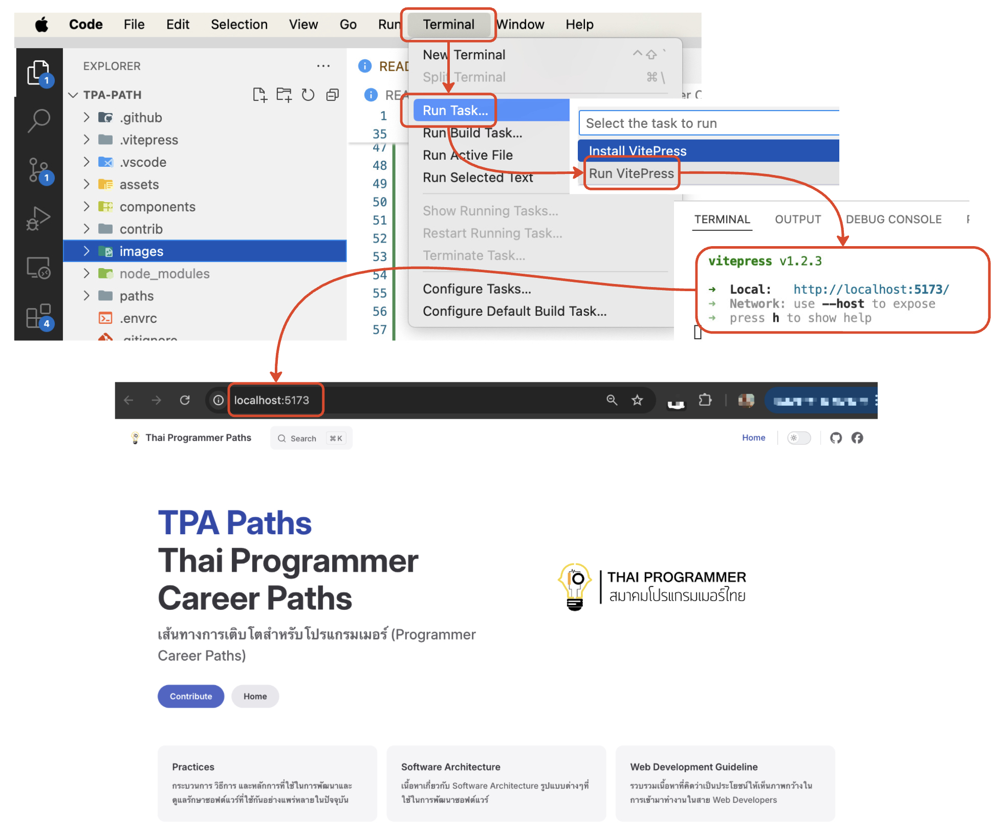
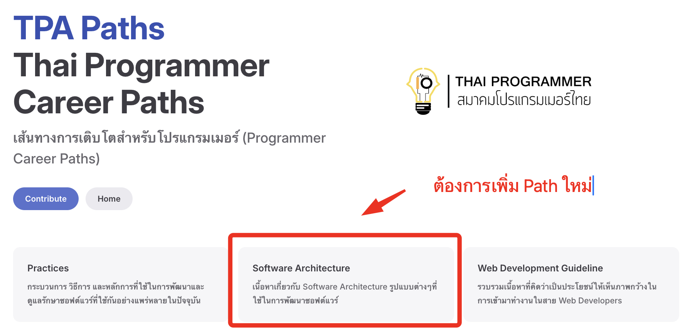
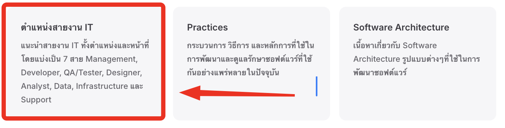
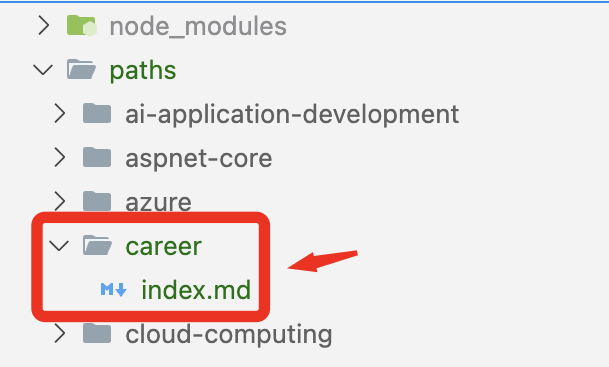
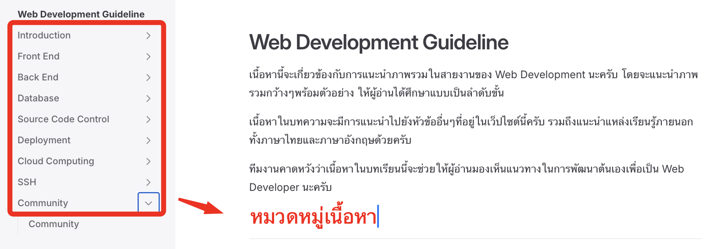
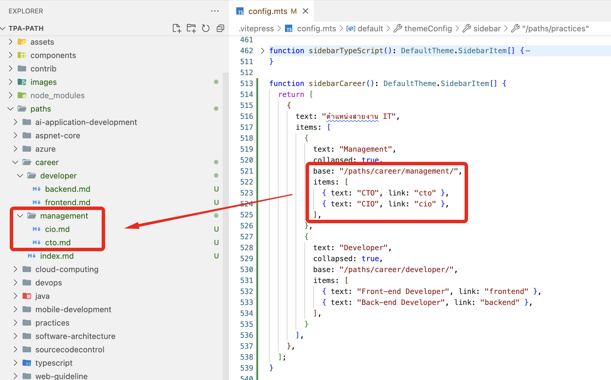
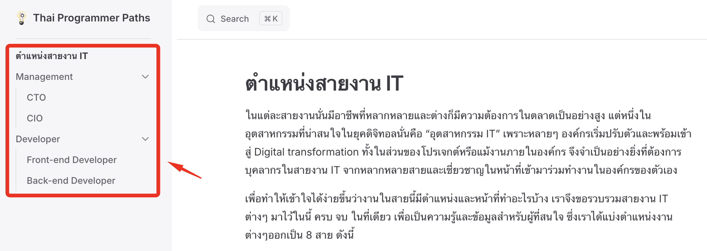

# ยินดีต้อนรับสู่ Thai Programmer Career Paths 
แนวทางแนะนำสำหรับเส้นทางการเติบโตสำหรับโปรแกรมเมอร์ (Programmer Career Paths) ในประเทศไทยนะครับ

## เข้าเยี่ยมชม Thai Programmer Career Paths Website
https://roadmap.thaiprogrammer.org/

## VitePress คืออะไร?
`VitePress` เป็นเครื่องมือสร้างเว็บไซต์แบบ Static Site Generator (SSG) ที่ออกแบบมาเพื่อสร้างเว็บไซต์ที่รวดเร็วและเน้นเนื้อหา โดย VitePress จะนำเนื้อหาที่เขียนในรูปแบบ Markdown มาปรับใช้กับธีมแล้วสร้างหน้า HTML แบบ static ที่สามารถเผยแพร่ได้ง่าย

## ได้บันดาลใจในการใช้ VitePress มาจากไหน
ประทับใจ VitePress หลังจากที่ได้ชม [Video สร้างเว็บแหล่งความรู้สวยๆ ด้วย VitePress โดยคุณ Thai Pangsakulyanont](https://www.youtube.com/watch?v=szr7swXqPSw)
ขอบคุณเนื้อหาดีๆมากๆนะครับ 
รวมถึงขอบคุณทาง [Creatorsgarten](https://www.youtube.com/@creatorsgarten) ที่จัดงาน [Event: BKK.JS #19](https://creatorsgarten.org/event/bkkjs19) แบ่งปันความรู้ดีๆขึ้นครับผม

## เริ่มต้น VitePress ยังไง
### แหล่งอ้างอิง
- [Getting Started](https://vitepress.dev/guide/getting-started)

### สิ่งที่ต้องมีก่อนติดตั้ง VitePress
- [Node.js](https://nodejs.org/) version 18 or higher.
- Terminal for accessing VitePress via its command line interface (CLI).
- Text Editor with [Markdown](https://en.wikipedia.org/wiki/Markdown) syntax support.
   - [VSCode](https://code.visualstudio.com/) is recommended, along with the [official Vue extension](https://marketplace.visualstudio.com/items?itemName=Vue.volar).

### ติดตั้ง VitePress กันเถอะ
```bash
npm add -D vitepress
```

### ติดตั้ง Dependencies สักหน่อย
```
npm install
```

### พร้อมรัน VitePress ล้าวววว
```bash
npm run docs:dev
```

## VS Code Tasks
ใน `Visual Studio Code (VS Code)` คำสั่ง `Run Tasks` คือฟีเจอร์ที่ช่วยให้เราสามารถรันงานหรือสคริปต์ที่กำหนดไว้ในไฟล์ `tasks.json` ซึ่งอยู่ในโฟลเดอร์ `.vscode` เพื่อทำการคอมไพล์โค้ด, รันทดสอบ, ทำการ linting หรือการทำงานอื่นๆ ที่จำเป็น

[tasks.json](./.vscode/tasks.json) ใน Project นี้
```json
{
  // See https://go.microsoft.com/fwlink/?LinkId=733558
  // for the documentation about the tasks.json format
  "version": "2.0.0",
  "tasks": [
    {
      "label": "Install VitePress", // ติดตั้ง VitePress กันเถอะ 
      "type": "shell",
      "command": "npm add -D vitepress"
    },
    {
      "label": "Run VitePress", // รัน VitePress กันเถอะ
      "type": "shell",
      "command": "npm run docs:dev"
    }
  ]
}
```

### วิธีรัน VS Code Tasks
1.	เปิด `Command Palette` โดยการกด `Ctrl+Shift+P` บน Windows หรือ `Cmd+Shift+P` บน macOS
2.	พิมพ์ `Tasks: Run Task` และเลือก
3.	เลือกงานที่ต้องการรันจากรายการที่ปรากฏดังนี้
   3.1. เลือก `Install VitePress` เพื่อติดตั้ง VitePress
   3.2. เลือก `Run VitePress` เพื่อรัน VitePress



## วิธีการเพิ่มเนื้อหา

### ศึกษาการเขียน Markdown 
- [GitHub Docs: Basic writing and formatting syntax](https://docs.github.com/en/get-started/writing-on-github/getting-started-with-writing-and-formatting-on-github/basic-writing-and-formatting-syntax)
- [VitePress: Markdown Extensions](https://vitepress.dev/guide/markdown)

### เพิ่ม Path ใหม่


- ขั้นตอนแรกให้เราทำการเปิด File `index.md`
- ทำการเพิ่มเนื้อหาของ `Path` ใหม่ที่ต้องการ
   - ตัวอย่างเช่น Path สำหรับตำแหน่งสายงาน IT
   ```markdown
    - title: ตำแหน่งสายงาน IT
    details:  แนะนำสายงาน IT ทั้งตำแหน่งและหน้าที่โดยแบ่งเป็น 7 สาย Management, Developer, QA/Tester, Designer, Analyst, Data, Infrastructure และ Support 
    link: /paths/career
   ``` 
- ผลลัพธ์ที่ได้
 
- เสร็จแล้วให้ทำการเพิ่ม Folder ใน `./paths/`
  - ตัวอย่างของผมจะเพิ่มเป็น `career` เพื่อให้ตรงกับรายละเอียดที่ระบุใน `index.md` ก่อนหน้านะครับ (`link: /paths/career`)
- ให้ทำการเพิ่ม `index.md` มาเป็นหน้าต้อนรับผู้อ่านที่สนใจ `Path` ของเรานะครับ พร้อมกับระบุรายละเอียดในรูปแบบ Markdown
  - ตัวอย่าง
    ```markdown
    ---
    outline: deep
    title: 'ตำแหน่งสายงาน IT'
    description: แนะนำสายงาน IT ทั้งตำแหน่งและหน้าที่โดยแบ่งเป็น 7 สาย Management, Developer, QA/Tester, Designer, Analyst, Data, Infrastructure และ Support
    ---
    # ตำแหน่งสายงาน IT
    ในแต่ละสายงานนั่นมีอาชีพที่หลากหลายและต่างก็มีความต้องการในตลาดเป็นอย่างสูง 
    ```
- ผลลัพธ์สุดท้ายจะเป็นดังนี้ครับ
  
- หน้าตาโครงสร้างจะประมาณนี้นะครับ
  
  
### เพิ่มหมวดหมู่ของเนื้อหา


- ขั้นตอนแรกให้เราเปิดไฟล์ `.vitepress/config.mts` และทำการเพิ่มรายละเอียดของเมนูที่ต้องการ
  - ทีมอยากขอยกตัวอย่างให้เห็นภาพมากขึ้นจากโค้ดชุดนี้นะครับ 
    - โดยเป็นการเพิ่มเมนู `ตำแหน่งสายงาน IT` 
    - และมีเมนูย่อย 
      - `Management`: มีเมนูย่อย `CTO`, `CIO`
      - `Developer`: มีเมนูย่อย `Front-end Developer`, `Back-end Developer`
    - ให้ทำการเพิ่ม Function ใหม่ล่างสุดของไฟล์
      ```javascript
      function sidebarCareer(): DefaultTheme.SidebarItem[] {
        return [
          {
            text: "ตำแหน่งสายงาน IT",
            items: [
              {
                text: "Management",
                collapsed: true,
                base: "/paths/career/management/",
                items: [
                  { text: "CTO", link: "cto" },
                  { text: "CIO", link: "cio" },
                ],
              },
              {
                text: "Developer",
                collapsed: true,
                base: "/paths/career/developer/",
                items: [
                  { text: "Front-end Developer", link: "frontend" },
                  { text: "Back-end Developer", link: "backend" },
                ],
              }
          },
        ];
      }
      ```
    - เสร็จแล้วให้ทำการ Register Function ใน `defineConfig()` ที่ Property  `sidebar`
      ```javascript
      export default defineConfig({
        sidebar: {
          "/paths/career": {
            base: "/paths/career/",
            items: sidebarCareer()
          }
        }});
      ```
    - หน้าตาโครงสร้างผลลัพธ์ที่ได้ตอนนี้
      
    - หน้าตาเว็บไซต์ผลลัพธ์ที่ได้ตอนนี้
      
## ขอบคุณผู้ร่วมพัฒนาทุกคน ❤

 <a href = "https://contrib.rocks/image?repo=ThaiProgrammer/tpa-path">
   
 </a>
