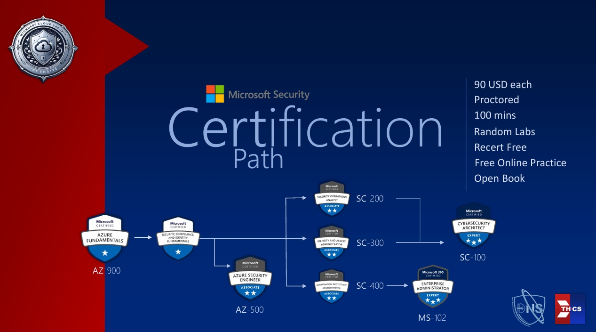

# Microsoft Cybersecurity
ยินดีต้อนรับสู่โลกของความปลอดภัยทางไซเบอร์ **Cybersecurity** แค่กดเข้ามาก็แสดงว่า 
เราต้องการให้ความสำคัญกับความปลอดภัยบนระบบของตัวเองใช่ไหมคะ 😎
ในฐานะนักพัฒนา การคิดถึงความต้องการด้านนี้ตั้งแต่แรกของ Software Development LifeCycle (SDLC)
ตั้งแต่การตั้ง Requirement ถือว่าสำคัญที่สุดเลยค่ะ ยินดีอีกครั้งที่เข้ามาสู่วัฒนธรรม Shift Left
เอาเรื่องความปลอดภัยนี้มาคุยกันตั้งแต่แรก ทำ Threat Modeling ดูความเสี่ยงและอุดแต่แรกบนกระดาษ
แทนที่จะไปเซอร์ไพรส์กันตอนเทสหรือดีพลอยทางฝั่งปลายขวาๆ ของขั้นตอนการพัฒนาค่ะ

## แล้วทำไมต้อง Microsoft
เพราะชั้นเรียนมาค่ะ 555 
เข้าเรื่อง เพราะ:
1. **เราใช้ Azure เป็นต้นแบบของ Cloud Infrastruture**: เป็นพับลิกคลาวด์ เป็นผู้ให้บริการคลาวด์ (Cloud Service Provider; CSP) ที่ให้บริการครบโดยเฉพาะด้านความปลอดภัย ที่สามารถนำหลักการและแนวคิดไปประยุกต์กับคลาวด์ บริการ หรือระบบโครงสร้างพื้นฐานอื่น (เช่น On-Premises) ได้
2. **มีระบบที่คนทั่วไปใช้งาน**: ทุกคนต้องเคยใช้วินโดวส์ ทุกองค์กรก็ผ่านการแชร์เครือข่าย คุมโดเมน ใช้ระบบไดเรกทอรีเป็น Active Directory หรือด้าน Productivity ก็ต่างใช้ Microsoft (Office) 365 กันทั้งนั้น
3. **สนับสนุนการเรียนทั้งฟรี และค่าสอบถูกมาก**: มีทั้งเนื้อหาเรียนรู้ด้วยตัวเอง Self-Pace ผ่านหน้าเว็บอย่าง learn.microsoft.com ที่มีกระทั่งแล็ปให้ฝึกให้สอบฟรี (Applied Skills) รวมไปถึงคอมมูนิตี้น่ารักแถวๆ นี้ เยอะเต็มไปหมดที่พร้อมเข้ามาช่วยเหลือยกระดับสกิล อีกทั้งมี Certificate ด้าน Security มากมายภายใต้ค่าสอบถูกสุดในจักรวาล มีที่ไหนอีกสอบได้แค่จ่าย 50 - 100USD แถมมีกิจกรรมทั้งลดทั้งฟรีค่าสอบมาเรื่อยๆ

## 4 หมวดใหญ่ของ Microsoft Security
จากหน้าหลักที่ทุกคนสามารถเข้ามาศึกษาบนเว็บไมโครซอฟท์ได้ "ฟรี" ที่ https://learn.microsoft.com/security นี้ มีการแบ่งหมวดเป็น 4 หมวดใหญ่ๆ ให้เราเลือกตามความสนใจได้ ซึ่งซาร่าเองก็ชอบที่จะแบ่งแบบนี้ในเนื้อหาของ TPA Path นี้ให้สอดคล้องเช่นเดียวกันก่อนค่ะ ❤️
1. **หลักการ Zero-Trust และการประยุกต์ใช้**:
2. **งานปฏิบัติการด้านเหตุการณ์ความปลอดภัย SecOps/SOC**:
3. **การจัดการข้อมูลตัวตน Identity และควบคุมการเข้าถึง Access Control**:
4. **การปกป้องความปลอดภัยของข้อมูล**:

หรือถ้าต้องการเลือกตามบทบาท ตำแหน่งหน้าที่งานด้าน Cybersecurity แล้ว ไมโครซอฟท์ก็แยกหมวดชัดเจนให้เลือกเติบโตในสายอาชีพที่ต้องการได้ตามนี้นะคะ (อยากให้สังเกตว่าการเรียงลำดับที่ไม่ได้ตามตัวอักษร A-Z ก็น่าจะเรียงตามความสำคัญ หรือความสัมพันธ์ในสายตาของ MS เองนะคะ)
## ตำแหน่งหน้าที่งานด้าน Cybersecurity คามคำแนะนำของไมโครซอฟท์
1. **แอดมินระบบข้อมูลตัวตนและควบคุมการเข้าถึง (Identity and Access Administrator)**:
2. **แอดมินระบบความปลอดภัยข้อมูล และการสอดคล้องตามกฎ/มาตรฐาน (Information Protection and Compliance Administrator)**:
3. **ผู้เชี่ยวชาญการออกแบบระบบความปลอดภัย (Cybersecurity Architect Expert)**:
4. **นักวิเคราะห์และปฏิบัติการด้านเหตุการณ์ความปลอดภัย (Security Operation (SOC) Analyst)**:
5. **วิศวกร (ผู้สร้าง) ระบบความปลอดภัย (Security Engineer)**:

และในฐานะที่ Microsoft มองทุกอย่างขึ้นมาบนคลาวด์ การพูดถึง Microsoft Security ก็คือการทำ (Multi(Cloud/Platform) รวมการประสานกับ On-Premises ด้วย) Cloud Security โดยปริยาย

ซึ่ง Microsoft เองมอง Security เป็นหนึ่งในขั้นตอนใหญ่ของกรอบการเริ่มเข้าใจงานคลาวด์ Cloud Adoption Framework (ที่เราท่องลำดับขั้นตอนย่อว่า SPRASMG ตอนสอบ AZ-900) ตามแผนภาพนี้:

จากแผนภาพ จะเห็นขั้นตอนเริ่มจากวาง Strategy เพื่อกำหนดเป้าหมายธุรกิจ ทำไมขึ้นมาใช้คลาวด์ (ให้สังเกตไม่ว่าเราจะลงทุนหรือทำอะไรใหม่ ต้องเริ่มจากความต้องการองค์กรก่อนเสมอ เอามาวางเป็นยุทธศาสตร์ให้ชัดเจนก่อนลงมือ) >> Plan >> Ready >> Adopt ตามลำดับ

ขณะที่ทุกขั้นตอนข้างต้น จะมีการกำกับดูแลแทรกเข้าไปในทุกอนู ทั้งด้าน Secure, Manage, Govern

ซึ่งใน Secure นี้ ไมโครซอฟท์ก็แจกแจงงานไว้ครอบคลุม "มากมาย" ให้ทั่วถึงทุกด้าน ไม่ว่าจะด้านกำกับดูแลในภาพรวม (Governance, Risk, Compliance ; GRC) อย่าง
1. **การวิเคราะห์ ระบุความเสี่ยง (Risk Insights)**:
2. **การผสานความปลอดภัยกับทุกอย่าง (Security Integration)**:
3. **การรักษาเสถียรภาพ กู้คืน สร้างความต่อเนื่องมั่นคงทางธุรกิจ (Business Resilience)**:
4. **การกำกับดูแลความปลอดภัยโดยรวม (Security Governance)**:

ไปจนถึงด้านเทคนิคัลที่เกี่ยวข้อง ตั้งแต่
1. **การควบคุมการเข้าถึง (Access Control)**:
2. **ปฏิบัติการจัดการเหตุการณ์ความปลอดภัย (Security Operation)**:
3. **การปกป้องทรัพย์สิน (เช่น ข้อมูล) (Asset Protection)**:
4. **ความปลอดภัยในการพัฒนาระบบใหม่ ตาม SDLC/DecSecOps (Innovation Security)**:
5. **การควบคุมความปลอดภัยใน DevSecOps (DevSecOps Control)**:

ไมโครซฮฟท์ยังเน้นย้ำการผสานบทบาทหน้าที่ต่างๆ ในองค์กรเพื่อจัดการความเสี่ยง (ย้ำ ทุกอย่างเริ่มจากความต้องการองค์กร/ธุรกิจ >> การมอง/จัดจำแนกการยอมรับความเสี่ยง Risk Acceptance ก่อนเสมอนะคะ) และจัดการงานด้านความปลอดภัย ดังแผนภาพเหล่านี้:

จะเห็นว่าเราไม่ได้มองตั้งแต่คน (People) และกระบวนการจัดการ/ทำงาน (Process) ก่อนจะลงไปเลือก Technology/Capabilities เสมอ ตามหลักการพาวเวอร์พอยต์ People-Process-Techonology (PPT) เหมือนฮวงจุ้ยที่ฟ้า คน ดิน ต้องประสานกันถึงเห็นผล

สำหรับองค์กรที่มองการวางโครงสร้างความปลอดภัย "ทั้งหมด" ในภาพรวม ไมโครซอฟท์ก็มีอธิบายครอบคลุมในรูปของ Microsoft Cybersecurity Reference Architecture (MCRA) ที่ก็เป็นส่วนหนึ่งของกรอบการทำงานแม่บท Microsoft Security Adoption Framework (SAF) อีกทอดหนึ่ง โดย MCRA มองภาพรวมตั้งแต่ต้นน้ำยันปลายน้ำ (End-to-End) ดังนี้:

ทั้งหมดทั้งมวล จะเห็นได้ว่าเรื่องความปลอดภัยทางไซเบอร์ที่ไมโครซอฟท์นำเสนอนี้ ครอบคลุม ครอบจักรวาล ตอบเทรนด์ Cloud Security ได้ทั้งภาพกว้างและลึก ควรค่าแก่การศึกษาเพื่อนำไปประยุกต์ใช้ แม้เราอาจไม่ได้ใช้ทุก Tech/Capabilities จากไมโครซอฟท์ก็ตามนะคะ ❤️
