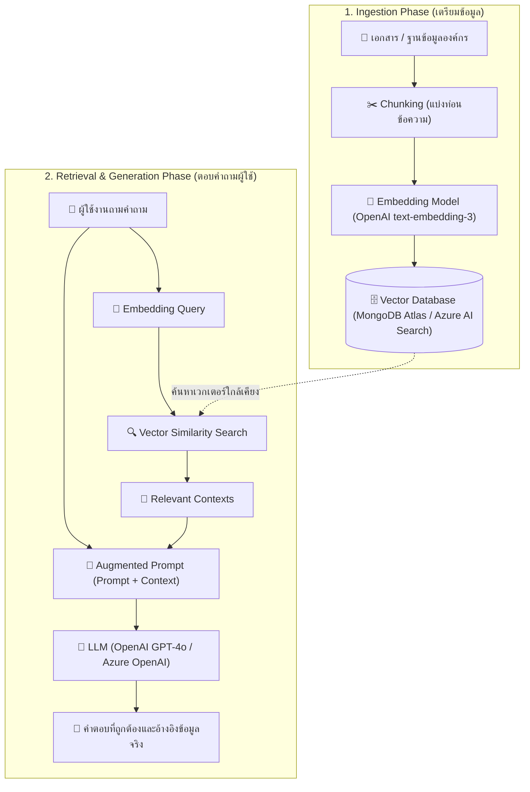

# การศึกษา AI เบื้องต้น: OpenAI, RAG และ Vector Search

ในยุคของ **Generative AI** การพัฒนาซอฟต์แวร์ได้ก้าวข้ามจากการเขียนตรรกะแบบ Hard-coded มาเป็นการผสานพลังของ **Large Language Models (LLMs)** เช่น OpenAI GPT เข้ากับข้อมูลเฉพาะทางขององค์กร โดยหนึ่งในสถาปัตยกรรมที่สำคัญและเป็นมาตรฐานที่สุดในปัจจุบันคือ **Retrieval-Augmented Generation (RAG)** ร่วมกับ **Vector Search**



---

## 1. Large Language Models (LLMs) และ OpenAI API

LLM เช่น โมเดลตระกูล GPT ของ OpenAI หรือ Azure OpenAI Service ได้รับการฝึกฝนจากข้อมูลสาธารณะมหาศาล ทำให้มีความสามารถในการทำความเข้าใจภาษาธรรมชาติ (NLP), สรุปความ, แปลภาษา, และสร้างโค้ด

อย่างไรก็ตาม LLMs ทั่วไปมีข้อจำกัดหลัก 2 ประการ:
1. **Knowledge Cutoff**: โมเดลไม่ทราบข้อมูลที่เป็นปัจจุบันหลังจากวันที่เทรนเสร็จสิ้น
2. **Private Data**: โมเดลไม่รู้จักข้อมูลเฉพาะของธุรกิจหรือเอกสารภายในองค์กร
3. **Hallucination (ภาพหลอน)**: โมเดลอาจสร้างคำตอบที่ดูน่าเชื่อถือแต่เป็นข้อมูลเท็จขึ้นมาเอง

---

## 2. สถาปัตยกรรม RAG (Retrieval-Augmented Generation)

**RAG** คือเทคนิคที่แก้ปัญหาข้อจำกัดของ LLM โดยการ **"ค้นหาข้อมูลที่เกี่ยวข้องจากภายนอก แล้วส่งไปเป็นบริบท (Context) ร่วมกับคำถาม"** ให้ LLM ใช้ประกอบการประมวลผลคำตอบ

### ขั้นตอนการทำงานของ RAG:
1. **Chunking**: นำเอกสารต้นฉบับ (PDF, Markdown, Web Page, Database) มาหั่นออกเป็นท่อนย่อยๆ (เช่น 500-1,000 Tokens) พร้อม overlap เล็กน้อยเพื่อคงความหมาย
2. **Vector Embedding**: นำ Chunk แต่ละชิ้นไปผ่านโมเดล Embedding (เช่น `text-embedding-3-small` หรือ `text-embedding-ada-002`) เพื่อแปลงข้อความให้อยู่ในรูปเวกเตอร์ตัวเลขหลายมิติ (Vector of Floats)
3. **Indexing & Storage**: จัดเก็บข้อความและเวกเตอร์ลงในฐานข้อมูล Vector Database
4. **Similarity Search**: เมื่อผู้ใช้ส่งคำถามเข้ามา ระบบจะแปลงคำถามเป็นเวกเตอร์ แล้วคำนวณหาความคล้ายคลึงเชิงความหมาย (Semantic Similarity เช่น Cosine Similarity) เพื่อดึง Chunk ที่ตรงที่สุดออกมา
5. **Generation**: รวบรวมคำถามและ Context ส่งเข้า LLM ด้วย System Prompt เช่น *"จงตอบคำถามโดยใช้เฉพาะข้อมูลในบริบทที่ระบุไว้เท่านั้น"*

---

## 3. Vector Database และ MongoDB Atlas Vector Search

ในอดีต การทำ Vector Search อาจต้องใช้ฐานข้อมูลเฉพาะทาง (เช่น Pinecone, Milvus, Qdrant) แต่ในปัจจุบัน ฐานข้อมูลระดับโลกอย่าง **MongoDB Atlas** ได้เพิ่มฟีเจอร์ **Vector Search** แบบเนทีฟ ทำให้ทีมสามารถจัดเก็บทั้งข้อมูลเอกสารปกติ (JSON Documents) และ Vector Embeddings ไว้ในที่เดียวกันได้

### การทำงานของ MongoDB Atlas Vector Search:
- จัดเก็บฟิลด์ Vector ร่วมกับข้อมูลเดิมใน Collection:
  ```json
  {
    "_id": "doc_101",
    "title": "คู่มือการเบิกสวัสดิการ",
    "content": "พนักงานสามารถยื่นเบิกค่ารักษาพยาบาลได้ไม่เกิน...",
    "content_vector": [0.0125, -0.0432, 0.0891, ...],
    "category": "hr"
  }
  ```
- สร้าง Index แบบ `vectorSearch` บน Atlas
- ใช้ Aggregation Pipeline `$vectorSearch` เพื่อค้นหาข้อมูลได้อย่างรวดเร็ว:
  ```javascript
  db.documents.aggregate([
    {
      $vectorSearch: {
        index: "vector_index",
        path: "content_vector",
        queryVector: userQueryVector,
        numCandidates: 100,
        limit: 5
      }
    }
  ]);
  ```

---

## 4. การประสานงานด้วย Semantic Kernel (C# / .NET)

สำหรับนักพัฒนาฝั่ง .NET / C# บริษัท Microsoft ได้พัฒนาโอเพนซอร์สเฟรมเวิร์กชื่อ **Semantic Kernel** เพื่อช่วยผสานการทำงานระหว่างโค้ดภาษา C# เข้ากับ AI Services ได้อย่างง่ายดาย:
- **Chat Completion Service**: จัดการสนทนากับ Azure OpenAI / OpenAI
- **Text Embedding Generation Service**: แปลงข้อความเป็น Embedding Vector อัตโนมัติ
- **Memory & Vector Store Connectors**: รองรับการเชื่อมต่อกับ MongoDB, Azure AI Search, Qdrant, และ SQLite

---

## 📚 แหล่งเรียนรู้ ตัวอย่างโค้ด และบทความแนะนำ

ชุมชนนักพัฒนาไทยได้รวบรวมตัวอย่างและบทความเชิงลึกสำหรับศึกษาและลงมือทำ:

### 1. โค้ดตัวอย่างบน GitHub
- 🔗 **GitHub**: [T-T-Software-Solution/dotnetConf2024.ttss.version](https://github.com/T-T-Software-Solution/dotnetConf2024.ttss.version/)  
  *ตัวอย่างการประยุกต์ใช้ Semantic Kernel C# และ Vector Search จากงาน .NET Conf Thailand*

### 2. บทความแนะนำโดย T-T Software Solution
- 📖 **Medium**: [RAG พื้นฐานโดย Semantic Kernel C# ร่วมกับ Chat Completion Model และ Text Embedding Model ใน Azure](https://medium.com/t-t-software-solution/rag-%E0%B8%9E%E0%B8%B7%E0%B9%89%E0%B8%99%E0%B8%90%E0%B8%B2%E0%B8%99%E0%B9%82%E0%B8%94%E0%B8%A2-semantic-kernel-c-%E0%B8%A3%E0%B9%88%E0%B8%A7%E0%B8%A1%E0%B8%81%E0%B8%B1%E0%B8%9A-chat-completion-model-%E0%B9%81%E0%B8%A5%E0%B8%B0-text-embedding-model-%E0%B9%83%E0%B8%99-azure-9a86f606c225)
- 📖 **Medium**: [Minimal RAG & Vector Database: ออกแบบระบบ RAG ขนาดกะทัดรัด](https://medium.com/t-t-software-solution/minimal-rag-vector-database-a219db209852)
