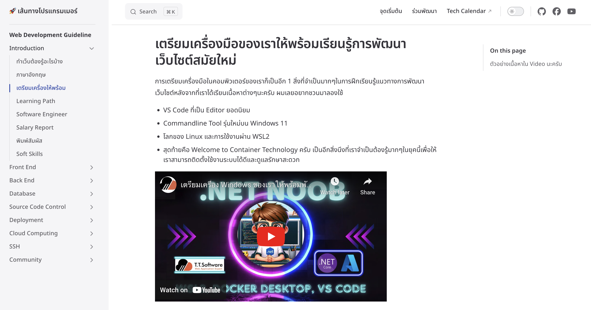
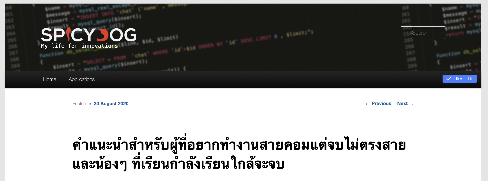
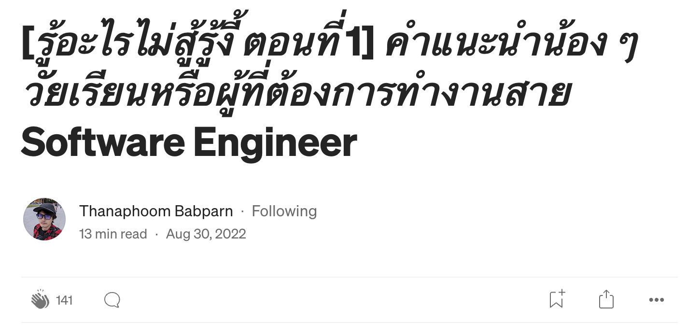
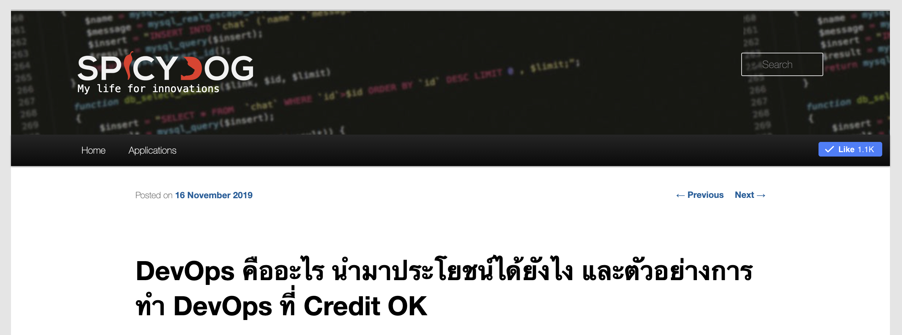
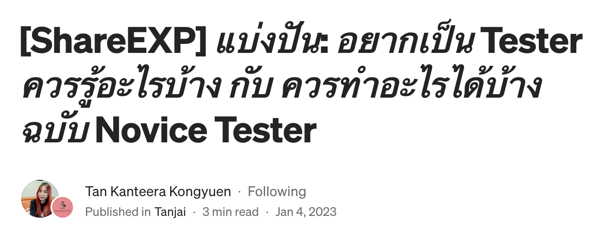

# ตำแหน่งสายงาน IT
> ขอบคุณเนื้อหาดีๆจาก **[TALANCE](https://www.talance.tech/blog/it-job-responsibility/)**

ในแต่ละสายงานนั่นมีอาชีพที่หลากหลายและต่างก็มีความต้องการในตลาดเป็นอย่างสูง แต่หนึ่งในอุตสาหกรรมที่น่าสนใจในยุคดิจิทอลนั่นคือ “อุตสาหกรรม IT” เพราะหลายๆ องค์กรเริ่มปรับตัวและพร้อมเข้าสู่ Digital transformation ทั้งในส่วนของโปรเจกต์หรือแม้งานภายในองค์กร จึงจำเป็นอย่างยิ่งที่ต้องการบุคลากรในสายงาน IT จากหลากหลายสายและเชี่ยวชาญในหน้าที่เข้ามาร่วมทำงานในองค์กรของตัวเอง

เพื่อทำให้เข้าใจได้ง่ายขึ้นว่างานในสายนี้มีตำแหน่งและหน้าที่ทำอะไรบ้าง เราจึงขอรวบรวมสายงาน IT ต่างๆ มาไว้ในนี้ ครบ จบ ในที่เดียว เพื่อเป็นความรู้และข้อมูลสำหรับผู้ที่สนใจ 

## Road to Software Engineer
ขั้นตอนแรกที่ผมอยากจะแนะนำที่สุดคืออยากให้เรารู้เส้นทางสายงาน IT ที่เรากำลังจะเดินทางไปด้วยกันนี้ก่อนครับผมว่ามีอะไรบ้าง เราอยู่ที่จุดไหนของสายงาน และเราอยากเติบโตไปในแนวทางไหนครับ ผมได้ทำ Video สรุปมาให้ตามนี้นะครับ

<iframe width="560" height="315" src="https://www.youtube.com/embed/W7SzHtGEtyg?si=kib60gegi6kFu64H" title="YouTube video player" frameborder="0" allow="accelerometer; autoplay; clipboard-write; encrypted-media; gyroscope; picture-in-picture; web-share" referrerpolicy="strict-origin-when-cross-origin" allowfullscreen></iframe>

> ขอบคุณเนื้อหาดีๆจาก **[T. T. Software Solution](https://www.tt-ss.net/)**

## Web Development Guideline

ทางสมาคมโปรแกรมเมอร์ไทยทำการรวบรวมเนื้อหาที่คิดว่าเป็นประโยชน์ให้เห็นภาพกว้างในการเข้ามาทำงานในสาย Web Developers นะครับ
ทีมงานมองว่าเป็นจุดเริ่มต้นที่ดีที่เราจะได้เห็นภาพรวมการพัฒนาระบบสักอย่างนึงตั้งแต่ต้น และเราสามารถนำความรู้ตรงนี้ไปต่อยอดกับงานอื่นได้ครับผม

[Web Development Guideline](/paths/web-guideline/intro/intro.html)

## อยากเป็น Software Developer เริ่มอย่างไรดี ? ระหว่าง เรียนรู้ด้วยตัวเอง vs หลักสูตรของมหาลัย vs Coding Bootcamp
> ขอบคุณเนื้อหาดีๆจาก **[Datayolk](https://datayolk.net/)**
  

[อยากเป็น Software Developer เริ่มอย่างไรดี ? ระหว่าง เรียนรู้ด้วยตัวเอง vs หลักสูตรของมหาลัย vs Coding Bootcamp](https://datayolk.net/technology/learning-to-code-self-taught-vs-bootcamp-vs-cs-degree/)

## คำแนะนำสำหรับผู้ที่อยากทำงานสายคอมแต่จบไม่ตรงสาย และน้องๆ ที่เรียนกำลังเรียนใกล้จะจบ
> ขอบคุณเนื้อหาดีๆจาก **[Spicydog](https://www.spicydog.org/blog/)**

[คำแนะนำสำหรับผู้ที่อยากทำงานสายคอมแต่จบไม่ตรงสาย และน้องๆ ที่เรียนกำลังเรียนใกล้จะจบ](https://www.spicydog.org/blog/advice-for-non-computer-degree-programmer/)

## คำแนะนำน้อง ๆ วัยเรียนหรือผู้ที่ต้องการทำงานสาย Software Engineer
> ขอบคุณเนื้อหาดีๆจาก **[Thanaphoom Babparn](https://tpbabparn.medium.com)**

[คำแนะนำน้อง ๆ วัยเรียนหรือผู้ที่ต้องการทำงานสาย Software Engineer](https://tpbabparn.medium.com/%E0%B8%A3%E0%B8%B9%E0%B9%89%E0%B8%AD%E0%B8%B0%E0%B9%84%E0%B8%A3%E0%B9%84%E0%B8%A1%E0%B9%88%E0%B8%AA%E0%B8%B9%E0%B9%89%E0%B8%A3%E0%B8%B9%E0%B9%89%E0%B8%87%E0%B8%B5%E0%B9%89-%E0%B8%95%E0%B8%AD%E0%B8%99%E0%B8%97%E0%B8%B5%E0%B9%88-1-%E0%B8%84%E0%B8%B3%E0%B9%81%E0%B8%99%E0%B8%B0%E0%B8%99%E0%B8%B3%E0%B8%99%E0%B9%89%E0%B8%AD%E0%B8%87-%E0%B9%86-%E0%B8%A7%E0%B8%B1%E0%B8%A2%E0%B9%80%E0%B8%A3%E0%B8%B5%E0%B8%A2%E0%B8%99%E0%B8%AB%E0%B8%A3%E0%B8%B7%E0%B8%AD%E0%B8%9C%E0%B8%B9%E0%B9%89%E0%B8%97%E0%B8%B5%E0%B9%88%E0%B8%95%E0%B9%89%E0%B8%AD%E0%B8%87%E0%B8%81%E0%B8%B2%E0%B8%A3%E0%B8%97%E0%B8%B3%E0%B8%87%E0%B8%B2%E0%B8%99%E0%B8%AA%E0%B8%B2%E0%B8%A2-software-engineer-a63275428a7f)

## อยากเป็นโปรแกรมเมอร์ละอ่อนใน 3เดือน
> ขอบคุณเนื้อหาดีๆจาก **[TiMeFF](https://timeff.medium.com/)**

[อยากเป็นโปรแกรมเมอร์ละอ่อนใน 3เดือน](https://timeff.medium.com/%E0%B8%AD%E0%B8%A2%E0%B8%B2%E0%B8%81%E0%B9%80%E0%B8%9B%E0%B9%87%E0%B8%99%E0%B9%82%E0%B8%9B%E0%B8%A3%E0%B9%81%E0%B8%81%E0%B8%A3%E0%B8%A1%E0%B9%80%E0%B8%A1%E0%B8%AD%E0%B8%A3%E0%B9%8C%E0%B8%A5%E0%B8%B0%E0%B8%AD%E0%B9%88%E0%B8%AD%E0%B8%99%E0%B9%83%E0%B8%99-3%E0%B9%80%E0%B8%94%E0%B8%B7%E0%B8%AD%E0%B8%99-7201b312e115)

## ทำเว็บต้องรู้อะไรบ้าง? เอากันตั้งแต่คอมพิวเตอร์ทำงานยังไง ไปจนถึงการสร้างเว็บเอาขึ้นออนไลน์
> ขอบคุณเนื้อหาดีๆจาก **[Spicydog](https://www.spicydog.org/blog/)**

[ทำเว็บต้องรู้อะไรบ้าง? เอากันตั้งแต่คอมพิวเตอร์ทำงานยังไง ไปจนถึงการสร้างเว็บเอาขึ้นออนไลน์](https://www.spicydog.org/blog/what-is-web-application/)

## DevOps คืออะไร นำมาประโยชน์ได้ยังไง และตัวอย่างการทำ DevOps ที่ Credit OK
> ขอบคุณเนื้อหาดีๆจาก **[Spicydog](https://www.spicydog.org/blog/)**

[DevOps คืออะไร นำมาประโยชน์ได้ยังไง และตัวอย่างการทำ DevOps ที่ Credit OK](https://www.spicydog.org/blog/introduction-to-devops-and-the-practical-use-cases-at-credit-ok/)
 
## เคล็ดลับย้ายสาย เข้าสู่งาน Data เริ่มได้ทันที
>  ขอบคุณเนื้อหาดีๆจาก **[มาลองเรียน - Malonglearn](https://www.malonglearn.com)**
> 

[เคล็ดลับย้ายสาย เข้าสู่งาน Data เริ่มได้ทันที](https://www.malonglearn.com/step-to-data-career/)

## Data Analyst Career Guide แนะนำงานสาย Data ฉบับสมบูรณ์
>  ขอบคุณเนื้อหาดีๆจาก **[DataRockie](https://datarockie.com/)**
> 

[Data Analyst Career Guide แนะนำงานสาย Data ฉบับสมบูรณ์](https://datarockie.com/blog/data-analyst-complete-career-guide/)

## อยากเป็น Data Engineer ต้องรู้ภาษาอะไรบ้าง
>  ขอบคุณเนื้อหาดีๆจาก **[DataRockie](https://datarockie.com/)**
> 

[อยากเป็น Data Engineer ต้องรู้ภาษาอะไรบ้าง](https://datarockie.com/blog/data-engineering-foundation/)

## แนะนำ 3 Platforms เรียนฟรีอัพสกิล Cloud Computing สำหรับผู้เริ่มต้น
>  ขอบคุณเนื้อหาดีๆจาก **[DataRockie](https://datarockie.com/)**
> 

[แนะนำ 3 Platforms เรียนฟรีอัพสกิล Cloud Computing สำหรับผู้เริ่มต้น](https://datarockie.com/blog/free-cloud-computing-courses/)

## [ShareEXP] แบ่งปัน: อยากเป็น Tester ควรรู้อะไรบ้าง กับ ควรทำอะไรได้บ้าง ฉบับ Novice Tester
>  ขอบคุณเนื้อหาดีๆจาก **[Tan Kanteera Kongyuen](https://medium.com/@tanjaik)**
> 

[[ShareEXP] แบ่งปัน: อยากเป็น Tester ควรรู้อะไรบ้าง กับ ควรทำอะไรได้บ้าง ฉบับ Novice Tester](https://tanjailittletester.com/shareexp-%E0%B9%81%E0%B8%9A%E0%B9%88%E0%B8%87%E0%B8%9B%E0%B8%B1%E0%B8%99-%E0%B8%AD%E0%B8%A2%E0%B8%B2%E0%B8%81%E0%B9%80%E0%B8%9B%E0%B9%87%E0%B8%99-tester-%E0%B8%84%E0%B8%A7%E0%B8%A3%E0%B8%A3%E0%B8%B9%E0%B9%89%E0%B8%AD%E0%B8%B0%E0%B9%84%E0%B8%A3%E0%B8%9A%E0%B9%89%E0%B8%B2%E0%B8%87-%E0%B8%81%E0%B8%B1%E0%B8%9A-%E0%B8%84%E0%B8%A7%E0%B8%A3%E0%B8%97%E0%B8%B3%E0%B8%AD%E0%B8%B0%E0%B9%84%E0%B8%A3%E0%B9%84%E0%B8%94%E0%B9%89%E0%B8%9A%E0%B9%89%E0%B8%B2%E0%B8%87-%E0%B8%89%E0%B8%9A%E0%B8%B1%E0%B8%9A-novice-tester-89c6f4f695d8)