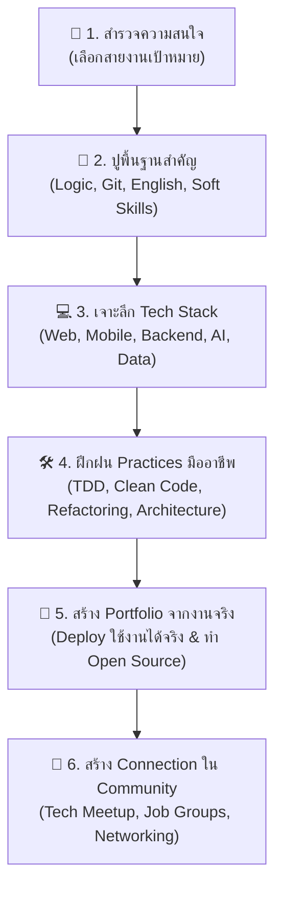

# คำแนะนำการใช้งาน TPA Website & ก้าวแรกสู่สายงาน IT

ยินดีต้อนรับสู่ **TPA Programmer's Roadmap & Career Paths** เว็บไซต์แผนที่การเรียนรู้และเส้นทางการเติบโตในสายงานเทคโนโลยี จัดทำและขับเคลื่อนโดย **สมาคมโปรแกรมเมอร์ไทย (Thai Programmer Association)** ร่วมกับชุมชนนักพัฒนาไทย

สำหรับผู้ที่กำลังสนใจเข้าสู่วงการเทคโนโลยี นักศึกษาจบใหม่ หรือผู้ที่ต้องการ **"ย้ายสายงาน (Career Changer)"** มักเจอกับคำถามว่า *"เทคโนโลยีมีเยอะมาก ควรเริ่มต้นจากตรงไหน?"* และ *"ควรเลือกเรียนอะไรก่อนหลัง?"* คู่มือหน้านี้จะช่วยนำทางคุณทีละก้าวอย่างเป็นระบบ

<SkillCard id="it-career-starter" />

---

## แผนภาพภาพรวม: เส้นทางการเริ่มต้นสายงาน IT

---

## 6 ขั้นตอนสู่การเริ่มต้นเป็นนักพัฒนาซอฟต์แวร์

### 1. 🧭 สำรวจตัวเองและค้นหาสายงานที่ใช่
ในสายงาน IT มีบทบาทหลากหลายที่ตอบโจทย์ความถนัดและความชอบที่ต่างกัน:
- **ชอบความสวยงาม งานที่เห็นภาพทันที การสร้างประสบการณ์ผู้ใช้**: แนะนำสาย [Front-end Developer](/paths/career/developer/frontend) หรือ [Mobile Developer](/paths/career/developer/mobile)
- **ชอบตรรกะ การคำนวณ การจัดการข้อมูล และเบื้องหลังระบบ**: แนะนำสาย [Back-end Developer](/paths/career/developer/backend)
- **ชอบดูแลระบบ วางโครงสร้าง Infrastructure และระบบอัตโนมัติ**: แนะนำสาย [DevOps Engineer](/paths/career/developer/devops) หรือ [Cloud Engineer](/paths/career/infrastructure/cloudengineer)
- **ชอบวิเคราะห์ ค้นหาความหมายจากตัวเลข หรือเทคโนโลยีปัญญาประดิษฐ์**: แนะนำสาย [Data Analyst/Scientist](/paths/career/data/da) หรือ [AI Engineer](/paths/career/developer/aiengineer)
- **ชอบตรวจสอบหาข้อผิดพลาด รักษาคุณภาพ และความถูกต้องของระบบ**: แนะนำสาย [QA / Software Tester](/paths/career/qa/automation)

> 💡 *สามารถอ่านรายละเอียดหน้าที่ ความรับผิดชอบ และเส้นทางการเติบโตของแต่ละตำแหน่งเพิ่มเติมได้ที่หมวด [ตำแหน่งสายงาน IT ทั้งหมด](/paths/career/)*

---

### 2. 🧱 ปูพื้นฐานที่ทุกคนต้องรู้ (Non-Negotiable Fundamentals)
ไม่ว่าจะเลือกเดินในเส้นทางใด มีทักษะพื้นฐาน 4 ด้านที่จำเป็นอย่างยิ่ง:
1. **การแก้ปัญหาและตรรกะ (Problem Solving & Logic)**: ทำความเข้าใจตัวแปร, เงื่อนไข (If-Else), การวนซ้ำ (Loops) และ Data Structures พื้นฐาน
2. **ระบบควบคุมเวอร์ชัน (Git & GitHub)**: ทักษะที่ขาดไม่ได้ในการทำงานร่วมกันในทีม เรียนรู้การ Commit, Push, Branch และการสร้าง Pull Request ได้ที่ [หมวด Source Code Control](/paths/sourcecodecontrol/git-basics/what-is-git)
3. **ภาษาอังกฤษเพื่อการค้นหา**: เอกสารทางการ (Official Docs), ข้อความแจ้งเตือน Error และวิธีแก้ปัญหาส่วนใหญ่ใน Stack Overflow เป็นภาษาอังกฤษ การฝึกค้นหา [Google Search Syntax และภาษาอังกฤษสำหรับโปรแกรมเมอร์](/paths/web-guideline/intro/english) จะช่วยเพิ่มความเร็วในการแก้ปัญหาได้หลายเท่า
4. **Soft Skills และการทำงานเป็นทีม**: การสื่อสาร, การรับฟัง Feedback, และความเห็นอกเห็นใจผู้อื่น สำคัญไม่แพ้ทักษะ Technical (ศึกษาเพิ่มเติมได้ที่ [Soft Skills สำหรับสายงาน Tech](/paths/web-guideline/intro/softskill))

---

### 3. 💻 เจาะลึก Tech Stack ในสายงานที่เลือก
เมื่อเลือกทิศทางได้แล้ว ให้มุ่งเน้นศึกษา **Stack หลักเพียง 1 อย่างให้เชี่ยวชาญก่อน** แทนที่จะพยายามเรียนรู้ทุกภาษาสะเปะสะปะ:
- **เริ่มต้นพัฒนาเว็บ**: ศึกษาตาม [Web Development Guidelines](/paths/web-guideline/intro/intro) (เริ่มจาก HTML, CSS, JavaScript แล้วต่อยอดสู่ React, TypeScript หรือ Angular)
- **สาย Enterprise Backend**:
  - สาย Java: [Java Roadmap & Bootcamp](/paths/java/)
  - สาย Microsoft / .NET: [ASP.NET Core Roadmap](/paths/aspnet-core/)
- **สาย AI Application**: [AI Application Development](/paths/ai-application-development/) (ศึกษา OpenAI API, RAG, และ Vector Search)
- **สาย DevOps & Cloud**: [DevOps Roadmap](/paths/devops/) และ [Azure Fundamentals](/paths/azure/)

---

### 4. 🛠️ ยกระดับสู่มาตรฐานระดับมืออาชีพ (Software Practices)
สิ่งที่แยกแยะระหว่างคนเขียนโค้ดได้ (Coder) กับวิศวกรซอฟต์แวร์มืออาชีพ (Software Engineer) คือการปฏิบัติตามแนวทางมาตรฐาน:
- **[Code Refactoring](/paths/practices/coding/code-refactoring)**: เขียนโค้ดให้อ่านง่าย สะอาด และกำจัด Code Smells
- **[Test-Driven Development (TDD)](/paths/practices/coding/test-driven-development)**: ฝึกเขียน Automated Test เพื่อสร้างความมั่นใจในการส่งมอบงาน
- **[Design Patterns](/paths/practices/design/design-patterns)** และ **[Domain-Driven Design (DDD)](/paths/practices/design/domain-driven-design)**: ออกแบบโครงสร้าง Class และระบบที่ยืดหยุ่นรองรับโจทย์ธุรกิจ
- **[Software Architecture](/paths/software-architecture/introduction/software-architecture-intro)**: ทำความเข้าใจสถาปัตยกรรมระดับภาพรวม เช่น Monolith และ Microservices

---

### 5. 📁 ลงมือทำโปรเจกต์จริงและสร้าง Portfolio
- **อย่าติดอยู่ใน Tutorial Hell**: การดูคลิปวิดีโอเพียงอย่างเดียวไม่ทำให้เขียนโปรแกรมเป็น ให้ปิดวิดีโอแล้วลองสร้างโปรเจกต์ของตัวเองขึ้นมาตั้งแต่ศูนย์
- **สร้างโปรเจกต์ที่แก้ปัญหาจริง**: เช่น เว็บไซต์จัดการค่าใช้จ่ายส่วนตัว, ระบบแจ้งเตือนคิว, หรือเว็บแอปร้านค้าขนาดเล็ก
- **Deploy ขึ้นอินเทอร์เน็ตจริง**: นำโค้ดขึ้น GitHub และ Deploy ผ่านบริการฟรี เช่น Vercel, Netlify, Render, หรือ Cloud เพื่อให้ผู้ว่าจ้างสามารถคลิกเข้ามาทดลองใช้งานได้จริง

---

### 6. 🤝 เชื่อมต่อกับชุมชนและเข้าร่วมกิจกรรม
- **เข้าร่วมงาน Tech Meetup**: เรียนรู้หัวข้อใหม่ๆ และสร้างเครือข่ายเพื่อนร่วมวงการ (ดูสรุปเนื้อหาและวิดีโอย้อนหลังได้ที่ [หมวด Tech Meetup](/paths/meetup/))
- **Tech Calendar**: ติดตามงานสัมมนาและกิจกรรมเทคโนโลยีทั่วประเทศไทยได้ที่ [th.techcal.dev](https://th.techcal.dev/)
- **กลุ่มพูดคุยและหางาน**:
  - [สมาคมโปรแกรมเมอร์ไทย (Facebook Page)](https://www.facebook.com/ThaiProgrammerSociety)
  - [กลุ่มพูดคุยสมาคมโปรแกรมเมอร์ไทย](https://www.facebook.com/groups/240703846140892)
  - [กลุ่มหางานสายโปรแกรมเมอร์](https://www.facebook.com/groups/647718825333067)
  - [YouTube สมาคมโปรแกรมเมอร์ไทย](https://www.youtube.com/@ThaiProgrammer)

---

## วิธีการใช้งานเว็บไซต์ TPA Roadmap ให้ได้ประโยชน์สูงสุด

1. **ใช้ช่องค้นหา (Search)**: กดปุ่ม `Ctrl + K` (หรือ `Cmd + K` บน Mac) เพื่อพิมพ์คำศัพท์ หัวข้อ หรือภาษาที่ต้องการศึกษาได้ทันที
2. **เรียนรู้ตามขั้นตอนทีละสเต็ป**: ด้านซ้ายของแต่ละหน้าจะมีแถบสารบัญ (Sidebar) เรียงลำดับเนื้อหาจากง่ายไปยาก
3. **ร่วมส่งต่อความรู้ (Contributing)**: หากพบจุดผิด มีเนื้อหาใหม่ที่อยากเพิ่มเติม หรือมีไอเดียดีๆ สามารถกดที่ปุ่ม [ร่วมพัฒนา (Contributing)](/contrib/contributing.md) เพื่อส่ง Pull Request ร่วมเป็นหนึ่งใน Contributor ของสมาคมโปรแกรมเมอร์ไทยได้เลยครับ!
