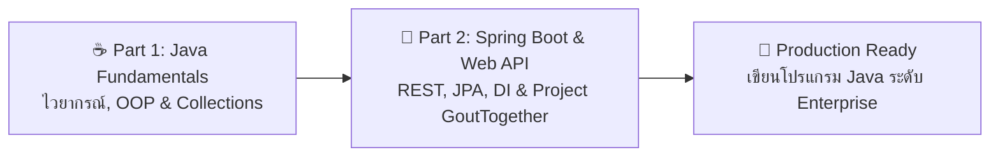

# Java Developer Bootcamp โดยคุณมาร์ท (Marttp)

สำหรับผู้ที่ต้องการศึกษาและพัฒนาทักษะทางด้าน **Java และ Spring Boot** ตั้งแต่ระดับพื้นฐานไปจนถึงการลงมือสร้างแอปพลิเคชันจริง คอร์ส **Java Developer Bootcamp โดยคุณมาร์ท (Marttp)** ถือเป็นหนึ่งในคลังความรู้ภาษาไทยที่ครอบคลุม ครบถ้วน และได้รับความนิยมอย่างมากในชุมชนนักพัฒนาไทย

---

## 📺 เพลย์ลิสต์วิดีโอ (YouTube Playlist)

สามารถรับชมคลิปการสอนแบบเต็มรูปแบบทั้งหมดได้ฟรีที่ YouTube Playlist:

> 🔗 **[YouTube: Java Developer Bootcamp โดย Marttp](https://www.youtube.com/playlist?list=PLm3A9eDaMzukMQtdDoeOR-HbFN35vieQY)**

---

## 📂 โครงสร้างเนื้อหาและ Source Code ตัวอย่าง

คอร์สนี้แบ่งออกเป็น 2 ช่วงการเรียนรู้หลัก พร้อม Repository ตัวอย่างโค้ดบน GitHub ให้ฝึกฝนและศึกษาตาม:

### 1. ⚪️ Java Fundamentals Part
เน้นปูพื้นฐานการเขียนภาษา Java ให้แข็งแกร่ง เข้าใจกลไกการทำงานของ JVM, Type System, การออกแบบ Object-Oriented Programming (OOP), และการจัดการ Data Structures:
- **หัวข้อสำคัญ**:
  - พื้นฐานภาษาและ Syntax ของ Java สมัยใหม่
  - การจัดการ Memory, Stack และ Heap
  - Object-Oriented Programming (Encapsulation, Inheritance, Polymorphism, Abstraction)
  - Collections Framework (List, Set, Map)
  - Exception Handling และ Best Practices ในการเขียนโค้ดที่ปลอดภัย
- **Repository โค้ดตัวอย่าง**:
  - 🔗 **GitHub**: [marttp/20240605-java-dev-bootcamp-example](https://github.com/marttp/20240605-java-dev-bootcamp-example)

### 2. ⚪️ Spring Boot & Web API Part
ก้าวข้ามจากภาษาพื้นฐานสู่การเป็น Backend Developer มืออาชีพด้วย Spring Boot เฟรมเวิร์กมาตรฐานของวงการ Enterprise ทั่วโลก:
- **หัวข้อสำคัญ**:
  - สถาปัตยกรรมของ Spring Framework และ Dependency Injection (Inversion of Control)
  - การสร้าง RESTful APIs ด้วย Spring Web / Spring MVC
  - การเชื่อมต่อและจัดการฐานข้อมูลด้วย Spring Data JPA & Hibernate
  - การจัดการ DTO (Data Transfer Object), Validation และ Error Response
  - การพัฒนาโปรเจกต์จริง **"GoutTogether"** เพื่อจำลองการทำงานจริงในระบบ
- **Repository โค้ดตัวอย่าง**:
  - 🔗 **GitHub**: [marttp/20240629-GoutTogether](https://github.com/marttp/20240629-GoutTogether)

---

## 💡 คำแนะนำในการเรียนรู้

1. **Clone โค้ดตัวอย่างมาทดลองรัน**: ดาวน์โหลดโค้ดจากทั้งสอง Repository มาเปิดใน IDE ยอดนิยม เช่น IntelliJ IDEA หรือ VS Code
2. **พิมพ์โค้ดตามด้วยตัวเอง (Code Along)**: การพิมพ์โค้ดด้วยตัวเองตามวิดีโอจะช่วยให้จดจำคำสั่งและเข้าใจ Error ต่างๆ ได้ดียิ่งขึ้น
3. **ต่อยอดโปรเจกต์ GoutTogether**: ทดลองเพิ่มฟังก์ชันใหม่ๆ เช่น ระบบ Authentication (Spring Security / JWT) หรือเขียน Automated Test เพิ่มเติมเพื่อฝึกฝนทักษะ
