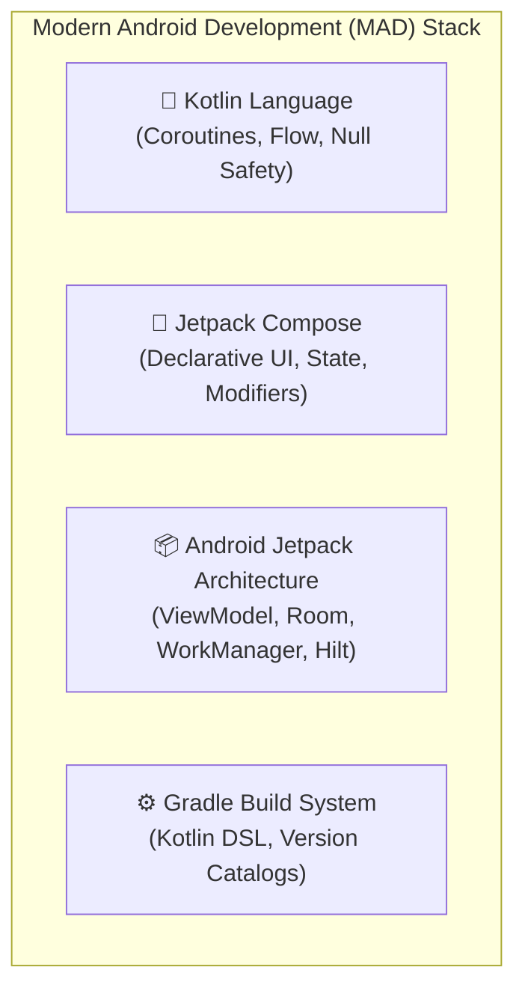
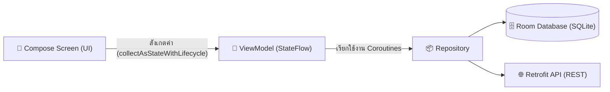
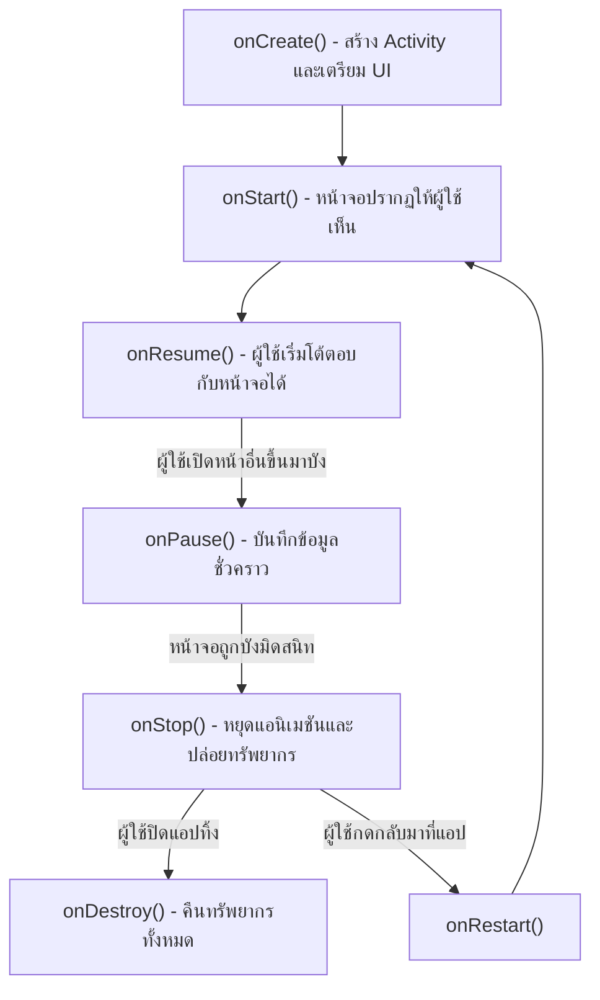

# พื้นฐานการพัฒนา Native Android (Kotlin & Jetpack Compose)

การพัฒนาแอปพลิเคชันแบบ **Native Android** เป็นแนวทางที่ให้ประสิทธิภาพสูงสุด สามารถเข้าถึงฟีเจอร์ระดับฮาร์ดแวร์ล่าสุดของ Google และ OEM ผู้ผลิตสมาร์ทโฟนได้อย่างเต็มประสิทธิภาพ 100%

ในปัจจุบัน การพัฒนา Android ได้เปลี่ยนผ่านเข้าสู่ยุค **Modern Android Development (MAD)** อย่างสมบูรณ์ โดยใช้ภาษา **Kotlin เป็นหลัก (Kotlin-First)** และใช้ **Jetpack Compose** เป็นเครื่องมือสร้าง UI แบบ Declarative



---

## 1. สถาปัตยกรรมระบบปฏิบัติการ Android

ระบบปฏิบัติการ Android มีโครงสร้างสถาปัตยกรรมแบบแบ่งชั้น (Layered Architecture):

1. **System Apps & User Apps**: แอปพลิเคชันของผู้ใช้และแอปพลิเคชันระบบ (Dialer, Camera)
2. **Java / Kotlin API Framework**: ชุด APIs ที่นักพัฒนาใช้สร้างแอป (Activity Manager, Window Manager, Notification Manager, Content Providers)
3. **Android Runtime (ART) & Native Libraries**: รันไทม์ที่คอมไพล์โค้ด DEX (Dalvik Executable) เป็น Machine Code พร้อมเทคนิค AOT (Ahead-of-Time) และ JIT (Just-in-Time) ผสมผสานกัน
4. **Hardware Abstraction Layer (HAL)**: เลเยอร์ตัวกลางระหว่าง Driver ของฮาร์ดแวร์กับเฟรมเวิร์กของระบบ
5. **Linux Kernel**: แกนหลักของระบบที่ควบคุมสิทธิ์ความปลอดภัย การจัดสรรหน่วยความจำ และการเชื่อมต่อฮาร์ดแวร์

---

## 2. การสร้าง UI สมัยใหม่ด้วย Jetpack Compose

หมดยุคการเขียนไฟล์ XML Layout และคำสั่ง `findViewById()` แล้ว ในยุคปัจจุบัน Android ใช้ **Jetpack Compose** ซึ่งเป็น Declarative UI Toolkit คล้ายกับ Flutter และ SwiftUI:

```kotlin
// GreetingCard.kt
import androidx.compose.foundation.layout.*
import androidx.compose.material3.*
import androidx.compose.runtime.*
import androidx.compose.ui.Modifier
import androidx.compose.ui.unit.dp

@Composable
fun GreetingCard(name: String, onButtonClick: () -> Unit) {
    Card(
        modifier = Modifier
            .fillMaxWidth()
            .padding(16.dp),
        elevation = CardDefaults.cardElevation(defaultElevation = 4.dp)
    ) {
        Column(
            modifier = Modifier.padding(16.dp)
        ) {
            Text(
                text = "ยินดีต้อนรับ, $name!",
                style = MaterialTheme.typography.headlineSmall
            )
            Spacer(modifier = Modifier.height(8.dp))
            Button(onClick = onButtonClick) {
                Text("เริ่มต้นใช้งาน")
            }
        }
    }
}
```

---

## 3. สถาปัตยกรรม Android Jetpack Components

Google ได้รวบรวมชุดไลบรารีมาตรฐานภายใต้ชื่อ **Android Jetpack** เพื่อช่วยให้นักพัฒนาสร้างแอปที่มีโครงสร้างมั่นคง (Robust Architecture):



### 3.1 ViewModel และ StateFlow
`ViewModel` จะคงอยู่ตลอดช่วงที่หน้าจอยังเปิดอยู่ แม้หน้าจอจะหมุนเปลี่ยนแนวนอน-แนวตั้ง (Configuration Change) ทำให้ข้อมูลไม่สูญหาย:

```kotlin
class ProfileViewModel(private val repository: UserRepository) : ViewModel() {
    private val _uiState = MutableStateFlow<ProfileUiState>(ProfileUiState.Loading)
    val uiState: StateFlow<ProfileUiState> = _uiState.asStateFlow()

    fun loadProfile(userId: String) {
        viewModelScope.launch {
            _uiState.value = ProfileUiState.Loading
            try {
                val user = repository.getUser(userId)
                _uiState.value = ProfileUiState.Success(user)
            } catch (e: Exception) {
                _uiState.value = ProfileUiState.Error(e.message ?: "Unknown error")
            }
        }
    }
}
```

### 3.2 Room Database (การจัดการฐานข้อมูล)
Room เป็น Object Mapping Library ที่ครอบ SQLite ไว้ ช่วยให้สามารถรัน Query และตรวจสอบความถูกต้องของ SQL ตั้งแต่ขั้นตอนคอมไพล์ พร้อมส่งข้อมูลออกมาเป็น `Flow`:

```kotlin
@Entity(tableName = "users")
data class UserEntity(
    @PrimaryKey val id: String,
    val name: String,
    val email: String
)

@Dao
interface UserDao {
    @Query("SELECT * FROM users WHERE id = :userId")
    fun getUserFlow(userId: String): Flow<UserEntity?>

    @Insert(onConflict = OnConflictStrategy.REPLACE)
    suspend fun insertUser(user: UserEntity)
}
```

### 3.3 WorkManager (งานเบื้องหลังที่การันตีความสำเร็จ)
สำหรับงานที่ต้องทำเบื้องหลังแม้แอปจะถูกปิดไปแล้ว (เช่น การอัปโหลดรูปลงเซิร์ฟเวอร์, การซิงค์ฐานข้อมูลตอนกลางคืน):

```kotlin
val syncRequest = PeriodicWorkRequestBuilder<SyncWorker>(12, TimeUnit.HOURS)
    .setConstraints(
        Constraints.Builder()
            .setRequiredNetworkType(NetworkType.CONNECTED)
            .setRequiresBatteryNotLow(true)
            .build()
    )
    .build()

WorkManager.getInstance(context).enqueue(syncRequest)
```

---

## 4. วงจรชีวิตของ Activity (Activity Lifecycle)

นักพัฒนา Android ต้องเข้าใจ Lifecycle เพื่อจัดการทรัพยากรและหน่วยความจำอย่างถูกต้อง:



---

## 5. ระบบบิลด์ Gradle (Kotlin DSL)

แอปพลิเคชัน Android สมัยใหม่ใช้ **Gradle with Kotlin DSL (`build.gradle.kts`)** ร่วมกับ **Version Catalogs (`libs.versions.toml`)** ในการจัดการ Dependencies:

```toml
# gradle/libs.versions.toml
[versions]
compose = "1.6.8"
lifecycle = "2.8.4"
room = "2.6.1"

[libraries]
androidx-compose-ui = { group = "androidx.compose.ui", name = "ui", version.ref = "compose" }
androidx-lifecycle-viewmodel = { group = "androidx.lifecycle", name = "lifecycle-viewmodel-compose", version.ref = "lifecycle" }
androidx-room-runtime = { group = "androidx.room", name = "room-runtime", version.ref = "room" }
```
