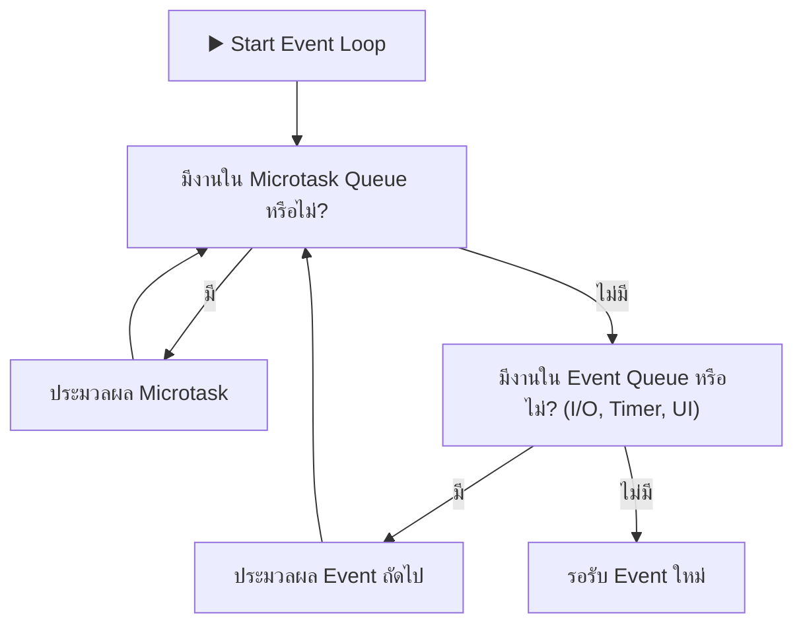

# พื้นฐานภาษา Dart 3 สำหรับนักพัฒนา Flutter

**Dart** เป็นภาษาเชิงวัตถุ (Object-Oriented Programming) แบบ Strong Type ที่พัฒนาโดย Google และถูกเลือกให้เป็นภาษาหลักของ Flutter เนื่องจากมีความเร็วในการคอมไพล์ทั้งแบบ **JIT (Just-In-Time)** ในช่วงพัฒนางาน (ทำให้เกิดฟีเจอร์ Stateful Hot Reload ในเสี้ยววินาที) และแบบ **AOT (Ahead-Of-Time)** เพื่อสร้าง Machine Code ประสิทธิภาพสูงสำหรับ Production

ตั้งแต่ **Dart 3.x** เป็นต้นมา ภาษา Dart ได้เพิ่มฟีเจอร์ระดับโมเดิร์นมากมายที่ยกระดับความปลอดภัยและความคล่องตัวในการพัฒนาซอฟต์แวร์

---

## 1. ระบบ Sound Null Safety

Dart บังคับใช้ **Sound Null Safety 100%** หมายความว่าตัวแปรจะไม่สามารถมีค่าเป็น `null` ได้เลย เว้นแต่เราจะประกาศอย่างชัดเจนว่าเป็น Nullable Type (`?`) ระบบนี้ช่วยกำจัดปัญหา `NullPointerException` (The Billion Dollar Mistake) ตั้งแต่ตอนคอมไพล์

```dart
// 1. Non-nullable type (ห้ามเป็น null เด็ดขาด)
String name = "Thai Programmer";
// name = null; // ❌ Compile Error!

// 2. Nullable type (สามารถเป็น null ได้)
String? optionalEmail;
optionalEmail = "contact@thaiprogrammer.org";
optionalEmail = null; // ✅ ใช้งานได้

// 3. Null-aware Operators
int length = optionalEmail?.length ?? 0; // ถ้า optionalEmail เป็น null ให้คืนค่า 0

// 4. Null Assertion Operator (!)
// ใช้เมื่อเรามั่นใจ 100% ว่าตัวแปรไม่ใช่ null (ควรใช้อย่างระมัดระวัง)
String nonNullEmail = optionalEmail!; 
```

### คำว่า `late` และข้อควรระวัง
คีย์เวิร์ด `late` ใช้บอกคอมไพเลอร์ว่า *"ตัวแปรนี้ไม่ใช่ null นะ แต่จะถูกกำหนดค่าก่อนที่จะถูกเรียกใช้งานจริง"*

```dart
class ProfileViewModel {
  late final String userId;

  void initialize(String id) {
    userId = id;
  }

  void printUser() {
    print(userId); // หากเรียก printUser() ก่อน initialize() จะเกิด LateInitializationError ทันที
  }
}
```

::: tip คำแนะนำสำหรับ Senior Engineer
พยายามหลีกเลี่ยงการใช้ `late` พร่ำเพรื่อ หากสามารถกำหนดค่าเริ่มต้นใน Constructor หรือใช้ Factory Method แทนได้ จะช่วยป้องกัน Runtime Crash ได้อย่างสิ้นเชิง
:::

---

## 2. Records และ Pattern Matching ใน Dart 3

### 2.1 Records (ฟังก์ชันส่งคืนค่าได้หลายตัวโดยไม่ต้องสร้าง Class)
ในอดีต หากฟังก์ชันต้องการคืนค่าพิกัดละติจูดและลองจิจูด เราต้องสร้างคลาสหรือส่งออกมาเป็น `List/Map` แต่ใน Dart 3 เราใช้ **Records** ได้โดยตรง:

```dart
// คืนค่าแบบ Records (ระบุชื่อตัวแปรได้)
({double lat, double lng}) getCoordinates() {
  return (lat: 13.7563, lng: 100.5018);
}

// การดึงค่ามาใช้งาน (Destructuring)
final (:lat, :lng) = getCoordinates();
print("Latitude: $lat, Longitude: $lng");
```

### 2.2 Pattern Matching & Switch Expressions
เราสามารถใช้ `switch` แบบ Expression ที่ส่งคืนค่าออกมาได้ทันที และมี Syntax ที่กระชับมาก:

```dart
// กำหนด HTTP Status Code เป็นข้อความแสดงผล
String getStatusMessage(int statusCode) => switch (statusCode) {
  200 => "สำเร็จ (OK)",
  201 => "สร้างข้อมูลสำเร็จ (Created)",
  400 || 422 => "ข้อมูลที่ส่งมาไม่ถูกต้อง (Bad Request)",
  401 => "กรุณาเข้าสู่ระบบก่อน (Unauthorized)",
  404 => "ไม่พบข้อมูลที่ต้องการ (Not Found)",
  >= 500 && <= 599 => "เซิร์ฟเวอร์ขัดข้อง (Server Error)",
  _ => "ข้อผิดพลาดที่ไม่รู้จัก ($statusCode)",
};
```

---

## 3. Class Modifiers และ Sealed Classes

Dart 3 เพิ่มคำสั่งจัดการพฤติกรรมของคลาส (Class Modifiers) เช่น `sealed`, `final`, `base`, `interface` โดยตัวที่สำคัญที่สุดในงานสร้างสถาปัตยกรรมแอปคือ **`sealed` class**

### การใช้ `sealed` class สำหรับจัดการสถานะ (UI State Hierarchy)
เมื่อประกาศคลาสหลักเป็น `sealed` คอมไพเลอร์จะบังคับให้ `switch` ต้องตรวจสอบ Subclass ให้ครบทุกเงื่อนไข (Exhaustiveness Checking) หากขาดกรณีใดกรณีหนึ่งไป โค้ดจะไม่สามารถคอมไพล์ผ่านได้:

```dart
// ประกาศ Sealed Class สำหรับผลลัพธ์ของ API
sealed class AuthState {}

class AuthInitial extends AuthState {}
class AuthLoading extends AuthState {}
class AuthSuccess extends AuthState {
  final String token;
  final String userId;
  AuthSuccess({required this.token, required this.userId});
}
class AuthFailure extends AuthState {
  final String errorMessage;
  AuthFailure(this.errorMessage);
}

// ใช้งานร่วมกับ Switch Expression
Widget renderAuthStatus(AuthState state) {
  return switch (state) {
    AuthInitial() => const Text("กรุณาเข้าสู่ระบบ"),
    AuthLoading() => const CircularProgressIndicator(),
    AuthSuccess(:final token, :final userId) => Text("ยินดีต้อนรับ User: $userId"),
    AuthFailure(:final errorMessage) => Text("เกิดข้อผิดพลาด: $errorMessage", style: const TextStyle(color: Colors.red)),
    // ไม่ต้องใส่ default case เพราะคอมไพเลอร์ทราบว่าครอบคลุมครบทุก Subclass แล้ว!
  };
}
```

---

## 4. Asynchronous Programming: Future และ Stream

สถาปัตยกรรมของ Dart เป็นแบบ **Single-threaded Event Loop** โดยรันงานแบบ Asynchronous ผ่าน **Microtask Queue** และ **Event Queue**



### 4.1 Future (การทำงานแบบคำขอเดียว - Single Value)
ใช้สำหรับการทำงานที่ใช้เวลา เช่น ยิง HTTP Request หรืออ่านไฟล์จาก Storage:

```dart
Future<UserProfile> fetchUserProfile(String userId) async {
  try {
    final response = await dio.get('/api/users/$userId');
    return UserProfile.fromJson(response.data);
  } catch (e, stackTrace) {
    // จัดการข้อผิดพลาดและส่งต่อ
    throw AppException("ไม่สามารถดึงข้อมูลผู้ใช้ได้", originalError: e);
  }
}
```

### 4.2 Stream (ข้อมูลที่ส่งมาเป็นลำดับอย่างต่อเนื่อง - Multiple Values)
ใช้สำหรับเหตุการณ์แบบ Real-time เช่น WebSocket, GPS Updates, หรือ Firebase Firestore Snapshots:

```dart
// การสร้าง Stream Generator ด้วย async*
Stream<int> countdownTimer(int seconds) async* {
  for (int i = seconds; i >= 0; i--) {
    await Future.delayed(const Duration(seconds: 1));
    yield i; // ส่งค่าถัดไปออกจาก Stream
  }
}

// การฟังข้อมูลจาก Stream
void listenToCountdown() async {
  await for (final remaining in countdownTimer(10)) {
    print("เวลาที่เหลือ: $remaining วินาที");
  }
}
```

---

## 5. การประมวลผลคู่ขนานด้วย Isolates (Multi-threading)

แม้ว่า Dart จะรันโค้ดหลักบน Main Thread (UI Thread) แต่หากมีงานประมวลผลที่กินพลังซีพียูหนักๆ (เช่น แปลง JSON ขนาด 50MB, ประมวลผลภาพถ่าย หรือคำนวณการเข้ารหัส) หากรันบน Main Thread จะทำให้หน้าจอกระตุกและเฟรมตก (Frame Drop) ทันที

เพื่อแก้ปัญหานี้ Dart จึงมีระบบ **Isolates** ซึ่งเป็น Thread แยกที่มี **Memory Heap ของตัวเอง** ไม่มีการแชร์หน่วยความจำร่วมกัน จึงปลอดภัยจากปัญหา Race Condition และ Deadlock 100%

```dart
import 'dart:isolate';
import 'dart:convert';

// ฟังก์ชันที่จะถูกรันบน Isolate แยก
List<Product> parseLargeJson(String rawJson) {
  final dynamic decoded = jsonDecode(rawJson);
  final List<dynamic> list = decoded['products'];
  return list.map((item) => Product.fromJson(item)).toList();
}

// เรียกใช้งานผ่าน Isolate.run (มีให้ใช้ตั้งแต่ Dart 2.19+)
Future<List<Product>> loadProductsConcurrently(String jsonString) async {
  // Isolate.run จะเปิด Isolate ใหม่ ประมวลผล และส่งผลลัพธ์กลับมายัง Main Thread อัตโนมัติ
  final products = await Isolate.run(() => parseLargeJson(jsonString));
  return products;
}
```

::: tip กฎทองในการป้องกัน UI Jank
งานใดก็ตามที่ใช้เวลาคำนวณซีพียูต่อเนื่องเกิน **16 มิลลิวินาที** (สำหรับหน้าจอ 60Hz) หรือเกิน **8 มิลลิวินาที** (สำหรับหน้าจอ 120Hz) **ต้องส่งไปรันใน Isolate เสมอ!**
:::
