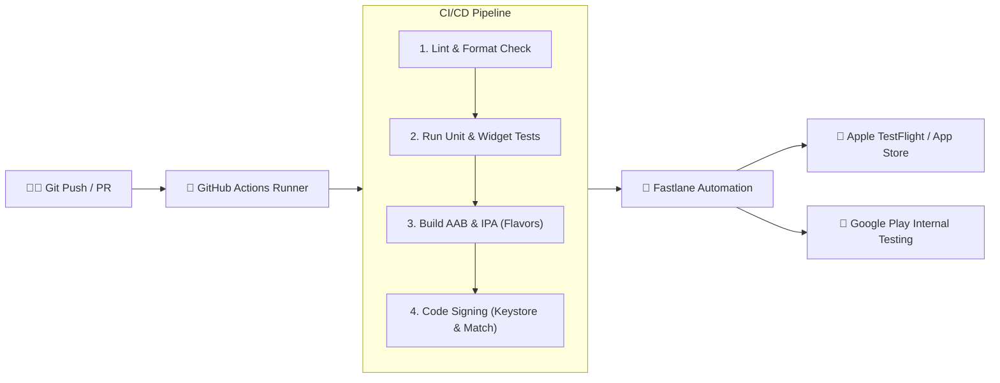

# DevOps, CI/CD และการขึ้นสโตร์

การส่งมอบโมบายล์แอปพลิเคชันสู่ผู้ใช้งานจริงมีความซับซ้อนกว่าเว็บแอปพลิเคชันอย่างมาก เนื่องจากมีขั้นตอนการตรวจสอบของ **Apple App Store** และ **Google Play Store**, การเข้ารหัสความปลอดภัยด้วย **Code Signing**, และการควบคุมการทำงานในหลายสภาพแวดล้อม (Environments)

วิศวกรระดับ Senior Fullstack / Lead Mobile Engineer จำเป็นต้องสร้าง **ระบบอัตโนมัติ (Automation Pipeline)** เพื่อให้ทีมสามารถ Release เวอร์ชันใหม่ได้อย่างราบรื่นและปราศจาก Human Error



---

## 1. การจัดการสภาพแวดล้อมด้วย Flavors (Dev, Staging, Production)

ในระดับองค์กร เราต้องแยก Environment ออกจากกันอย่างเด็ดขาด เพื่อไม่ให้ข้อมูลทดสอบปะปนกับข้อมูลจริง:
- **Development**: ชี้ไปยัง Local API หรือ Dev Server, Package ID: `com.example.app.dev`, ไอคอนมีป้าย DEV
- **Staging / UAT**: ชี้ไปยังเซิร์ฟเวอร์ทดสอบของ QA, Package ID: `com.example.app.staging`
- **Production**: ชี้ไปยัง Live Server, Package ID: `com.example.app`

### 1.1 การแยกไฟล์ Entry Point ใน Flutter
```dart
// lib/main_dev.dart
import 'package:flutter/material.dart';
import 'app_config.dart';
import 'main_common.dart';

void main() {
  const config = AppConfig(
    appName: '[DEV] My App',
    apiBaseUrl: 'https://dev-api.myapp.com',
    enableLogging: true,
  );
  mainCommon(config);
}

// lib/main_prod.dart
import 'package:flutter/material.dart';
import 'app_config.dart';
import 'main_common.dart';

void main() {
  const config = AppConfig(
    appName: 'My App',
    apiBaseUrl: 'https://api.myapp.com',
    enableLogging: false,
  );
  mainCommon(config);
}
```

### 1.2 การตั้งค่า Flavor ใน Android (`android/app/build.gradle`)
```groovy
flavorDimensions "default"

productFlavors {
    dev {
        dimension "default"
        applicationIdSuffix ".dev"
        resValue "string", "app_name", "My App (Dev)"
    }
    prod {
        dimension "default"
        resValue "string", "app_name", "My App"
    }
}
```

รันแอปด้วยคำสั่ง:
```bash
flutter run --flavor dev -t lib/main_dev.dart
```

---

## 2. การจัดการใบรับรองและความปลอดภัย (Code Signing)

### 2.1 Android Keystore
สร้าง Keystore และเก็บไฟล์ `key.properties` ไว้นอก Version Control (ใส่ใน `.gitignore`):

```bash
keytool -genkey -v -keystore upload-keystore.jks -keyalg RSA -keysize 2048 -validity 10000 -alias upload
```

### 2.2 iOS Certificates & Fastlane Match
การจัดการใบรับรองและ Provisioning Profile บน iOS มักสร้างความปวดหัวให้กับทีม เครื่องมือ **`fastlane match`** ช่วยจัดเก็บใบรับรองที่เข้ารหัสไว้ใน Git Repository ส่วนตัว ทำให้ทีมทุกคนรวมถึง CI/CD Server ใช้ใบรับรองชุดเดียวกันได้โดยอัตโนมัติ

---

## 3. การทำ Automation ด้วย Fastlane

ติดตั้ง Fastlane และสร้าง `Fastfile` ในโฟลเดอร์ `android/fastlane/Fastfile` และ `ios/fastlane/Fastfile`:

### ตัวอย่าง iOS `Fastfile`
```ruby
default_platform(:ios)

platform :ios do
  desc "ส่งมอบเวอร์ชันใหม่ไปยัง Apple TestFlight อัตโนมัติ"
  lane :beta do
    # 1. ซิงค์ใบรับรองผ่าน Match
    match(type: "appstore", readonly: true)
    
    # 2. คอมไพล์ไฟล์ IPA
    build_app(
      workspace: "Runner.xcworkspace",
      scheme: "prod",
      export_method: "app-store"
    )
    
    # 3. อัปโหลดขึ้น TestFlight
    upload_to_testflight(
      skip_waiting_for_build_processing: true
    )
  end
end
```

### ตัวอย่าง Android `Fastfile`
```ruby
default_platform(:android)

platform :android do
  desc "ส่งมอบ Android App Bundle (AAB) ขึ้น Google Play Internal Testing"
  lane :internal do
    upload_to_play_store(
      track: 'internal',
      aab: '../build/app/outputs/bundle/prodRelease/app-prod-release.aab'
    )
  end
end
```

---

## 4. GitHub Actions CI/CD Pipeline

สร้างไฟล์ `.github/workflows/deploy.yml` เพื่อให้ระบบรันทดสอบและบิลด์อัตโนมัติเมื่อมีการเปิด Pull Request หรือ Push เข้าสู่ `main`:

```yaml
name: Flutter CI/CD Pipeline

on:
  push:
    branches: [ main ]
  pull_request:
    branches: [ main ]

jobs:
  test:
    runs-on: ubuntu-latest
    steps:
      - uses: actions/checkout@v4

      - name: Setup Java
        uses: actions/setup-java@v4
        with:
          distribution: 'zulu'
          java-version: '17'

      - name: Setup Flutter
        uses: subosito/flutter-action@v2
        with:
          flutter-version: '3.24.0'
          cache: true

      - name: Install Dependencies
        run: flutter pub get

      - name: Check Code Formatting
        run: dart format --set-exit-if-changed .

      - name: Analyze Static Code
        run: flutter analyze

      - name: Run Unit & Widget Tests
        run: flutter test --coverage

  build-android:
    needs: test
    if: github.ref == 'refs/heads/main'
    runs-on: ubuntu-latest
    steps:
      - uses: actions/checkout@v4
      - uses: subosito/flutter-action@v2
        with:
          flutter-version: '3.24.0'

      - name: Build Android App Bundle
        run: flutter build appbundle --flavor prod -t lib/main_prod.dart --release

      - name: Upload Artifact
        uses: actions/upload-artifact@v4
        with:
          name: app-bundle
          path: build/app/outputs/bundle/prodRelease/*.aab
```

---

## 5. กลยุทธ์การปล่อยแอป (Release Strategy & Staged Rollout)

หลังจากส่งแอปผ่านการอนุมัติ (App Review) จาก Apple และ Google แล้ว หลีกเลี่ยงการเปิดให้ผู้ใช้ดาวน์โหลด 100% ทันที

ให้ใช้เทคนิค **Staged Rollout (Phased Release)**:
1. **Day 1**: ปล่อยให้ผู้ใช้ 1% (เฝ้าดู Crash Rate บน Firebase Crashlytics หรือ Sentry)
2. **Day 2**: ขยายเป็น 5%
3. **Day 3**: ขยายเป็น 20%
4. **Day 5**: ขยายเป็น 50%
5. **Day 7**: ปล่อย 100% เต็มรูปแบบ

หากพบ Crash สำคัญในวันแรกๆ เราสามารถกด **Halt Rollout** ได้ทันทีเพื่อป้องกันผลกระทบต่อผู้ใช้งานส่วนใหญ่ของบริษัท
