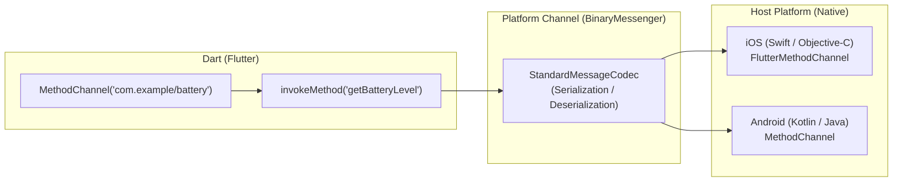

# การเชื่อมต่อ Native Platform, ฮาร์ดแวร์ และเซนเซอร์

แม้ว่า Flutter จะมีปลั๊กอินในชุมชน `pub.dev` ครอบคลุมการใช้งานทั่วไปแทบทั้งหมด แต่ในงานระดับองค์กร วิศวกรโมบายล์มักต้องเชื่อมต่อกับ **Native SDK เฉพาะทางของบริษัท** (เช่น เครื่องอ่านบัตร EDC, ระบบความปลอดภัยภายในองค์กร, หรือฮาร์ดแวร์ IoT)

การเข้าใจกลไก **Platform Channels**, เครื่องมือ **Pigeon**, และ **Dart FFI** จึงเป็นทักษะสำคัญที่แยกนักพัฒนาระดับทั่วไปออกจาก Senior Mobile Engineer



---

## 1. ชนิดของ Platform Channels

Flutter มีช่องทางการสื่อสาร 3 รูปแบบหลักตามลักษณะของข้อมูล:

1. **`MethodChannel`**: ใช้สำหรับการเรียกใช้งานฟังก์ชันแบบ Request-Response (เช่น ดึงระดับแบตเตอรี่, ขอเปิดกล้อง)
2. **`EventChannel`**: ใช้สำหรับการรับกระแสข้อมูลแบบต่อเนื่อง (Data Stream จากเซนเซอร์ เช่น เซนเซอร์วัดการเอียงตัว Gyroscope, ตำแหน่ง GPS, หรือสัญญาณ BLE)
3. **`BasicMessageChannel`**: ใช้สำหรับการส่งข้อมูลดิบแบบ Strings หรือ Binary buffers

---

## 2. ตัวอย่างการสร้าง MethodChannel ด้วยตนเอง

### 2.1 ฝั่ง Flutter (Dart)
```dart
// battery_service.dart
import 'package:flutter/services.dart';

class BatteryService {
  // สร้าง Channel โดยต้องตั้งชื่อ ID ให้ไม่ซ้ำกับใคร
  static const MethodChannel _channel = MethodChannel('com.thaiprogrammer.app/battery');

  static Future<int> getBatteryLevel() async {
    try {
      // เรียกใช้ฟังก์ชันชื่อ 'getBatteryLevel' ฝั่ง Native
      final int result = await _channel.invokeMethod('getBatteryLevel');
      return result;
    } on PlatformException catch (e) {
      throw Exception("ไม่สามารถอ่านค่าแบตเตอรี่ได้: ${e.message}");
    }
  }
}
```

### 2.2 ฝั่ง Android (Kotlin)
ในไฟล์ `android/app/src/main/kotlin/.../MainActivity.kt`:

```kotlin
package com.thaiprogrammer.app

import android.content.Context
import android.os.BatteryManager
import io.flutter.embedding.android.FlutterActivity
import io.flutter.embedding.engine.FlutterEngine
import io.flutter.plugin.common.MethodChannel

class MainActivity: FlutterActivity() {
    private val CHANNEL = "com.thaiprogrammer.app/battery"

    override fun configureFlutterEngine(flutterEngine: FlutterEngine) {
        super.configureFlutterEngine(flutterEngine)

        MethodChannel(flutterEngine.dartExecutor.binaryMessenger, CHANNEL).setMethodCallHandler { call, result ->
            if (call.method == "getBatteryLevel") {
                val batteryManager = getSystemService(Context.BATTERY_SERVICE) as BatteryManager
                val batteryLevel = batteryManager.getIntProperty(BatteryManager.BATTERY_PROPERTY_CAPACITY)

                if (batteryLevel != -1) {
                    result.success(batteryLevel)
                } else {
                    result.error("UNAVAILABLE", "Battery level not available.", null)
                }
            } else {
                result.notImplemented()
            }
        }
    }
}
```

### 2.3 ฝั่ง iOS (Swift)
ในไฟล์ `ios/Runner/AppDelegate.swift`:

```swift
import UIKit
import Flutter

@UIApplicationMain
@objc class AppDelegate: FlutterAppDelegate {
  override func application(
    _ application: UIApplication,
    didFinishLaunchingWithOptions launchOptions: [UIApplication.LaunchOptionsKey: Any]?
  ) -> Bool {
    let controller : FlutterViewController = window?.rootViewController as! FlutterViewController
    let batteryChannel = FlutterMethodChannel(name: "com.thaiprogrammer.app/battery",
                                              binaryMessenger: controller.binaryMessenger)

    batteryChannel.setMethodCallHandler({
      (call: FlutterMethodCall, result: @escaping FlutterResult) -> Void in
      guard call.method == "getBatteryLevel" else {
        result(FlutterMethodNotImplemented)
        return
      }
      
      UIDevice.current.isBatteryMonitoringEnabled = true
      let level = Int(UIDevice.current.batteryLevel * 100)
      if level >= 0 {
        result(level)
      } else {
        result(FlutterError(code: "UNAVAILABLE", message: "Battery info unavailable", details: nil))
      }
    })

    GeneratedPluginRegistrant.register(with: self)
    return super.application(application, didFinishLaunchingWithOptions: launchOptions)
  }
}
```

---

## 3. Type-Safe Interop ด้วย Pigeon

ปัญหาของการใช้ `MethodChannel` ธรรมดาคือ หากพิมพ์ชื่อฟังก์ชันหรือส่งชนิดข้อมูลผิด จะไม่แจ้งเตือนในระหว่างคอมไพล์ (Compile Error) แต่จะไประเบิดตอนรันไทม์ (Runtime Crash)

เครื่องมือ **`Pigeon`** แก้ปัญหานี้โดยให้นักพัฒนากำหนด Interface ใน Dart เพียงครั้งเดียว แล้ว Pigeon จะสร้างโค้ดแบบ Type-Safe ทั้งใน Dart, Swift และ Kotlin ให้โดยอัตโนมัติ:

```dart
// pigeons/messages.dart
import 'package:pigeon/pigeon.dart';

@ConfigurePigeon(PigeonOptions(
  dartOut: 'lib/src/messages.g.dart',
  kotlinOut: 'android/app/src/main/kotlin/com/example/Messages.g.kt',
  swiftOut: 'ios/Runner/Messages.g.swift',
))
@HostApi()
abstract class NativeSecurityApi {
  bool isDeviceRooted();
  String getHardwareDeviceId();
}
```

---

## 4. Dart FFI (Foreign Function Interface) สำหรับ Native C/C++/Rust

หากต้องการประมวลผลอัลกอริทึมที่หนักหน่วง เช่น การวิเคราะห์ภาพ Real-time, โมเดล AI Inference, หรือการถอดรหัสไฟล์ การส่งข้อมูลผ่าน Platform Channel จะมีต้นทุนเรื่อง Serialization สูง

เราสามารถใช้ **Dart FFI** เพื่อเรียกโค้ด C, C++ หรือ Rust ที่คอมไพล์เป็น Dynamic Library (`.so` บน Android, `.dylib`/Framework บน iOS) ได้โดยตรงแบบ Zero-Copy Memory:

```dart
import 'dart:ffi' as ffi;

typedef NativeSumFunc = ffi.Int32 Function(ffi.Int32 a, ffi.Int32 b);
typedef DartSumFunc = int Function(int a, int b);

final dylib = ffi.DynamicLibrary.open('libnative_crypto.so');
final DartSumFunc nativeSum = dylib
    .lookup<ffi.NativeFunction<NativeSumFunc>>('native_add')
    .asFunction();

int total = nativeSum(10, 20); // ทำงานในระดับ C Speed!
```

---

## 5. การผสานรวมฮาร์ดแวร์ยอดนิยมในแอปพลิเคชัน

### 5.1 ระบบยืนยันตัวตนด้วยไบโอเมตริกส์ (`local_auth`)
ใช้ยืนยันตัวตนผ่าน Face ID, Touch ID บน iOS หรือ Fingerprint/Face Unlock บน Android:

```dart
import 'package:local_auth/local_auth.dart';

final LocalAuthentication auth = LocalAuthentication();

Future<bool> authenticateUser() async {
  final bool canAuthenticateWithBiometrics = await auth.canCheckBiometrics;
  if (!canAuthenticateWithBiometrics) return false;

  return await auth.authenticate(
    localizedReason: 'กรุณาสแกนใบหน้าหรือลายนิ้วมือเพื่อยืนยันการทำธุรกรรม',
    options: const AuthenticationOptions(
      stickyAuth: true,
      biometricOnly: true,
    ),
  );
}
```

### 5.2 การจัดการ Push Notifications (FCM & APNs)
วงจรชีวิตของ Push Notification ต้องครอบคลุม 3 สถานะ:
1. **Foreground**: แอปกำลังเปิดใช้งานอยู่บนหน้าจอ (ใช้ `FirebaseMessaging.onMessage`)
2. **Background**: แอปพับอยู่เบื้องหลัง เมื่อผู้ใช้กดที่การแจ้งเตือนจะปลุกแอปขึ้นมา (`onMessageOpenedApp`)
3. **Terminated**: แอปถูกปิดไปอย่างสิ้นเชิง (`getInitialMessage`)
