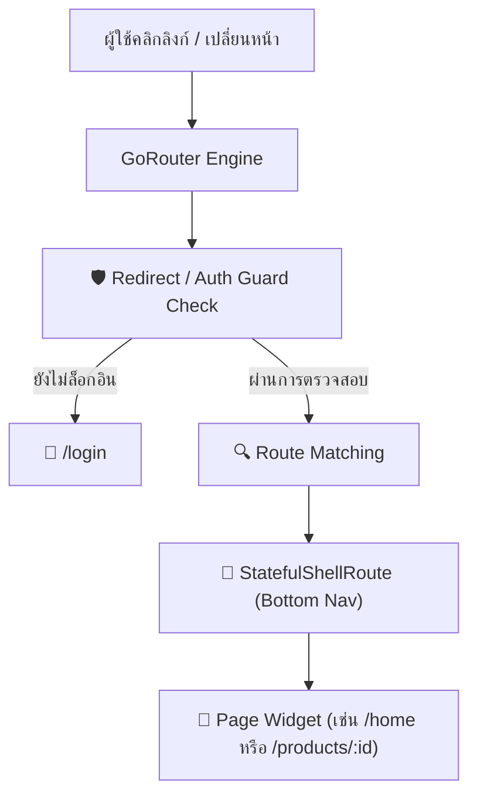
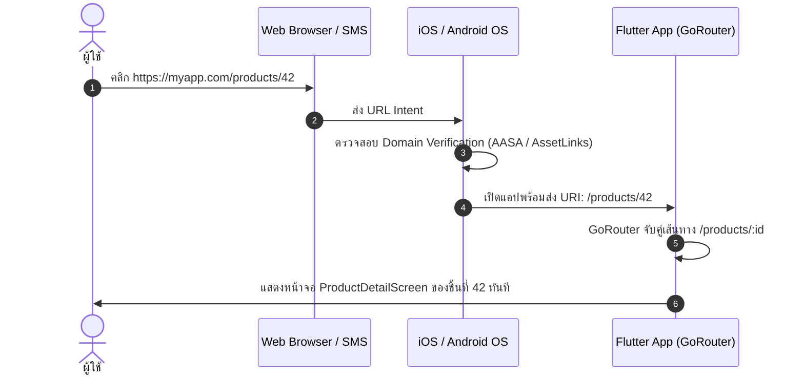

# การจัดการ Navigation, Routing และ Deep Linking ด้วย GoRouter

ระบบการเปลี่ยนหน้าจอ (Navigation & Routing) ในโมบายล์แอปพลิเคชันยุคใหม่ไม่ได้จำกัดอยู่เพียงแค่การ `push` และ `pop` หน้าจอซ้อนทับกันเท่านั้น แต่ต้องรองรับ:
1. **Deep Linking**: การเปิดแอปไปยังหน้าจอที่กำหนดจาก URL หรือการแจ้งเตือน (Push Notification)
2. **Stateful Bottom Navigation**: การคงสถานะของแต่ละแท็บเมื่อผู้ใช้สลับไปมา โดยไม่ต้องโหลดหน้าจอใหม่
3. **Authentication Guards**: การตรวจสอบสิทธิ์การเข้าถึงหน้าจออย่างปลอดภัยก่อนที่หน้าจะถูกเรนเดอร์

แพ็กเกจ **GoRouter** (พัฒนาและดูแลโดยทีม Flutter ของ Google) คือมาตรฐานอุตสาหกรรมในปัจจุบันที่รวมคุณสมบัติทั้งหมดนี้ไว้ในระบบ **Declarative Routing**

---

## 1. Navigator 1.0 vs Navigator 2.0 และ GoRouter

- **Navigator 1.0 (Imperative API)**: ใช้ `Navigator.push()` และ `Navigator.pop()` ง่ายสำหรับการเริ่มต้น แต่ควบคุม URL, Browser History บน Web และ Deep Linking ที่ซับซ้อนได้ยาก
- **Navigator 2.0 (Declarative Router API)**: ยืดหยุ่นสูงสุด แต่โค้ด Boilerplate เยอะและซับซ้อนมาก
- **GoRouter**: Wrapper อัจฉริยะที่ครอบ Navigator 2.0 ไว้ ทำให้เขียนโค้ดได้กระชับ ชัดเจน และทรงพลัง



---

## 2. การกำหนดค่าเส้นทางพื้นฐานและ Parameter

การสร้างอินสแตนซ์ `GoRouter` และการส่งผ่านข้อมูลในรูปแบบ Path Parameters, Query Parameters และ Extra Objects:

```dart
// app_router.dart
import 'package:flutter/material.dart';
import 'package:go_router/go_router.dart';

final appRouter = GoRouter(
  initialLocation: '/home',
  routes: [
    GoRoute(
      path: '/home',
      builder: (context, state) => const HomeScreen(),
    ),
    GoRoute(
      path: '/products/:productId', // Path Parameter
      builder: (context, state) {
        final productId = state.pathParameters['productId']!;
        final promoCode = state.uri.queryParameters['promo']; // Query Parameter (?promo=DISCOUNT50)
        final productObject = state.extra as Product?; // ส่ง Object ข้ามหน้า
        
        return ProductDetailScreen(
          productId: productId,
          promoCode: promoCode,
          product: productObject,
        );
      },
    ),
    GoRoute(
      path: '/login',
      builder: (context, state) => const LoginScreen(),
    ),
  ],
);
```

### การสั่งเปลี่ยนหน้าจอ (Navigation Methods)
```dart
// 1. ไปยังหน้าใหม่ (แทนที่หรือซ้อนทับตาม Path)
context.go('/products/101?promo=SUMMER');

// 2. ส่ง Object แนบไปด้วย
context.go('/products/101', extra: currentProduct);

// 3. Push หน้าใหม่ลงบน Stack (เพื่อมีปุ่ม Back เสมอ)
context.push('/settings');

// 4. ถอยกลับหน้าก่อนหน้า
context.pop();
```

---

## 3. Stateful Bottom Navigation Bar ด้วย StatefulShellRoute

ในการทำหน้าจอที่มี Bottom Navigation Bar (เช่น Home, Explore, Profile) ผู้ใช้คาดหวังว่าเมื่อสลับแท็บ ข้อมูลที่เลื่อนค้างไว้ (Scroll Position) หรือฟอร์มที่กรอกอยู่จะไม่สูญหายไป

เราใช้ **`StatefulShellRoute.indexedStack`** เพื่อสร้าง Navigation Stack แยกกันในแต่ละแท็บอย่างเป็นอิสระ:

```dart
final appRouter = GoRouter(
  initialLocation: '/home',
  routes: [
    StatefulShellRoute.indexedStack(
      builder: (context, state, navigationShell) {
        // navigationShell คือ Controller ควบคุมการสลับแท็บ
        return MainScaffold(navigationShell: navigationShell);
      },
      branches: [
        // แท็บที่ 1: Home Branch
        StatefulShellBranch(
          routes: [
            GoRoute(
              path: '/home',
              builder: (context, state) => const HomeScreen(),
            ),
          ],
        ),
        // แท็บที่ 2: Notifications Branch
        StatefulShellBranch(
          routes: [
            GoRoute(
              path: '/notifications',
              builder: (context, state) => const NotificationScreen(),
            ),
          ],
        ),
        // แท็บที่ 3: Profile Branch
        StatefulShellBranch(
          routes: [
            GoRoute(
              path: '/profile',
              builder: (context, state) => const ProfileScreen(),
            ),
          ],
        ),
      ],
    ),
  ],
);

// UI ของ MainScaffold ที่ผูกกับ NavigationBar
class MainScaffold extends StatelessWidget {
  final StatefulNavigationShell navigationShell;
  const MainScaffold({super.key, required this.navigationShell});

  @override
  Widget build(BuildContext context) {
    return Scaffold(
      body: navigationShell,
      bottomNavigationBar: NavigationBar(
        selectedIndex: navigationShell.currentIndex,
        onDestinationSelected: (index) {
          // สลับแท็บพร้อมรองรับการกดซ้ำเพื่อกลับสู่ Root ของแท็บนั้น
          navigationShell.goBranch(
            index,
            initialLocation: index == navigationShell.currentIndex,
          );
        },
        destinations: const [
          NavigationDestination(icon: Icon(Icons.home), label: 'หน้าแรก'),
          NavigationDestination(icon: Icon(Icons.notifications), label: 'แจ้งเตือน'),
          NavigationDestination(icon: Icon(Icons.person), label: 'โปรไฟล์'),
        ],
      ),
    );
  }
}
```

---

## 4. ระบบป้องกันการเข้าถึง (Authentication Guards & Redirect)

เราสามารถกำหนดตรรกะในการตรวจสอบสิทธิ์ (Auth Check) ได้ที่ฟังก์ชัน `redirect` ของ `GoRouter`:

```dart
final appRouter = GoRouter(
  refreshListenable: authStateNotifier, // ฟังการเปลี่ยนแปลงสถานะ Login/Logout
  redirect: (BuildContext context, GoRouterState state) {
    final bool isAuthenticated = authService.isLoggedIn;
    final bool isGoingToLogin = state.matchedLocation == '/login';

    // ถ้ายังไม่ได้ล็อกอิน และกำลังจะเข้าหน้าที่ต้องใช้สิทธิ์ ให้เตะไปหน้า /login
    if (!isAuthenticated && !isGoingToLogin) {
      return '/login';
    }

    // ถ้าล็อกอินอยู่แล้ว แต่พยายามเปิดหน้า /login ให้ส่งกลับไปหน้า /home
    if (isAuthenticated && isGoingToLogin) {
      return '/home';
    }

    return null; // ไม่มีเงื่อนไขพิเศษ ให้เปิดหน้าปลายทางตามปกติ
  },
  // ... routes
);
```

---

## 5. การตั้งค่า Deep Linking (Universal Links & App Links)

Deep Linking ช่วยให้ผู้ใช้สามารถคลิกลิงก์จากเว็บไซต์, SMS หรือ Social Media แล้วแอปเปิดขึ้นมาตรงหน้าจอนั้นทันที



### 5.1 การตั้งค่าฝั่ง Android (App Links)
ในไฟล์ `android/app/src/main/AndroidManifest.xml` เพิ่ม `intent-filter` ภายใน `<activity>`:

```xml
<intent-filter android:autoVerify="true">
    <action android:name="android.intent.action.VIEW" />
    <category android:name="android.intent.category.DEFAULT" />
    <category android:name="android.intent.category.BROWSABLE" />
    <data
        android:scheme="https"
        android:host="myapp.com"
        android:pathPrefix="/products" />
</intent-filter>
```
และโฮสต์ไฟล์ `assetlinks.json` ไว้ที่ `https://myapp.com/.well-known/assetlinks.json` เพื่อยืนยันว่าแอปเป็นเจ้าของโดเมนจริง

### 5.2 การตั้งค่าฝั่ง iOS (Universal Links)
1. ใน Xcode เปิดแท็บ **Signing & Capabilities** เพิ่มความสามารถ **Associated Domains**
2. ระบุโดเมน: `applinks:myapp.com`
3. โฮสต์ไฟล์ `apple-app-site-association` ไว้ที่ `https://myapp.com/.well-known/apple-app-site-association` (Content-Type: `application/json`)

### 5.3 คำสั่งทดสอบ Deep Link ผ่าน Terminal
```bash
# ทดสอบบน Android Emulator
adb shell 'am start -W -a android.intent.action.VIEW -d "https://myapp.com/products/42" com.example.myapp'

# ทดสอบบน iOS Simulator
xcrun simctl openurl booted "https://myapp.com/products/42"
```
