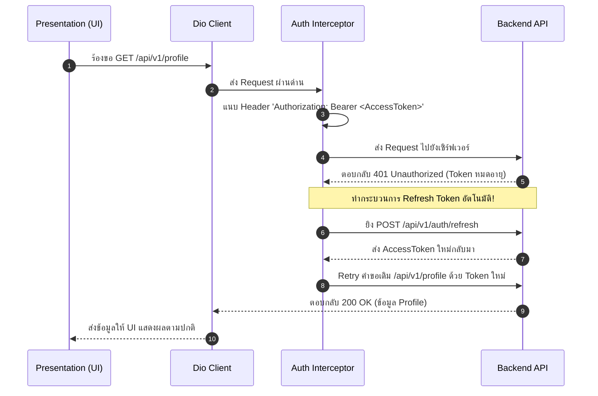
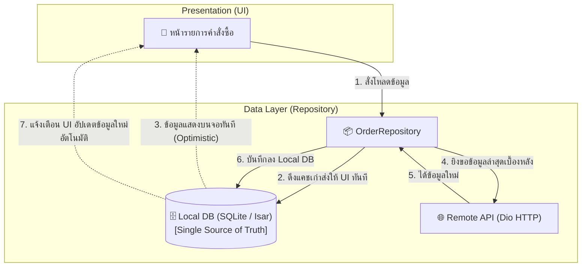

# ระบบ Networking, Local Storage และสถาปัตยกรรม Offline-First

ในโมบายล์แอปพลิเคชันระดับ Production ชั้นข้อมูล (Data Layer) เป็นรากฐานที่กำหนดความเสถียรและความน่าเชื่อถือของทั้งระบบ เครือข่ายโทรศัพท์เคลื่อนที่อาจดับ หลุด หรือมีความหน่วงสูงได้ตลอดเวลา ดังนั้นแอปพลิเคชันที่ดีจึงต้องออกแบบให้รับมือกับสถานการณ์เหล่านี้ได้อย่างราบรื่น

---

## 1. Network Layer ด้วย Dio และ Interceptors

แม้ว่า Dart จะมีไลบรารีพื้นฐานอย่าง `http` แต่ในงานระดับ Enterprise **`Dio`** คือตัวเลือกมาตรฐานเนื่องจากมีฟีเจอร์ระดับสูงในตัว:
- **Interceptors**: ดักจับและปรับแต่ง Request/Response ก่อนส่งหรือหลังรับ
- **Auto Token Refresh**: หมุนเวียน Refresh Token อัตโนมัติเมื่อเกิด 401 Unauthorized
- **Request Cancellation**: ยกเลิกคำขอผ่าน `CancelToken` เมื่อผู้ใช้ออกจากหน้าจอ
- **File Upload / Download**: มี Progress Callback ในตัว



### 1.1 ตัวอย่างการตั้งค่า Dio พร้อม Token Refresh Interceptor

```dart
// api_client.dart
import 'package:dio/dio.dart';
import 'package:flutter_secure_storage/flutter_secure_storage.dart';

class ApiClient {
  final Dio dio;
  final FlutterSecureStorage secureStorage;

  ApiClient({required this.secureStorage})
      : dio = Dio(
          BaseOptions(
            baseUrl: 'https://api.myapp.com/v1',
            connectTimeout: const Duration(seconds: 15),
            receiveTimeout: const Duration(seconds: 15),
            headers: {'Content-Type': 'application/json'},
          ),
        ) {
    dio.interceptors.add(
      QueuedInterceptorsWrapper(
        onRequest: (options, handler) async {
          // ดึง Access Token จาก Keychain/Keystore
          final token = await secureStorage.read(key: 'access_token');
          if (token != null) {
            options.headers['Authorization'] = 'Bearer $token';
          }
          return handler.next(options);
        },
        onError: (DioException error, handler) async {
          // ตรวจสอบกรณี Token หมดอายุ (401)
          if (error.response?.statusCode == 401) {
            final refreshToken = await secureStorage.read(key: 'refresh_token');
            if (refreshToken != null) {
              try {
                // ขอ Token ใหม่
                final refreshResponse = await Dio().post(
                  'https://api.myapp.com/v1/auth/refresh',
                  data: {'refresh_token': refreshToken},
                );

                final newAccessToken = refreshResponse.data['access_token'];
                await secureStorage.write(key: 'access_token', value: newAccessToken);

                // สั่ง Retry Request เดิมซ้ำอีกครั้งด้วย Token ใหม่
                error.requestOptions.headers['Authorization'] = 'Bearer $newAccessToken';
                final retryResponse = await dio.fetch(error.requestOptions);
                return handler.resolve(retryResponse);
              } catch (refreshError) {
                // ถ้า Refresh ไม่ผ่าน ให้บังคับเคลียร์ Token เพื่อให้ผู้ใช้ล็อกอินใหม่
                await secureStorage.deleteAll();
              }
            }
          }
          return handler.next(error);
        },
      ),
    );
  }
}
```

---

## 2. Immutable Data Models ด้วย Freezed

การสร้าง Data Model ด้วยมือมักเกิดข้อผิดพลาดในการเขียนฟังก์ชัน `copyWith`, การเปรียบเทียบ `==` และ `hashCode` หรือการแปลง JSON แพ็กเกจ **`Freezed`** และ **`json_serializable`** ช่วยสร้างโค้ดส่วนนี้ให้อัตโนมัติ:

```dart
// user_model.dart
import 'package:freezed_annotation/freezed_annotation.dart';

part 'user_model.freezed.dart';
part 'user_model.g.dart';

@freezed
class UserModel with _$UserModel {
  const factory UserModel({
    required String id,
    required String fullName,
    required String email,
    @Default(false) bool isVerified,
    DateTime? createdAt,
  }) = _UserModel;

  factory UserModel.fromJson(Map<String, dynamic> json) =>
      _$UserModelFromJson(json);
}
```

รันคำสั่ง Code Generation:
```bash
dart run build_runner build --delete-conflicting-outputs
```

---

## 3. ทางเลือกในการจัดเก็บข้อมูลในเครื่อง (Local Storage Options)

| เครื่องมือ | รูปแบบข้อมูล | ความเร็ว | ความปลอดภัย | เหมาะสำหรับ |
| :--- | :--- | :--- | :--- | :--- |
| **`shared_preferences`** | Key-Value (XML / Plist) | ปานกลาง | ต่ำ (Plaintext) | การตั้งค่าแอป, ค่าธีมสี, Onboarding seen flag |
| **`flutter_secure_storage`** | Key-Value เข้ารหัส | ปานกลาง | **สูงสุด (Keychain / Keystore)** | Auth Tokens, API Keys, ข้อมูลระบุตัวตน |
| **`Isar` / `Hive`** | NoSQL Document / Objects | **เร็วมาก (In-memory cache)** | ปานกลาง-สูง | แคชข้อมูลข่าวสาร, ตะกร้าสินค้าออฟไลน์ |
| **`sqflite` / `drift`** | Relational SQL (SQLite) | สูงมาก | สูง (รองรับ SQLCipher) | ข้อมูลที่มีความสัมพันธ์ซับซ้อน, Full-text Search |

---

## 4. สถาปัตยกรรม Offline-First (Single Source of Truth)

ในสถาปัตยกรรม **Offline-First** UI จะไม่รอฟังผลลัพธ์จากเซิร์ฟเวอร์โดยตรง แต่จะเชื่อมต่อเข้ากับ **Local Database (ซึ่งทำหน้าที่เป็น Single Source of Truth - SSOT)** เสมอ:



### ตัวอย่าง Repository Pattern สำหรับ Offline-First
```dart
class OrderRepository {
  final OrderRemoteDataSource remoteDataSource;
  final OrderLocalDataSource localDataSource;

  OrderRepository({required this.remoteDataSource, required this.localDataSource});

  // ใช้ Stream เพื่อให้ UI อัปเดตข้อมูลอัตโนมัติเมื่อ Local DB มีการเปลี่ยนแปลง
  Stream<List<Order>> watchOrders() async* {
    // 1. ส่งข้อมูลเก่าจาก Local DB ออกไปทันที
    yield await localDataSource.getCachedOrders();

    try {
      // 2. ดึงข้อมูลใหม่จาก Server
      final remoteOrders = await remoteDataSource.fetchOrders();
      // 3. บันทึกทับลง Local DB (จะกระตุ้นให้ Stream ส่งข้อมูลชุดใหม่ออกไป)
      await localDataSource.cacheOrders(remoteOrders);
      yield remoteOrders;
    } catch (e) {
      // หากไม่มีเน็ต ผู้ใช้ก็ยังสามารถดูข้อมูลจากขั้นตอนที่ 1 ได้อย่างสมบูรณ์
    }
  }
}
```
