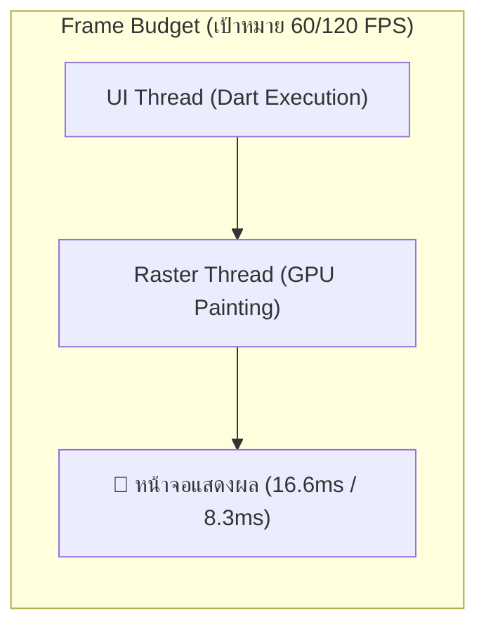
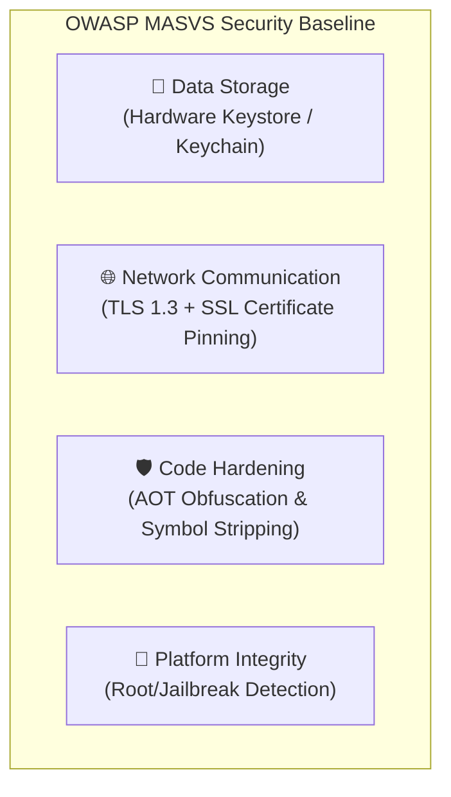

# การเพิ่มประสิทธิภาพ และความปลอดภัย

การสร้างแอปพลิเคชันที่ประสบความสำเร็จไม่ได้วัดกันที่ฟีเจอร์เพียงอย่างเดียว แต่ต้องมอบประสบการณ์การใช้งานที่ **ลื่นไหล รวดเร็ว ไม่กินแบตเตอรี่** และที่สำคัญที่สุดคือ **ต้องปกป้องข้อมูลสำคัญของผู้ใช้จากการถูกเจาะระบบ** ตามมาตรฐานสากล

---

## 1. การปรับจูนประสิทธิภาพ (Performance Optimization)

หน้าจอสมาร์ทโฟนทั่วไปทำงานที่ความถี่ 60Hz (มีเวลาเรนเดอร์ต่อเฟรม **16.6 มิลลิวินาที**) และหน้าจอเรือธง ProMotion/High Refresh Rate ทำงานที่ 120Hz (มีเวลาเพียง **8.3 มิลลิวินาที**) หากแอปพลิเคชันใช้เวลาคำนวณเกินกว่านี้ เฟรมจะถูกทิ้ง (Dropped Frame) และผู้ใช้จะรู้สึกถึงอาการกระตุก (Jank) ทันที



### 1.1 กฎเหล็กในการลด Unnecessary Rebuilds
- **ใส่ `const` เสมอ**: การใส่ `const` ทำให้ Flutter ใช้ Instance เดิมในหน่วยความจำและข้ามขั้นตอนการ Rebuild Widget ตัวนั้นไปโดยสิ้นเชิง
- **แยก Widget ย่อยแทนการสร้างฟังก์ชัน `Widget _buildItem()`**: การแยกคลาส `StatelessWidget` ทำให้ Flutter ทำ Reconciliation เฉพาะจุดที่มีการเปลี่ยนแปลงได้ ในขณะที่ฟังก์ชัน `_buildItem()` จะถูกบังคับรันใหม่ทุกครั้งที่ Parent Rebuild
- **ใช้ `RepaintBoundary`**: สำหรับ Widget ที่มีการขยับหรือเคลื่อนไหวบ่อยๆ (เช่น Loading Spinner หรือเข็มนาฬิกา) การครอบด้วย `RepaintBoundary` จะช่วยแยก Layer การวาดออกจากส่วนอื่น ทำให้ไม่ต้องวาดทั้งหน้าจอใหม่

```dart
// แยก Layer การวาดด้วย RepaintBoundary
RepaintBoundary(
  child: AnimatedRotation(
    turns: _turns,
    duration: const Duration(seconds: 2),
    child: const Icon(Icons.refresh, size: 48),
  ),
)
```

### 1.2 การปรับจูน ListView และการจัดการรูปภาพ
- **ระบุ `itemExtent` หรือ `prototypeItem`**: หากรายการใน `ListView.builder` มีความสูงคงที่ การระบุ `itemExtent: 72.0` จะช่วยให้ Flutter คำนวณ Scroll Offset ได้ทันทีโดยไม่ต้องวัดขนาดของ Child แต่ละตัว
- **หลีกเลี่ยง `shrinkWrap: true` ในพื้นที่เลื่อนได้**: คำสั่งนี้จะบีบให้ Flutter ต้องวัดขนาดและเรนเดอร์ข้อมูลทุกชิ้นพร้อมกันทั้งหมด สูญเสียข้อดีของ Virtualized List
- **จำกัดขนาดรูปภาพด้วย `cacheWidth` / `cacheHeight`**: รูปภาพความละเอียด 4K ที่ถ่ายจากกล้อง หากนำมาแสดงผลใน Avatar ขนาด 50x50 พิกเซล หากไม่บีบอัดขนาดแคช จะกินหน่วยความจำแรมสูงถึงหลายสิบเมกะไบต์ต่อรูป

```dart
Image.network(
  user.avatarUrl,
  cacheWidth: 150, // บีบอัดขนาดในหน่วยความจำ RAM ให้พอดีกับหน้าจอ
  cacheHeight: 150,
)
```

---

## 2. การวิเคราะห์ปัญหาด้วย Flutter DevTools

เมื่อแอปเริ่มมีอาการกระตุกหรือใช้แรมสูง ให้เปิด **Flutter DevTools** ผ่าน VS Code หรือ Terminal:

```bash
flutter run --profile # รันในโหมด Profile เพื่อวัดประสิทธิภาพจริง (ห้ามวัดใน Debug Mode)
```

1. **Performance View**:
   - ตรวจสอบกราฟแท่งของแต่ละเฟรม (Frame Chart)
   - แถบสีน้ำเงิน/เขียว คือเวลาที่ใช้ใน **UI Thread** (การคำนวณโค้ด Dart)
   - แถบสีส้ม คือเวลาที่ใช้ใน **Raster Thread** (การวาดภาพลงบน GPU)
2. **Memory View**:
   - ตรวจสอบ Memory Leaks จากการลืม `cancel()` StreamSubscription หรือการไม่ `dispose()` Controller
   - ดู snapshot การจองพื้นที่ของรูปภาพและคลาสต่างๆ

---

## 3. ความปลอดภัยของโมบายล์แอป (OWASP MASVS Baseline)

โมบายล์แอปพลิเคชันเป็นโปรแกรมฝั่ง Client ที่ผู้ไม่ประสงค์ดีสามารถนำไฟล์ APK/IPA ไปแตกไฟล์และทำ Reverse Engineering ได้ เราจึงต้องปฏิบัติตามมาตรฐาน **OWASP Mobile Application Security Verification Standard (MASVS)**



### 3.1 การจัดเก็บข้อมูลสำคัญด้วย `flutter_secure_storage`
ห้ามเก็บ Token, รหัสผ่าน หรือข้อมูลบัตรเครดิตลงใน `SharedPreferences` หรือ `UserDefaults` โดยตรง เพราะเป็นไฟล์ข้อความธรรมดาที่เปิดอ่านได้ ให้ใช้ **`flutter_secure_storage`** ซึ่งทำงานร่วมกับ **KeyStore (Android)** และ **Keychain (iOS)**:

```dart
import 'package:flutter_secure_storage/flutter_secure_storage.dart';

class SecureVaultService {
  final _storage = const FlutterSecureStorage(
    aOptions: AndroidOptions(encryptedSharedPreferences: true),
    iOptions: IOSOptions(accessibility: KeychainAccessibility.first_unlock),
  );

  Future<void> saveAuthToken(String token) async {
    await _storage.write(key: 'jwt_token', value: token);
  }

  Future<String?> getAuthToken() async {
    return await _storage.read(key: 'jwt_token');
  }
}
```

### 3.2 การทำ SSL / Certificate Pinning ใน Dio
เพื่อป้องกันการดักจับข้อมูลผ่าน Proxy เช่น Charles Proxy หรือ Burp Suite (Man-in-the-Middle Attack) เราสามารถบังคับให้แอปยอมรับเฉพาะใบรับรองที่มี Public Key Hash ตรงกับที่กำหนดไว้เท่านั้น:

```dart
import 'package:dio/dio.dart';
import 'package:dio/io.dart';
import 'dart:io';

void configureCertificatePinning(Dio dio) {
  const String expectedFingerprint = "2b8a...your_sha256_public_key_fingerprint...";

  dio.httpClientAdapter = IOHttpClientAdapter(
    createHttpClient: () {
      final SecurityContext context = SecurityContext(withTrustedRoots: false);
      final HttpClient client = HttpClient(context: context);
      
      client.badCertificateCallback = (X509Certificate cert, String host, int port) {
        // ตรวจสอบ Fingerprint ของใบรับรองที่ได้รับจากเซิร์ฟเวอร์
        final certFingerprint = cert.sha256.map((b) => b.toRadixString(16).padLeft(2, '0')).join();
        return certFingerprint.toLowerCase() == expectedFingerprint.toLowerCase();
      };
      return client;
    },
  );
}
```

### 3.3 การทำ Code Obfuscation (พรางซอร์สโค้ด)
ในระหว่างการคอมไพล์เพื่อส่งขึ้นสโตร์ ให้เปิดใช้งาน Obfuscation เพื่อสลับชื่อคลาส เมธอด และตัวแปรให้กลายเป็นตัวอักษรสุ่มที่อ่านไม่รู้เรื่อง พร้อมทั้งแยก Debug Symbols ออกจากตัวไฟล์ Binary:

```bash
flutter build appbundle --obfuscate --split-debug-info=./build/symbols
flutter build ipa --obfuscate --split-debug-info=./build/symbols
```
*(ไฟล์ในโฟลเดอร์ `./build/symbols` จะถูกใช้เพื่อถอดรหัส Crash Log (Symbolication) ใน Sentry หรือ Crashlytics ห้ามทำหายเด็ดขาด)*
