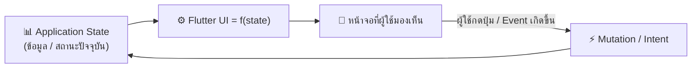
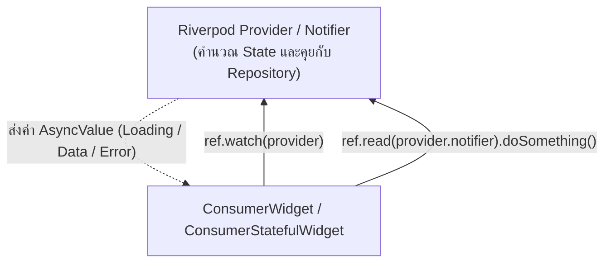
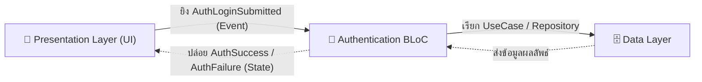

# การจัดการ State ในระดับ Production

ในแอปพลิเคชัน Flutter **"State"** คือข้อมูลทั้งหมดที่ส่งผลต่อการแสดงผลของ UI ณ ขณะใดขณะหนึ่ง เช่น ข้อมูลผู้ใช้ที่ล็อกอิน, สินค้าในตะกร้า, สถานะการดาวน์โหลด, หรือแม้กระทั่งข้อความที่กำลังพิมพ์อยู่ในฟอร์ม



เมื่อแอปพลิเคชันมีขนาดใหญ่ขึ้น การส่งผ่านข้อมูลด้วย Constructor ไปตาม Widget Tree หรือการพึ่งพา `setState()` เพียงอย่างเดียวจะไม่สามารถดูแลรักษาได้ (เกิดปัญหา Prop Drilling และ Spaghetti Code) การเลือกใช้ **State Management Solution** ที่เหมาะสมจึงเป็นหัวใจสำคัญสูงสุดของโมบายล์เอนจิเนียร์

---

## 1. การแบ่งประเภทของ State

| ประเภท State | นิยาม | ตัวอย่าง | เครื่องมือที่เหมาะสม |
| :--- | :--- | :--- | :--- |
| **Ephemeral State** (Local UI State) | ข้อมูลที่ใช้งานอยู่เฉพาะใน Widget ตัวเดียว ไม่ต้องแชร์ให้หน้าจออื่น | การสลับแท็บ (Current Tab Index), หน้าแอนิเมชันเปิด/ปิด, ค่าในช่องค้นหาขณะพิมพ์ | `setState()`, `ValueNotifier` |
| **App State** (Shared State) | ข้อมูลที่ส่งผลต่อหลายหน้าจอในแอป หรือต้องคงอยู่ข้ามเซสชัน | ตะกร้าสินค้า, โปรไฟล์ผู้ใช้, ธีมสีแอป (Dark/Light), สิทธิ์การเข้าถึง (Auth) | **Riverpod**, **BLoC / Cubit** |

---

## 2. Riverpod 2.x/3.x (พร้อม Code Generation)

**Riverpod** เป็นโซลูชันที่พัฒนาโดย Remi Rousselet (ผู้สร้าง Provider เดิม) เพื่อแก้ไขข้อจำกัดทั้งหมดของ Provider โดย Riverpod:
- **Compile-time Safe**: ไม่มีทางเกิดข้อผิดพลาด `ProviderNotFoundException`
- **ไม่ผูกติดกับ BuildContext**: สามารถเรียกใช้จากที่ใดก็ได้ (แม้กระทั่งใน Service Layer)
- **รองรับ Asynchronous State ในตัว**: จัดการสถานะ Loading, Error, Data อย่างสมบูรณ์ผ่าน `AsyncValue`



### 2.1 ตัวอย่างการเขียน Notifier ด้วย Riverpod Generator

```dart
// product_notifier.dart
import 'package:riverpod_annotation/riverpod_annotation.dart';
import '../models/product.dart';
import '../repositories/product_repository.dart';

part 'product_notifier.g.dart';

@riverpod
class ProductNotifier extends _$ProductNotifier {
  @override
  FutureOr<List<Product>> build() async {
    // โค้ดใน build() จะรันครั้งแรกโดยอัตโนมัติ
    return _fetchProducts();
  }

  Future<List<Product>> _fetchProducts() async {
    final repository = ref.watch(productRepositoryProvider);
    return repository.getProducts();
  }

  // Action เพิ่มสินค้า
  Future<void> addProduct(String title, double price) async {
    // 1. ตั้งสถานะเป็น Loading ชั่วคราว
    state = const AsyncValue.loading();

    // 2. เรียก Repository และอัปเดต State ปลายทาง
    state = await AsyncValue.guard(() async {
      final repository = ref.read(productRepositoryProvider);
      await repository.createProduct(title: title, price: price);
      return _fetchProducts();
    });
  }
}
```

### 2.2 การนำไปแสดงผลบน UI ผ่าน ConsumerWidget

```dart
// product_list_page.dart
import 'package:flutter/material.dart';
import 'package:flutter_riverpod/flutter_riverpod.dart';
import 'product_notifier.dart';

class ProductListPage extends ConsumerWidget {
  const ProductListPage({super.key});

  @override
  Widget build(BuildContext context, WidgetRef ref) {
    // 1. สั่ง watch การเปลี่ยนแปลงของ Provider
    final productState = ref.watch(productNotifierProvider);

    return Scaffold(
      appBar: AppBar(title: const Text('รายการสินค้า')),
      // 2. ใช้ .when() จัดการครบทั้ง 3 สถานะอย่างสง่างาม
      body: productState.when(
        loading: () => const Center(child: CircularProgressIndicator()),
        error: (error, stack) => Center(
          child: Text('เกิดข้อผิดพลาด: $error', style: const TextStyle(color: Colors.red)),
        ),
        data: (products) => ListView.builder(
          itemCount: products.length,
          itemBuilder: (context, index) {
            final product = products[index];
            return ListTile(
              title: Text(product.title),
              trailing: Text('฿${product.price}'),
            );
          },
        ),
      ),
      floatingActionButton: FloatingActionButton(
        onPressed: () {
          // ใช้ ref.read เมื่อต้องการสั่งรันฟังก์ชันใน Notifier
          ref.read(productNotifierProvider.notifier).addProduct('สินค้าใหม่', 299.0);
        },
        child: const Icon(Icons.add),
      ),
    );
  }
}
```

---

## 3. สถาปัตยกรรม BLoC / Cubit (Business Logic Component)

**BLoC** ได้รับความนิยมสูงสุดในโปรเจกต์ระดับองค์กร (Enterprise Projects) เพราะบังคับใช้แนวคิด **Event-Driven Architecture** อย่างเคร่งครัด แยกตรรกะทางธุรกิจออกจาก UI 100%

- **Cubit**: รูปแบบเรียบง่าย ไม่ต้องสร้าง Event Class ยิงฟังก์ชันเปลี่ยน State ได้โดยตรง
- **BLoC**: รูปแบบเต็มรูปแบบ รับ Event เข้ามาแปลงเป็น State ออกไปตามทฤษฎี Finite State Machine



### 3.1 ตัวอย่างการสร้าง Event และ State ใน BLoC

```dart
// auth_event.dart
sealed class AuthEvent {}
class AuthLoginRequested extends AuthEvent {
  final String email;
  final String password;
  AuthLoginRequested({required this.email, required this.password});
}
class AuthLogoutRequested extends AuthEvent {}

// auth_state.dart
sealed class AuthState {}
class AuthInitial extends AuthState {}
class AuthLoading extends AuthState {}
class AuthSuccess extends AuthState {
  final User user;
  AuthSuccess(this.user);
}
class AuthFailure extends AuthState {
  final String message;
  AuthFailure(this.message);
}

// auth_bloc.dart
class AuthBloc extends Bloc<AuthEvent, AuthState> {
  final AuthRepository _authRepository;

  AuthBloc(this._authRepository) : super(AuthInitial()) {
    on<AuthLoginRequested>(_onLoginRequested);
    on<AuthLogoutRequested>(_onLogoutRequested);
  }

  Future<void> _onLoginRequested(
    AuthLoginRequested event,
    Emitter<AuthState> emit,
  ) async {
    emit(AuthLoading());
    try {
      final user = await _authRepository.login(event.email, event.password);
      emit(AuthSuccess(user));
    } catch (e) {
      emit(AuthFailure(e.toString()));
    }
  }

  Future<void> _onLogoutRequested(
    AuthLogoutRequested event,
    Emitter<AuthState> emit,
  ) async {
    await _authRepository.logout();
    emit(AuthInitial());
  }
}
```

### 3.2 การนำ BLoC ไปเชื่อมต่อกับ UI
ใช้ `BlocConsumer` (รวมทั้ง `BlocListener` สำหรับ Side Effects เช่น แสดง Dialog/SnackBar และ `BlocBuilder` สำหรับสร้าง UI):

```dart
BlocConsumer<AuthBloc, AuthState>(
  listener: (context, state) {
    if (state is AuthFailure) {
      ScaffoldMessenger.of(context).showSnackBar(
        SnackBar(content: Text(state.message), backgroundColor: Colors.red),
      );
    }
    if (state is AuthSuccess) {
      context.go('/home'); // เปลี่ยนหน้าจอเมื่อสำเร็จ
    }
  },
  builder: (context, state) {
    if (state is AuthLoading) {
      return const Center(child: CircularProgressIndicator());
    }
    return LoginForm();
  },
)
```

---

## 4. ตารางเปรียบเทียบและการตัดสินใจเลือกใช้งาน

| มิติการพิจารณา | Flutter Riverpod | Flutter BLoC | Provider |
| :--- | :--- | :--- | :--- |
| **ความสะดวกในการเรียนรู้** | ปานกลาง (ต้องเข้าใจ Notifier/AsyncValue) | สูง (ต้องเขียน Boilerplate Events/States) | ง่ายที่สุด (ChangeNotifier ทั่วไป) |
| **การทดสอบ (Testability)** | ยอดเยี่ยมมาก (Mock Provider ได้ง่าย) | ยอดเยี่ยมที่สุด (มีแพ็กเกจ `bloc_test`) | ปานกลาง (ขึ้นกับ BuildContext) |
| **การจัดการ Asynchronous** | Built-in สมบูรณ์แบบด้วย `AsyncValue` | ต้องจัดการผ่าน Status Enum หรือ State Classes เอง | ต้องจัดการด้วยตัวเองทั้งหมด |
| **ระดับความเข้มงวด** | ยืดหยุ่น ปรับใช้ได้ทั้งแอปเล็กและใหญ่ | เข้มงวดมาก บังคับใช้ Event-State Pattern | ยืดหยุ่นสูง แต่อาจเละได้ง่าย |
| **ขนาดของโปรเจกต์** | เหมาะสมกับทุกขนาด (Startup ถึง Enterprise) | เหมาะกับทีมขนาดใหญ่และระบบ Complex Workflow | เหมาะกับโปรเจกต์ขนาดเล็กหรือตัวอย่าง Demo |
