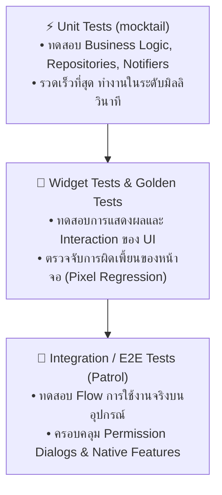

# กลยุทธ์การทดสอบ และการรักษาคุณภาพโค้ด

การพัฒนาโมบายล์แอปพลิเคชันระดับมืออาชีพต้องการมากกว่าโค้ดที่รันผ่านบนเครื่องของผู้พัฒนา แต่ต้องมี **ชุดการทดสอบอัตโนมัติ (Automated Testing Suite)** ที่ช่วยให้ทีมสามารถ Refactor โค้ดและปล่อยอัปเดตเวอร์ชันใหม่ได้อย่างมั่นใจ 100% โดยไม่เกิด Regression Bug



---

## 1. Unit Testing ด้วย `test` และ `mocktail`

Unit Test ใช้ทดสอบฟังก์ชันและคลาสเดี่ยวๆ โดยตัดการเชื่อมต่อกับภายนอก (เช่น API หรือ Database) ด้วยการจำลอง (Mocking) ข้อมูล

### ตัวอย่างการทดสอบ Notifier / UseCase
```dart
// test/features/auth/auth_notifier_test.dart
import 'package:flutter_test/flutter_test.dart';
import 'package:mocktail/mocktail.dart';

// 1. สร้าง Mock Class
class MockAuthRepository extends Mock implements AuthRepository {}

void main() {
  late MockAuthRepository mockAuthRepository;
  late AuthNotifier notifier;

  setUp(() {
    mockAuthRepository = MockAuthRepository();
    notifier = AuthNotifier(authRepository: mockAuthRepository);
  });

  group('AuthNotifier - Login Tests', () {
    const email = 'user@example.com';
    const password = 'password123';
    final user = User(id: '1', email: email);

    test('เมื่อล็อกอินสำเร็จ State ต้องเปลี่ยนเป็น AuthSuccess', () async {
      // Arrange (เตรียมพฤติกรรมของ Mock)
      when(() => mockAuthRepository.login(email, password))
          .thenAnswer((_) async => user);

      // Act (สั่งกระทำ)
      await notifier.login(email, password);

      // Assert (ตรวจสอบผลลัพธ์)
      expect(notifier.state, isA<AuthSuccess>());
      verify(() => mockAuthRepository.login(email, password)).called(1);
    });

    test('เมื่อล็อกอินล้มเหลว State ต้องเปลี่ยนเป็น AuthFailure', () async {
      // Arrange
      when(() => mockAuthRepository.login(email, password))
          .thenThrow(Exception('รหัสผ่านไม่ถูกต้อง'));

      // Act
      await notifier.login(email, password);

      // Assert
      expect(notifier.state, isA<AuthFailure>());
    });
  });
}
```

---

## 2. Widget Testing (Component Testing)

Widget Test จำลองสภาพแวดล้อมของ UI ขึ้นมาในหน่วยความจำโดยไม่ต้องเปิด Emulator จริง ทำให้รันได้อย่างรวดเร็วมาก

### สิ่งสำคัญที่ต้องรู้เกี่ยวกับ `WidgetTester`:
- `tester.pumpWidget()`: สั่งเรนเดอร์ Widget ลงใน Test Environment
- `tester.pump()`: กระตุ้นการวาด 1 เฟรม
- `tester.pumpAndSettle()`: สั่งรอจนกระทั่ง Animation หรือ Microtask ทั้งหมดเสร็จสิ้นจนหน้าจอนิ่งสนิท
- `find`: ตัวค้นหาคอมโพเนนต์ เช่น `find.text()`, `find.byKey()`, `find.byType()`

```dart
// test/widgets/login_form_test.dart
import 'package:flutter/material.dart';
import 'package:flutter_test/flutter_test.dart';
import 'package:my_app/features/auth/login_screen.dart';

void main() {
  testWidgets('เมื่อกดปุ่มเข้าสู่ระบบโดยไม่กรอกอีเมล ต้องแสดงข้อความแจ้งเตือนสีแดง', (WidgetTester tester) async {
    // 1. เรนเดอร์หน้าจอ (ต้องครอบด้วย MaterialApp เสมอเพื่อให้มี Theme และ Directionality)
    await tester.pumpWidget(
      const MaterialApp(
        home: LoginScreen(),
      ),
    );

    // 2. ตรวจสอบว่ามีปุ่มและช่องกรอกข้อมูลอยู่จริง
    expect(find.byType(ElevatedButton), findsOneWidget);

    // 3. จำลองการกดปุ่ม 'เข้าสู่ระบบ'
    await tester.tap(find.byType(ElevatedButton));
    await tester.pumpAndSettle(); // รอให้ Form Validation ทำงานและวาดข้อความผิดพลาด

    // 4. ตรวจสอบว่าขึ้นข้อความเตือน
    expect(find.text('กรุณากรอกอีเมล'), findsOneWidget);
  });
}
```

---

## 3. Golden Tests: ป้องกัน UI เพี้ยนระดับพิกเซล

**Golden Test** คือการเรนเดอร์ Widget และบันทึกภาพหน้าจอเป็นไฟล์ Master Image (`.png`) เมื่อมีการแก้ไขโค้ดในอนาคต เทสต์จะนำหน้าจอใหม่มาเปรียบเทียบพิกเซลต่อพิกเซลกับรูปต้นฉบับ หากมีความคลาดเคลื่อนเพียงเล็กน้อย เทสต์จะแจ้งเตือนทันที

```dart
testWidgets('Login button golden test', (tester) async {
  await tester.pumpWidget(
    const MaterialApp(
      home: Scaffold(
        body: Center(child: PrimaryButton(title: 'ตกลง')),
      ),
    ),
  );

  // เปรียบเทียบกับภาพต้นฉบับ
  await expectLater(
    find.byType(PrimaryButton),
    matchesGoldenFile('goldens/primary_button.png'),
  );
});
```

รันคำสั่งสร้างภาพ Golden ต้นฉบับ:
```bash
flutter test --update-goldens
```

---

## 4. End-to-End Testing ด้วย Patrol

ในการทดสอบแบบบูรณาการ (Integration Test) เครื่องมือมาตรฐานมักติดปัญหาใหญ่: **ไม่สามารถกดรับสิทธิ์ของระบบปฏิบัติการ (Native Permission Dialogs เช่น สิทธิ์เข้าถึงกล้อง ตำแหน่ง GPS หรือการแจ้งเตือน) ได้**

เฟรมเวิร์ก **Patrol** (จาก LeanCode) พัฒนาขึ้นมาเพื่อแก้จุดอ่อนนี้โดยเฉพาะ ทำให้สามารถเขียนโค้ดภาษา Dart เพียงภาษาเดียวเพื่อควบคุมทั้งหน้าจอ Flutter และหน้าต่าง Native OS:

```dart
// integration_test/checkout_flow_test.dart
import 'package:patrol/patrol.dart';

void main() {
  patrolTest('ผู้ใช้สั่งซื้อสินค้าและอนุญาตสิทธิ์การเข้าถึงตำแหน่งสำเร็จ', ($) async {
    // 1. เปิดแอปพลิเคชัน
    await $.pumpWidgetAndSettle(const MyApp());

    // 2. เลือกสินค้าและกดสั่งซื้อ
    await $(#addToCartButton).tap();
    await $(#checkoutButton).tap();

    // 3. หน้าจอ Native OS เด้งถามสิทธิ์ Location
    if (await $.native.isPermissionDialogVisible()) {
      await $.native.grantPermissionWhenInUse(); // กดปุ่มอนุญาตของระบบปฏิบัติการ!
    }

    // 4. ตรวจสอบข้อความสั่งซื้อสำเร็จ
    expect($('คำสั่งซื้อของคุณสำเร็จแล้ว'), findsOneWidget);
  });
}
```

---

## 5. การตั้งค่า Linter และ Static Analysis ที่เข้มงวด

ในไฟล์ `analysis_options.yaml` ควรรวมกฎที่ช่วยลดข้อผิดพลาดตั้งแต่ตอนพิมพ์โค้ด:

```yaml
include: package:flutter_lints/flutter.yaml

analyzer:
  language:
    strict-casts: true
    strict-inference: true
    strict-raw-types: true
  errors:
    missing_required_param: error
    missing_return: error
    todo: ignore

linter:
  rules:
    - prefer_const_constructors
    - prefer_const_declarations
    - avoid_print # ห้ามใช้ print() ใน Production (ให้ใช้ Logger แทน)
    - unawaited_futures # ป้องกันการลืมใส่ await ใน Future
    - cancel_subscriptions # บังคับปิด StreamSubscription ใน dispose()
```

คำสั่งตรวจสอบโค้ดก่อน Commit:
```bash
# ตรวจสอบ Lint ทั้งโปรเจกต์
dart analyze --fatal-infos

# ตรวจสอบการจัดรูปแบบโค้ด
dart format --set-exit-if-changed .
```
