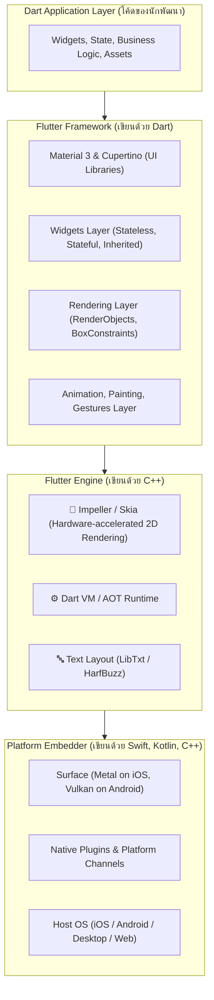
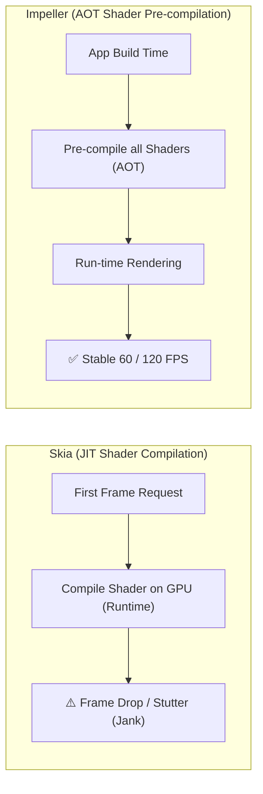

# Flutter คืออะไรและทำงานอย่างไร

**Flutter** คือเฟรมเวิร์กโอเพนซอร์สที่พัฒนาโดย **Google** เพื่อใช้สร้างแอปพลิเคชันแบบ Multi-Platform ที่สามารถรันได้ทั้งบน **iOS, Android, Web, macOS, Windows, Linux** รวมถึง Embedded Devices จาก **ฐานโค้ดชุดเดียวกัน (Single Codebase)** โดยใช้ภาษา **Dart**

จุดเด่นสำคัญของ Flutter ที่ทำให้แตกต่างจากเฟรมเวิร์ก Cross-Platform อื่นๆ ในอดีต คือ Flutter **ไม่ได้แปลงโค้ดไปเป็น Native UI Components ของระบบปฏิบัติการ** และ **ไม่ได้รันผ่าน Web View** แต่ Flutter ทำการวาดทุกพิกเซลบนหน้าจอด้วย **Rendering Engine ของตัวเองลงบน Canvas** เสมือนกับ Game Engine



---

## 1. ชั้นสถาปัตยกรรมของ Flutter (Three Architecture Layers)

### 1.1 Flutter Framework (Dart)
ชั้นที่นักพัฒนาโต้ตอบด้วยมากที่สุด ประกอบด้วย:
- **Design Systems**: ไลบรารีคอมโพเนนต์สำเร็จรูปตามมาตรฐาน Material Design 3 (Android) และ Cupertino (iOS)
- **Widgets Layer**: คอนเซ็ปต์การสร้าง UI แบบ Declarative โดยทุกสิ่งในหน้าจอคือ Widget
- **Rendering Layer**: จัดการ Layout, คำนวณขนาดและพิกัด (RenderObject)
- **Painting & Gestures**: ระบบจัดการ Animation, การวาด Vector, และการดักจับ Touch Gestures

### 1.2 Flutter Engine (C++)
หัวใจหลักของการทำงานระดับล่าง (Low-level Engine):
- **Graphics Engine**: เรนเดอร์ภาพกราฟิกด้วยฮาร์ดแวร์ GPU (Impeller หรือ Skia)
- **Dart Runtime**: สภาพแวดล้อมรันไทม์ของ Dart รันโค้ด AOT (Ahead-Of-Time) สำหรับ Production และ JIT (Just-In-Time) สำหรับ Development (Hot Reload)
- **Text Rendering**: คำนวณความกว้าง ความสูง และฟอนต์ภาษาต่างๆ (รองรับ Complex Scripts ภาษาไทย)

### 1.3 Platform Embedder (Native Code)
ทำหน้าที่ประสานงานระหว่าง Flutter Engine กับระบบปฏิบัติการหลัก (Host OS):
- จัดการสร้าง Window/View บนหน้าจอ (เช่น `FlutterViewController` บน iOS, `FlutterActivity` บน Android)
- จัดการ Event Loops, Lifecycle, และช่องทางสื่อสาร Platform Channels

---

## 2. เครื่องยนต์เรนเดอร์ Impeller: บอกลาปัญหา Shader Compilation Jank

ใน Flutter เวอร์ชันแรกเริ่ม เอนจินกราฟิกเริ่มต้นคือ **Skia** ซึ่งมีจุดอ่อนสำคัญคือ **Shader Compilation Jank** (อาการกระตุกเมื่อเปิดหน้าจอใหม่เป็นครั้งแรก เนื่องจาก GPU เพิ่งคอมไพล์ Shader ในขณะรันไทม์)

ทีมงาน Google จึงพัฒนา **Impeller** ขึ้นมาใหม่ทั้งหมด เพื่อเป็น Rendering Engine ยุคใหม่ของ Flutter:



### จุดเด่นของ Impeller:
1. **AOT Shaders**: คอมไพล์ Shaders ทั้งหมดล่วงหน้าในระหว่าง Build Time ทำให้ไม่มีการรันคอมไพล์ Shaders ขัดจังหวะ Frame Rendering
2. **Modern Graphics APIs**: ใช้ **Metal** บน iOS / macOS และ **Vulkan** บน Android โดยตรง (มี fallback เป็น OpenGL ES)
3. **Consistent Frame Rate**: ให้เฟรมเรตคงที่ 60 FPS และ 120 FPS บนหน้าจอ ProMotion / High Refresh Rate

---

## 3. เครื่องมือและการติดตั้งสภาพแวดล้อม (Tooling & Setup)

### 3.1 การจัดการเวอร์ชันด้วย FVM (Flutter Version Management)
ในการทำงานจริงแต่ละโปรเจกต์อาจใช้ Flutter เวอร์ชันไม่เท่ากัน การติดตั้ง Flutter Global อาจทำให้เกิดปัญหาเมื่อสลับงาน แนะนำให้ใช้ **FVM**:

```bash
# ติดตั้ง FVM ผ่าน Homebrew หรือ Dart
brew tap leoafarias/fvm
brew install fvm

# ติดตั้งและกำหนดเวอร์ชัน Flutter ให้โปรเจกต์
fvm install 3.24.0
fvm use 3.24.0

# ตรวจสอบความพร้อมของระบบ
fvm flutter doctor -v
```

### 3.2 เครื่องมือพัฒนาที่จำเป็น
- **VS Code**: ติดตั้ง Extensions: `Dart`, `Flutter`, `Flutter Riverpod Snippets`, `Awesome Flutter Snippets`
- **Android Studio**: สำหรับติดตั้ง Android SDK, Command Line Tools และ Android Emulator
- **Xcode (สำหรับ macOS)**: สำหรับคอมไพล์แอป iOS, macOS และการทดสอบบน iOS Simulator
- **Flutter DevTools**: ชุดเครื่องมือดีบักที่มีประสิทธิภาพสูง ประกอบด้วย:
  - **Widget Inspector**: ตรวจสอบโครงสร้าง Widget Tree และ Element บนหน้าจอแบบ Interactive
  - **CPU Profiler**: วิเคราะห์ฟังก์ชันที่ใช้เวลาประมวลผลนาน
  - **Memory Profiler**: ตรวจสอบการใช้ RAM และ Memory Leaks
  - **Network Profiler**: มอนิเตอร์ HTTP/WebSocket Requests พร้อม Headers และ Payload

---

## 4. กายวิภาคของโปรเจกต์ Flutter (Project Structure Anatomy)

โครงสร้างโฟลเดอร์มาตรฐานของโปรเจกต์ Flutter เมื่อสร้างด้วยคำสั่ง `flutter create my_app`:

```text
my_app/
├── .fvm/                     # FVM configuration (กำหนดเวอร์ชัน Flutter ของโปรเจกต์)
├── android/                  # โค้ดส่วน Native Android (Gradle, Manifest, Kotlin)
├── ios/                      # โค้ดส่วน Native iOS (Xcode Project, Podfile, Swift)
├── lib/                      # โค้ดหลักภาษา Dart ของแอปพลิเคชัน
│   ├── main.dart             # Entry Point เริ่มต้นของแอป (void main() => runApp(...))
│   ├── app/                  # การตั้งค่าแอปหลัก (Theme, Routing, Providers)
│   ├── core/                 # โค้ดส่วนกลาง (Constants, Utils, Network Client)
│   └── features/             # ฟีเจอร์ต่างๆ แบ่งตาม Business Domain
├── test/                     # ชุดการทดสอบ Unit Tests และ Widget Tests
├── integration_test/         # ชุดการทดสอบ E2E / Integration Tests
├── pubspec.yaml              # กำหนด Dependencies, เวอร์ชันแอป, Assets และ Fonts
└── analysis_options.yaml     # กฎการตรวจสอบคุณภาพโค้ด (Linter rules)
```

### ทำความเข้าใจ `pubspec.yaml`
`pubspec.yaml` คือไฟล์หัวใจสำคัญในการจัดการแพ็กเกจ (Dependencies):

```yaml
name: my_app
description: "A production-ready Flutter enterprise application."
version: 1.0.0+1 # [semantic_version]+[build_number]

environment:
  sdk: ">=3.3.0 <4.0.0" # กำหนด Dart SDK version

dependencies:
  flutter:
    sdk: flutter
  flutter_riverpod: ^2.5.1
  dio: ^5.4.3+1
  go_router: ^14.2.0

dev_dependencies:
  flutter_test:
    sdk: flutter
  flutter_lints: ^4.0.0
  build_runner: ^2.4.9
  mocktail: ^1.0.3

flutter:
  uses-material-design: true
  assets:
    - assets/images/
    - assets/icons/
```

---

## 5. เมื่อไหร่ควรเลือก Flutter?

### ✅ สถานการณ์ที่ Flutter เหมาะสมที่สุด:
- **แอปที่ต้องการ UI ที่สวยงาม แปลกใหม่ หรือตรงตาม Design System 100%**: ทุกแพลตฟอร์มจะแสดงผลพิกเซลตรงกันอย่างแม่นยำ
- **ต้องการส่งมอบงานอย่างรวดเร็ว (Time to Market)**: พัฒนาโค้ดชุดเดียวแต่รันได้ทั้ง iOS, Android, Web, Desktop
- **ทีมพัฒนาขนาดกะทัดรัด (Small to Medium Sized Team)**: ไม่ต้องแยกทีม iOS และ Android ออกจากกันอย่างสิ้นเชิง
- **แอปพลิเคชันประเภท FinTech, E-Commerce, Social Media, Dashboard**: แอปที่เน้น CRUD, รายการข้อมูล, ฟอร์ม, แผนภูมิ และอนิเมชันที่ลื่นไหล

### ⚠️ สถานการณ์ที่ควรพิจารณา Native แทน:
- แอปที่เน้นการประมวลผลวิดีโอ 4K/8K หรือการตัดต่อเสียงแบบ Real-time Low-Latency ระดับสูง
- แอปที่ใช้ Native AR/VR APIs ที่เปลี่ยนเวอร์ชันเร็วมากและผูกติดกับ Hardware ของ Apple/Google โดยตรง
- แอปที่ต้องการขนาดของ Binary เริ่มต้นเล็กมากระดับไม่เกิน 3-5 MB (Flutter เอนจินจะมี base size ราว 10-15 MB ขึ้นไป)
