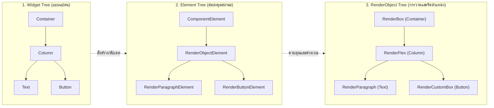
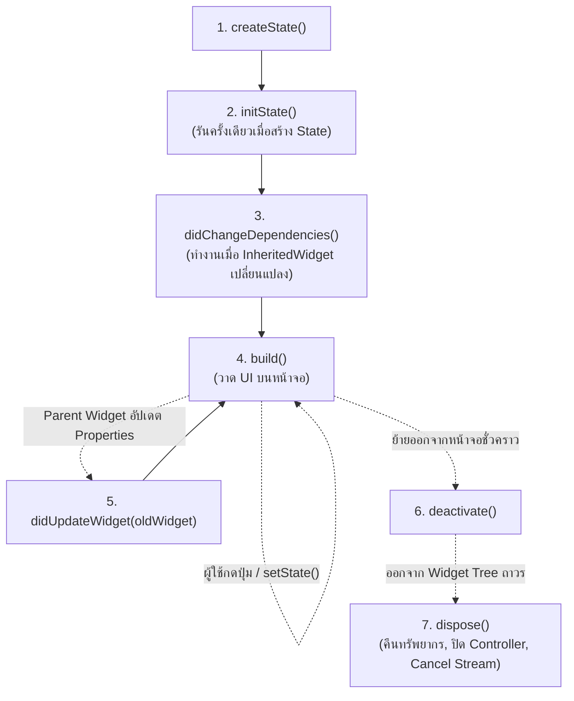
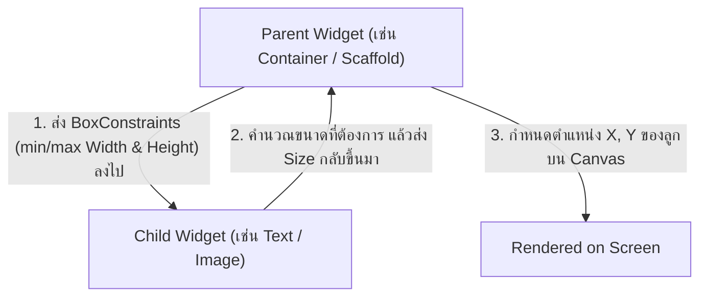

# สถาปัตยกรรม Widget, วงจรชีวิต และระบบ Layout

ปรัชญาพื้นฐานอันดับหนึ่งของ Flutter คือ **"Everything is a Widget"** ไม่ว่าจะเป็นข้อความ รูปภาพ ปุ่มกด ระยะขอบ (Padding) โครงร่างหน้าจอ (Layout) หรือแม้กระทั่งการจัดการอนิเมชัน ทุกอย่างล้วนสร้างขึ้นจาก Widget ที่ต่อกันเป็นต้นไม้ลำดับชั้น (Hierarchical Tree)

อย่างไรก็ตาม เพื่อให้สามารถเขียนแอปที่มีประสิทธิภาพระดับ 60 หรือ 120 FPS ได้อย่างเสถียร นักพัฒนาจำเป็นต้องเข้าใจว่า **เบื้องหลังของ Widget นั้น Flutter จัดการโครงสร้างต้นไม้อย่างไร**

---

## 1. กลไก 3 ต้นไม้ (The Three Trees of Flutter)

ในขณะที่แอปพลิเคชันกำลังทำงาน Flutter ไม่ได้มีเพียงต้นไม้เดียว แต่มี **3 ต้นไม้ที่ทำงานประสานกัน** ดังนี้:



1. **Widget Tree (Immutable Configuration)**:
   - เป็นอ็อบเจ็กต์ที่มีน้ำหนักเบามาก (Lightweight) และเป็น **Immutable** (แก้ไขค่าไม่ได้)
   - ถูกสร้างและทำลายทิ้งบ่อยมากในทุกๆ ครั้งที่มีการ Rebuild หน้าจอ
2. **Element Tree (Lifecycle & State Holder)**:
   - เป็นโครงสร้างตัวกลางที่คงอยู่ตลอดการทำงาน (Persistent)
   - ทำหน้าที่เก็บ **State** ของ `StatefulWidget` และเปรียบเทียบ Widget เก่ากับใหม่ (Reconciliation) หาก Widget ชนิดเดิมและคีย์เดิมยังเหมือนเดิม Element จะไม่อัปเดตทั้งก้อน แต่จะส่งแค่ Properties ใหม่ไปให้ RenderObject
3. **RenderObject Tree (Layout & Paint)**:
   - มีน้ำหนักมากที่สุด (Heavyweight) ทำหน้าที่คำนวณขนาด (Sizing), ตำแหน่ง (Positioning), การวาดพิกเซลลงบนจอ (Painting) และการรับสัมผัส (Hit Testing)

::: tip ทำไม Flutter ถึงเรนเดอร์ได้เร็วนัก?
เพราะเมื่อเราสั่ง `setState()` เฉพาะ Widget Tree เท่านั้นที่ถูกสร้างใหม่ ส่วน Element Tree และ RenderObject Tree จะถูกนำกลับมาใช้ซ้ำ (Reuse) เกือบทั้งหมดโดยไม่ต้องคำนวณพิกัดใหม่ตั้งแต่ต้น
:::

---

## 2. StatelessWidget vs StatefulWidget และ วงจรชีวิต (Lifecycle)

### 2.1 StatelessWidget
ใช้สำหรับ UI ที่ขึ้นอยู่กับข้อมูลที่ส่งเข้ามาใน Constructor เท่านั้น ไม่มีการเปลี่ยนค่าภายในตัวเองตามกาลเวลา

```dart
class UserAvatar extends StatelessWidget {
  final String imageUrl;
  final double radius;

  const UserAvatar({
    super.key,
    required this.imageUrl,
    this.radius = 24.0,
  });

  @override
  Widget build(BuildContext context) {
    return CircleAvatar(
      radius: radius,
      backgroundImage: NetworkImage(imageUrl),
    );
  }
}
```

### 2.2 วงจรชีวิตของ StatefulWidget (The Complete Lifecycle)
เมื่อคอมโพเนนต์มีสถานะภายในที่เปลี่ยนแปลงได้ตามการกระทำของผู้ใช้ เราจะใช้ `StatefulWidget` โดยมีลำดับขั้นตอนวงจรชีวิตดังนี้:



```dart
class TimerWidget extends StatefulWidget {
  final int initialSeconds;
  const TimerWidget({super.key, required this.initialSeconds});

  @override
  State<TimerWidget> createState() => _TimerWidgetState();
}

class _TimerWidgetState extends State<TimerWidget> {
  late int _remainingSeconds;
  Timer? _timer;

  @override
  void initState() {
    super.initState();
    // 1. กำหนดค่าเริ่มต้น และลงทะเบียน Listener / Timer
    _remainingSeconds = widget.initialSeconds;
    _startTimer();
  }

  @override
  void didChangeDependencies() {
    super.didChangeDependencies();
    // 2. เรียกใช้งานเมื่อสิ่งที่ผูกกับ BuildContext เปลี่ยน (เช่น Theme, MediaQuery)
  }

  @override
  void didUpdateWidget(covariant TimerWidget oldWidget) {
    super.didUpdateWidget(oldWidget);
    // 3. เรียกใช้งานเมื่อ Parent Widget ส่ง Parameter ตัวใหม่เข้ามา
    if (oldWidget.initialSeconds != widget.initialSeconds) {
      setState(() {
        _remainingSeconds = widget.initialSeconds;
      });
    }
  }

  void _startTimer() {
    _timer = Timer.periodic(const Duration(seconds: 1), (timer) {
      if (_remainingSeconds > 0) {
        setState(() => _remainingSeconds--);
      } else {
        timer.cancel();
      }
    });
  }

  @override
  Widget build(BuildContext context) {
    // 4. วาด UI
    return Text(
      'เวลาที่เหลือ: $_remainingSeconds วินาที',
      style: Theme.of(context).textTheme.headlineMedium,
    );
  }

  @override
  void dispose() {
    // 5. ปิดทรัพยากรทุกอย่างเพื่อป้องกัน Memory Leak
    _timer?.cancel();
    super.dispose();
  }
}
```

---

## 3. ทำความเข้าใจ BuildContext และ Keys

### 3.1 BuildContext คืออะไร?
แท้จริงแล้ว `BuildContext` คือ **Element ตัวนั้นๆ ใน Element Tree** นั่นเอง! ฟังก์ชันของมันคือการบอกตำแหน่งพิกัดของ Widget ในลำดับชั้นต้นไม้ ทำให้เราสามารถสืบค้นข้อมูลจาก Parent ขึ้นไปได้ เช่น:

```dart
// ค้นหา Theme ที่ใกล้ที่สุดใน Tree
final theme = Theme.of(context);

// หาขนาดหน้าจอ
final screenSize = MediaQuery.of(context).size;

// แสดง SnackBar
ScaffoldMessenger.of(context).showSnackBar(
  const SnackBar(content: Text('บันทึกสำเร็จ')),
);
```

### 3.2 ความสำคัญของ Keys
โดยปกติ Flutter จะจับคู่ Widget กับ Element ด้วยชนิดของ Class (`runtimeType`) แต่ในกรณีของรายการที่มีการสลับลำดับ (Reordering) หรือการลบรายการ หากไม่มี **Key** Flutter จะอัปเดตผิด Element ทำให้สถานะ UI คลาดเคลื่อน

- **ValueKey**: ใช้เมื่อมี Unique ID ที่ชัดเจน เช่น `ValueKey(user.id)`
- **ObjectKey**: ใช้เมื่อเปรียบเทียบจากตัวอ็อบเจ็กต์ทั้งหมด
- **UniqueKey**: สร้างคีย์ใหม่ที่ไม่ซ้ำใครเสมอ (บังคับ Rebuild ใหม่แน่นอน)
- **GlobalKey**: ช่วยให้เข้าถึง State ของ Widget จากภายนอกได้โดยตรง เช่น ตรวจสอบความถูกต้องของ Form:

```dart
final _formKey = GlobalKey<FormState>();

// เรียกใช้งานจากปุ่ม Submit
if (_formKey.currentState?.validate() ?? false) {
  // บันทึกฟอร์ม
}
```

---

## 4. กฎเหล็กของระบบ Layout ใน Flutter

กฎการจัด Layout ของ Flutter สรุปได้สั้นๆ ว่า:

> **"Constraints go down. Sizes go up. Parent sets position."**
> (ข้อจำกัดขนาดถูกส่งลงล่าง · ขนาดถูกคำนวณส่งกลับขึ้นบน · แม่เป็นผู้กำหนดตำแหน่งพิกัด)



### ปัญหาที่พบบ่อย: "A RenderFlex overflowed by xxx pixels"
เกิดจากคอมโพเนนต์ภายใน `Row` หรือ `Column` ต้องการขยายขนาดเกินขอบเขตที่หน้าจอกำหนด วิธีแก้คือใช้ `Expanded` หรือ `Flexible` เพื่อบังคับให้มีขนาดตามสัดส่วนพื้นที่ที่เหลือ:

```dart
Row(
  children: [
    const Icon(Icons.info),
    const SizedBox(width: 8),
    // ป้องกันข้อความยาวเกินหน้าจอจนเกิดแถบเหลืองดำ (Overflow)
    Expanded(
      child: Text(
        'ข้อความรายละเอียดที่อาจจะยาวมากๆ ในบางภาษา',
        overflow: TextOverflow.ellipsis,
      ),
    ),
  ],
)
```

---

## 5. คอมโพเนนต์ Layout และ Advanced Slivers

### 5.1 คอมโพเนนต์จัดกลุ่มหลัก
- **Row / Column**: จัดเรียงแนวนอน / แนวตั้ง พร้อมกำหนด `mainAxisAlignment` และ `crossAxisAlignment`
- **Stack / Positioned**: วางคอมโพเนนต์ทับซ้อนกันตามลำดับชั้นความลึก (Z-Index)
- **Wrap**: คล้าย Row แต่สามารถขึ้นบรรทัดใหม่อัตโนมัติเมื่อเนื้อหาล้นพื้นที่ (เหมาะสำหรับ Tags / Badges)

### 5.2 การจัดการ Scroll และ Slivers ประสิทธิภาพสูง
เมื่อต้องแสดงผลรายการขนาดใหญ่ (เช่น 1,000 รายการ) ห้ามใช้ `SingleChildScrollView + Column` เด็ดขาด เพราะจะเรนเดอร์ทุกก้อนพร้อมกันลงในหน่วยความจำทันที

ให้ใช้ **ListView.builder** หรือ **CustomScrollView + Slivers** เพื่อทำ **List Virtualization** (เรนเดอร์เฉพาะรายการที่ปรากฏบนหน้าจอเท่านั้น):

```dart
CustomScrollView(
  slivers: [
    // แถบหัวกระดาษที่ยุบตัวได้เมื่อเลื่อนหน้าจอ (Collapsible App Bar)
    SliverAppBar(
      expandedHeight: 200.0,
      floating: false,
      pinned: true,
      flexibleSpace: FlexibleSpaceBar(
        title: const Text('โปรไฟล์สมาชิก'),
        background: Image.asset('assets/images/header.jpg', fit: BoxFit.cover),
      ),
    ),
    // รายการข้อมูลที่ทำ Virtualized Rendering
    SliverList(
      delegate: SliverChildBuilderDelegate(
        (context, index) => ListTile(
          leading: CircleAvatar(child: Text('${index + 1}')),
          title: Text('รายการกิจกรรมที่ ${index + 1}'),
        ),
        childCount: 1000,
      ),
    ),
  ],
)
```
