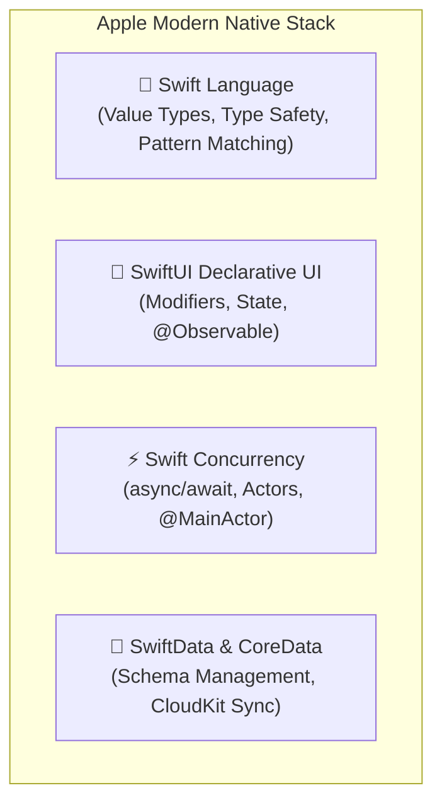
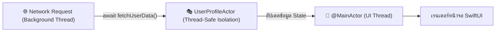

# พื้นฐานการพัฒนา Native iOS (Swift & SwiftUI)

การพัฒนาแอปพลิเคชันแบบ **Native iOS** เป็นเส้นทางหลักสำหรับระบบนิเวศของ Apple ซึ่งครอบคลุมทั้ง **iPhone (iOS), iPad (iPadOS), Mac (macOS), Apple Watch (watchOS) และ Apple Vision Pro (visionOS)**

ความโดดเด่นของ Native iOS คือประสบการณ์ผู้ใช้งานที่ประณีต สวยงาม ลื่นไหล เข้าถึงชิปประมวลผล Apple Silicon (Neural Engine, Metal GPU) ได้อย่างเต็มกำลัง โดยมีภาษา **Swift** และเฟรมเวิร์ก **SwiftUI** เป็นแกนนำในการพัฒนา



---

## 1. SwiftUI vs UIKit: วิวัฒนาการสู่ Declarative UI

ในอดีต iOS ใช้วิธีการเขียนแบบ **UIKit** (สร้าง `UIViewController`, จัด Layout ด้วย Storyboard หรือ AutoLayout Code) แต่ตั้งแต่ iOS 13 เป็นต้นมา Apple ได้เปิดตัว **SwiftUI** ซึ่งเป็น Declarative UI Framework สมัยใหม่:

```swift
// UserProfileView.swift
import SwiftUI

struct UserProfileView: View {
    let userName: String
    @State private var isFollowing = false

    var body: some View {
        VStack(spacing: 16) {
            Image(systemName: "person.crop.circle.fill")
                .resizable()
                .frame(width: 80, height: 80)
                .foregroundColor(.blue)

            Text(userName)
                .font(.title2)
                .fontWeight(.bold)

            Button(action: {
                isFollowing.toggle()
            }) {
                Text(isFollowing ? "กำลังติดตาม" : "ติดตาม")
                    .fontWeight(.semibold)
                    .frame(maxWidth: .infinity)
                    .padding()
                    .background(isFollowing ? Color.gray.opacity(0.2) : Color.blue)
                    .foregroundColor(isFollowing ? .primary : .white)
                    .cornerRadius(12)
            }
            .padding(.horizontal)
        }
        .padding()
    }
}
```

---

## 2. การจัดการสถานะใน SwiftUI ยุคใหม่ (`@Observable`)

ตั้งแต่ **iOS 17 (Swift 5.9+)** เป็นต้นมา Apple ได้เปิดตัว **Observation Framework** ด้วย Macro `@Observable` ซึ่งเข้ามาแทนที่ `ObservableObject` และ `@Published` เดิม ทำให้โค้ดสะอาดและคอมไพล์ได้เร็วขึ้น:

```swift
import SwiftUI
import Observation

@Observable
class CartViewModel {
    var items: [String] = []
    var isCheckingOut: Bool = false

    var totalCount: Int {
        items.count
    }

    func addItem(_ name: String) {
        items.append(name)
    }
}

struct CartScreen: View {
    @State private var viewModel = CartViewModel()

    var body: some View {
        VStack {
            Text("จำนวนสินค้าในตะกร้า: \(viewModel.totalCount)")
                .font(.headline)

            Button("เพิ่มสินค้า") {
                viewModel.addItem("หนังสือเขียนโค้ด")
            }
        }
    }
}
```

---

## 3. Swift Concurrency: async/await และ Actors

Swift มีระบบ Concurrency ระดับภาษาที่ช่วยกำจัดปัญหา Data Race (การแย่งกันเขียนตัวแปรพร้อมกันหลาย Thread):



### 3.1 การใช้งาน Actor เพื่อความปลอดภัยของข้อมูล
`actor` คือคลาสชนิดพิเศษที่รับประกันว่าจะมีเพียง **เธรดเดียวเท่านั้น** ที่สามารถเข้าถึงข้อมูลภายในได้ ณ เวลาใดเวลาหนึ่ง:

```swift
actor BankAccountManager {
    private var balance: Double = 0.0

    func deposit(amount: Double) {
        balance += amount
    }

    func getBalance() -> Double {
        return balance
    }
}
```

### 3.2 การอัปเดต UI ด้วย `@MainActor`
ฟังก์ชันหรือคลาสใดที่มีผลต่อหน้าจอ ต้องกำกับด้วย `@MainActor` เพื่อให้มั่นใจว่าจะถูกประมวลผลบน UI Thread เสมอ:

```swift
@MainActor
class OrderViewModel: ObservableObject {
    @Published var orderStatus: String = "รอดำเนินการ"

    func processOrder() async {
        // ทำงาน Network แบบ Asynchronous
        let result = await OrderService.sendOrder()
        // ผลลัพธ์จะถูกอัปเดตบน Main Thread อย่างปลอดภัยโดยอัตโนมัติ
        self.orderStatus = result.status
    }
}
```

---

## 4. SwiftData: การจัดเก็บข้อมูลถาวรสมัยใหม่

เปิดตัวใน iOS 17 โดยผสานพลังของ Swift Macro ร่วมกับ CoreData ช่วยให้สามารถกำหนด Schema ข้อมูลด้วยคลาส Swift ธรรมดา:

```swift
import SwiftData

@Model
class NoteItem {
    var id: UUID
    var title: String
    var content: String
    var createdAt: Date

    init(title: String, content: String) {
        self.id = UUID()
        self.title = title
        self.content = content
        self.createdAt = Date()
    }
}
```

ใน SwiftUI View เราสามารถดึงข้อมูลและเฝ้าสังเกต (Query) ได้อย่างง่ายดาย:
```swift
struct NoteListView: View {
    @Environment(\.modelContext) private var modelContext
    @Query(sort: \NoteItem.createdAt, order: .reverse) private var notes: [NoteItem]

    var body: some View {
        List(notes) { note in
            Text(note.title)
        }
    }
}
```

---

## 5. วงจรชีวิตแอป SwiftUI (ScenePhase Lifecycle)

ใน SwiftUI สมัยใหม่ เราใช้โครงสร้าง `@main App` และเฝ้าสังเกต `scenePhase`:

```swift
@main
struct MyApp: App {
    @Environment(\.scenePhase) private var scenePhase

    var body: some Scene {
        WindowGroup {
            ContentView()
        }
        .onChange(of: scenePhase) { oldPhase, newPhase in
            switch newPhase {
            case .active:
                print("แอปเปิดใช้งานอยู่บนหน้าจอ (Active)")
            case .inactive:
                print("ผู้ใช้ปัด Notification หรือมีสายโทรเข้า (Inactive)")
            case .background:
                print("แอปถูกพับลงเบื้องหลัง (Background) - บันทึกข้อมูลและปิดการเชื่อมต่อ")
            @unknown default:
                break
            }
        }
    }
}
```
