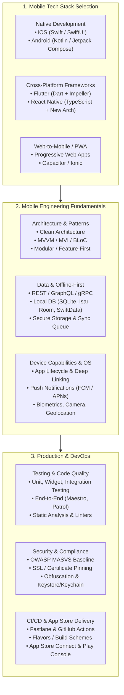

# Mobile Application Development Roadmap & Guideline

ยินดีต้อนรับสู่ **Mobile Application Development Roadmap** แหล่งรวบรวมองค์ความรู้ แนวทางปฏิบัติ และเส้นทางการเติบโตสำหรับนักพัฒนาโมบายล์แอปพลิเคชัน ตั้งแต่ระดับเริ่มต้น (Beginner) ไปจนถึงระดับ Senior / Lead Mobile Engineer

ในยุคปัจจุบัน โมบายล์แอปพลิเคชันกลายเป็นหัวใจสำคัญของธุรกิจและประสบการณ์ของผู้ใช้ ไม่ว่าจะเป็น FinTech, E-Commerce, Social Network หรือ Enterprise Solution การสร้างแอปพลิเคชันที่มีประสิทธิภาพสูง ลื่นไหล ปลอดภัย และดูแลรักษาง่าย จำเป็นต้องอาศัยความเข้าใจทั้งในระดับแพลตฟอร์ม สถาปัตยกรรมซอฟต์แวร์ และกระบวนการส่งมอบงานระดับสากล

<SkillCard id="mobile-app-developer" />

---

## 1. การเลือกเส้นทางการพัฒนา (Technology Stack Selection)

คำถามแรกที่นักพัฒนาและทีมวิศวกรรมต้องตอบคือ: **"ควรเลือกใช้เทคโนโลยีใดในการพัฒนาโมบายล์แอปพลิเคชัน?"**

| มิติการเปรียบเทียบ | Native (iOS / Android) | Flutter | React Native |
| :--- | :--- | :--- | :--- |
| **ภาษาหลัก** | Swift (iOS), Kotlin (Android) | Dart 3.x | TypeScript / JavaScript |
| **การเรนเดอร์ UI** | Native UI Components (SwiftUI, Jetpack Compose) | Custom Canvas Rendering Engine (Impeller / Skia) | Native Views ผ่าน Fabric Renderer (New Arch) |
| **ประสิทธิภาพ (Performance)** | สูงสุด เข้าถึงฮาร์ดแวร์ได้โดยตรง 100% | สูงมาก (AOT Compiled, 60/120 FPS สม่ำเสมอ) | สูงมากเมื่อใช้ TurboModules + Hermes |
| **การแชร์โค้ด (Code Reuse)** | ต่ำ (แยก 2 โปรเจกต์อย่างสิ้นเชิง) | สูงมาก (UI และ Logic เดียวกัน 90-95%+) | สูง (UI และ Logic แชร์กันได้ 80-90%) |
| **การเข้าถึง Native APIs** | ไม่ต้องผ่านบริดจ์ (Native 100%) | ผ่าน Platform Channels, Pigeon หรือ Dart FFI | ผ่าน TurboModules / JSI (JavaScript Interface) |
| **ความเหมาะสมของโปรเจกต์** | แอปที่ใช้กราฟิก 3D/AR ระดับสูง, ระบบเบื้องหลังลึกๆ | แอปที่ต้องการ UI สวยงามตามดีไซน์ตรงกันทุกแพลตฟอร์ม | ทีมที่มีพื้นฐาน React/Web แข็งแกร่ง ต้องการความยืดหยุ่น |

---

## 2. เสาหลักของวิศวกรรมโมบายล์ (Mobile Engineering Pillars)

### 2.1 สถาปัตยกรรมซอฟต์แวร์ (Architecture)
แอปพลิเคชันขนาดใหญ่ต้องมีโครงสร้างที่ชัดเจนเพื่อรองรับการขยายตัว (Scalability) และการทดสอบ (Testability):
- **Clean Architecture**: แบ่งแอปพลิเคชันออกเป็น 3 เลเยอร์หลัก:
  1. **Presentation Layer**: UI Widgets, State Notifiers/ViewModels
  2. **Domain Layer**: Entities, Use Cases / Business Rules (ปราศจาก Framework Dependency)
  3. **Data Layer**: Repositories, Data Sources (Remote API, Local Database)
- **Feature-First Organization**: จัดโครงสร้างโฟลเดอร์ตามฟีเจอร์ของธุรกิจ (เช่น `features/auth/`, `features/checkout/`) แทนที่จะจัดตามชนิดของไฟล์ ช่วยให้ทีมหลายคนทำงานพร้อมกันได้โดยไม่ชนกัน

### 2.2 ระบบออฟไลน์และการจัดการข้อมูล (Offline-First & Data Sync)
สัญญาณอินเทอร์เน็ตบนมือถือมีความไม่แน่นอนสูง แอปพลิเคชันที่ดีต้อง:
- ใช้ฐานข้อมูลในเครื่อง (Local DB) เป็น **Single Source of Truth (SSOT)**
- แสดงผลข้อมูลจากแคชในเครื่องทันที (Optimistic UI)
- จัดคิวคำขอ (Sync Queue) เพื่อซิงค์ข้อมูลกับเซิร์ฟเวอร์เมื่อมีสัญญาณ
- มีกลยุทธ์จัดการข้อขัดแย้งของข้อมูล (Conflict Resolution Strategy เช่น Last-Write-Wins หรือ Server-Wins)

### 2.3 ความปลอดภัย (Mobile Application Security - OWASP MASVS)
โมบายล์แอปพลิเคชันถูกแจกจ่ายไปยังเครื่องของผู้ใช้ ทำให้มีโอกาสถูก Reverse Engineering:
- **Secure Storage**: ห้ามเก็บ Secret, Token, Password ลงใน Local Storage ปกติ ให้ใช้ Hardware-backed Keystore (Android) และ Keychain (iOS)
- **SSL / Certificate Pinning**: ป้องกันการโจมตีแบบ Man-in-the-Middle (MitM) โดยการตรวจสอบ Certificate หรือ Public Key ของเซิร์ฟเวอร์
- **Code Obfuscation**: ทำการ Obfuscate และบีบอัดโค้ดด้วย ProGuard/R8 (Android) และ `--obfuscate` (Flutter) เพื่อป้องกันการแกะซอร์สโค้ด

---

## 3. สารบัญหัวข้อการเรียนรู้ (Curriculum Tracks)

เลือกศึกษาตามหัวข้อที่ท่านสนใจ เพื่อเจาะลึกรายละเอียดในแต่ละหมวดหมู่:

### 📱 Flutter Development (Track แนะนำ)
เรียนรู้ Flutter เชิงลึกตั้งแต่พื้นฐานสถาปัตยกรรมไปจนถึงการ Deploy สู่ Production:
1. **[Flutter คืออะไรและทำงานอย่างไร](/paths/mobile-development/flutter-fundamentals/what-is-flutter)**: โครงสร้าง Engine, Impeller, เครื่องมือและ DevTools
2. **[พื้นฐานภาษา Dart 3](/paths/mobile-development/flutter-fundamentals/dart-fundamentals)**: Null Safety, Records, Pattern Matching, Concurrency & Isolates
3. **[Widget Architecture & Lifecycle](/paths/mobile-development/flutter-fundamentals/widget-architecture)**: การทำงานของ Widget, Element, RenderObject Tree, Keys และ Layout System
4. **[การจัดการ State (State Management)](/paths/mobile-development/flutter-fundamentals/state-management)**: Riverpod, BLoC/Cubit, Provider และ Clean Architecture
5. **[การจัดการ Navigation & Deep Linking](/paths/mobile-development/flutter-fundamentals/navigation-and-routing)**: GoRouter, Nested Routing, ShellRoute, Auth Guards
6. **[ระบบ Networking และ Local Storage](/paths/mobile-development/flutter-fundamentals/networking-and-storage)**: Dio, Freezed, SQLite, Hive, Isar, Offline-first pattern
7. **[การเชื่อมต่อ Native & ฮาร์ดแวร์](/paths/mobile-development/flutter-fundamentals/native-interop-and-hardware)**: MethodChannel, EventChannel, Pigeon, Dart FFI, Biometrics, Push Notifications
8. **[การทดสอบและการรักษาคุณภาพโค้ด](/paths/mobile-development/flutter-fundamentals/testing-and-quality)**: Unit Tests, Widget Tests, Integration Tests (Patrol), Golden Tests
9. **[การเพิ่มประสิทธิภาพและความปลอดภัย](/paths/mobile-development/flutter-fundamentals/performance-and-security)**: Rebuild Optimization, DevTools Profiler, Certificate Pinning, OWASP MASVS
10. **[DevOps, CI/CD และการขึ้นสโตร์](/paths/mobile-development/flutter-fundamentals/deployment-and-cicd)**: Build Flavors, Fastlane, GitHub Actions, Code Signing, App Store & Play Console

---

### 🤖 Native Android & iOS Fundamentals
ทำความเข้าใจพื้นฐานการพัฒนา Native เพื่อต่อยอดการเขียน Native Modules หรือพัฒนาแอป Native โดยตรง:
- **[Native Android Fundamentals](/paths/mobile-development/android-fundamentals/what-is-android)**: Kotlin, Jetpack Compose, Android Jetpack (ViewModel, Room, WorkManager), Gradle
- **[Native iOS Fundamentals](/paths/mobile-development/iOS-fundamentals/what-is-ios)**: Swift, SwiftUI, Swift Concurrency, Core Data / SwiftData, Human Interface Guidelines
- **[React Native Fundamentals](/paths/mobile-development/react-native-fundamentals/what-is-react-native)**: New Architecture (Fabric, TurboModules), Expo Ecosystem, Hermes Engine
