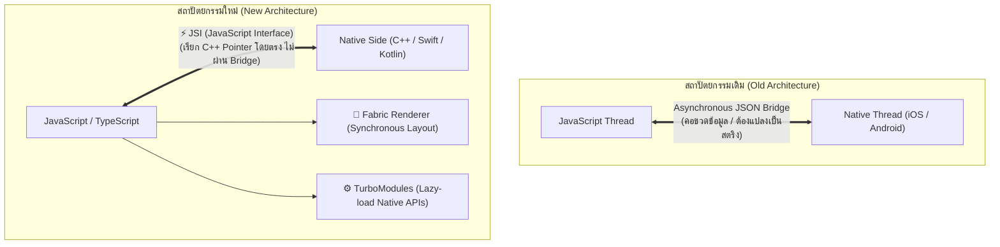

# พื้นฐานการพัฒนา React Native (New Architecture & Expo)

**React Native** เป็นเฟรมเวิร์ก Cross-Platform ที่สร้างโดย **Meta (Facebook)** ซึ่งช่วยให้นักพัฒนาสามารถใช้ภาษา **JavaScript / TypeScript** ร่วมกับแนวคิดคอมโพเนนต์ของ **React** เพื่อสร้างโมบายล์แอปพลิเคชันสำหรับ iOS และ Android

ความแตกต่างระหว่าง React Native และ Flutter คือ: **React Native จะแปลง Component ไปเป็น Native UI Widgets ของระบบปฏิบัติการจริง** (เช่น `<View>` จะถูกแปลงเป็น `UIView` บน iOS และ `ViewGroup` บน Android)



---

## 1. สถาปัตยกรรมใหม่ของ React Native (The New Architecture)

ในอดีต ปัญหาที่พบบ่อยของ React Native คือ **ความล่าช้าของ Async Bridge** เมื่อผู้ใช้เลื่อนหน้าจอเร็วมากๆ (Fast Scrolling) หรือมีอนิเมชันซับซ้อน ข้อมูล JSON ที่ต้องส่งข้าม Bridge ไปมาจะเกิดการอุดตัน ทำให้หน้าจอเกิดช่องว่างสีขาวชั่วคราว (Blank Screen)

Meta จึงได้รื้อระบบใหม่ทั้งหมดและเปิดตัว **The New Architecture**:

### 1.1 JSI (JavaScript Interface)
ตัวเชื่อมภาษา C++ อัจฉริยะที่ทำให้ JavaScript Engine สามารถถือ **HostObject Pointer** ของฝั่ง Native ได้โดยตรง ทำให้ JavaScript สามารถเรียกฟังก์ชัน Native ได้แบบ Synchronous โดยไม่ต้องแปลงข้อมูลเป็น JSON String อีกต่อไป

### 1.2 Fabric Renderer
ระบบเรนเดอร์ UI ยุคใหม่ที่เขียนด้วยภาษา C++:
- แชร์ตรรกะการคำนวณ Layout (ผ่าน Yoga Engine) ระหว่าง iOS และ Android
- รองรับ **Concurrent React** (เช่น `useTransition`, `Suspense`)
- จัดการสัมผัสและการจัดวางพิกัดได้แบบ Synchronous ทำให้การเลื่อน ListView มีความเสถียรและลื่นไหลทัดเทียม Native

### 1.3 TurboModules
ในอดีต Native Modules ทั้งหมดจะถูกโหลดขึ้นสู่หน่วยความจำตั้งแต่ตอนเปิดแอป (ทำให้ Cold Start ช้า) แต่ **TurboModules** จะใช้วิธี **Lazy-Loading** (โหลดขึ้นมาทำงานเฉพาะเมื่อโมดูลนั้นถูกเรียกใช้งานจริงเท่านั้น) ส่งผลให้แอปเปิดตัวได้เร็วขึ้นอย่างมาก

### 1.4 Hermes JavaScript Engine
เอนจินประมวลผล JavaScript ที่ Meta พัฒนาขึ้นมาเพื่อโมบายล์โดยเฉพาะ โดยจะทำการแปลงโค้ด JS ไปเป็น **Bytecode ล่วงหน้าตั้งแต่ขั้นตอนการ Build (AOT Bytecode Precompilation)** ทำให้ไม่ต้องเสียเวลา Parse โค้ดตอนเปิดแอป ลดการใช้ RAM และเพิ่มความเร็วในการเปิดแอปอย่างมหาศาล

---

## 2. ระบบนิเวศ Expo สมัยใหม่ (Modern Expo & EAS)

ในปัจจุบัน ชุมชน React Native ได้ยกให้ **Expo** เป็นมาตรฐานหลักในการเริ่มต้นโปรเจกต์ (แนะนำโดยทีมงาน React Native อย่างเป็นทางการ):

- **Expo Prebuild**: สามารถสร้างโฟลเดอร์ `android/` และ `ios/` อัตโนมัติจากไฟล์ `app.json` และ Plugins
- **Development Builds (`expo-dev-client`)**: หมดข้อจำกัดเดิมของ Expo Go! สามารถติดตั้ง Custom Native Code (เช่น สแกนเนอร์บาร์โค้ดฮาร์ดแวร์เฉพาะ, บลูทูธพิเศษ) ได้อย่างไร้รอยต่อ
- **Expo Router**: ระบบ Routing แบบ File-based Routing (โครงสร้างโฟลเดอร์คล้ายกับ Next.js App Router) รองรับ Deep Linking และ Web Export ในตัว
- **EAS (Expo Application Services)**: บริการคลาวด์สำหรับ Build, อัปเดตแอปผ่านสัญญาณไร้สาย (OTA Updates ผ่าน EAS Update), และส่งแอปขึ้น App Store อัตโนมัติ

```bash
# สร้างโปรเจกต์ React Native ด้วย Expo ยุคใหม่
npx create-expo-app@latest my-app
```

---

## 3. ตัวอย่างโค้ด React Native สมัยใหม่ (TypeScript + Hooks)

```tsx
import React, { useState } from 'react';
import { StyleSheet, Text, View, TouchableOpacity, FlatList } from 'react-native';

interface Task {
  id: string;
  title: string;
  isDone: boolean;
}

export default function TodoApp() {
  const [tasks, setTasks] = useState<Task[]>([
    { id: '1', title: 'เรียนรู้ Flutter Architecture', isDone: true },
    { id: '2', title: 'ศึกษา React Native New Architecture', isDone: false },
  ]);

  const toggleTask = (id: string) => {
    setTasks(prev =>
      prev.map(task =>
        task.id === id ? { ...task, isDone: !task.isDone } : task
      )
    );
  };

  return (
    <View style={styles.container}>
      <Text style={styles.headerTitle}>รายการที่ต้องทำ</Text>
      <FlatList
        data={tasks}
        keyExtractor={item => item.id}
        renderItem={({ item }) => (
          <TouchableOpacity
            style={[styles.taskCard, item.isDone && styles.taskDone]}
            onPress={() => toggleTask(item.id)}
          >
            <Text style={[styles.taskText, item.isDone && styles.textDone]}>
              {item.title}
            </Text>
          </TouchableOpacity>
        )}
      />
    </View>
  );
}

const styles = StyleSheet.create({
  container: {
    flex: 1,
    paddingTop: 60,
    paddingHorizontal: 20,
    backgroundColor: '#F8F9FA',
  },
  headerTitle: {
    fontSize: 24,
    fontWeight: '700',
    marginBottom: 20,
    color: '#212529',
  },
  taskCard: {
    backgroundColor: '#FFFFFF',
    padding: 16,
    borderRadius: 12,
    marginBottom: 12,
    borderWidth: 1,
    borderColor: '#E9ECEF',
  },
  taskDone: {
    backgroundColor: '#E8F5E9',
    borderColor: '#C8E6C9',
  },
  taskText: {
    fontSize: 16,
    color: '#212529',
  },
  textDone: {
    textDecorationLine: 'line-through',
    color: '#4CAF50',
  },
});
```

---

## 4. ตารางเปรียบเทียบ: Flutter vs React Native

| หัวข้อ | Flutter (Google) | React Native (Meta) |
| :--- | :--- | :--- |
| **ภาษาที่ใช้** | Dart 3.x | TypeScript / JavaScript |
| **กลไกการเรนเดอร์** | วาดทุกพิกเซลเองผ่าน Impeller (Canvas-based) | แปลงเป็น Native Views จริง (Platform UI) |
| **ความสม่ำเสมอของ UI** | เหมือนกัน 100% ทุกระบบปฏิบัติการ | มีสไตล์ Native ตามค่าเริ่มต้นของ OS นั้นๆ |
| **ความเร็วของแอนิเมชัน** | ลื่นไหลมาก (60-120 FPS ไม่ต้องผ่าน Bridge) | ลื่นไหลมากเมื่อใช้ JSI + Reanimated v3 |
| **ระบบนิเวศภายนอก** | `pub.dev` (แพ็กเกจคัดกรองคุณภาพโดย Google) | `npm` (แพ็กเกจมหาศาลจากโลก JavaScript) |
| **จุดเด่นที่สุด** | ออกแบบ UI สวยงามตามใจชอบ, Engine ทรงพลัง | ใช้ทีมงานเว็บพัฒนาต่อยอดได้ทันที, มี Expo หนุนหลัง |
