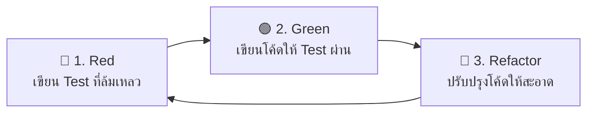
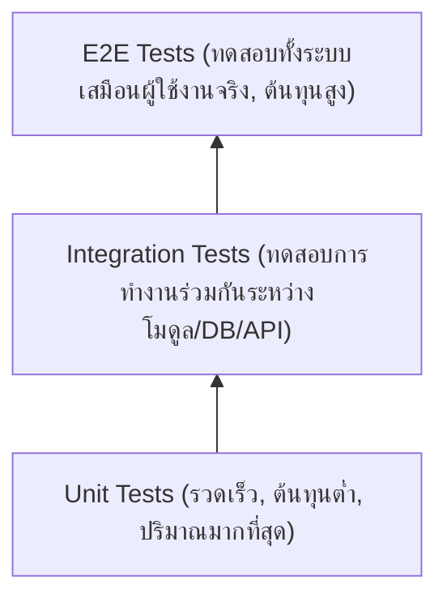

# Test-Driven Development (TDD)

**Test-Driven Development (TDD)** หรือบางครั้งเรียกว่า **Test-Driven Design** คือกระบวนการพัฒนาซอฟต์แวร์ที่ขับเคลื่อนการออกแบบและการเขียนโค้ดด้วย "การทดสอบ (Tests)" โดยมีหัวใจหลักคือ **การเขียนชุดทดสอบ (Automated Unit Test) ให้ล้มเหลวก่อนที่จะเริ่มต้นเขียนโค้ดการทำงานจริง** จากนั้นจึงเขียนโค้ดเท่าที่จำเป็นเพื่อให้ผ่านการทดสอบ แล้วจึงปรับปรุงโครงสร้างโค้ด (Refactor) ให้มีคุณภาพสูง

แนวคิดนี้ได้รับการเผยแพร่และทำให้เป็นที่นิยมโดย **Kent Beck** ซึ่งเป็นหนึ่งในผู้ริเริ่มหลักการ Extreme Programming (XP) และผู้ร่วมลงนามใน Agile Manifesto

---

## วัฏจักร Red-Green-Refactor

หัวใจสำคัญที่สุดของ TDD คือวงจรการทำงานสั้นๆ ที่หมุนเวียนซ้ำต่อเนื่องที่เรียกว่า **Red-Green-Refactor Cycle**:



### 1. 🔴 Red (เขียนการทดสอบที่ล้มเหลว)
- เริ่มต้นด้วยการคิดถึง **Requirement** หรือพฤติกรรม (Behavior) ที่ต้องการ
- เขียน Unit Test เล็กๆ ขึ้นมา 1 ตัวสำหรับฟังก์ชันหรือเมธอดที่ยังไม่มีอยู่จริง
- รันการทดสอบ แล้วตรวจสอบว่าต้อง **Fail (ล้มเหลว)** อย่างที่คาดหวัง (เพื่อยืนยันว่าการทดสอบสามารถตรวจจับกรณีที่ยังไม่มีการทำงานได้อย่างถูกต้อง)

### 2. 🟢 Green (เขียนโค้ดให้ทดสอบผ่านอย่างเร็วที่สุด)
- เขียนโค้ดการทำงานจริง (Production Code) **เท่าที่จำเป็นและน้อยที่สุด** เพื่อให้ Test ที่เพิ่งเขียนผ่าน
- ในขั้นตอนนี้ยังไม่ต้องกังวลเรื่องความสวยงามของโค้ดหรือ performance ให้มุ่งเป้าที่ "ทำให้ Test ผ่าน (Turn Green)" ก่อนเสมอ

### 3. 🔵 Refactor (ปรับปรุงคุณภาพโค้ด)
- เมื่อ Test ผ่านแล้ว ให้ตรวจสอบหา Code Smells หรือความซ้ำซ้อน
- ปรับปรุงโครงสร้างโค้ด ตั้งชื่อตัวแปรให้สื่อความหมาย ดึง logic ย่อยออกมาเป็นฟังก์ชัน หรือปรับใช้ Design Patterns
- **ทุกครั้งที่มีการ Refactor ต้องรัน Test ซ้ำเพื่อการันตีว่าพฤติกรรมเดิมไม่เสียหาย**

---

## กฎ 3 ข้อของ TDD (The Three Laws of TDD)

Robert C. Martin (Uncle Bob) ได้สรุปกฎ 3 ข้อของการทำ TDD ไว้ดังนี้:

1. **ห้ามเขียน Production Code** ใดๆ เว้นแต่จะเขียนขึ้นเพื่อให้ Unit Test ที่ล้มเหลวอยู่ผ่าน
2. **ห้ามเขียน Unit Test เกินกว่าที่จะทำให้เกิดข้อผิดพลาด** (Compile error ก็นับว่าเป็น failure)
3. **ห้ามเขียน Production Code เกินกว่าที่จำเป็น** เพื่อให้ Unit Test ที่ล้มเหลวอยู่ตัวนั้นผ่าน

---

## ตัวอย่างการนำ TDD ไปใช้งาน (Walkthrough)

สมมติว่าเรากำลังสร้างระบบคำนวณส่วนลดสำหรับร้านค้า: *"ยอดซื้อตั้งแต่ 1,000 บาทขึ้นไป จะได้รับส่วนลด 10%"*

### Step 1: 🔴 Red - เขียน Test ก่อน
```typescript
// discount.test.ts
import { describe, it, expect } from 'vitest';
import { calculateDiscount } from './discount';

describe('calculateDiscount', () => {
  it('ควรได้ส่วนลด 10% เมื่อยอดซื้อครบ 1,000 บาท', () => {
    const total = 1000;
    const discount = calculateDiscount(total);
    expect(discount).toBe(100);
  });
});
```
เมื่อรันการทดสอบ จะพบว่า **Fail** เนื่องจากยังไม่มีฟังก์ชัน `calculateDiscount`

### Step 2: 🟢 Green - เขียนโค้ดให้ผ่าน
```typescript
// discount.ts
export function calculateDiscount(total: number): number {
  if (total >= 1000) {
    return total * 0.1;
  }
  return 0;
}
```
เมื่อรันการทดสอบอีกครั้ง ผลลัพธ์จะเป็น **Pass (Green)**

### Step 3: 🔵 Refactor - ปรับปรุงโครงสร้างโค้ด
หากมีหลายเงื่อนไขหรือตัวแปร Magic Numbers ให้ดึงออกมาเป็นค่าคงที่ (Constants) หรือแยกความรับผิดชอบ:
```typescript
// discount.ts
const DISCOUNT_THRESHOLD = 1000;
const DISCOUNT_RATE = 0.10;

export function calculateDiscount(total: number): number {
  const isEligible = total >= DISCOUNT_THRESHOLD;
  return isEligible ? total * DISCOUNT_RATE : 0;
}
```
รัน Test อีกครั้งเพื่อยืนยันว่าการแก้ไขโครงสร้างไม่ทำให้ผลลัพธ์ผิดเพี้ยน

---

## ลำดับชั้นการทดสอบ (Test Pyramid)

ในการทำระบบที่มีการทดสอบรองรับ มักจะอิงตามสถาปัตยกรรม **Test Pyramid** ของ Mike Cohn:



- **Unit Tests**: เป็นฐานที่กว้างที่สุดและเป็นจุดที่ TDD ใช้งานมากที่สุด มุ่งเน้นการทดสอบ logic ย่อยของ class/function แบบแยกเดี่ยวและรวดเร็วระดับ millisecond
- **Integration Tests**: ตรวจสอบการสื่อสารระหว่าง component เช่น Database query, Network request, หรือ Third-party integration
- **End-to-End (E2E) Tests**: ทดสอบเส้นทางการใช้งานของผู้ใช้ตั้งแต่ต้นจนจบ (Happy path และ Critical flows)

---

## ประโยชน์ของการทำ TDD

1. **ลดจำนวนบั๊กได้อย่างมหาศาล**: การดักจับข้อผิดพลาดตั้งแต่ขั้นตอนการพัฒนาช่วยลด Defect Rate ก่อนขึ้นสู่ Production ได้ถึง 40-90%
2. **ได้โค้ดที่ออกแบบมาให้ทดสอบได้ (Testable Design)**: โค้ดที่เขียนด้วย TDD จะมี Low Coupling และ High Cohesion โดยธรรมชาติ เพราะถ้าออกแบบซับซ้อนเกินไปจะเขียน Test ได้ยาก
3. **ความมั่นใจในการเปลี่ยนแปลง (Fearless Refactoring)**: เมื่อมี Automated Tests ครอบคลุม ทีมสามารถปรับปรุงโค้ดหรืออัปเกรด dependencies ได้อย่างรวดเร็วโดยไม่ต้องกลัวระบบพัง
4. **ทำหน้าที่เป็น Living Documentation**: ตัวอย่างการเรียกใช้ฟังก์ชันใน Unit Tests คือเอกสารอธิบายการทำงานจริงที่มีความสดใหม่อยู่เสมอ

---

## ข้อควรระวังและ Anti-patterns ที่พบบ่อย

- **ทดสอบ Implementation Detail แทนที่จะทดสอบ Behavior**: การทดสอบไม่ควรผูกติดกับตัวแปรภายในหรือลำดับการเรียกเมธอดส่วนตัว เพราะจะทำให้การ Refactor โค้ดภายในทำให้ Test พังทั้งที่ผลลัพธ์ยังถูกต้อง
- **ข้ามขั้นตอน Refactor**: หลายคนหยุดเมื่อเห็นแถบเขียว (Green) แล้วข้ามขั้นตอน Refactor ไป ทำให้สะสม Technical Debt ในระยะยาว
- **เขียน Test กว้างเกินไปในรอบเดียว**: ควรแบ่งโจทย์ใหญ่เป็นชิ้นส่วนย่อยๆ แล้วค่อยๆ ทำทีละรอบตาม Red-Green-Refactor
- **Mock มากเกินความจำเป็น**: การ Mock ทุกสิ่งทุกอย่างอาจทำให้ Test ไม่สะท้อนพฤติกรรมจริงของระบบ

---

## แหล่งข้อมูลอ้างอิงและศึกษาเพิ่มเติม

- หนังสือ **Test Driven Development: By Example** โดย Kent Beck
- บทความ [TestDrivenDevelopment](https://martinfowler.com/bliki/TestDrivenDevelopment.html) โดย Martin Fowler
- บทความ [The Three Laws of TDD](http://butunclebob.com/ArticleS.UncleBob.TheThreeLawsOfTdd) โดย Robert C. Martin (Uncle Bob)
- [The Practical Test Pyramid](https://martinfowler.com/articles/practical-test-pyramid.html) โดย Ham Vocke
