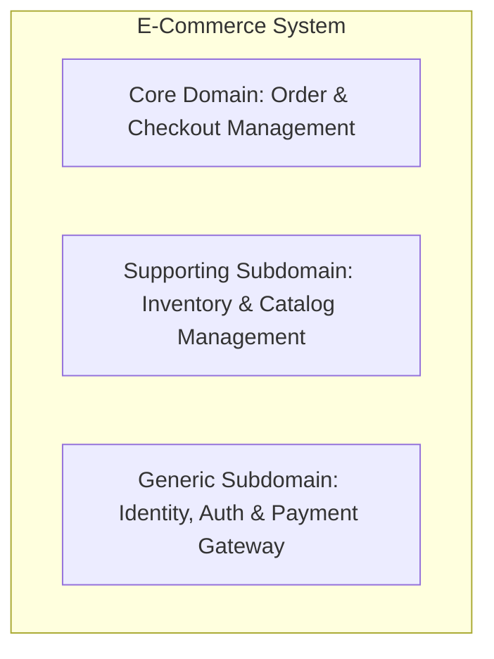
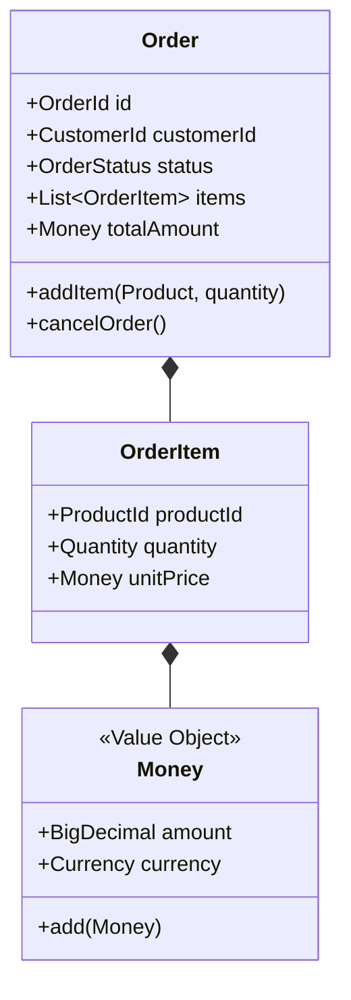

# Domain-Driven Design (DDD)

**Domain-Driven Design (DDD)** คือแนวคิดและปรัชญาในการออกแบบสถาปัตยกรรมซอฟต์แวร์ที่มุ่งเน้นการให้ความสำคัญกับ **"แก่นของธุรกิจ (Domain)"** และ **"ตรรกะทางธุรกิจ (Domain Logic)"** เป็นศูนย์กลางของการพัฒนา โดยเชื่อมโยงการทำงานระหว่างผู้เชี่ยวชาญด้านธุรกิจ (Domain Experts) และทีมพัฒนาซอฟต์แวร์ (Developers) ให้เข้าใจตรงกันผ่านโมเดลและภาษาเดียวกัน

แนวคิดนี้ริเริ่มโดย **Eric Evans** ในปี 2003 ผ่านหนังสือคลาสสิก *"Domain-Driven Design: Tackling Complexity in the Heart of Software"* (หรือที่รู้จักกันในชื่อ "The Blue Book")

---

## ทำไมต้องใช้ Domain-Driven Design?

ในระบบซอฟต์แวร์ระดับองค์กรที่มีความซับซ้อนสูง มักพบปัญหาสำคัญ ได้แก่:
- โค้ดกระจัดกระจาย ตรรกะทางธุรกิจปะปนอยู่กับ Database Queries, UI หรือ Framework Controllers
- ภาษาที่นักพัฒนาใช้ไม่ตรงกับสิ่งที่ฝั่งธุรกิจหรือผู้ใช้งานเรียก ทำให้เกิดความคลาดเคลื่อนในการส่งมอบงาน
- การเปลี่ยนแปลง Requirement ทางธุรกิจส่งผลกระทบต่อเนื่องเป็นลูกโซ่จนระบบเปราะบาง

DDD ช่วยแก้ปัญหาเหล่านี้โดยแบ่งการออกแบบออกเป็น 2 ระดับหลัก:
1. **Strategic Design (การออกแบบเชิงกลยุทธ์)**: การมองภาพรวม จัดกลุ่มระบบ และกำหนดขอบเขต
2. **Tactical Design (การออกแบบเชิงเทคนิค)**: รูปแบบโครงสร้างโค้ดและการสร้างโมเดลภายในขอบเขต

---

## 1. Strategic Design (การออกแบบเชิงกลยุทธ์)

Strategic Design มุ่งเน้นการทำความเข้าใจบริบททางธุรกิจและแบ่งแยกความซับซ้อนของระบบใหญ่ออกเป็นส่วนย่อยๆ ที่ชัดเจน

### 1.1 Ubiquitous Language (ภาษาที่เป็นสากลร่วมกัน)
- ภาษาและชุดคำศัพท์เฉพาะที่ทุกคนในทีม ทั้ง Domain Experts, Product Managers, และ Developers ใช้สื่อสารตรงกัน
- คำศัพท์นี้จะต้องถูกนำไปใช้จริงในบทสนทนา เอกสารความต้องการ และปรากฏอยู่ใน **ชื่อคลาส เมธอด และตัวแปรในโค้ด** โดยไม่ใช้คำศัพท์ทางเทคนิคมาแทนที่ความหมายทางธุรกิจ

### 1.2 Subdomains (โดเมนย่อย)
- **Core Domain**: หัวใจสำคัญและจุดเด่นทางธุรกิจของระบบ เป็นสิ่งที่สร้างความแตกต่างและมูลค่าหลักให้กับองค์กร (ควรทุ่มเททรัพยากรพัฒนามากที่สุด)
- **Supporting Domain**: ส่วนที่ช่วยสนับสนุน Core Domain มีความสำคัญทางธุรกิจเฉพาะตัวแต่อาจไม่ใช่จุดขายหลัก
- **Generic Domain**: งานทั่วไปที่ไม่มีความเฉพาะเจาะจงทางธุรกิจ เช่น ระบบ Authentication, ระบบแจ้งเตือน, การส่งอีเมล (สามารถใช้ Third-party หรือ Library สำเร็จรูปได้)

### 1.3 Bounded Context (บริบทที่จำกัดขอบเขต)
- ขอบเขตที่แน่นอนทางตรรกะที่โมเดลภาษาและความหมายของคำศัพท์มีความเป็นเอกภาพ
- *ตัวอย่าง*: คำว่า `Customer` ในบริบทของระบบขายสินค้า (Sales Context) อาจหมายถึงผู้ที่มีตะกร้าและประวัติการสั่งซื้อ แต่ในบริบทของระบบสนับสนุนลูกค้า (Support Context) อาจหมายถึงผู้เปิดบัตรแจ้งปัญหา (Ticket Requester) โดยทั้งสองบริบทสามารถแยกโมเดลออกจากกันเพื่อไม่ให้คลาสบวมและขัดแย้งกัน

### 1.4 Context Mapping (การแมปความสัมพันธ์ระหว่างบริบท)
รูปแบบการเชื่อมต่อและการพึ่งพาอาศัยกันระหว่าง Bounded Contexts:
- **Shared Kernel**: การใช้โมเดลหรือโค้ดบางส่วนร่วมกันอย่างระมัดระวัง
- **Customer-Supplier / Upstream-Downstream**: ทีมหนึ่งขึ้นอยู่กับข้อมูลหรือ API จากอีกทีมหนึ่ง
- **Anti-Corruption Layer (ACL)**: เลเยอร์ที่ทำหน้าที่แปลงข้อมูลหรือ Protocol จากระบบภายนอกหรือระบบเก่า (Legacy) ให้เข้ากับ Ubiquitous Language ภายในบริบทของตน เพื่อป้องกันไม่ให้โมเดลภายนอกเข้ามาปนเปื้อนภายใน

---

## 2. Tactical Design (การออกแบบเชิงเทคนิค)

Tactical Design คือชุดของ Design Patterns และ Building Blocks ในการสร้าง Domain Model ภายในแต่ละ Bounded Context ให้มีความยืดหยุ่นและแสดงออกถึง Business Logic อย่างชัดเจน

### 2.1 Entity
- อ็อบเจ็กต์ที่มี **เอกลักษณ์เฉพาะตัว (Identity)** และมีความต่อเนื่องของวงจรชีวิต
- การเปรียบเทียบความเท่ากันพิจารณาจาก `ID` แม้ว่าฟิลด์อื่นๆ จะเปลี่ยนไป เช่น `User`, `Order`

### 2.2 Value Object (VO)
- อ็อบเจ็กต์ที่ไม่มี Identity และสถานะไม่สามารถเปลี่ยนแปลงได้ (**Immutable**)
- วัดค่าจากคุณลักษณะของข้อมูล เช่น `Money` (จำนวนเงิน + สกุลเงิน), `Address`, `DateRange`
- มีประโยชน์อย่างยิ่งในการป้องกันปัญหา Primitive Obsession และมี Validations ในตัว

### 2.3 Aggregate & Aggregate Root
- กลุ่มของ Entity และ Value Object ที่มีความสัมพันธ์กันทางธุรกิจ และต้องรักษาความถูกต้องสอดคล้องของข้อมูล (Invariants) ร่วมกัน
- มี **Aggregate Root** ทำหน้าที่เป็นประตูทางเข้าออกเพียงหนึ่งเดียวในการเข้าถึงและสั่งการทำงานของอ็อบเจ็กต์ภายในกลุ่ม ภายนอกไม่สามารถแก้ไข Entity ย่อยภายใน Aggregate โดยตรงได้

### 2.4 Domain Service
- บริการที่รวบรวมตรรกะทางธุรกิจที่ **ไม่เหมาะจะจัดอยู่ใน Entity หรือ Value Object ตัวใดตัวหนึ่ง** เช่น การโอนเงินระหว่าง 2 บัญชี (`TransferService.transfer(fromAccount, toAccount, amount)`)

### 2.5 Domain Events
- สิ่งที่บ่งบอกถึงเหตุการณ์สำคัญทางธุรกิจที่ **เกิดขึ้นแล้วในอดีต** มักตั้งชื่อด้วย Past Tense เช่น `OrderPlaced`, `PaymentSucceeded`, `UserRegistered`
- ใช้ในการสื่อสารแบบ Decoupled ภายในระบบ หรือส่งข้าม Bounded Context ผ่าน Message Broker

### 2.6 Repository
- ตัวกลางที่ทำหน้าที่เสมือน Collection ในหน่วยความจำ สำหรับการค้นหา ดึงข้อมูล และบันทึก Aggregate Root ทั้งก้อนลงฐานข้อมูล โดยซ่อนความซับซ้อนของ SQL หรือ ORM เอาไว้

---

## Anemic Domain Model vs Rich Domain Model

| คุณลักษณะ | Anemic Domain Model (มักพบใน CRUD ทั่วไป) | Rich Domain Model (แนวทางของ DDD) |
| :--- | :--- | :--- |
| **โครงสร้าง Entity** | มีเฉพาะ Getters/Setters ไม่มี Business Logic | มีทั้ง Data และพฤติกรรม (Behavior) ทางธุรกิจ |
| **ที่อยู่ของ Business Logic** | ไปกระจุกตัวอยู่ใน Service Layer ทั้งหมด | อยู่ใน Entity, Value Object และ Aggregate เป็นหลัก |
| **การปกป้องข้อมูล (Invariants)** | โค้ดภายนอกแก้ไขฟิลด์ได้ตามใจชอบ ข้อมูลอาจไม่สมบูรณ์ | มี Encapsulation สูง สถานะต้องถูกต้องตามกฎธุรกิจเสมอ |
| **ความเหมาะสม** | เหมาะกับระบบ CRUD ง่ายๆ | เหมาะกับระบบที่มี Business Rules ซับซ้อน |

---

## เมื่อใดควรและไม่ควรใช้ DDD?

### ✅ ควรใช้เมื่อ:
- ระบบมีตรรกะทางธุรกิจที่สลับซับซ้อน มีกฎเกณฑ์และการคำนวณที่เปลี่ยนแปลงบ่อย
- มีทีมงานขนาดใหญ่และต้องการแบ่งขอบเขตความรับผิดชอบอย่างชัดเจน
- วางแผนสร้างระบบสถาปัตยกรรม Microservices หรือ Event-Driven Architecture (ใช้ Bounded Context ในการกำหนดขอบเขตของ Service)

### ❌ ไม่ควรใช้เมื่อ:
- ระบบเป็นเพียง CRUD ธรรมดา (เช่น ระบบบันทึกข้อมูลแบบฟอร์มทั่วไป)
- โครงการขนาดเล็กมาก หรือมีระยะเวลาสั้นมาก (การทำ DDD ต้องใช้เวลาและความพยายามในการศึกษา Domain)

---

## แหล่งข้อมูลอ้างอิงและศึกษาเพิ่มเติม

- หนังสือ **Domain-Driven Design: Tackling Complexity in the Heart of Software** โดย Eric Evans
- หนังสือ **Implementing Domain-Driven Design (IDDD)** โดย Vaughn Vernon
- บทความ [Bounded Context](https://martinfowler.com/bliki/BoundedContext.html) โดย Martin Fowler
- [Domain Language DDD Reference](https://www.domainlanguage.com/ddd/reference/) สรุปแนวคิดโดย Eric Evans
