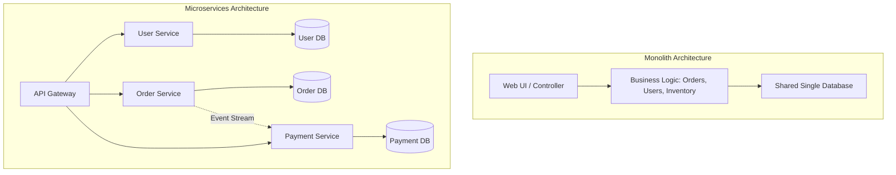

# Microservices Architecture

**Microservices Architecture** คือรูปแบบสถาปัตยกรรมซอฟต์แวร์ที่พัฒนาแอปพลิเคชันโดยแบ่งออกเป็น **"บริการขนาดเล็ก (Services)"** หลายๆ บริการที่ทำงานร่วมกัน โดยแต่ละบริการจะมีความเป็นอิสระต่อกัน (Autonomous), มีขอบเขตการทำงานเฉพาะทาง (Bounded Context), มีฐานข้อมูลเป็นของตัวเอง (Database-per-Service) และสามารถพัฒนา ทดสอบ ตลอดจน Deploy ได้อย่างเป็นเอกเทศโดยไม่ต้องรอส่วนอื่นๆ ของระบบ

แนวคิดนี้ได้รับความนิยมอย่างแพร่หลายในองค์กรขนาดใหญ่ เช่น Netflix, Amazon, Spotify และ Uber เพื่อรองรับการขยายตัวของระบบและทีมพัฒนาขนาดใหญ่

---

## การเปรียบเทียบ Monolith vs Microservices

| ปัจจัยเปรียบเทียบ | Monolithic Architecture | Microservices Architecture |
| :--- | :--- | :--- |
| **โครงสร้างระบบ** | โค้ดทั้งหมดรวมอยู่ใน Codebase เดียว และรันเป็น Process เดียว | แยกออกเป็นหลายๆ Service ที่รันเป็นอิสระต่อกัน |
| **การ Deploy** | ต้อง Deploy ทั้งระบบพร้อมกัน การแก้ไขจุดเล็กๆ อาจเสี่ยงกระทบส่วนอื่น | แต่ละ Service สามารถ Deploy แยกกันได้ตามรอบการทำงาน (Independent Deployment) |
| **ฐานข้อมูล** | ใช้ Database ตัวเดียวกันร่วมกันทุกโมดูล (Shared Database) | แต่ละ Service ดูแล Database ของตัวเอง (Database-per-Service) |
| **ความยืดหยุ่นทางเทคโนโลยี** | ผูกติดกับภาษาและ Stack เดียวกันทั้งระบบ | แต่ละ Service สามารถเลือกใช้ภาษาและฐานข้อมูลที่เหมาะสมที่สุด (Polyglot) |
| **ความซับซ้อน** | โครงสร้างเริ่มต้นเข้าใจง่าย ซับซ้อนน้อยในการดูแลเบื้องต้น | มีความซับซ้อนสูงด้าน Network, Data Consistency, และ Infrastructure |
| **การขยายขนาด (Scaling)** | ต้อง Scale ทั้งก้อน แม้จะมีเพียงโมดูลเดียวที่ใช้งานหนัก | Scale เฉพาะ Service ที่มีปริมาณการเรียกใช้งานสูงได้ |

---

## รูปแบบการออกแบบสำคัญ (Key Patterns)

### 1. API Gateway Pattern
ทำหน้าที่เป็นประตูทางผ่านหลัก (Single Entry Point) สำหรับ Client ทั้งหมด โดยรวมความรับผิดชอบส่วนกลาง เช่น:
- Authentication & Authorization
- Rate Limiting & Throttling
- Request Routing & Load Balancing
- Protocol Translation (เช่น แปลง HTTP/JSON เป็น gRPC ภายใน)

### 2. Database-per-Service Pattern
- แต่ละ Service ต้องเป็นเจ้าของข้อมูลของตนเอง และไม่อนุญาตให้ Service อื่นมาเชื่อมต่อ Query ข้อมูลจาก Database โดยตรง
- การเข้าถึงข้อมูลต้องทำผ่าน API หรือ Event เท่านั้น เพื่อป้องกันปัญหา Tight Coupling ในระดับ Database Schema

### 3. Event-Driven Architecture & Message Broker
- การสื่อสารระหว่าง Service แบบ Asynchronous โดยใช้ Message Broker เช่น Apache Kafka, RabbitMQ, หรือ AWS SQS/SNS
- เมื่อเกิดเหตุการณ์ใน Service หนึ่ง (เช่น `OrderCreated`) จะส่ง Event ออกไป เพื่อให้ Service อื่นๆ (เช่น Inventory, Notification) รับไปประมวลผลต่อโดยไม่ต้องเรียกหากันตรงๆ

### 4. Saga Pattern (การจัดการ Distributed Transactions)
เมื่อไม่สามารถใช้ ACID Transaction แบบดั้งเดิมข้ามหลายๆ ฐานข้อมูลได้ จึงต้องใช้ Saga Pattern ในการจัดการกระบวนการทำงานที่ต่อเนื่องกัน:
- **Choreography-based Saga**: แต่ละ Service รับและส่ง Event ต่อๆ กันเองแบบกระจายศูนย์
- **Orchestration-based Saga**: มี Service ตัวกลาง (Orchestrator) ทำหน้าที่สั่งการขั้นตอนและส่ง Compensating Transaction (คำสั่งยกเลิก/ย้อนกลับ) หากเกิดข้อผิดพลาดระหว่างทาง

### 5. Circuit Breaker Pattern
- ป้องกันปัญหา Cascading Failure (ความล้มเหลวแบบลูกโซ่) เมื่อ Service ปลายทางหยุดทำงานหรือไม่ตอบสนอง
- Circuit Breaker จะตัดวงจรการเชื่อมต่อชั่วคราวและส่ง Fallback Response กลับทันที เพื่อรักษาประสิทธิภาพของระบบโดยรวม

---

## ความท้าทายในการทำ Microservices

1. **Data Consistency**: ต้องยอมรับโมเดลความถูกต้องแบบ **Eventual Consistency** แทนการการันตีข้อมูลแบบเรียลไทม์พร้อมกันทุกจุด
2. **Distributed Tracing & Observability**: เมื่อคำขอของผู้ใช้หนึ่งรายการวิ่งผ่านหลายสิบ Service จำเป็นต้องมีระบบ Tracing ที่ดี เช่น OpenTelemetry, Jaeger, Grafana Tempo เพื่อติดตาม Correlation ID
3. **Network Latency & Reliability**: การเรียกข้ามเครือข่ายมีโอกาสเกิด Timeout และ Delay ได้เสมอ จึงต้องมีการออกแบบ Retry Policy, Idempotency และ Fallback
4. **DevOps & Infrastructure Overhead**: ต้องมีระบบ Containerization (Docker), Orchestration (Kubernetes) และ Automated CI/CD Pipelines ที่แข็งแกร่ง

---

## การเปลี่ยนผ่านจาก Monolith สู่ Microservices

Martin Fowler แนะนำกฎสำคัญคือ **"MonolithFirst"** โดยทั่วไปควรเริ่มต้นจาก Monolith ที่มีโครงสร้างแบบ Modular ให้ชัดเจนก่อน จนกระทั่งทีมหรือสเกลของระบบใหญ่จนเกิดคอขวด แล้วจึงค่อยๆ สกัด (Extract) ออกมาเป็น Microservices

รูปแบบยอดนิยมในการย้ายระบบคือ **Strangler Fig Pattern**:
- ไม่ทุบระบบเดิมทิ้ง (Big Bang Rewrite)
- ค่อยๆ ดึงฟีเจอร์ย่อยหรือฟีเจอร์ใหม่ออกมาทำเป็น Service อิสระทีละส่วน
- วาง API Gateway นำทาง Traffic ไปยัง Service ใหม่ จนกระทั่งระบบเก่าค่อยๆ หายไปในที่สุด

---

## แหล่งข้อมูลอ้างอิงและศึกษาเพิ่มเติม

- หนังสือ **Building Microservices: Designing Fine-Grained Systems** โดย Sam Newman
- หนังสือ **Microservices Patterns: With examples in Java** โดย Chris Richardson
- เว็บไซต์ [Microservices.io](https://microservices.io/) โดย Chris Richardson
- บทความ [Microservices](https://martinfowler.com/articles/microservices.html) โดย Martin Fowler & James Lewis
