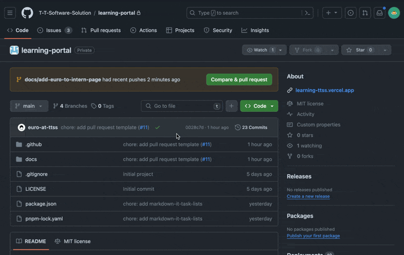

# เริ่มต้นสร้าง Pull Request แรกกัน!

ในบทความนี้ เราจะมาเรียนรู้วิธีการสร้าง Pull Request แรกของเราใน GitHub
โดยเราจะใช้โปรเจกต์ [Thai Programmer Career Paths](https://github.com/ThaiProgrammer/tpa-path) ในการลองสร้าง Pull Request กัน


1. ก่อนอื่นคุณต้องทำการ clone โปรเจกต์นี้มาก่อน โดยใช้คำสั่ง

   ::: code-group

   ```bash [HTTPS]
   git clone https://github.com/ThaiProgrammer/tpa-path.git
   ```

   ```bash [SSH]
   git clone git@github.com:ThaiProgrammer/tpa-path.git
   ```

   :::

2. หลังจาก clone โปรเจกต์เสร็จแล้ว ให้ทำการติดตั้ง dependencies ของโปรเจกต์นี้ โดยใช้คำสั่ง

ติดตั้ง VitePress กันเถอะ

```bash
npm add -D vitepress
```
พร้อมรัน VitePress ล้าวววว

```bash
npm run docs:dev
```

3. ทำการสร้าง branch ใหม่ โดยใช้คำสั่ง

   ```bash
    git checkout -b <branch-name>
   ```

4. ทำการแก้ไขโค้ดตาม issue ที่คุณได้รับมอบหมาย และเมื่อแก้ไขเสร็จแล้ว ให้ทำการ commit โค้ดของคุณ โดยใช้คำสั่ง `git add` และ `git commit` โดยให้เขียน commit message โดยใช้รูปแบบของ [Conventional Commits](https://www.conventionalcommits.org/en/v1.0.0/)

   ```bash
   git add .
   git commit -m "docs: <commit-message>"
   ```

5. ทำการ push branch ของคุณขึ้นไปยัง GitHub โดยใช้คำสั่ง

   ```bash
   git push origin <branch-name>
   ```

6. ทำการสร้าง Pull Request โดยไปที่แท็บ Pull Requests และกดปุ่ม New Pull Request

   

7. กรอกข้อมูลให้ครบถ้วน และกดปุ่ม Create Pull Request

   

8.  รอ Maintainer ทำการ review pull request ของคุณ และเมื่อ review เสร็จแล้ว จะมีการทำการ merge pull request ของคุณไปที่ main branch แต่ระหว่างนี้คุณสามารถลองดู preview เว็บไซต์ที่คุณเพิ่งได้แก้ไขไปได้ด้วยนะ ถ้าสมมติว่าดูแล้วไม่ชอบคุณสามารถ commit มาเพิ่มเติมได้เลย


## จบแล้ว! 🎉

เยี่ยมมาก! คุณได้สร้าง Pull Request แรกของคุณแล้ว ขอบคุณที่มาร่วมเป็นส่วนหนึ่งของ Thai Programmer Career Paths  ครับ

## Credit
ขอบคุณเนื้อหาดีๆจากต้นทางครับ [TTSS Learning Portal - Learn together, succeed together.](https://learning-ttss.vercel.app/portal.html)