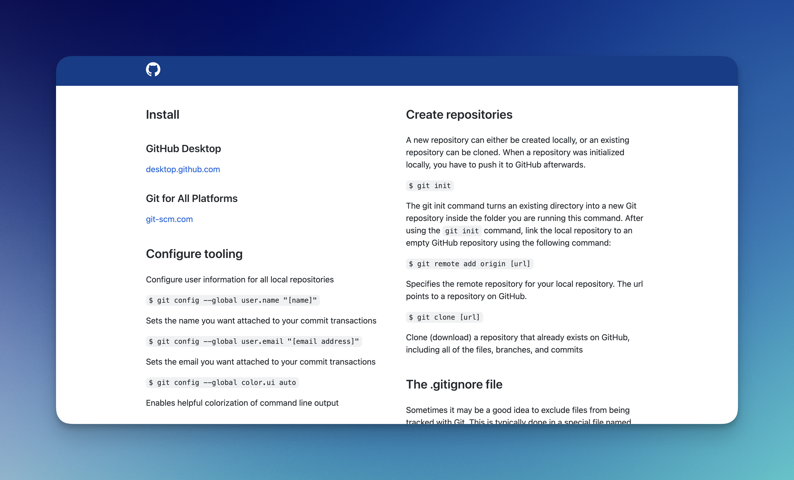
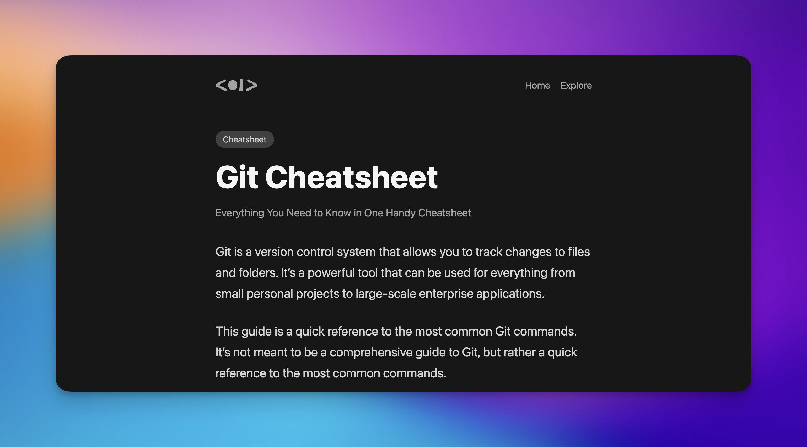
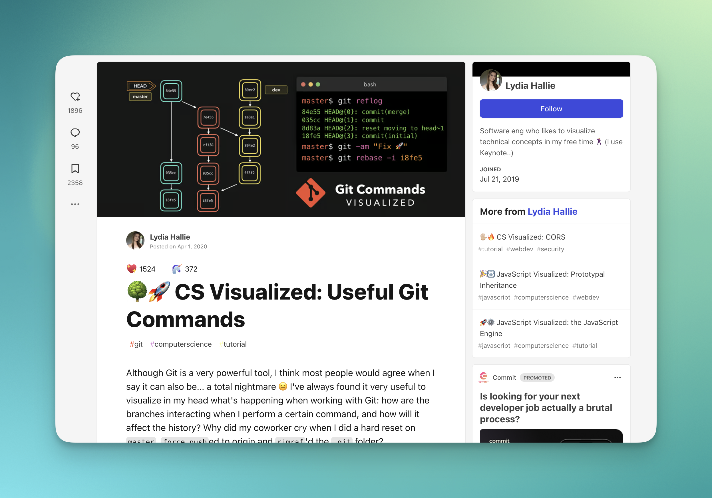
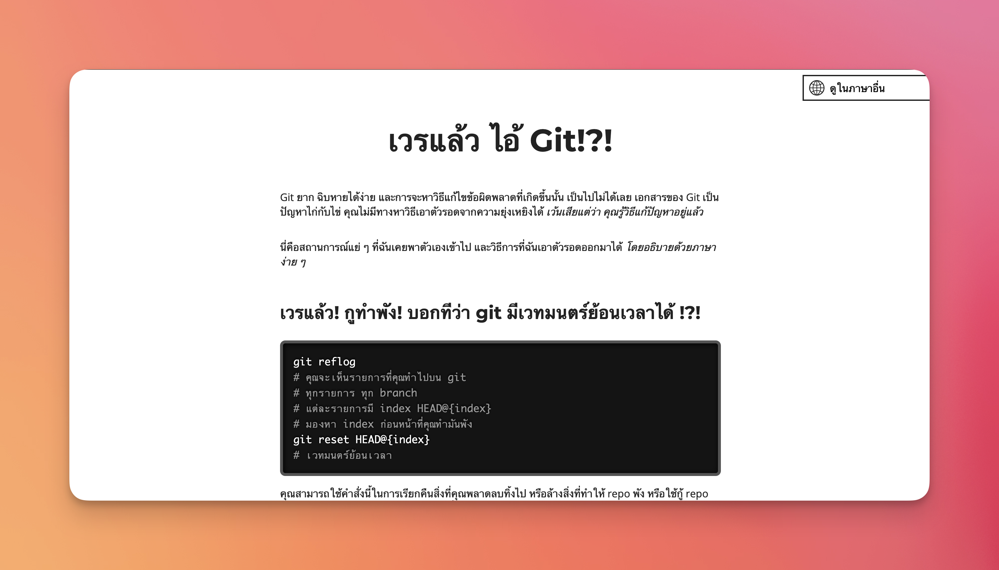

# คำสั่ง Git ที่จำเป็น

> [!WARNING]
> หน้านี้ยังไม่สมบูรณ์ และอาจมีการเพิ่มเติมเนื้อหาเข้ามาในภายหลัง

## Git Cheat Sheet จาก GitHub

GitHub ได้ทำการสร้าง Git Cheat Sheet ขึ้นมา โดยในนั้นมีคำสั่งที่จำเป็นในการใช้งาน Git โดยคุณสามารถเข้าไปดูได้ที่ [Git Cheat Sheet](https://training.github.com/downloads/github-git-cheat-sheet/)

## Git Cheatsheet จาก cs.fyi

ถ้าหากคุณดู Git Cheat Sheet จาก GitHub แล้วยังไม่หนำใจล่ะก็ผมขอแนะนำ Git Cheatsheet จาก [cs.fyi](https://cs.fyi/guide/git-cheatsheet) เลย ในนี้มีคำสั่งที่ advance มากขึ้น รวมถึง tips ในการใช้งาน Git อีกด้วย

## 🌳🚀 CS Visualized: Useful Git Commands

ถ้าคุณชอบการเรียนรู้ผ่านภาพและอยากเรียนรู้เกี่ยวกับ Git ผ่านภาพ ผมขอแนะนำให้ไปดู [CS Visualized: Useful Git Commands](https://dev.to/lydiahallie/cs-visualized-useful-git-commands-37p1) ของ Lydia Hallie ที่เป็นการอธิบายคำสั่ง Git ที่สำคัญ ๆ ผ่านภาพและอธิบายอย่างง่าย ๆ และเข้าใจง่าย

## เวรแล้ว ไอ้ Git!?!

เคยเจอเหตุการณ์ฉุกเฉินตอนใช้งาน Git ไหมครับ
เช่น เผลอ commit ไปแล้ว แต่นึกขึ้นได้ว่าต้องแก้อะไรเพิ่มอีกหน่อย หรือเผลอ commit ไปผิด branch 🤯

ถ้าคุณเคยเจอเหตุการณ์คล้าย ๆ แบบนี้ ผมขอแนะนำเว็บไซต์ [เวรแล้ว ไอ้ Git!?!](https://ohshitgit.com/th) ที่เป็นเว็บไซต์รวมคำสั่งที่คุณน่าจะต้องการใช้ในยามคับขันแบบนั้น และยังมีคำแนะนำเกี่ยวกับวิธีแก้ไขปัญหาที่เกิดขึ้นด้วย

## Credit
ขอบคุณเนื้อหาดีๆจากต้นทางครับ [TTSS Learning Portal - Learn together, succeed together.](https://learning-ttss.vercel.app/portal.html)
