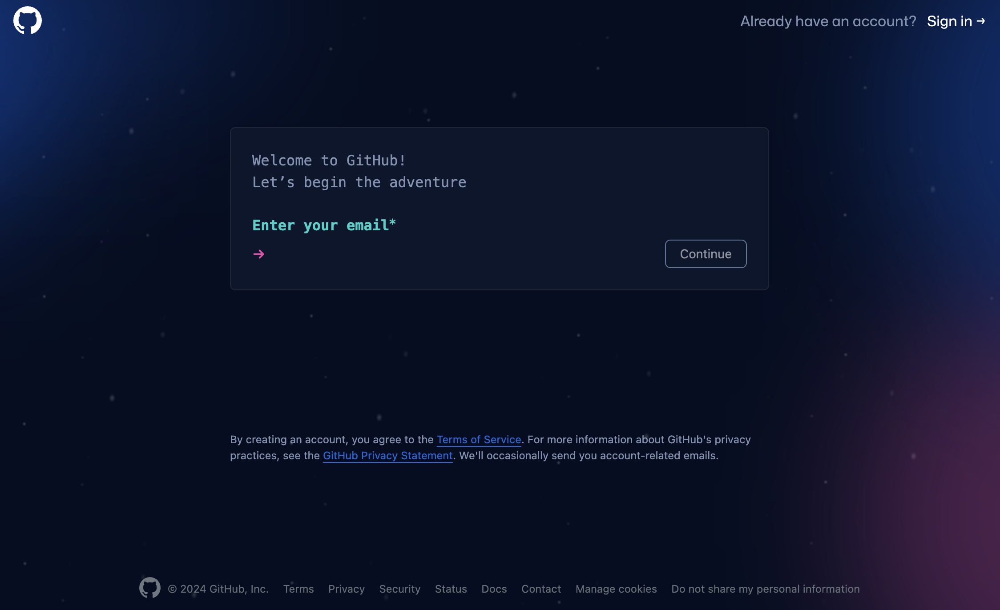
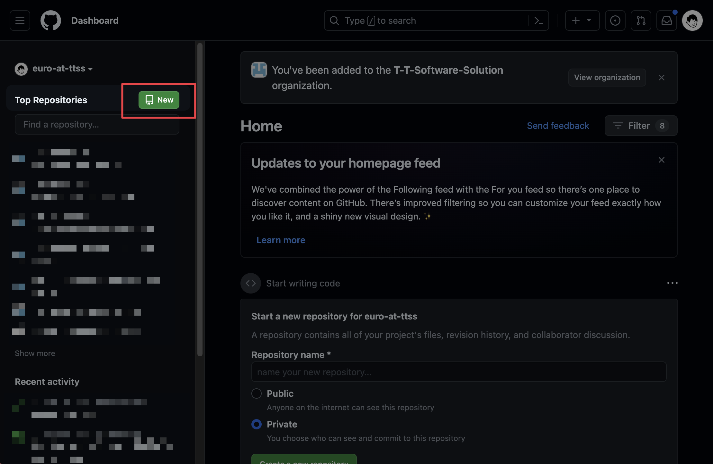
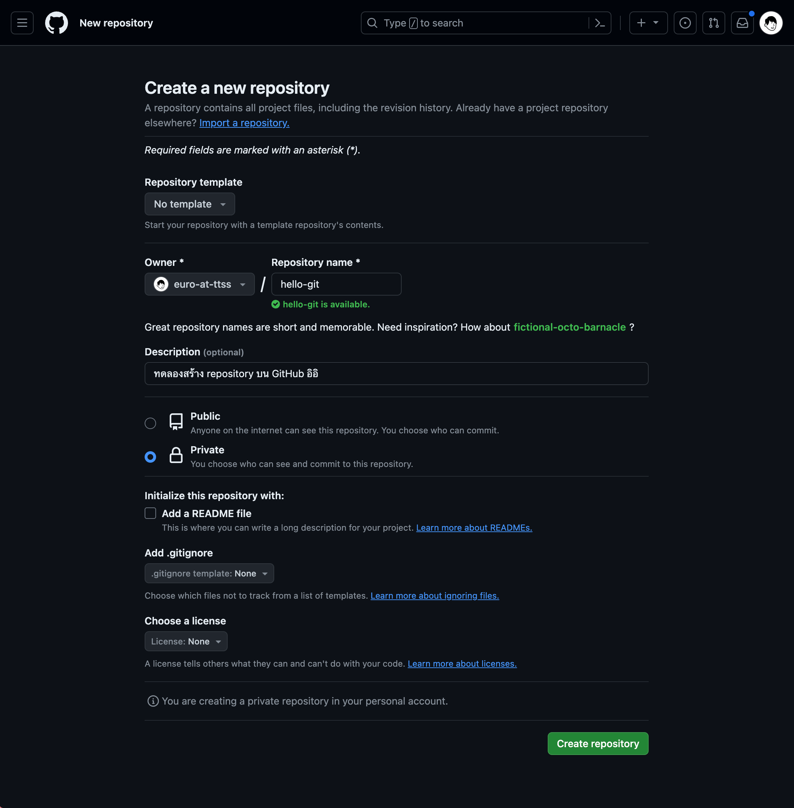
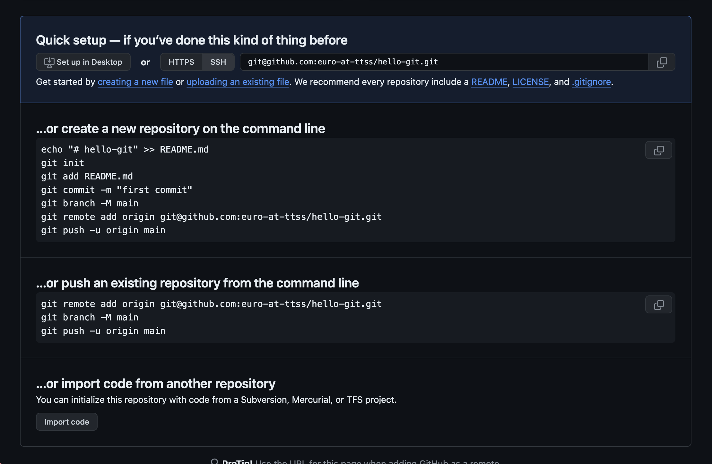
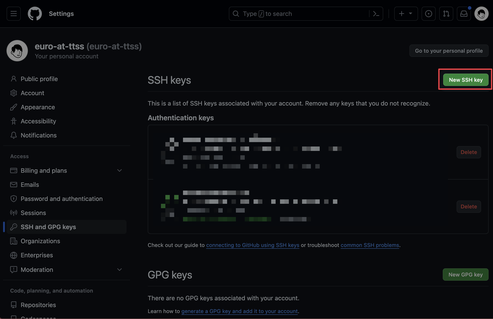
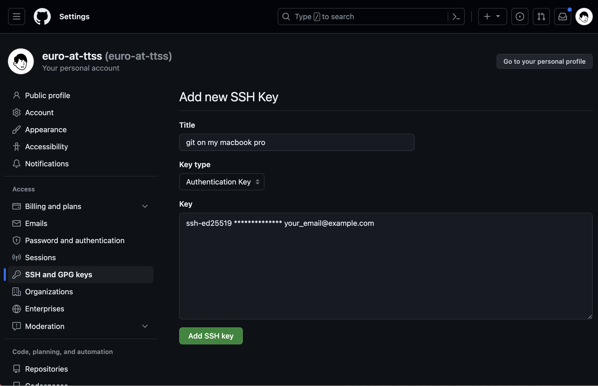
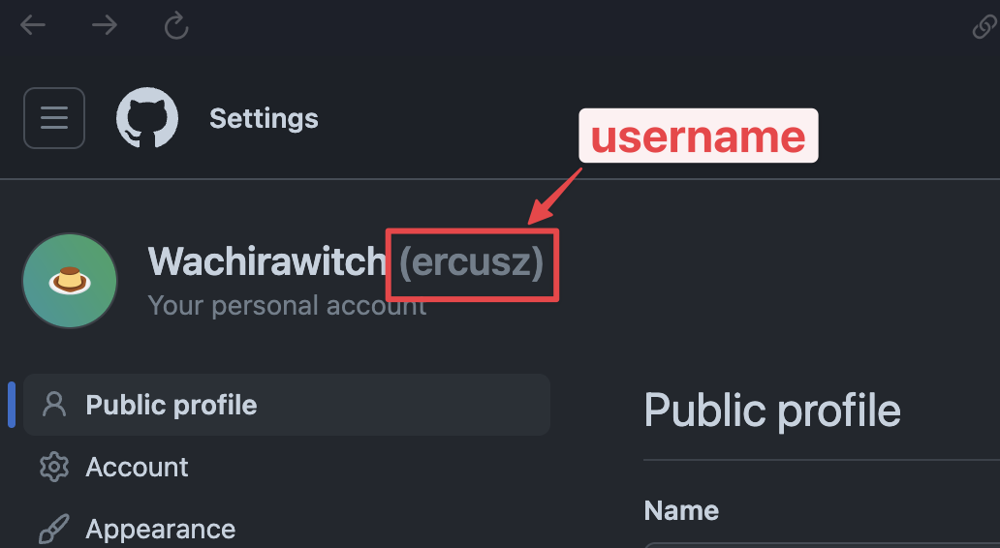
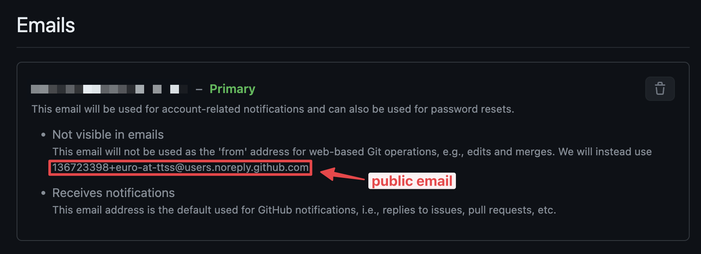
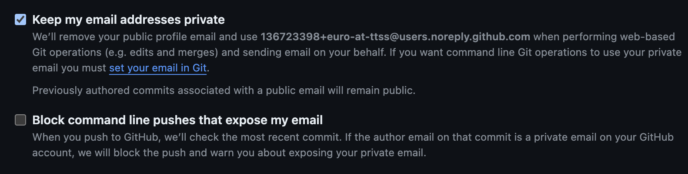

# การ Setup Git และ GitHub ให้พร้อมสำหรับการทำงานร่วมกับทีม

จากในบทความ [Git คืออะไร?](./what-is-git) ที่ผ่านมา เราได้เรียนรู้ว่า Git เป็น Distributed Version Control System ที่ช่วยให้เราสามารถบันทึกการเปลี่ยนแปลงของไฟล์ไว้ตามช่วงเวลาต่าง ๆ ได้ ซึ่งในบทความนั้น เราก็ได้ลองฝึกสร้าง local repository ขึ้นมาแล้ว ทีนี้เราจะมาทำความรู้จักกับ GitHub เครื่องมือที่ช่วยให้เราสามารถทำงานร่วมกันได้ง่ายขึ้นกัน!

## รู้จักกับ GitHub

GitHub เป็นเว็บไซต์ที่ให้บริการ Git Repository Hosting
หรือภาษาบ้าน ๆ คือ เซิร์ฟเวอร์ที่ใช้เก็บ Remote repository ของเราให้เราสามารถเข้าถึงได้จากทุกที่ทุกเวลานั่นเอง

## มาเริ่มต้นใช้งาน GitHub กันเถอะ!

1.  สร้าง Account ใหม่บน GitHub โดยเข้าไปที่ [https://github.com/signup](https://github.com/signup) ได้เลย

    

2.  เมื่อสร้างบัญชีเสร็จแล้ว มาลองสร้าง Repository ใหม่บน GitHub กัน

    - คลิกที่ปุ่ม New ที่ sidebar ด้านซ้ายของเว็บไซต์

      

    - กรอกชื่อ Repository และคำอธิบาย (ถ้ามี) แล้วคลิก Create Repository

      

    - เมื่อสร้างเสร็จแล้ว จะได้ผลลัพธ์แบบนี้

      

    > [!NOTE]
    > เนื่องจากเรามี local repository ชื่อ `hello-git` ที่เคยทำไว้อยู่แล้วในบทความ [Git คืออะไร?](./what-is-git) ที่ผ่านมา ดังนั้นเราจะมาลองทำการเชื่อมต่อ local repository นี้กับ remote repository ใหม่ที่เราสร้างขึ้นใน GitHub กันดูนะครับ

3.  เข้าไปยังไดเรกทอรี local repository ของเรา ในเคสนี้ คือ `hello-git` แล้วเพิ่ม remote repository ของเราที่ GitHub โดยใช้คำสั่ง

    ```bash
    git remote add origin <URL ของ Remote Repository ของเรา>
    # ตัวอย่าง git remote add origin git@github.com:euro-at-ttss/hello-git.git
    ```

    > [!NOTE]
    > ในสมัยก่อน git จะใช้ชื่อ branch หลักเป็นคำว่า `master` แต่ว่า Git เวอร์ชันใหม่ ตั้งแต่เวอร์ชัน 2.28.0 ขึ้นไป จะเปลี่ยนมาใช้เป็นคำว่า `main` แทน
    >
    > ถ้าสังเกตจากรูปข้างบน ในรูป GitHub จะแนะนำให้เราใช้คำสั่ง `git branch -M main` เพื่อเปลี่ยนชื่อ branch หลักจาก `master` เป็น `main` ก่อนที่จะ push ขึ้นไป remote repository
    >
    > ซึ่งบทความนี้ ตอนเขียนผมใช้ Git เวอร์ชัน 2.39.3 และ branch หลักเป็น `main` อยู่แล้ว ดังนั้นไม่จำเป็นต้องใช้คำสั่ง `git branch -M main` อีก

4.  ทำการลอง push การเปลี่ยนแปลงขึ้นไปยัง Remote Repository บน GitHub ด้วยคำสั่ง

    ```bash
    git push -u origin main
    ```

มาถึงจุดนี้ ถ้าคนที่เพิ่ง setup Git มาใหม่ ๆ และทำการใช้งาน Git กับ GitHub ครั้งแรก อาจจะเจอปัญหาเรื่องการ Authenticate กับ GitHub ได้ ซึ่งเราจะมาแก้ปัญหานี้กันครับ ส่วนที่ใครที่ทำได้แล้วก็สามารถข้ามขั้นตอนถัดไปได้เลย

## การ Authenticate กับ GitHub ด้วย SSH Key

การ Authenticate กับ GitHub ด้วย SSH Key จะช่วยให้เราสามารถทำงานกับ GitHub ได้โดยไม่ต้องใช้ Username และ Password ทุกครั้งที่เราทำการ Push หรือ Pull ข้อมูลจาก Remote Repository บน GitHub

### สร้าง SSH Key บนเครื่องของเรา

1.  เปิด Terminal ขึ้นมา

2.  ใช้คำสั่ง `ssh-keygen` เพื่อสร้าง SSH Key บนเครื่องของเรา

    ```bash
    ssh-keygen -t ed25519 -C "your_email@example.com"
    ```

    จะมีข้อความขึ้นมาให้เราเลือกตำแหน่งที่จะเก็บ SSH Key ของเรา ในส่วนนี้จะใช้ path default (`/Users/YOU/.ssh/id_ALGORITHM`) ที่เขาให้มาก็ได้ เราก็แค่กด Enter เฉย ๆ ไม่ต้องพิมพ์อะไร

    ```bash
    > Generating public/private ed25519 key pair.
    > Enter a file in which to save the key (/Users/YOU/.ssh/id_ALGORITHM): [Press enter]
    ```

    จากนั้นจะมีข้อความบอกให้เราใส่ passphrase ถ้าใส่ passphrase แล้วจะเป็นการเพิ่มความปลอดภัยให้กับ SSH Key ของเรา แต่จะไม่ใส่ก็ได้ ถ้าไม่ใส่ก็กด Enter ไปเลย

    ```bash
    > Enter passphrase (empty for no passphrase): [Type a passphrase]
    > Enter same passphrase again: [Type passphrase again]
    ```

3.  เมื่อสร้าง SSH Key เสร็จแล้ว ให้เราทำการเปิดไฟล์ที่ได้จากข้อ 2. ในไฟล์นั้นก็จะมีรหัส SSH Key ของเราอยู่ ซึ่งจะขึ้นต้นด้วย `ssh-ed25519` และจะลงท้ายด้วย email ที่เราใส่ไว้ เช่น

    ```
    ssh-ed25519 ************** your_email@example.com
    ```

### เพิ่ม SSH Key ของเราลงใน GitHub

1.  คัดลอก SSH Key ที่เราสร้างไว้

2.  เข้าไปที่หน้า [SSH and GPG keys](https://github.com/settings/keys) และคลิกที่ปุ่ม New SSH Key

    

3.  ใส่ชื่อ Key และ Paste SSH Key ที่เราคัดลอกมาลงในช่อง Key แล้วคลิก Add SSH Key

    

4.  ถ้าทำถูกต้อง จะมีชื่อ Key ที่เราเพิ่งสร้างถูกเพิ่มเข้ามาในหน้า SSH and GPG keys แล้ว

### ทดสอบการใช้งาน SSH Key กับ GitHub

ก่อนทดสอบ อย่าลืม config email และ username ให้ Git ก่อน โดยจะใช้คำสั่ง

```bash
git config --global user.email "your_email@example.com"
git config --global user.name "your_username"
```

ในส่วนของ username ให้คุณใช้ username ของ GitHub ของคุณ
วิธีการดู username ให้เข้าไปดูที่ profile ตัวเองได้เลย หรือเข้าไปที่ [Settings](https://github.com/settings/profile) แล้วดูตามรูปนี้ได้เลย



และในส่วนของ email ให้ใช้ public email แทนนะครับ ไม่ใช่ email ที่เราใช้สมัคร GitHub นะครับ วิธีการดู public email ของเรา ให้เข้าไปที่ [เมนู Emails](https://github.com/settings/emails) แล้วดูตามรูปนี้ได้เลย



> [!NOTE]
> ใน GitHub ถ้าคุณไม่ได้เลือกเปิดใช้งาน Keep my email addresses private ไว้ คุณก็ไม่จำเป็นต้องใช้ public email ก็ได้ คุณสามารถใช้ email จริงได้เลย แต่โดยส่วนตัวแล้ว ผมชอบใช้เป็น public email มากกว่าครับ
> 
>
> _แต่ถ้าคุณเลือกเปิดใช้งาน Block command line pushes that expose my email คุณจะไม่สามารถใช้ email จริงของคุณในการ push โค้ดได้ คุณจะถูกบังคับให้ต้องใช้ public email เท่านั้น_
>
> สามารถตั้งค่าได้ที่ [เมนู Emails](https://github.com/settings/emails)

เมื่อ config เสร็จแล้ว มาลองทำการ Push การเปลี่ยนแปลงขึ้นไปยัง Remote Repository บน GitHub อีกครั้งกัน โดยใช้คำสั่ง

```bash
git push -u origin main
```

ถ้าทำได้สำเร็จ แสดงว่าเราสามารถ Authenticate กับ GitHub ด้วย SSH Key ได้สำเร็จแล้ว

จากนั้นลองไปดู repo ของเราบน GitHub ได้เลยว่ามีการเปลี่ยนแปลงอะไรเกิดขึ้นบ้าง

## สรุป

ในบทความนี้ เราสามารถ setup เครื่องของเราให้พร้อมทำงานร่วมกับทีมโดยใช้ Git และ GitHub ได้แล้ว เดี๋ยวในบทความ [เริ่มต้นสร้าง Pull Request แรกกัน!](./create-first-pull-request) ผมจะพาคุณไปทำความรู้จักกับวิธีทำงานร่วมทีมว่าจะมีขั้นตอนอะไรบ้าง เช่น การ clone โปรเจกต์, การสร้าง Pull Request และอื่น ๆ แต่ก่อนจะไปถึงบทความนั้นก็มีบทความที่น่าสนใจที่คุณควรจะต้องรู้ก่อนนะครับ [ไปอ่านต่อกันเลย!](./git-essential-commands)

## Credit
ขอบคุณเนื้อหาดีๆจากต้นทางครับ [TTSS Learning Portal - Learn together, succeed together.](https://learning-ttss.vercel.app/portal.html)