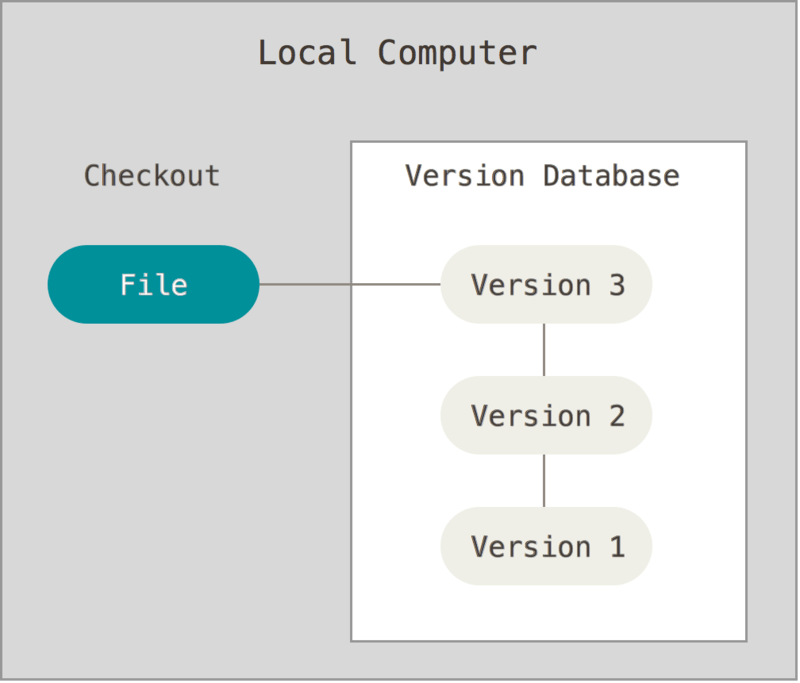
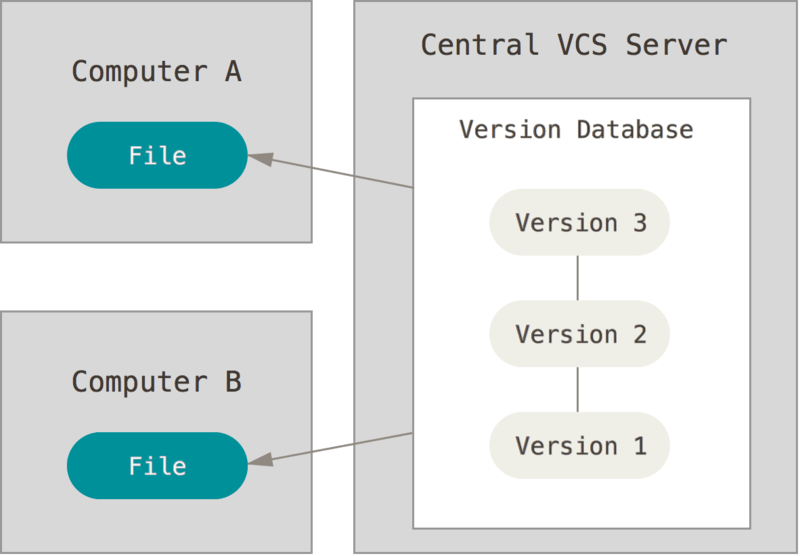
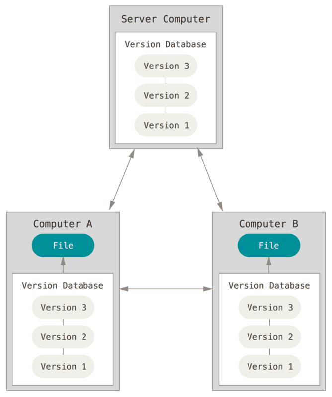

# Version Control คืออะไร?

Version Control คือ ระบบที่บันทึกการเปลี่ยนแปลงของไฟล์ตามช่วงเวลาต่าง ๆ ที่ช่วยให้เราสามารถย้อนกลับไปดูข้อมูลก่อนหน้าและเปรียบเทียบการเปลี่ยนแปลงระหว่างเวอร์ชันต่าง ๆ ของไฟล์ได้

## ทำไม Version Control ถึงสำคัญ?

ผมจะมี checklist ที่ช่วยให้คุณเข้าใจว่าทำไม Version Control ถึงสำคัญ และทำไมคุณควรใช้มัน ลองอ่านแล้วคิดตามดูนะครับ

<input type="checkbox" /> คุณเคยแก้ไขโค้ดไปเรื่อย ๆ จนโปรแกรมทำงานผิดพลาด แล้วไม่สามารถกด undo (
<kbd>ctrl/cmd</kbd> + <kbd>z</kbd>
) เพื่อย้อนกลับไปที่เวอร์ชันก่อนหน้าได้ไหม

<input type="checkbox" /> คุณเคยทำงานร่วมกับคนอื่น ๆ แล้วเกิดปัญหาเรื่องโค้ดที่คุณเขียนไปมันดันไปทับซ้อนกับโค้ดที่คนอื่นเขียนไปไหม

<input type="checkbox" /> คุณเคยเผลอลบไฟล์ผิดไป แล้วไม่สามารถกู้คืนได้ไหม

<input type="checkbox" /> ตอนที่คุณทำงานกับเพื่อนร่วมงาน คุณเคยสงสัยไหมว่าใครเป็นคนเพิ่ม bug ลงไปในโปรแกรมของพวกคุณ

จาก checklist ข้างต้น ถ้าคุณตอบว่า **"ใช่"** กับข้อใดข้อหนึ่ง หรือทั้งหมด **_โปรดจงรู้ไว้ว่าคุณควรใช้ Version Control System (VCS) ได้แล้ว!_**
เพราะการใช้ VCS จะช่วยให้คุณสามารถแก้ไขหรือลดปัญหาเหล่านี้ได้อย่างมีประสิทธิภาพนั่นเอง

## แล้ว VCS มีกี่ประเภทล่ะ?

### Local Version Control Systems

- เก็บประวัติการเปลี่ยนแปลงของไฟล์ไว้บน local machine เท่านั้น
- ไม่สามารถแชร์หรือทำงานร่วมกับผู้อื่นได้
- ยกตัวอย่าง เช่น [RCS](https://www.gnu.org/software/rcs/)

> Local version control diagram by [Git](https://git-scm.com/book/en/v2/Getting-Started-About-Version-Control)

### Centralized Version Control Systems

- มีเซิร์ฟเวอร์กลางสำหรับเก็บประวัติการเปลี่ยนแปลงไฟล์ และมีการควบคุมการเข้าถึง
- ผู้ใช้ต้องเชื่อมต่อกับเซิร์ฟเวอร์กลางเสมอเพื่อส่งหรือรับไฟล์
- หากเซิร์ฟเวอร์กลางล่ม ผู้ใช้จะไม่สามารถทำงานต่อได้
- ยกตัวอย่าง เช่น [CVS](https://savannah.nongnu.org/projects/cvs), [Subversion](https://subversion.apache.org/)

> Centralized version control diagram by [Git](https://git-scm.com/book/en/v2/Getting-Started-About-Version-Control)

### Distributed Version Control Systems

- ไม่จำเป็นต้องมีเซิร์ฟเวอร์กลาง เพราะทุกคนมี mirror ของ repo เก็บไว้ใน local machine อยู่แล้ว
- สามารถทำงานแบบ offline ได้และยังคงมีประวัติการเปลี่ยนแปลงไฟล์ทั้งหมด
- หากเซิร์ฟเวอร์ล่ม ทุกคนก็ยังสามารถทำงานต่อไปได้ และถ้าเซิร์ฟเวอร์กลับมาทำงานได้แล้ว ทุกคนก็สามารถ sync ข้อมูลกลับไปได้ โดยไม่ต้องกังวลว่าข้อมูลจะสูญหาย
- ยกตัวอย่าง เช่น [Git](https://git-scm.com/)⭐️, [Mercurial](https://www.mercurial-scm.org/)

> Distributed version control diagram by [Git](https://git-scm.com/book/en/v2/Getting-Started-About-Version-Control)

## อ่านเพิ่มเติม

- [Git Basics - What is Version Control?](https://git-scm.com/book/en/v2/Getting-Started-About-Version-Control)

## Credit
ขอบคุณเนื้อหาดีๆจากต้นทางครับ [TTSS Learning Portal - Learn together, succeed together.](https://learning-ttss.vercel.app/portal.html)
