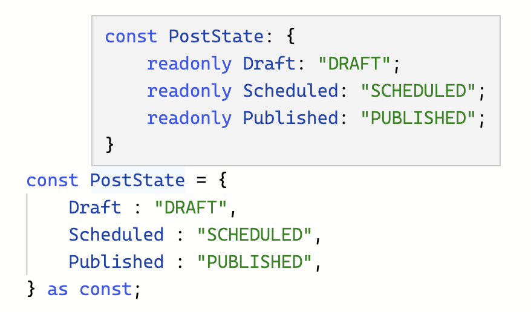

# Enum

ถ้าเราใช้งาน enum เราไม่สามารถ assign string ตรงๆ ไปได้ เช่น เราไม่สามารถใส่ `DRAFT` ลงไปใน `PostState` ได้

```typescript
enum PostState {
    Draft = "DRAFT",
    Scheduled = "SCHEDULED",
    Published = "PUBLISHED",
}

const state1: PostState = PostState.Draft;
const state2: PostState = "IDEA";    // ❌ Error: Type '"IDEA"' is not assignable to type 'PostState'
const state3: PostState = "DRAFT";   // ❌ Error: Type '"DRAFT"' is not assignable to type 'PostState'.
```

บางทีเราสามารถใช้ `as` เพื่อ casting type ได้ แต่มันก็ไม่เกิดประโยชน์เท่าไหร่ เพราะความสามารถในการเช็ค Type หายไป

```typescript
const state2: PostState = "IDEA" as PostState.Draft;   // ตรงนี้มันควรจะ Error ใช่มั้ย
const state3: PostState = "DRAFT" as PostState.Draft;  
```

ปัญหาอีกอย่าง ถ้าเราใช้ `enum` อยู่ใน Library แล้วเราไม่สามารถส่ง string `"DRAFT"` ที่มีใน `enum PostState` ได้เลย
เราอาจจะต้อง import enum เข้ามาใช้งาน และถ้าเป็นภาษา JS ละ ??

## เราสามารถใช้ const object แทน enum ใน TypeScript ได้

```typescript
const PostState = {
    Draft : "DRAFT",
    Scheduled : "SCHEDULED",
    Published : "PUBLISHED",
} as const;
```

เมื่อเราใช้ `as const` แต่ละ property ของ object จะเป็น `readonly` ทันที



เราสามารถทำ Type Alias เพื่อมา check type ของ `PostState` ได้

```typescript
type PostStateType = PostState; // ❌ Error เราไม่สามารถเอา js variable มาเป็น type ได้
type PostStateType = typeof PostState; //เราสามารถใช้ `typeof` เพื่อเอา type ของ js variable มาได้แทน
```

แบบนี้เราจะได้ Key ของ object `PostState`

```typescript
type PostStateType = keyof typeof PostState;
// type PostStateType = "Draft" | "Scheduled" | "Published"
```

แบบนี้เราจะได้ Value ของ object `PostState` พอเป็นแบบนี้เราก็เอามา check type ได้แล้ว

```typescript
type PostStateType = typeof PostState[keyof typeof PostState];
// type PostStateType = "DRAFT" | "SCHEDULED" | "PUBLISHED"
```

## เรามาดูตัวอย่างแบบเต็มๆ กันดีกว่า

```typescript
const PostState = {
    Draft : "DRAFT",
    Scheduled : "SCHEDULED",
    Published : "PUBLISHED",
} as const;

type PostStateType = typeof PostState[keyof typeof PostState];
// type PostStateType = "DRAFT" | "SCHEDULED" | "PUBLISHED"

const state1: PostStateType = PostState.Draft;  // อันนี้ เราสามารใช้งานได้เหมือน enum เลย
const state2: PostStateType = "IDEA";           // อันนี้ ❌ Error: Type '"IDEA"' is not assignable to type 'PostStateType'
const state3: PostStateType = "DRAFT";          // เย้ๆ เราสามารถ passing string ที่ match กับ value ใน PostState ได้แล้ว
```

ขอบคุณตัวอย่างจากคุณ Andrew Burgess [How to use TypeScript Enums and why not to, maybe](https://www.youtube.com/watch?v=pWPClHdcvVg)

## ทำ Type Utility ใช้งานเอง

```typescript
// Type Utility
type Enum<T> = T[keyof T];

type PostStateType = Enum<typeof PostState>;
```


## อ่านเพิ่มน้าาา
- https://shaky.sh/ts-bit-flags/
- [Number Enums as flags](https://basarat.gitbook.io/typescript/type-system/enums#number-enums-as-flags)