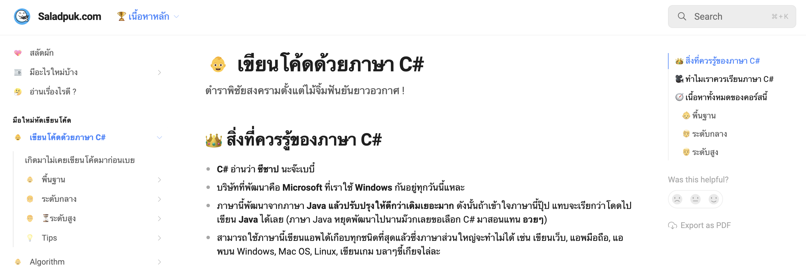
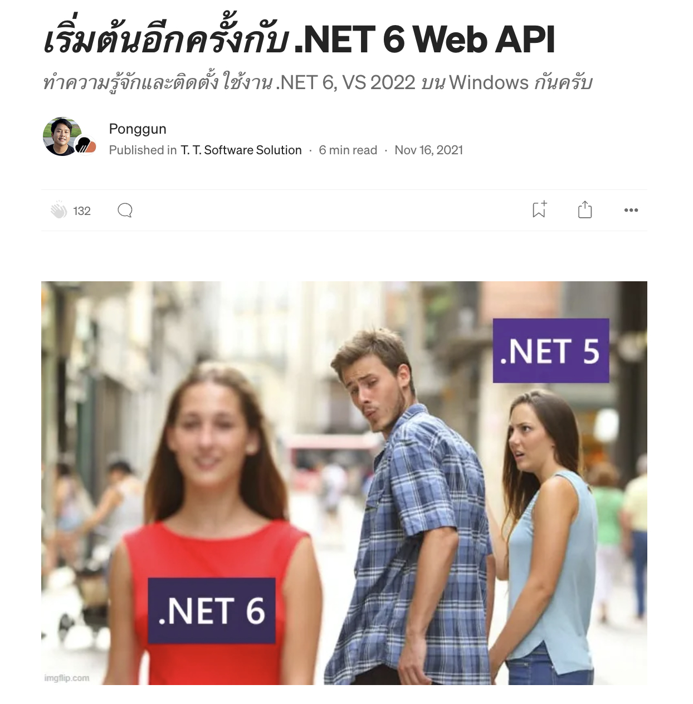

# ASP.NET
ASP.NET คือเฟรมเวิร์คสำหรับการพัฒนาเว็บแอปพลิเคชันที่พัฒนาโดย Microsoft ทำงานบนแพลตฟอร์ม .NET ASP.NET ช่วยให้การสร้างเว็บแอปพลิเคชันที่มีความซับซ้อนและมีประสิทธิภาพเป็นไปได้อย่างง่ายดาย โดยมีฟีเจอร์ต่าง ๆ ที่รองรับการพัฒนาทั้งฝั่งเซิร์ฟเวอร์และฝั่งไคลเอ็นต์

## คุณสมบัติหลักของ ASP.NET

### 1. MVC (Model-View-Controller)
ASP.NET MVC เป็นสถาปัตยกรรมที่ช่วยในการแยกส่วนของแอปพลิเคชันออกเป็น 3 ส่วนหลัก คือ Model, View และ Controller ทำให้การพัฒนาและการทดสอบมีความง่ายดายและมีโครงสร้างที่ชัดเจน

### 2. Web API
ASP.NET ช่วยให้การสร้าง RESTful API สำหรับการสื่อสารระหว่างไคลเอ็นต์และเซิร์ฟเวอร์เป็นไปได้อย่างง่ายดาย โดยใช้ ASP.NET Web API

### 3. Razor Pages
Razor Pages เป็นรูปแบบการพัฒนาแบบใหม่ที่เพิ่มเข้ามาใน ASP.NET Core ซึ่งช่วยให้การพัฒนาเว็บแอปพลิเคชันที่มีความง่ายดายและเน้นการใช้งานแบบหน้าเดียว (single-page application)

### 4. SignalR
SignalR เป็นไลบรารีที่ช่วยให้การสร้างการสื่อสารแบบเรียลไทม์ระหว่างเซิร์ฟเวอร์และไคลเอ็นต์เป็นไปได้อย่างง่ายดาย

### 5. Dependency Injection
ASP.NET Core มีการสนับสนุน Dependency Injection ในตัว ทำให้การจัดการการพึ่งพาของส่วนต่าง ๆ ในแอปพลิเคชันเป็นไปได้อย่างง่ายดายและมีความยืดหยุ่น

### 6. Cross-Platform
ASP.NET Core สามารถทำงานได้บนหลายแพลตฟอร์ม เช่น Windows, macOS, และ Linux

## การเริ่มต้นใช้งาน ASP.NET Core

### 1. การติดตั้ง .NET SDK

สามารถดาวน์โหลดและติดตั้ง .NET SDK ได้จาก [Microsoft .NET Download](https://dotnet.microsoft.com/download)

### 2. การสร้างโปรเจค ASP.NET Core ใหม่

ใช้คำสั่ง `dotnet new` เพื่อสร้างโปรเจคใหม่

```bash
dotnet new mvc -o MyWebApp
cd MyWebApp
dotnet run
```

### 3. โครงสร้างโปรเจค

```plaintext
MyWebApp/
├── Controllers/
│   └── HomeController.cs
├── Models/
├── Views/
│   ├── Home/
│   │   └── Index.cshtml
│   ├── Shared/
│   │   └── _Layout.cshtml
├── wwwroot/
├── appsettings.json
├── Program.cs
├── Startup.cs
├── MyWebApp.csproj
```

### 4. การสร้าง Controller

Controller เป็นส่วนที่รับผิดชอบในการจัดการการร้องขอจากผู้ใช้และส่งข้อมูลไปยัง View

```csharp
using Microsoft.AspNetCore.Mvc;

namespace MyWebApp.Controllers
{
    public class HomeController : Controller
    {
        public IActionResult Index()
        {
            return View();
        }

        public IActionResult About()
        {
            ViewData["Message"] = "Your application description page.";
            return View();
        }

        public IActionResult Contact()
        {
            ViewData["Message"] = "Your contact page.";
            return View();
        }
    }
}
```

### 5. การสร้าง View

View เป็นส่วนที่ใช้แสดงผลข้อมูลที่ได้รับจาก Controller

#### สร้างไฟล์ `Views/Home/Index.cshtml`

```html
@{
    ViewData["Title"] = "Home Page";
}

<div class="text-center">
    <h1 class="display-4">Welcome</h1>
    <p>Learn about <a href="https://docs.microsoft.com/aspnet/core">building Web apps with ASP.NET Core</a>.</p>
</div>
```

### 6. การตั้งค่า Routing

การตั้งค่า Routing ใน ASP.NET Core สามารถทำได้ในไฟล์ `Startup.cs`

```csharp
using Microsoft.AspNetCore.Builder;
using Microsoft.AspNetCore.Hosting;
using Microsoft.Extensions.Configuration;
using Microsoft.Extensions.DependencyInjection;
using Microsoft.Extensions.Hosting;

namespace MyWebApp
{
    public class Startup
    {
        public Startup(IConfiguration configuration)
        {
            Configuration = configuration;
        }

        public IConfiguration Configuration { get; }

        public void ConfigureServices(IServiceCollection services)
        {
            services.AddControllersWithViews();
        }

        public void Configure(IApplicationBuilder app, IWebHostEnvironment env)
        {
            if (env.IsDevelopment())
            {
                app.UseDeveloperExceptionPage();
            }
            else
            {
                app.UseExceptionHandler("/Home/Error");
                app.UseHsts();
            }

            app.UseHttpsRedirection();
            app.UseStaticFiles();

            app.UseRouting();

            app.UseAuthorization();

            app.UseEndpoints(endpoints =>
            {
                endpoints.MapControllerRoute(
                    name: "default",
                    pattern: "{controller=Home}/{action=Index}/{id?}");
            });
        }
    }
}
```

### 7. การใช้ Entity Framework Core สำหรับการเข้าถึงฐานข้อมูล

Entity Framework Core (EF Core) เป็น ORM (Object-Relational Mapping) ที่ช่วยให้การทำงานกับฐานข้อมูลใน .NET เป็นไปได้อย่างง่ายดาย

#### การติดตั้งแพ็กเกจ EF Core

```bash
dotnet add package Microsoft.EntityFrameworkCore.SqlServer
dotnet add package Microsoft.EntityFrameworkCore.Tools
```

#### การสร้าง DbContext และ Model

```csharp
using Microsoft.EntityFrameworkCore;

namespace MyWebApp.Models
{
    public class ApplicationDbContext : DbContext
    {
        public ApplicationDbContext(DbContextOptions<ApplicationDbContext> options)
            : base(options)
        {
        }

        public DbSet<Product> Products { get; set; }
    }

    public class Product
    {
        public int Id { get; set; }
        public string Name { get; set; }
        public decimal Price { get; set; }
    }
}
```

#### การตั้งค่า EF Core ใน `Startup.cs`

```csharp
using Microsoft.EntityFrameworkCore;
using MyWebApp.Models;

public void ConfigureServices(IServiceCollection services)
{
    services.AddControllersWithViews();

    services.AddDbContext<ApplicationDbContext>(options =>
        options.UseSqlServer(Configuration.GetConnectionString("DefaultConnection")));
}
```

#### การตั้งค่า Connection String ใน `appsettings.json`

```json
{
  "ConnectionStrings": {
    "DefaultConnection": "Server=(localdb)\\mssqllocaldb;Database=MyWebAppDB;Trusted_Connection=True;MultipleActiveResultSets=true"
  },
  ...
}
```

ASP.NET Core เป็นเฟรมเวิร์คที่ทรงพลังและยืดหยุ่นสำหรับการพัฒนาเว็บแอปพลิเคชันที่มีประสิทธิภาพและสามารถขยายตัวได้ดี การรวมการใช้งานของ MVC, Web API, Razor Pages และฟีเจอร์ต่าง ๆ ของ .NET ช่วยให้การพัฒนาเว็บแอปพลิเคชันเป็นไปได้อย่างราบรื่นและมีประสิทธิภาพ

## แนะนำคอร์สเรียน

**เรียนพื้นฐานภาษา C#**

[Saladpuk.com](https://www.saladpuk.com/beginner-1/csharp101)



หลังจากนั้นมาทำลองหัดเขียน ASP.NET Web API กันนะครับ

[เริ่มต้นอีกครั้งกับ .NET 6 Web API](https://medium.com/t-t-software-solution/%E0%B9%80%E0%B8%A3%E0%B8%B4%E0%B9%88%E0%B8%A1%E0%B8%95%E0%B9%89%E0%B8%99%E0%B8%AD%E0%B8%B5%E0%B8%81%E0%B8%84%E0%B8%A3%E0%B8%B1%E0%B9%89%E0%B8%87%E0%B8%81%E0%B8%B1%E0%B8%9A-net-6-web-api-7bd33ce2c28f?source=post_page-----bc61325951d4--------------------------------)



หลังจากนั้นมาลองหัดเขียน Clean Architecture กันครับ

[Clean architecture from scratch with .NET7](https://medium.com/t-t-software-solution/clean-architecture-from-scratch-with-net7-187f18b6accd?source=post_page-----bc61325951d4--------------------------------)

**Part#1**

<iframe width="560" height="315" src="https://www.youtube.com/embed/s5CqkV4VOwo?si=949SiiLPwnP0Piov" title="YouTube video player" frameborder="0" allow="accelerometer; autoplay; clipboard-write; encrypted-media; gyroscope; picture-in-picture; web-share" referrerpolicy="strict-origin-when-cross-origin" allowfullscreen></iframe>

**Part#2**

<iframe width="560" height="315" src="https://www.youtube.com/embed/CTfW86Nz5OY?si=I7Hk4HxpLXQ9g8Ri" title="YouTube video player" frameborder="0" allow="accelerometer; autoplay; clipboard-write; encrypted-media; gyroscope; picture-in-picture; web-share" referrerpolicy="strict-origin-when-cross-origin" allowfullscreen></iframe>

## **Bonus Track**

แนะนำ Beginner Playlist สำหรับท่านใดที่สนใจพัฒนาโปรแกรมด้วย .NET Technology จาก Microsoft นะครับ เรียนกันช่วงปิดปีใหม่สะดวกเลย เนื้อหาครอบคลุมทั้ง AI, IoT, Cloud, Desktop App, Mobile App, Web App

- [#1: ทำความรู้จักกับ .NET กันก่อน](https://www.youtube.com/playlist?list=PLdo4fOcmZ0oUwBEC2bnwPtHqbU8Vmh_tj)
- [#2: เลือก Tool VS Code](https://www.youtube.com/watch?v=tFCZw-wZVtg&list=PLdo4fOcmZ0oWUrumb503vY3v6O3u3P4rW)
- [#3: หรือเลือก Tool VS Studio](https://www.youtube.com/playlist?list=PLdo4fOcmZ0oUkJJEM_FagLkvwPQHsQ5xL)
- [#4: หัดเขียนโปรแกรมด้วยภาษา C# ที่](https://www.youtube.com/playlist?list=PLdo4fOcmZ0oULFjxrOagaERVAMbmG20Xe)
- [#5: ศึกษา NuGet Package](https://www.youtube.com/playlist?list=PLdo4fOcmZ0oV79rO05Nb8W9dbOn6jRQoo)
- [#6: ศึกษา .NET MAUI เพื่อพัฒนา Desktop App](https://www.youtube.com/playlist?list=PLdo4fOcmZ0oUBAdL2NwBpDs32zwGqb9DY)
- [#7: Generative AI with .NET for Beginners](https://www.youtube.com/playlist?list=PLdo4fOcmZ0oW_k4_eDTPWDLUVWz7A9y0M)
- [#8: .NET IoT for Beginners](https://www.youtube.com/playlist?list=PLdo4fOcmZ0oWG4G6NxHV2yGEb42vQaFNc)
- [#9: Entity Framework Core for Beginners](https://www.youtube.com/playlist?list=PLdo4fOcmZ0oXCPdC3fTFA3Z79-eVH3K-s)
- [#10: Web APIs for Beginners](https://www.youtube.com/playlist?list=PLdo4fOcmZ0oVjOKgzsWqdFVvzGL2_d72v)
- [#11: ASP.NET Core for Beginners](https://www.youtube.com/playlist?list=PLdo4fOcmZ0oW8nviYduHq7bmKode-p8Wy)
- [#12: .NET on Azure for Beginners](https://www.youtube.com/playlist?list=PLdo4fOcmZ0oVSBX3Lde8owu6dSgZLIXfu)
- [#13: Upgrade Applications with .NET Modernization for Beginners](https://www.youtube.com/playlist?list=PLdo4fOcmZ0oWhjOqruRP3xQWOreCBjeyy)

**Awesome .NET**

- [C# Tutorial for Beginners 2024- Teddy Smith](https://www.youtube.com/playlist?list=PL82C6-O4XrHcblXkHA4dLcnb_ipVkKHch)
- [ASP.NET Web API .NET 8 Tutorial 2024 — Teddy Smith](https://youtube.com/playlist?list=PL82C6-O4XrHfrGOCPmKmwTO7M0avXyQKc&si=dNR0-Es7r0RE5GC6)
- [ASP.NET Core Identity JWT 2024](https://youtube.com/playlist?list=PL82C6-O4XrHcjpGzpxAVqumv2PaYGIJfz&si=2UneRqUoJaWAhg3e)
- [React Typescript + .NET Core Finance Project](https://youtube.com/playlist?list=PL82C6-O4XrHcNJd4ejg8pX5fZaIDZmXyn&si=DXLMWAgrhPDRfZ_M)