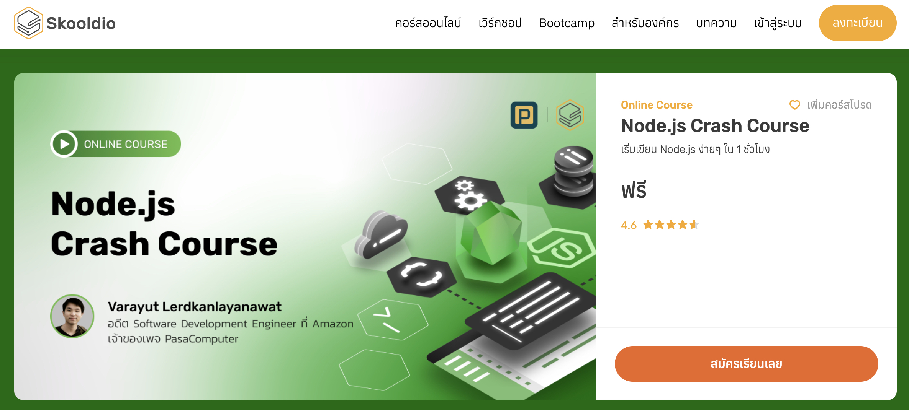

# Node.js

Node.js เป็นแพลตฟอร์มการพัฒนาแอปพลิเคชันฝั่งเซิร์ฟเวอร์ที่สร้างขึ้นบนเอนจิน JavaScript ของ Chrome (V8 engine) Node.js ช่วยให้สามารถใช้ JavaScript ในการเขียนโค้ดที่ทำงานบนเซิร์ฟเวอร์ได้ ทำให้สามารถใช้ภาษาเดียวกัน (JavaScript) ทั้งในฝั่งไคลเอนต์และฝั่งเซิร์ฟเวอร์

## คุณสมบัติเด่นของ Node.js

### 1. Event-Driven และ Non-Blocking I/O
Node.js ใช้การทำงานแบบ Event-Driven และ Non-Blocking I/O ซึ่งช่วยให้สามารถจัดการกับคำขอจำนวนมากในเวลาเดียวกันได้อย่างมีประสิทธิภาพ โดยไม่ต้องรอให้คำขอหนึ่งเสร็จสิ้นก่อนที่จะเริ่มคำขอถัดไป

### 2. Single Programming Language
นักพัฒนาสามารถใช้ JavaScript ในการเขียนโค้ดทั้งฝั่งไคลเอนต์และฝั่งเซิร์ฟเวอร์ ทำให้การพัฒนาซอฟต์แวร์มีความสม่ำเสมอและง่ายต่อการเรียนรู้

### 3. Rich Ecosystem
Node.js มีระบบการจัดการแพ็กเกจที่ชื่อว่า npm (Node Package Manager) ซึ่งมีแพ็กเกจและไลบรารีมากมายให้เลือกใช้ ทำให้การพัฒนาและขยายโปรเจคเป็นไปได้อย่างง่ายดาย

### 4. Scalability
Node.js ถูกออกแบบมาให้สามารถรองรับการทำงานที่มีขนาดใหญ่และมีการขยายตัวได้ง่าย สามารถเพิ่มจำนวนเซิร์ฟเวอร์หรือกระบวนการเพื่อรองรับโหลดที่เพิ่มขึ้นได้อย่างมีประสิทธิภาพ

## การเริ่มต้นใช้งาน Node.js

### 1. การติดตั้ง Node.js

สามารถดาวน์โหลดและติดตั้ง Node.js ได้จาก [Node.js official website](https://nodejs.org/)

### 2. สร้างโปรเจค Node.js แรก

#### สร้างไฟล์ `app.js`

```javascript
const http = require('http');

// สร้างเซิร์ฟเวอร์
const server = http.createServer((req, res) => {
    res.statusCode = 200;
    res.setHeader('Content-Type', 'text/plain');
    res.end('Hello, World!\n');
});

// กำหนดพอร์ตและเริ่มเซิร์ฟเวอร์
const port = 3000;
server.listen(port, () => {
    console.log(`Server running at http://localhost:${port}/`);
});
```

#### รันโปรเจค

```bash
node app.js
```

### 3. การใช้ npm

npm เป็นตัวจัดการแพ็กเกจที่มาพร้อมกับ Node.js ใช้ในการติดตั้งและจัดการไลบรารีต่าง ๆ ที่ต้องการในโปรเจค

#### การสร้างไฟล์ `package.json`

```bash
npm init -y
```

#### การติดตั้งแพ็กเกจ

```bash
npm install express
```

### 4. การใช้ Express.js ใน Node.js

Express.js เป็นเฟรมเวิร์คยอดนิยมสำหรับการพัฒนาแอปพลิเคชันเว็บด้วย Node.js

#### สร้างโปรเจคด้วย Express

```bash
npm install express
```

#### สร้างไฟล์ `index.js`

```javascript
const express = require('express');
const app = express();
const port = 3000;

// สร้างเส้นทาง (route) สำหรับหน้าหลัก
app.get('/', (req, res) => {
    res.send('Hello, World!');
});

// เริ่มเซิร์ฟเวอร์
app.listen(port, () => {
    console.log(`Server running at http://localhost:${port}/`);
});
```

### 5. การสร้าง RESTful API ด้วย Express

#### สร้างไฟล์ `index.js`

```javascript
const express = require('express');
const app = express();
const port = 3000;

// Middleware สำหรับการจัดการ JSON
app.use(express.json());

// ตัวอย่างข้อมูลผู้ใช้
let users = [
    { id: 1, name: 'John Doe' },
    { id: 2, name: 'Jane Doe' }
];

// API สำหรับการดึงข้อมูลผู้ใช้
app.get('/api/users', (req, res) => {
    res.json(users);
});

// API สำหรับการสร้างผู้ใช้ใหม่
app.post('/api/users', (req, res) => {
    const newUser = req.body;
    users.push(newUser);
    res.status(201).json(newUser);
});

// API สำหรับการอัปเดตข้อมูลผู้ใช้
app.put('/api/users/:id', (req, res) => {
    const id = parseInt(req.params.id);
    const updatedUser = req.body;
    users = users.map(user => (user.id === id ? updatedUser : user));
    res.json(updatedUser);
});

// API สำหรับการลบผู้ใช้
app.delete('/api/users/:id', (req, res) => {
    const id = parseInt(req.params.id);
    users = users.filter(user => user.id !== id);
    res.status(204).send();
});

// เริ่มเซิร์ฟเวอร์
app.listen(port, () => {
    console.log(`Server running at http://localhost:${port}/`);
});
```

### 6. การเชื่อมต่อกับฐานข้อมูล (เช่น MongoDB)

#### การติดตั้งไลบรารี Mongoose

```bash
npm install mongoose
```

#### การเชื่อมต่อและใช้ MongoDB

```javascript
const express = require('express');
const mongoose = require('mongoose');
const app = express();
const port = 3000;

app.use(express.json());

// การเชื่อมต่อกับ MongoDB
mongoose.connect('mongodb://localhost:27017/mydatabase', {
    useNewUrlParser: true,
    useUnifiedTopology: true,
});

const db = mongoose.connection;
db.on('error', console.error.bind(console, 'connection error:'));
db.once('open', () => {
    console.log('Connected to MongoDB');
});

// สร้าง Schema และ Model
const userSchema = new mongoose.Schema({
    name: String,
    email: String,
});

const User = mongoose.model('User', userSchema);

// API สำหรับการดึงข้อมูลผู้ใช้
app.get('/api/users', async (req, res) => {
    try {
        const users = await User.find();
        res.json(users);
    } catch (err) {
        res.status(500).json({ message: err.message });
    }
});

// API สำหรับการสร้างผู้ใช้ใหม่
app.post('/api/users', async (req, res) => {
    const user = new User({
        name: req.body.name,
        email: req.body.email,
    });

    try {
        const newUser = await user.save();
        res.status(201).json(newUser);
    } catch (err) {
        res.status(400).json({ message: err.message });
    }
});

app.listen(port, () => {
    console.log(`Server is running at http://localhost:${port}`);
});
```

## แนะนำคอร์สเรียน

Node.js เป็นแพลตฟอร์มที่ทรงพลังและยืดหยุ่น เหมาะสำหรับการพัฒนาแอปพลิเคชันฝั่งเซิร์ฟเวอร์ที่ต้องการความเร็วและการจัดการกับคำขอจำนวนมากอย่างมีประสิทธิภาพ

[Node.js Crash Course | Skooldio](https://www.skooldio.com/courses/nodejs-crash-course?source=post_page-----bc61325951d4--------------------------------)



[Express.js Crash Course | Skooldio](https://www.skooldio.com/courses/expressjs-crash-course?source=post_page-----bc61325951d4--------------------------------)

