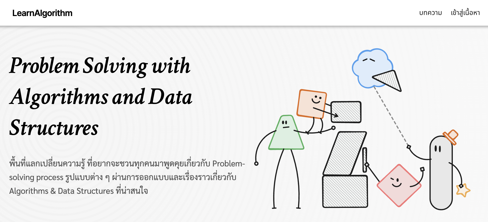

# Problem Solving with Logical Thinking

เป็นหัวข้อที่สำคัญและมีความเกี่ยวข้องอย่างยิ่งกับการทำงานในสายงานโปรแกรมเมอร์เป็นอย่างมากเพราะการแก้ปัญหาอย่างมีเหตุผลและการคิดเชิงตรรกะเป็นทักษะพื้นฐานที่โปรแกรมเมอร์ทุกคนจำเป็นต้องมี เนื่องจากการเขียนโปรแกรมและการพัฒนาซอฟต์แวร์ต้องการความสามารถในการแก้ไขปัญหาและการตัดสินใจอย่างมีเหตุผลในทุกขั้นตอน

ผมจึงอยากแนะนำเนื้อหาดีๆทั้งในประเทศไทยและต่างประเทศนะครับ

[borntodev.com/devlab](https://borntodev.com/devlab)

[learnalgorithm.com](https://learnalgorithm.com)

[programming.in.th](https://programming.in.th)

[**C++ Data Structure & Algorithm (C++ DSA)**](https://youtube.com/playlist?list=PLwZ0y9k-cYXCUxNYRKJ9OdjkyTWriMu1M&si=44_-yghGJVYipAkr)

<iframe width="560" height="315" src="https://www.youtube.com/embed/videoseries?si=0UajBxNC3GukfYcD&amp;list=PLwZ0y9k-cYXCUxNYRKJ9OdjkyTWriMu1M" title="YouTube video player" frameborder="0" allow="accelerometer; autoplay; clipboard-write; encrypted-media; gyroscope; picture-in-picture; web-share" referrerpolicy="strict-origin-when-cross-origin" allowfullscreen></iframe>

[codingame.com](https://www.codingame.com/training)

