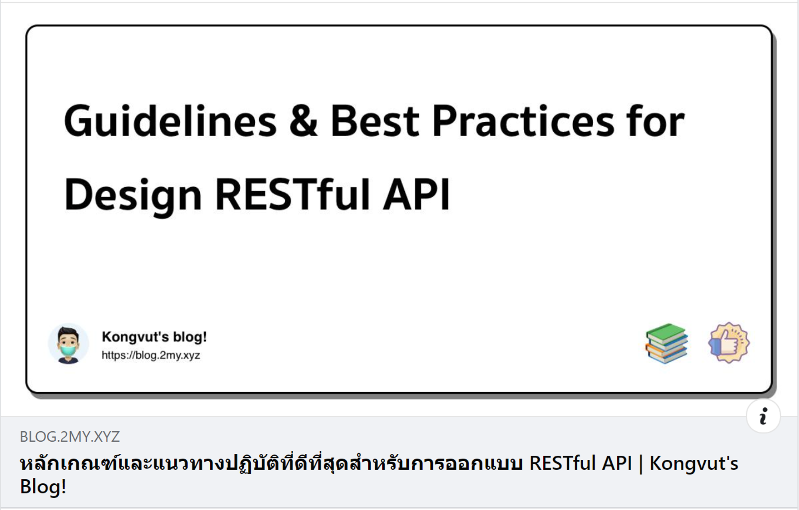

# RESTful Web API

**RESTful Web API (Application Programming Interface)** คือรูปแบบหนึ่งของ **API** ที่ใช้สถาปัตยกรรม **REST (Representational State Transfer)** สำหรับการแลกเปลี่ยนข้อมูลระหว่างเครื่องคอมพิวเตอร์ในเครือข่าย ซึ่ง RESTful Web API เกี่ยวข้องกับ Backend อย่างมาก เนื่องจาก Backend คือส่วนที่ทำหน้าที่เป็นเซิร์ฟเวอร์ที่ให้บริการข้อมูลและการประมวลผลต่างๆ โดย RESTful Web API เป็นวิธีการที่ใช้กันอย่างแพร่หลายในการออกแบบและพัฒนา Backend เพื่อให้สามารถสื่อสารกับไคลเอ็นต์ (Client) ได้อย่างมีประสิทธิภาพ โดยมีความสัมพันธ์กันดังนี้:

มีบทความที่สรุปดีมากๆๆๆอยากมาแนะนำครับผม

[หลักเกณฑ์และแนวทางปฏิบัติที่ดีที่สุดสำหรับการออกแบบ RESTful API](https://blog.2my.xyz/2021/01/24/guidelines-best-practices-for-design-restful-api/)

## การทำงานของ RESTful Web API ใน Backend

1. **จัดการทรัพยากร (Resources Management)**: Backend จะเก็บข้อมูลในฐานข้อมูลหรือที่เก็บข้อมูลอื่นๆ โดย RESTful Web API จะเป็นตัวกลางในการรับคำขอจากไคลเอ็นต์และจัดการกับทรัพยากรเหล่านั้น เช่น การเพิ่มข้อมูลใหม่ การอัปเดตข้อมูล การลบข้อมูล และการดึงข้อมูลออกมา
2. **การรับและตอบสนองคำขอ (Request and Response Handling)**: เมื่อไคลเอ็นต์ส่งคำขอ HTTP มายัง Backend ผ่าน RESTful API, Backend จะทำการประมวลผลคำขอนั้นและส่งการตอบสนอง (response) กลับไปยังไคลเอ็นต์ในรูปแบบ JSON หรือ XML โดยขึ้นอยู่กับการตั้งค่าที่กำหนดไว้
3. **Business Logic**: Backend จะรวมตรรกะธุรกิจต่างๆ เช่น การคำนวณ การตรวจสอบเงื่อนไขกับระบบภายนอก ฯลฯ ไว้ใน RESTful API เพื่อให้แน่ใจว่าการดำเนินการกับทรัพยากรเป็นไปตามกฎเกณฑ์และข้อกำหนดของแอปพลิเคชัน
4. **การรักษาความปลอดภัย (Security)**: RESTful API ใน Backend จะต้องมีการจัดการความปลอดภัย เช่น การยืนยันตัวตน (Authentication) การอนุญาต (Authorization) การเข้ารหัสข้อมูล (Data Encryption) และการป้องกันการโจมตีต่างๆ เช่น SQL Injection, XSS, CSRF เป็นต้น
5. **การสเกลระบบ (Scalability)**: Backend ที่ใช้ RESTful API สามารถออกแบบให้รองรับการสเกลแนวนอน (Horizontal Scaling) ได้ง่าย โดยการเพิ่มจำนวนเซิร์ฟเวอร์ที่ให้บริการ API มากขึ้นเพื่อรองรับจำนวนคำขอที่เพิ่มขึ้น

## ตัวอย่าง RESTful Web API

สมมติว่าคุณมีระบบจัดการหนังสือ (**Book Management System**) โดยมี API ที่ใช้จัดการหนังสือดังนี้:

- **GET /books**: รับรายการหนังสือทั้งหมด
- **GET /books/{id}**: รับรายละเอียดหนังสือเฉพาะโดย ID
- **POST /books**: เพิ่มหนังสือใหม่
- **PUT /books/{id}**: อัปเดตข้อมูลหนังสือเฉพาะโดย ID
- **DELETE /books/{id}**: ลบหนังสือเฉพาะโดย ID

## ตัวอย่างการเรียกใช้ API:

- การขอรายการหนังสือทั้งหมด: `GET /books`
- การขอรายละเอียดหนังสือ ID 1: `GET /books/1`
- การเพิ่มหนังสือใหม่: `POST /books` พร้อมข้อมูลหนังสือในบอดี้ของคำขอ
- การอัปเดตหนังสือ ID 1: `PUT /books/1` พร้อมข้อมูลที่ต้องการอัปเดตในบอดี้ของคำขอ
- การลบหนังสือ ID 1: `DELETE /books/1`