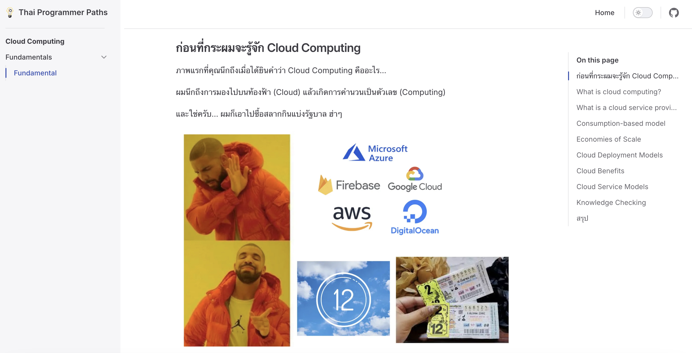
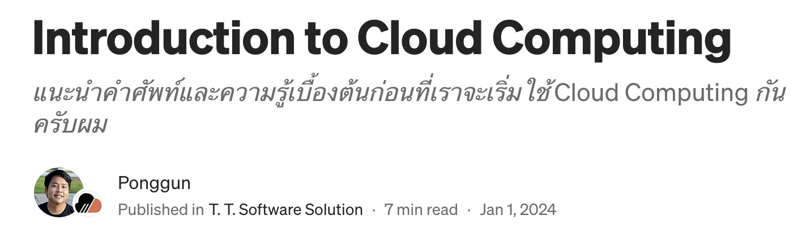

# Introduction to Cloud Computing

**Cloud Computing** คือ การให้บริการคอมพิวเตอร์ผ่านทางอินเทอร์เน็ต ซึ่งรวมถึงเซิร์ฟเวอร์, การจัดเก็บข้อมูล, ฐานข้อมูล, เน็ตเวิร์ก, ซอฟต์แวร์ และอื่นๆ ที่สามารถเข้าถึงและจัดการได้จากระยะไกล

**ข้อดีในมุมธุรกิจ**:

1. **ลดค่าใช้จ่าย**: ลดต้นทุนการลงทุนในฮาร์ดแวร์และซอฟต์แวร์ รวมถึงค่าบำรุงรักษา
2. **ปรับขยายได้ง่าย**: สามารถปรับเพิ่มหรือลดทรัพยากรได้ตามความต้องการของธุรกิจ
3. **ความยืดหยุ่น**: เข้าถึงและจัดการข้อมูลได้ทุกที่ทุกเวลา ทำให้การทำงานร่วมกันสะดวกขึ้น
4. **ประสิทธิภาพ**: เพิ่มประสิทธิภาพการทำงานด้วยการเข้าถึงเทคโนโลยีใหม่ๆ และระบบอัตโนมัติ
5. **ความปลอดภัย**: มีมาตรการความปลอดภัยและการสำรองข้อมูลที่ทันสมัย ช่วยปกป้องข้อมูลสำคัญของธุรกิจ

## แนะนำเนื้อหาแบบแน่นๆ เน้นๆ
[Introduction to Cloud Computing - TPA Paths](https://roadmap.thaiprogrammer.org/paths/cloud-computing/fundamental/fundamental.html)

[Introduction to Cloud Computing - TTSS](https://medium.com/t-t-software-solution/introduction-to-cloud-computing-571b767a363f?source=post_page-----bc61325951d4--------------------------------)

