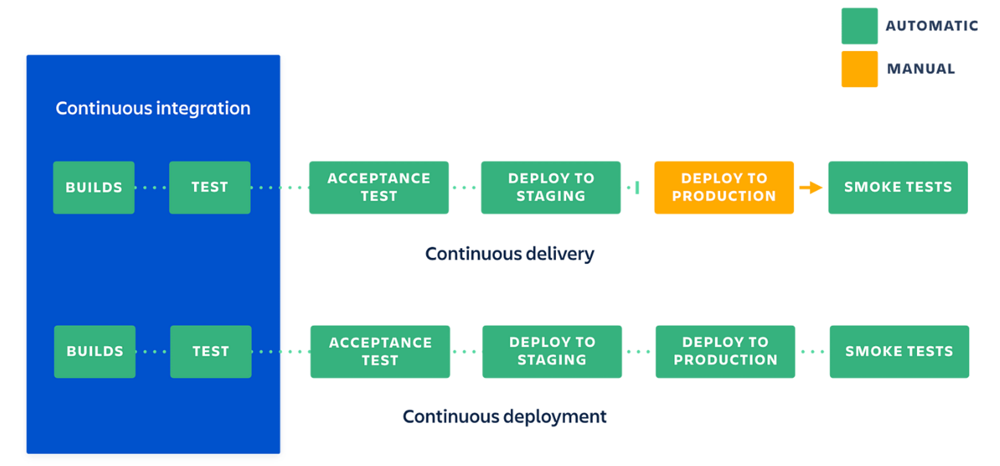

# Continuous Integration/Continuous Deployment (CI/CD)

[atlassian.com/continuous-integration-vs-delivery-vs-deployment](https://www.atlassian.com/continuous-delivery/principles/continuous-integration-vs-delivery-vs-deployment)



### Continuous Integration/Continuous Deployment (CI/CD)

CI/CD คือแนวคิดและชุดของกระบวนการที่ช่วยให้การพัฒนา, การทดสอบ, และการปรับใช้ซอฟต์แวร์เป็นไปอย่างอัตโนมัติและต่อเนื่อง ช่วยให้นักพัฒนาสามารถนำโค้ดใหม่ๆ ไปใช้ในสภาพแวดล้อมการผลิตได้อย่างรวดเร็วและมีความเสถียร

## Continuous Integration (CI)

**Continuous Integration** คือกระบวนการที่นักพัฒนารวมโค้ดที่ตนเองพัฒนาขึ้นไปยัง repository หลักบ่อยครั้ง โดยอัตโนมัติจะมีการทดสอบโค้ดที่รวมเข้ามาเพื่อให้แน่ใจว่าโค้ดสามารถทำงานร่วมกันได้อย่างไม่มีปัญหา

### ข้อดีของ CI

1. **ตรวจจับข้อผิดพลาดได้รวดเร็ว**: การทดสอบโค้ดที่รวมเข้ามาทันทีช่วยให้ตรวจจับข้อผิดพลาดได้ทันที
2. **ลดความเสี่ยงในการผสานโค้ด**: การรวมโค้ดบ่อยๆ ทำให้การผสานโค้ดเป็นไปอย่างราบรื่น
3. **เพิ่มความเร็วในการพัฒนา**: นักพัฒนาสามารถทำงานร่วมกันได้อย่างมีประสิทธิภาพและไม่ต้องรอให้โค้ดของคนอื่นเสร็จก่อน

## Continuous Deployment (CD)

**Continuous Deployment** คือกระบวนการที่โค้ดที่ผ่านการทดสอบและตรวจสอบแล้วจะถูกนำไปปรับใช้ในสภาพแวดล้อมการผลิตโดยอัตโนมัติ กระบวนการนี้ช่วยลดเวลาในการปรับใช้โค้ดใหม่และลดความเสี่ยงในการปรับใช้ด้วยมือ

### ข้อดีของ CD

1. **เพิ่มความรวดเร็วในการส่งมอบซอฟต์แวร์**: โค้ดที่ผ่านการทดสอบจะถูกนำไปใช้ในสภาพแวดล้อมการผลิตทันที
2. **ลดความเสี่ยงของการปรับใช้**: การปรับใช้ด้วยมือมีโอกาสเกิดข้อผิดพลาดสูงกว่า
3. **ตอบสนองต่อความต้องการของผู้ใช้ได้เร็วขึ้น**: สามารถนำฟีเจอร์ใหม่หรือแก้ไขบั๊กไปใช้งานได้เร็วขึ้น

## การตั้งค่า CI/CD ด้วยเครื่องมือต่างๆ

### 1. GitHub Actions

GitHub Actions ช่วยให้นักพัฒนาสามารถสร้าง workflow สำหรับ CI/CD ได้ง่ายดาย

#### ตัวอย่างไฟล์ Workflow สำหรับ Node.js

```yaml
name: CI/CD Pipeline

on:
  push:
    branches:
      - main

jobs:
  build-and-deploy:
    runs-on: ubuntu-latest

    steps:
    - name: Checkout code
      uses: actions/checkout@v2

    - name: Set up Node.js
      uses: actions/setup-node@v2
      with:
        node-version: '14'

    - name: Install dependencies
      run: npm install

    - name: Run tests
      run: npm test

    - name: Build project
      run: npm run build

    - name: Deploy to Server
      env:
        SSH_PRIVATE_KEY: ${{ secrets.SSH_PRIVATE_KEY }}
        SERVER: your_server_ip
        USER: your_server_user
      run: |
        echo "$SSH_PRIVATE_KEY" | tr -d '\r' | ssh-add - > /dev/null
        ssh -o StrictHostKeyChecking=no $USER@$SERVER "cd /var/www/myapp && git pull origin main && npm install && npm run build"
```

### 2. GitLab CI/CD

GitLab CI/CD ช่วยในการตั้งค่า pipeline สำหรับการทดสอบและปรับใช้โปรเจค

#### ตัวอย่างไฟล์ `.gitlab-ci.yml`

```yaml
stages:
  - test
  - build
  - deploy

test:
  stage: test
  script:
    - npm install
    - npm test

build:
  stage: build
  script:
    - npm run build

deploy:
  stage: deploy
  script:
    - apt-get update -qq && apt-get install -qqy openssh-client
    - eval $(ssh-agent -s)
    - echo "$SSH_PRIVATE_KEY" | tr -d '\r' | ssh-add -
    - mkdir -p ~/.ssh
    - ssh-keyscan your_server_ip >> ~/.ssh/known_hosts
    - ssh $USER@$SERVER "cd /var/www/myapp && git pull origin main && npm install && npm run build"
  only:
    - main
```

### 3. Bitbucket Pipelines

Bitbucket Pipelines ช่วยในการตั้งค่า CI/CD สำหรับการทดสอบและปรับใช้โปรเจค

#### ตัวอย่างไฟล์ `bitbucket-pipelines.yml`

```yaml
pipelines:
  default:
    - step:
        name: Test
        caches:
          - node
        script:
          - npm install
          - npm test

    - step:
        name: Build
        caches:
          - node
        script:
          - npm run build

    - step:
        name: Deploy
        caches:
          - node
        script:
          - apt-get update && apt-get install -y openssh-client
          - echo "$SSH_PRIVATE_KEY" > ~/.ssh/id_rsa
          - chmod 600 ~/.ssh/id_rsa
          - ssh-keyscan your_server_ip >> ~/.ssh/known_hosts
          - ssh $USER@$SERVER "cd /var/www/myapp && git pull origin main && npm install && npm run build"
        services:
          - docker
```

## สรุป

CI/CD เป็นกระบวนการที่ช่วยให้การพัฒนา การทดสอบ และการปรับใช้ซอฟต์แวร์เป็นไปอย่างอัตโนมัติและต่อเนื่อง ช่วยเพิ่มประสิทธิภาพในการทำงานและลดความเสี่ยงในการปรับใช้ซอฟต์แวร์ การใช้เครื่องมือเช่น GitHub Actions, GitLab CI/CD หรือ Bitbucket Pipelines จะช่วยให้นักพัฒนาสามารถตั้งค่าและจัดการกระบวนการ CI/CD ได้อย่างมีประสิทธิภาพ