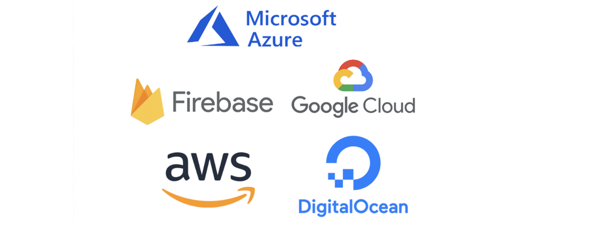
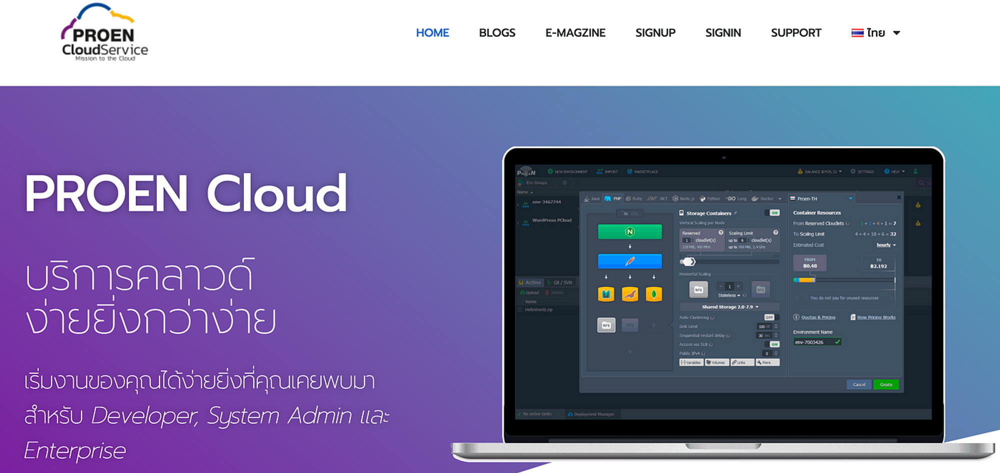
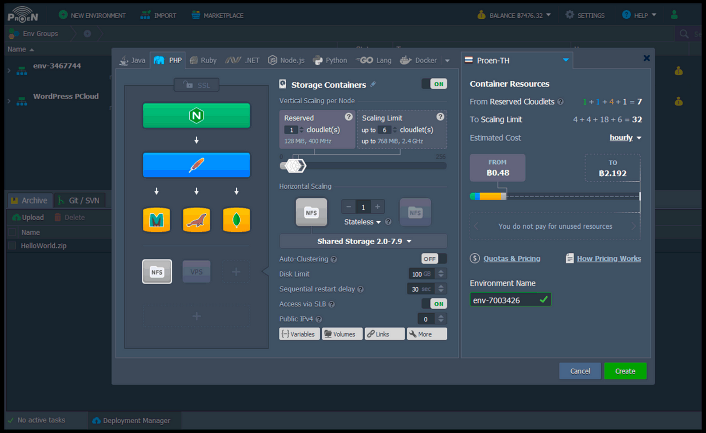
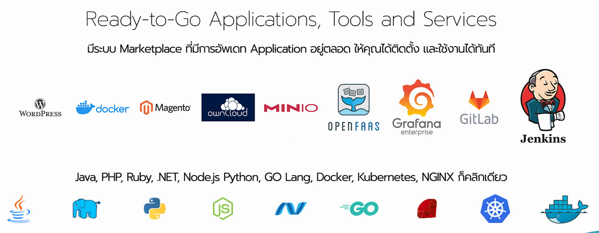
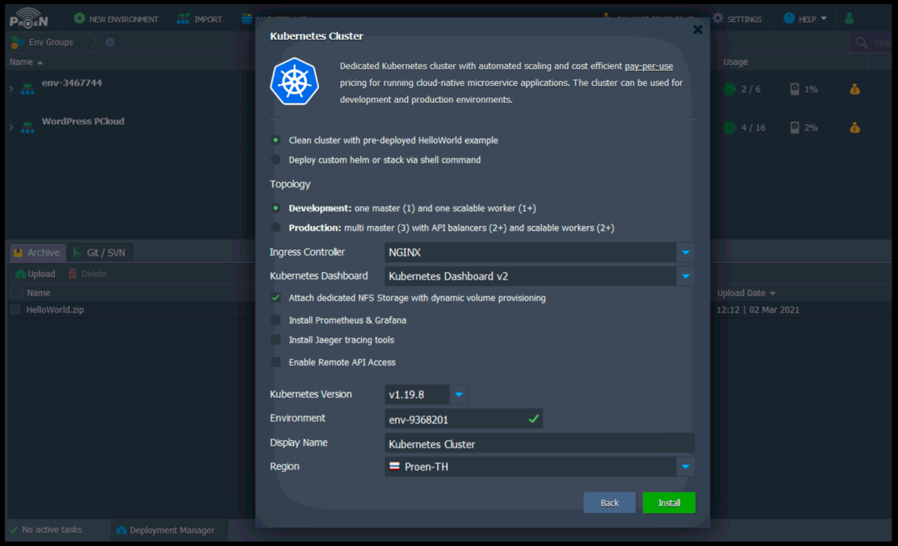
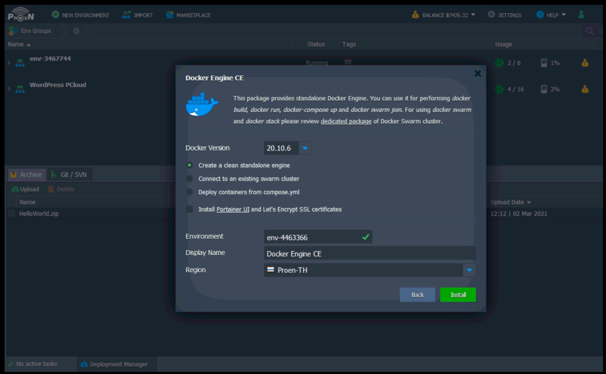
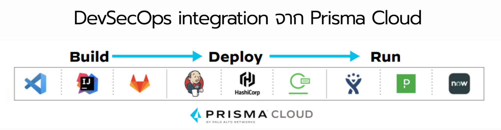
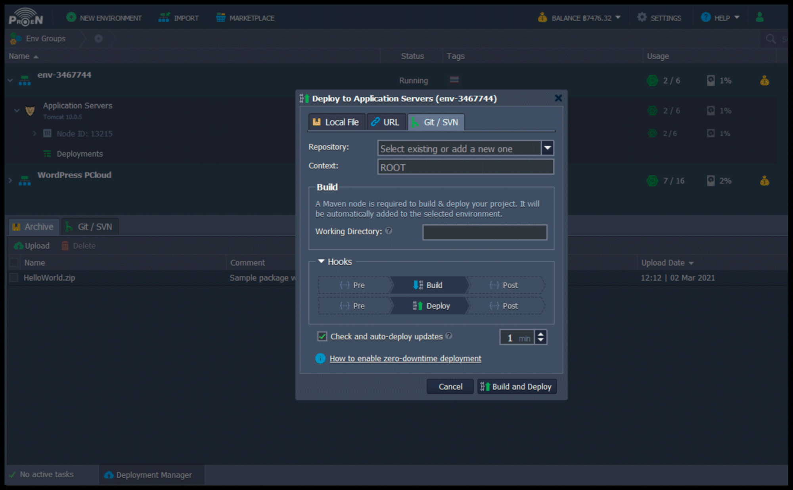

# Cloud Services Deployment

การใช้บริการคลาวด์เช่น AWS, Google Cloud Platform (GCP), และ Microsoft Azure ในการปรับใช้แอปพลิเคชัน ช่วยให้กระบวนการปรับใช้เป็นเรื่องง่ายและรวดเร็ว บริการเช่น AWS Elastic Beanstalk, Google App Engine, และ Azure App Service ช่วยในการจัดการโครงสร้างพื้นฐานโดยอัตโนมัติ ทำให้สามารถมุ่งเน้นไปที่การพัฒนาแอปพลิเคชันได้



## PROEN Cloud

[**PROEN Cloud PaaS**](https://www.proen.cloud/th/th-home/) เป็นบริการคลาวด์ **`ในประเทศไทย`** ที่เน้นความสะดวกและความยืดหยุ่นในการใช้งาน โดยมีคุณสมบัติและบริการที่หลากหลายสำหรับ Developer, System Admin และ Enterprise

[proen.cloud](https://www.proen.cloud/th/th-home/)




### **การใช้งาน**

PROEN Cloud PaaS ออกแบบมาเพื่อให้การเริ่มต้นและการจัดการงานได้สะดวกมากๆครับ โดยมีขั้นตอนคร่าวๆดังนี้:

- ติดตั้งแอปพลิเคชัน เช่น WordPress, Magento, Grafana, และอื่นๆ
- สร้างและจัดการ Virtual Machine
- ตั้งค่า Load Balancer
- ติดตั้งระบบป้องกันและรักษาความปลอดภัย
- ทำการตรวจสอบและแจ้งเตือนการทำงานของระบบ



สร้างระบบนึงขึ้นมาง่ายๆเลยครับ มาทั้ง Web Server พร้อม Load Balancer, Database Server, File Server เลือกขนาดกันตามสะดวกเลย

### **รายละเอียดเชิงลึก**



**รองรับหลายภาษาในการรันไทม์**: รองรับภาษาโปรแกรมต่างๆ เช่น Java, PHP, Ruby, .NET, Node.js, Python, และ GO Lang สามารถเพิ่มลดขนาดการใช้งานได้ง่าย และมีการจัดการ Nginx ให้โดยอัตโนมัติ เปลี่ยนเวอร์ชันของโปรแกรมได้ตามต้องการ

**การจัดการฐานข้อมูล**:รองรับการทำ Cluster ฐานข้อมูลได้อย่างง่ายดาย

**เทคโนโลยี Container-based**: ใช้เทคโนโลยี Container สำหรับการจัดการและรันแอปพลิเคชัน มี Kubernetes ให้บริการ





**Marketplace**: มี Marketplace สำหรับติดตั้งและใช้งานแอปพลิเคชันต่างๆ เช่น WordPress, Magento, Grafana, OpenFaaS, GitLab, Jenkins และอื่นๆ อีกมากมาย สามารถเลือกใช้งานแอปพลิเคชันจาก Docker Hub และ Marketplace ได้ตามต้องการ

**CI/CD Integration**: รองรับการทำงาน CI/CD ผ่าน GIT และมี Jenkins ให้บริการ

**ความปลอดภัยระดับสากล**: ได้รับการรับรองความปลอดภัยระดับสากล (CSA-STAR Certified)

**รองรับการใช้งานหลายภูมิภาค**: มีบริการในหลาย Regions ทั่วโลก

**บริการ DevSecOps**: มีการผสานการทำงาน DevSecOps ผ่าน Prisma Cloud






**การป้องกันและการรักษาความปลอดภัย**:มีระบบป้องกัน DDoS และ Security Firewall มี Free SSL & Automate Renewal จาก Let’s Encrypt

**การตรวจสอบและการแจ้งเตือน**: มี Built-in monitoring ครอบคลุมทั้ง Memory, CPU, Disk และ Application Performance Monitoring

**การคิดค่าใช้จ่าย**: คิดค่าใช้จ่ายตามการใช้งานเป็นรายชั่วโมง สามารถประเมินค่าใช้จ่ายบนระบบได้ทันที

### แนะนำเนื้อหา

[ลองสร้างเว็บแอปกับ Cloud ของคนไทย borntoDev x PROEN](https://www.youtube.com/watch?v=2DdXeDcxwdk)
<iframe width="560" height="315" src="https://www.youtube.com/embed/2DdXeDcxwdk?si=6Ns4ke8oI58Kz1RY" title="YouTube video player" frameborder="0" allow="accelerometer; autoplay; clipboard-write; encrypted-media; gyroscope; picture-in-picture; web-share" referrerpolicy="strict-origin-when-cross-origin" allowfullscreen></iframe>

[ย้ายจาก On-Premise มา Cloud แบบง่ายๆ กับ PROEN Any Cloud](https://www.youtube.com/watch?v=loiDm1G1Dg0)
<iframe width="560" height="315" src="https://www.youtube.com/embed/loiDm1G1Dg0?si=fNq523VkjQg1ZK6o" title="YouTube video player" frameborder="0" allow="accelerometer; autoplay; clipboard-write; encrypted-media; gyroscope; picture-in-picture; web-share" referrerpolicy="strict-origin-when-cross-origin" allowfullscreen></iframe>

[รีวิว ! ทดสอบยิง Request เป็นล้านครั้งกับ PROEN Any Cloud รอดไม่รอดมาดูกัน - Dev รีวิววว ! EP7](https://www.youtube.com/watch?v=5G4LyduJBM4)
<iframe width="560" height="315" src="https://www.youtube.com/embed/5G4LyduJBM4?si=SR6Ejz6l0Ylvdzeu" title="YouTube video player" frameborder="0" allow="accelerometer; autoplay; clipboard-write; encrypted-media; gyroscope; picture-in-picture; web-share" referrerpolicy="strict-origin-when-cross-origin" allowfullscreen></iframe>

##  AWS Elastic Beanstalk

AWS Elastic Beanstalk เป็นบริการที่ช่วยให้นักพัฒนาสามารถปรับใช้และจัดการแอปพลิเคชันบน AWS ได้ง่ายโดยไม่ต้องจัดการกับโครงสร้างพื้นฐาน

### การปรับใช้แอปพลิเคชันบน Elastic Beanstalk

1. **ติดตั้ง AWS CLI**:
   ```bash
   pip install awscli
   ```

2. **กำหนดค่า AWS CLI**:
   ```bash
   aws configure
   ```

3. **สร้างแอปพลิเคชัน Elastic Beanstalk**:
   ```bash
   eb init -p node.js my-app
   eb create my-app-env
   ```

4. **ปรับใช้แอปพลิเคชัน**:
   ```bash
   eb deploy
   ```

5. **เปิดแอปพลิเคชัน**:
   ```bash
   eb open
   ```

## Google App Engine

Google App Engine เป็นแพลตฟอร์มที่ช่วยให้นักพัฒนาสามารถสร้างและปรับใช้แอปพลิเคชันบนโครงสร้างพื้นฐานของ Google ได้อย่างง่ายดาย

### การปรับใช้แอปพลิเคชันบน Google App Engine

1. **ติดตั้ง Google Cloud SDK**:
   ```bash
   curl https://sdk.cloud.google.com | bash
   exec -l $SHELL
   gcloud init
   ```

2. **สร้างไฟล์กำหนดค่า `app.yaml`**:
   ```yaml
   runtime: nodejs14
   handlers:
   - url: /.*
     script: auto
   ```

3. **ปรับใช้แอปพลิเคชัน**:
   ```bash
   gcloud app deploy
   ```

4. **เปิดแอปพลิเคชัน**:
   ```bash
   gcloud app browse
   ```

## Azure App Service

Azure App Service เป็นแพลตฟอร์มที่ช่วยให้นักพัฒนาสามารถสร้างและปรับใช้เว็บแอปพลิเคชันและ API บนโครงสร้างพื้นฐานของ Microsoft Azure ได้ง่ายดาย

### การปรับใช้แอปพลิเคชันบน Azure App Service

1. **ติดตั้ง Azure CLI**:
   ```bash
   curl -sL https://aka.ms/InstallAzureCLIDeb | sudo bash
   ```

2. **ล็อกอินเข้าสู่ Azure**:
   ```bash
   az login
   ```

3. **สร้าง Resource Group**:
   ```bash
   az group create --name myResourceGroup --location "East US"
   ```

4. **สร้าง App Service Plan**:
   ```bash
   az appservice plan create --name myAppServicePlan --resource-group myResourceGroup --sku B1 --is-linux
   ```

5. **สร้าง Web App**:
   ```bash
   az webapp create --resource-group myResourceGroup --plan myAppServicePlan --name myUniqueAppName --runtime "NODE|14-lts"
   ```

6. **ปรับใช้แอปพลิเคชัน**:
   ```bash
   az webapp up --resource-group myResourceGroup --name myUniqueAppName
   ```

7. **เปิดแอปพลิเคชัน**:
   ```bash
   az webapp browse --resource-group myResourceGroup --name myUniqueAppName
   ```

## สรุป

การใช้บริการคลาวด์เช่น AWS, Google Cloud Platform, และ Microsoft Azure ช่วยให้นักพัฒนาสามารถปรับใช้แอปพลิเคชันได้อย่างรวดเร็วและง่ายดาย บริการเช่น AWS Elastic Beanstalk, Google App Engine, และ Azure App Service ช่วยในการจัดการโครงสร้างพื้นฐานโดยอัตโนมัติ ทำให้นักพัฒนาสามารถมุ่งเน้นไปที่การพัฒนาแอปพลิเคชันได้อย่างเต็มที่