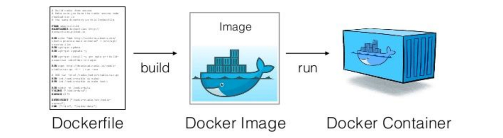
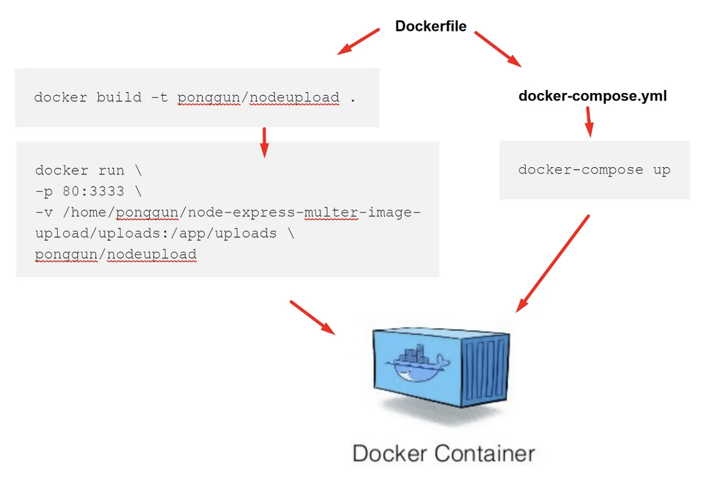

# **Containerization Deployment**

การใช้ Docker ในการสร้าง container สำหรับแอปพลิเคชัน และใช้ Kubernetes หรือ Docker Swarm ในการจัดการการ deploy container เหล่านั้น ช่วยในการจัดการสภาพแวดล้อมและการขยายตัวของแอปพลิเคชันอย่างมีประสิทธิภาพ

[Build a Docker Image just like how you would configure a VM](https://medium.com/platformer-blog/practical-guide-on-writing-a-dockerfile-for-your-application-89376f88b3b5)



## Docker

Docker เป็นเครื่องมือที่ช่วยในการสร้างและจัดการ container ซึ่งเป็นหน่วยเล็ก ๆ ของซอฟต์แวร์ที่บรรจุโค้ดและการขึ้นอยู่ทั้งหมดของแอปพลิเคชัน

### การสร้างและใช้ Docker

1. **ติดตั้ง Docker**:
   - สำหรับ [Windows](https://docs.docker.com/desktop/windows/install/)
   - สำหรับ [macOS](https://docs.docker.com/desktop/mac/install/)
   - สำหรับ [Linux](https://docs.docker.com/engine/install/)

2. **สร้างไฟล์ Dockerfile**:
   ตัวอย่างไฟล์ `Dockerfile` สำหรับแอปพลิเคชัน Node.js:

   ```Dockerfile
   # ใช้ภาพพื้นฐานของ Node.js
   FROM node:14

   # ตั้งค่าดirectoryทำงานใน container
   WORKDIR /app

   # คัดลอกไฟล์ package.json และ package-lock.json
   COPY package*.json ./

   # ติดตั้ง dependencies
   RUN npm install

   # คัดลอกไฟล์โปรเจคทั้งหมดไปยัง container
   COPY . .

   # เปิดพอร์ตที่แอปพลิเคชันจะรัน
   EXPOSE 3000

   # คำสั่งรันแอปพลิเคชัน
   CMD ["npm", "start"]
   ```

3. **สร้าง Docker Image**:
   ```bash
   docker build -t my-app .
   ```

4. **รัน Docker Container**:
   ```bash
   docker run -p 3000:3000 my-app
   ```

## Kubernetes

Kubernetes เป็นระบบที่ช่วยในการจัดการ container แบบกระจาย รวมถึงการปรับขนาด การอัปเดต และการตรวจสอบสถานะของ container

### การติดตั้ง Kubernetes

1. **ติดตั้ง Kubernetes**:
   - สำหรับ [Windows](https://kubernetes.io/docs/tasks/tools/install-kubectl-windows/)
   - สำหรับ [macOS](https://kubernetes.io/docs/tasks/tools/install-kubectl-macos/)
   - สำหรับ [Linux](https://kubernetes.io/docs/tasks/tools/install-kubectl-linux/)

2. **ติดตั้ง Minikube** สำหรับการรัน Kubernetes ในเครื่อง:
   - [Minikube](https://minikube.sigs.k8s.io/docs/start/)

3. **เริ่ม Minikube**:
   ```bash
   minikube start
   ```

### การปรับใช้แอปพลิเคชันด้วย Kubernetes

1. **สร้างไฟล์ Deployment**:
   ตัวอย่างไฟล์ `deployment.yaml` สำหรับแอปพลิเคชัน Node.js:

   ```yaml
   apiVersion: apps/v1
   kind: Deployment
   metadata:
     name: my-app
   spec:
     replicas: 3
     selector:
       matchLabels:
         app: my-app
     template:
       metadata:
         labels:
           app: my-app
       spec:
         containers:
         - name: my-app
           image: my-app:latest
           ports:
           - containerPort: 3000
   ```

2. **สร้างไฟล์ Service**:
   ตัวอย่างไฟล์ `service.yaml`:

   ```yaml
   apiVersion: v1
   kind: Service
   metadata:
     name: my-app-service
   spec:
     type: NodePort
     selector:
       app: my-app
     ports:
     - port: 3000
       targetPort: 3000
       nodePort: 30001
   ```

3. **ปรับใช้ Deployment และ Service**:
   ```bash
   kubectl apply -f deployment.yaml
   kubectl apply -f service.yaml
   ```

4. **เข้าถึงแอปพลิเคชัน**:
   ```bash
   minikube service my-app-service
   ```

## Docker Swarm

Docker Swarm เป็นเครื่องมือที่ใช้ในการจัดการ container แบบกระจาย โดยมีการทำงานที่ง่ายกว่า Kubernetes

### การใช้ Docker Swarm

1. **สร้าง Swarm Cluster**:
   ```bash
   docker swarm init
   ```

2. **สร้าง Service**:
   ตัวอย่างการสร้าง Service สำหรับแอปพลิเคชัน Node.js:

   ```bash
   docker service create --name my-app --publish published=3000,target=3000 my-app
   ```

3. **ตรวจสอบ Service**:
   ```bash
   docker service ls
   ```

4. **สเกล Service**:
   ```bash
   docker service scale my-app=3
   ```

5. **ลบ Service**:
   ```bash
   docker service rm my-app
   ```

## สรุป

การใช้ Docker ในการสร้าง container สำหรับแอปพลิเคชัน และการใช้ Kubernetes หรือ Docker Swarm ในการจัดการการ deploy container ช่วยให้การจัดการสภาพแวดล้อมและการขยายตัวของแอปพลิเคชันเป็นไปอย่างมีประสิทธิภาพและยืดหยุ่น 

Containerization Deployment ช่วยให้การจัดการแอปพลิเคชันมีความเป็นมาตรฐาน สะดวก และง่ายต่อการปรับปรุงและบำรุงรักษา

## แนะนำเนื้อหา
[เตรียมเครื่อง Windows ของเราให้พร้อมพัฒนา Modern Application ด้วย WSL2 และ Docker Desktop](https://www.youtube.com/watch?v=i9iiEYY4ZC4)
<iframe width="560" height="315" src="https://www.youtube.com/embed/i9iiEYY4ZC4?si=Z2t1GHkocG8OsTO6" title="YouTube video player" frameborder="0" allow="accelerometer; autoplay; clipboard-write; encrypted-media; gyroscope; picture-in-picture; web-share" referrerpolicy="strict-origin-when-cross-origin" allowfullscreen></iframe>

[ฝึกวิชา Docker Image & Container](https://medium.com/t-t-software-solution/%E0%B8%9D%E0%B8%B6%E0%B8%81%E0%B8%A7%E0%B8%B4%E0%B8%8A%E0%B8%B2-docker-image-container-8765a513f2b4)

