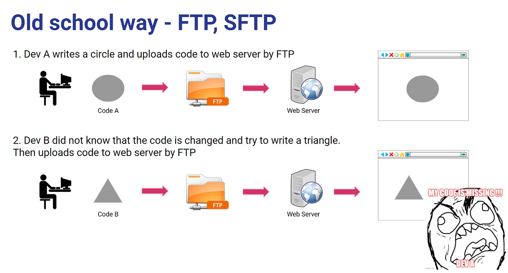

# FTP/SFTP Deployment

FTP (File Transfer Protocol) และ SFTP (Secure File Transfer Protocol) เป็นวิธีการที่ใช้ในการอัปโหลดไฟล์โปรเจคจากเครื่องคอมพิวเตอร์ของนักพัฒนาไปยังเซิร์ฟเวอร์เว็บโฮสติ้ง การใช้ SFTP มีความปลอดภัยมากกว่าเนื่องจากข้อมูลถูกเข้ารหัสในระหว่างการถ่ายโอน

## ขั้นตอนการปรับใช้เว็บแอปพลิเคชันด้วย FTP/SFTP

### 1. การเตรียมโปรเจค

- **ตรวจสอบความถูกต้องของโค้ด**: ทำการทดสอบและแก้ไขข้อผิดพลาดที่พบ
- **สร้างไฟล์ที่จำเป็น**: เช่น ไฟล์ build, ไฟล์กำหนดค่า (configuration files)
- **ตรวจสอบการจัดการเวอร์ชัน**: ตรวจสอบให้แน่ใจว่าโค้ดทั้งหมดถูก commit และ push ไปยัง repository

### 2. การเลือกและติดตั้งโปรแกรม FTP/SFTP

โปรแกรม FTP/SFTP ยอดนิยมมีหลายตัว เช่น:
- **FileZilla**: โปรแกรม FTP/SFTP แบบโอเพ่นซอร์ส
- **WinSCP**: โปรแกรม SFTP และ SCP สำหรับ Windows
- **Cyberduck**: โปรแกรม FTP/SFTP สำหรับ macOS และ Windows

### 3. การเชื่อมต่อกับเซิร์ฟเวอร์ผ่าน FTP/SFTP

1. **เปิดโปรแกรม FTP/SFTP ที่เลือกใช้**
2. **ตั้งค่าการเชื่อมต่อ**: กรอกข้อมูลเซิร์ฟเวอร์ เช่น
    - **Hostname**: ชื่อโฮสต์หรือ IP ของเซิร์ฟเวอร์
    - **Port**: สำหรับ FTP มักใช้พอร์ต 21 และ SFTP ใช้พอร์ต 22
    - **Username**: ชื่อผู้ใช้สำหรับการเข้าสู่ระบบ
    - **Password**: รหัสผ่านสำหรับการเข้าสู่ระบบ

### 4. การอัปโหลดไฟล์โปรเจค

1. **เชื่อมต่อกับเซิร์ฟเวอร์**: กดปุ่มเชื่อมต่อหลังจากกรอกข้อมูลที่จำเป็น
2. **เลือกไฟล์และไดเรกทอรี**: เลือกไฟล์และโฟลเดอร์ที่ต้องการอัปโหลดจากเครื่องคอมพิวเตอร์
3. **อัปโหลดไฟล์**: ลากและวางไฟล์จากเครื่องคอมพิวเตอร์ไปยังไดเรกทอรีที่ต้องการบนเซิร์ฟเวอร์

### 5. การกำหนดค่าเซิร์ฟเวอร์ (ถ้าจำเป็น)

หลังจากอัปโหลดไฟล์เรียบร้อยแล้ว คุณอาจต้อง:
- **ตั้งค่าสิทธิ์การเข้าถึงไฟล์**: ใช้คำสั่ง `chmod` ผ่าน SSH หรือการตั้งค่าจากโปรแกรม FTP/SFTP
- **ตั้งค่าไฟล์กำหนดค่า**: ตรวจสอบและตั้งค่าไฟล์กำหนดค่าต่าง ๆ เช่น `.htaccess` หรือ `web.config`
- **รีสตาร์ทเซิร์ฟเวอร์**: รีสตาร์ทบริการเซิร์ฟเวอร์เพื่อให้การเปลี่ยนแปลงมีผล

### ตัวอย่างการใช้ FileZilla

1. **เปิด FileZilla** และไปที่ **File > Site Manager**
2. **คลิกที่ปุ่ม New Site** และกรอกข้อมูลดังนี้:
    - **Host**: ชื่อโฮสต์หรือ IP ของเซิร์ฟเวอร์
    - **Port**: พอร์ตสำหรับการเชื่อมต่อ (21 สำหรับ FTP, 22 สำหรับ SFTP)
    - **Protocol**: เลือก FTP หรือ SFTP
    - **Logon Type**: เลือก Normal
    - **User**: ชื่อผู้ใช้
    - **Password**: รหัสผ่าน
3. **คลิกที่ปุ่ม Connect** เพื่อเชื่อมต่อกับเซิร์ฟเวอร์
4. **ลากและวางไฟล์** จากเครื่องคอมพิวเตอร์ไปยังไดเรกทอรีบนเซิร์ฟเวอร์ที่ต้องการ

### ตัวอย่างการใช้ WinSCP

1. **เปิด WinSCP** และกรอกข้อมูลการเชื่อมต่อ:
    - **Host name**: ชื่อโฮสต์หรือ IP ของเซิร์ฟเวอร์
    - **Port number**: พอร์ตสำหรับการเชื่อมต่อ (21 สำหรับ FTP, 22 สำหรับ SFTP)
    - **User name**: ชื่อผู้ใช้
    - **Password**: รหัสผ่าน
2. **คลิกที่ปุ่ม Login** เพื่อเชื่อมต่อกับเซิร์ฟเวอร์
3. **เลือกไฟล์และไดเรกทอรี**: เลือกไฟล์และโฟลเดอร์ที่ต้องการอัปโหลดจากเครื่องคอมพิวเตอร์
4. **ลากและวางไฟล์** จากเครื่องคอมพิวเตอร์ไปยังไดเรกทอรีบนเซิร์ฟเวอร์ที่ต้องการ

## ข้อดีและข้อเสียของการปรับใช้ผ่าน FTP/SFTP

### ข้อดี
- **ใช้งานง่าย**: การใช้งานโปรแกรม FTP/SFTP ส่วนใหญ่ไม่ซับซ้อนและมีอินเตอร์เฟซที่ใช้งานง่าย
- **การเชื่อมต่อที่ปลอดภัย**: SFTP มีการเข้ารหัสข้อมูลระหว่างการถ่ายโอน ทำให้มีความปลอดภัยสูง

### ข้อเสีย
- **การจัดการที่ซับซ้อน**: การปรับใช้โปรเจคขนาดใหญ่หรือการอัปเดตไฟล์บ่อยๆ อาจทำให้การจัดการไฟล์ยากขึ้น
- **ไม่มีการควบคุมเวอร์ชัน**: FTP/SFTP ไม่ได้รวมระบบการควบคุมเวอร์ชัน ทำให้การติดตามการเปลี่ยนแปลงและการแก้ไขบั๊กยากขึ้น

การปรับใช้เว็บแอปพลิเคชันผ่าน FTP/SFTP เป็นวิธีที่ใช้งานง่ายและตรงไปตรงมา โดยเฉพาะสำหรับโปรเจคขนาดเล็กหรือการทดสอบเบื้องต้น อย่างไรก็ตาม สำหรับโปรเจคขนาดใหญ่หรือการพัฒนาที่ต้องการความซับซ้อนมากขึ้น ควรพิจารณาใช้เครื่องมือและแพลตฟอร์มที่มีความสามารถในการควบคุมเวอร์ชันและการจัดการที่ดีขึ้น

วาง Code ทับของเพื่อนที ล้องห้ายยย T__T