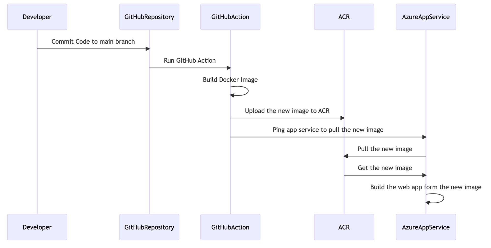

# Git Deployment

การใช้ Git ในการจัดการเวอร์ชันของโค้ดและดึงโค้ดจาก Git repository ไปยังเซิร์ฟเวอร์โดยตรงเป็นวิธีที่มีประสิทธิภาพและสะดวกสบายในการปรับใช้เว็บแอปพลิเคชัน โดยสามารถใช้บริการเช่น GitHub Actions, GitLab CI/CD หรือ Bitbucket Pipelines ในการจัดการกระบวนการ deploy อัตโนมัติได้



## ขั้นตอนการปรับใช้เว็บแอปพลิเคชันด้วย Git Deployment

## 1. การตั้งค่า Git Repository

- **สร้าง Git repository**: บน GitHub, GitLab หรือ Bitbucket
- **เพิ่ม remote repository**: บนเครื่องคอมพิวเตอร์ของคุณ

```bash
git remote add origin https://github.com/username/repository.git
```

## 2. การติดตั้ง Git บนเซิร์ฟเวอร์

บนเซิร์ฟเวอร์ที่ต้องการปรับใช้แอปพลิเคชัน ตรวจสอบให้แน่ใจว่า Git ถูกติดตั้งแล้ว ถ้ายังไม่ติดตั้ง ให้ใช้คำสั่งดังนี้:

```bash
sudo apt-get update
sudo apt-get install git
```

## 3. การตั้งค่า SSH Key สำหรับการเชื่อมต่อกับ Git Repository

- **สร้าง SSH Key**: บนเซิร์ฟเวอร์

```bash
ssh-keygen -t rsa -b 4096 -C "your_email@example.com"
```

- **เพิ่ม SSH Key ไปยัง Git repository**: โดยคัดลอก public key (ไฟล์ `.pub`) และเพิ่มไปยัง GitHub, GitLab หรือ Bitbucket ในส่วนของ SSH keys

## 4. การตั้งค่า Git Deployment บนเซิร์ฟเวอร์

- **สร้างโฟลเดอร์สำหรับแอปพลิเคชัน**: บนเซิร์ฟเวอร์

```bash
mkdir -p /var/www/myapp
cd /var/www/myapp
```

- **ดึงโค้ดจาก Git repository**:

```bash
git clone git@github.com:username/repository.git .
```

- **ตั้งค่า post-receive hook**: เพื่อทำการ pull โค้ดอัตโนมัติเมื่อมีการ push โค้ดใหม่ไปยัง repository

```bash
cd /var/www/myapp.git/hooks
nano post-receive
```

เพิ่มสคริปต์ดังนี้:

```bash
#!/bin/bash
GIT_WORK_TREE=/var/www/myapp git checkout -f
```

บันทึกไฟล์และให้สิทธิ์การรัน:

```bash
chmod +x post-receive
```

## 5. การใช้ GitHub Actions สำหรับการ Deploy อัตโนมัติ

GitHub Actions ช่วยให้การตั้งค่า CI/CD เพื่อทดสอบและปรับใช้โค้ดอัตโนมัติ

- **สร้างไฟล์ workflow**: ในโฟลเดอร์ `.github/workflows`

```yaml
name: CI/CD Pipeline

on:
  push:
    branches:
      - main

jobs:
  build-and-deploy:
    runs-on: ubuntu-latest

    steps:
    - name: Checkout code
      uses: actions/checkout@v2

    - name: Set up Node.js
      uses: actions/setup-node@v2
      with:
        node-version: '14'

    - name: Install dependencies
      run: npm install

    - name: Build project
      run: npm run build

    - name: Deploy to Server
      env:
        SSH_PRIVATE_KEY: ${{ secrets.SSH_PRIVATE_KEY }}
        SERVER: your_server_ip
        USER: your_server_user
      run: |
        echo "$SSH_PRIVATE_KEY" | tr -d '\r' | ssh-add - > /dev/null
        ssh -o StrictHostKeyChecking=no $USER@$SERVER "cd /var/www/myapp && git pull origin main && npm install && npm run build"
```

- **ตั้งค่า Secrets ใน GitHub Repository**: เช่น `SSH_PRIVATE_KEY` เพื่อให้ GitHub Actions สามารถเชื่อมต่อกับเซิร์ฟเวอร์

## 6. การใช้ GitLab CI/CD สำหรับการ Deploy อัตโนมัติ

GitLab CI/CD ช่วยในการตั้งค่า pipeline สำหรับการปรับใช้โปรเจค

- **สร้างไฟล์ `.gitlab-ci.yml`**: ใน root directory ของโปรเจค

```yaml
stages:
  - deploy

deploy:
  stage: deploy
  script:
    - apt-get update -qq && apt-get install -qqy openssh-client
    - eval $(ssh-agent -s)
    - echo "$SSH_PRIVATE_KEY" | tr -d '\r' | ssh-add -
    - mkdir -p ~/.ssh
    - ssh-keyscan your_server_ip >> ~/.ssh/known_hosts
    - ssh $USER@$SERVER "cd /var/www/myapp && git pull origin main && npm install && npm run build"
  only:
    - main
```

- **ตั้งค่า Variables ใน GitLab Repository**: เช่น `SSH_PRIVATE_KEY` เพื่อให้ GitLab CI/CD สามารถเชื่อมต่อกับเซิร์ฟเวอร์

### 7. การใช้ Bitbucket Pipelines สำหรับการ Deploy อัตโนมัติ

Bitbucket Pipelines ช่วยในการตั้งค่า CI/CD สำหรับการปรับใช้โปรเจค

- **สร้างไฟล์ `bitbucket-pipelines.yml`**: ใน root directory ของโปรเจค

```yaml
pipelines:
  default:
    - step:
        name: Deploy to Server
        caches:
          - node
        script:
          - apt-get update && apt-get install -y openssh-client
          - echo "$SSH_PRIVATE_KEY" > ~/.ssh/id_rsa
          - chmod 600 ~/.ssh/id_rsa
          - ssh-keyscan your_server_ip >> ~/.ssh/known_hosts
          - ssh $USER@$SERVER "cd /var/www/myapp && git pull origin main && npm install && npm run build"
        services:
          - docker
```

- **ตั้งค่า Environment Variables ใน Bitbucket Repository**: เช่น `SSH_PRIVATE_KEY` เพื่อให้ Bitbucket Pipelines สามารถเชื่อมต่อกับเซิร์ฟเวอร์

## สรุป

การใช้ Git ในการจัดการเวอร์ชันของโค้ดและดึงโค้ดจาก Git repository ไปยังเซิร์ฟเวอร์โดยตรงเป็นวิธีที่มีประสิทธิภาพและสะดวกสบาย โดยสามารถใช้บริการเช่น GitHub Actions, GitLab CI/CD หรือ Bitbucket Pipelines ในการจัดการกระบวนการ deploy อัตโนมัติได้อย่างมีประสิทธิภาพ.

## แนะนำบทความ

[Deploy Node.js ด้วย Azure App Service Plan, Azure Container Registry และ GitHub Action](https://medium.com/t-t-software-solution/deploy-node-js-%E0%B8%94%E0%B9%89%E0%B8%A7%E0%B8%A2-azure-app-service-plan-azure-container-registry-%E0%B9%81%E0%B8%A5%E0%B8%B0-github-action-460998dd805f)

