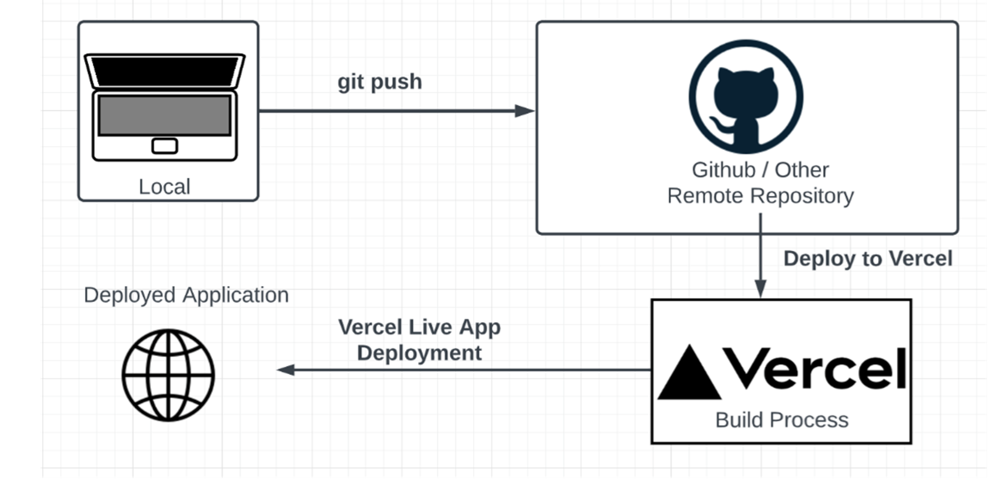

# **Static Site Hosting**

สำหรับเว็บแอปพลิเคชันแบบ Static สามารถใช้บริการเช่น GitHub Pages, Netlify, และ Vercel ในการ deploy ได้ เหมาะสำหรับเว็บไซต์ที่ไม่ต้องการ backend หรือมี backend น้อย เช่น บล็อก, พอร์ตโฟลิโอ, และเอกสารออนไลน์

[How to Deploy Next.js with Vercel](https://www.mitrais.com/news-updates/how-to-deploy-next-js-with-vercel/)


## 1. GitHub Pages

GitHub Pages เป็นบริการที่ช่วยให้คุณสามารถโฮสต์เว็บไซต์แบบ static จาก GitHub repository ได้ฟรี

### การปรับใช้เว็บไซต์ด้วย GitHub Pages

1. **สร้าง GitHub Repository**:
   - สร้าง repository ใหม่บน GitHub

2. **เพิ่มไฟล์เว็บไซต์**:
   - เพิ่มไฟล์ HTML, CSS, และ JavaScript ไปยัง repository

3. **ปรับใช้เว็บไซต์**:
   - ไปที่หน้า settings ของ repository
   - เลื่อนลงมาที่ส่วน **GitHub Pages**
   - เลือก source branch (เช่น `main`) และโฟลเดอร์ (เช่น `/root` หรือ `/docs`)
   - คลิกที่ปุ่ม **Save**
   
4. **เข้าถึงเว็บไซต์**:
   - เว็บไซต์ของคุณจะถูกโฮสต์ที่ `https://username.github.io/repository`

## 2. Netlify

Netlify เป็นแพลตฟอร์มที่ช่วยในการปรับใช้และจัดการเว็บไซต์แบบ static ได้ง่ายและรวดเร็ว

### การปรับใช้เว็บไซต์ด้วย Netlify

1. **สมัครบัญชี Netlify**:
   - สมัครบัญชีที่ [Netlify](https://www.netlify.com/)

2. **สร้างเว็บไซต์ใหม่**:
   - ล็อกอินเข้าสู่ Netlify และคลิกที่ปุ่ม **New site from Git**
   - เชื่อมต่อบัญชี GitHub, GitLab หรือ Bitbucket ของคุณ

3. **เลือก Repository**:
   - เลือก repository ที่ต้องการปรับใช้
   - ตั้งค่า build command และ publish directory (ถ้ามี)

4. **ปรับใช้เว็บไซต์**:
   - คลิกที่ปุ่ม **Deploy site** เพื่อเริ่มกระบวนการปรับใช้

5. **เข้าถึงเว็บไซต์**:
   - เว็บไซต์ของคุณจะถูกโฮสต์ที่ URL ที่ Netlify กำหนดให้

## 3. Vercel

Vercel เป็นแพลตฟอร์มที่เน้นการปรับใช้เว็บแอปพลิเคชันแบบ static และ serverless ได้ง่าย

### การปรับใช้เว็บไซต์ด้วย Vercel

1. **สมัครบัญชี Vercel**:
   - สมัครบัญชีที่ [Vercel](https://vercel.com/)

2. **สร้างโปรเจคใหม่**:
   - ล็อกอินเข้าสู่ Vercel และคลิกที่ปุ่ม **New Project**
   - เชื่อมต่อบัญชี GitHub, GitLab หรือ Bitbucket ของคุณ

3. **เลือก Repository**:
   - เลือก repository ที่ต้องการปรับใช้

4. **ตั้งค่าโปรเจค**:
   - ตั้งค่า build command และ output directory (ถ้ามี)

5. **ปรับใช้เว็บไซต์**:
   - คลิกที่ปุ่ม **Deploy** เพื่อเริ่มกระบวนการปรับใช้

6. **เข้าถึงเว็บไซต์**:
   - เว็บไซต์ของคุณจะถูกโฮสต์ที่ URL ที่ Vercel กำหนดให้

## 4 Cloudflare Pages

Cloudflare Pages เป็นแพลตฟอร์มสำหรับการโฮสต์เว็บไซต์แบบ static ที่ทำให้การปรับใช้เว็บไซต์ง่ายและรวดเร็ว ด้วยการใช้ Cloudflare Pages คุณจะได้รับประโยชน์จากประสิทธิภาพและความปลอดภัยของเครือข่าย CDN ของ Cloudflare ซึ่งช่วยให้เว็บไซต์ของคุณโหลดได้เร็วและปลอดภัย

### การปรับใช้เว็บไซต์ด้วย Cloudflare Pages

#### ขั้นตอนที่ 1: เตรียมโปรเจค

- สร้างโปรเจคเว็บไซต์แบบ static บนเครื่องของคุณ (เช่น ใช้ HTML, CSS, และ JavaScript)

#### ขั้นตอนที่ 2: สร้างบัญชีและโปรเจคบน Cloudflare Pages

1. **สมัครบัญชี Cloudflare**:
   - สมัครบัญชีที่ [Cloudflare](https://www.cloudflare.com/)

2. **สร้างโปรเจคใหม่บน Cloudflare Pages**:
   - ล็อกอินเข้าสู่ Cloudflare
   - ไปที่แดชบอร์ดของ Cloudflare Pages และคลิกที่ปุ่ม **Create a project**

3. **เชื่อมต่อกับ GitHub**:
   - คลิกที่ปุ่ม **Connect to Git** และเลือกเชื่อมต่อกับ GitHub
   - อนุญาตให้ Cloudflare เข้าถึง repository ของคุณ

4. **เลือก Repository**:
   - เลือก repository ที่ต้องการปรับใช้
   - ตั้งค่า branch ที่จะใช้สำหรับการ deploy (เช่น `main`)

#### ขั้นตอนที่ 3: ตั้งค่าโปรเจค

1. **ตั้งค่า Build**:
   - ถ้าโปรเจคของคุณใช้ build tool (เช่น Webpack, Hugo, Jekyll), ตั้งค่า build command และ output directory
   - สำหรับโปรเจคพื้นฐานที่ไม่ต้องการ build tool, คุณสามารถข้ามขั้นตอนนี้ได้

2. **ปรับใช้โปรเจค**:
   - คลิกที่ปุ่ม **Begin setup** และกรอกข้อมูลที่จำเป็น
   - คลิกที่ปุ่ม **Save and Deploy** เพื่อเริ่มกระบวนการปรับใช้

#### ขั้นตอนที่ 4: การเข้าถึงเว็บไซต์

- หลังจากการปรับใช้สำเร็จ, คุณจะได้รับ URL สำหรับเว็บไซต์ของคุณ
- Cloudflare Pages จะให้คุณสามารถใช้โดเมนที่กำหนดเองได้ โดยการตั้งค่า DNS ตามคำแนะนำของ Cloudflare

### ตัวอย่างการใช้ Cloudflare Pages

#### ตัวอย่างไฟล์ `index.html`

```html
<!DOCTYPE html>
<html lang="en">
<head>
    <meta charset="UTF-8">
    <meta name="viewport" content="width=device-width, initial-scale=1.0">
    <title>My Static Site</title>
    <link rel="stylesheet" href="styles.css">
</head>
<body>
    <h1>Welcome to My Static Site</h1>
    <p>This is a simple static site hosted on Cloudflare Pages.</p>
</body>
</html>
```

#### ตัวอย่างไฟล์ `styles.css`

```css
body {
    font-family: Arial, sans-serif;
    margin: 0;
    padding: 0;
    display: flex;
    justify-content: center;
    align-items: center;
    height: 100vh;
    background-color: #f4f4f4;
}

h1 {
    color: #333;
}
```

### ข้อดีของการใช้ Cloudflare Pages

1. **ประสิทธิภาพสูง**: Cloudflare Pages ใช้เครือข่าย CDN ของ Cloudflare ที่มีการกระจายตัวทั่วโลก ทำให้เว็บไซต์โหลดได้เร็ว
2. **ความปลอดภัย**: Cloudflare มีฟีเจอร์ความปลอดภัยที่ช่วยป้องกันการโจมตี DDoS และการเข้าถึงที่ไม่พึงประสงค์
3. **ใช้งานง่าย**: การตั้งค่าและปรับใช้เว็บไซต์ด้วย Cloudflare Pages ทำได้ง่ายและรวดเร็ว
4. **การตั้งค่าโดเมนที่กำหนดเอง**: สามารถใช้โดเมนที่กำหนดเองได้ง่ายๆ ด้วยการตั้งค่า DNS

## สรุป

การใช้บริการ Static Site Hosting เช่น GitHub Pages, Netlify, และ Vercel ช่วยให้นักพัฒนาสามารถปรับใช้เว็บไซต์แบบ static ได้อย่างง่ายดายและรวดเร็ว เหมาะสำหรับโปรเจคที่ไม่ต้องการ backend หรือมี backend น้อย บริการเหล่านี้ยังมีฟีเจอร์เพิ่มเติมที่ช่วยในการจัดการและปรับปรุงเว็บไซต์อย่างมีประสิทธิภาพ