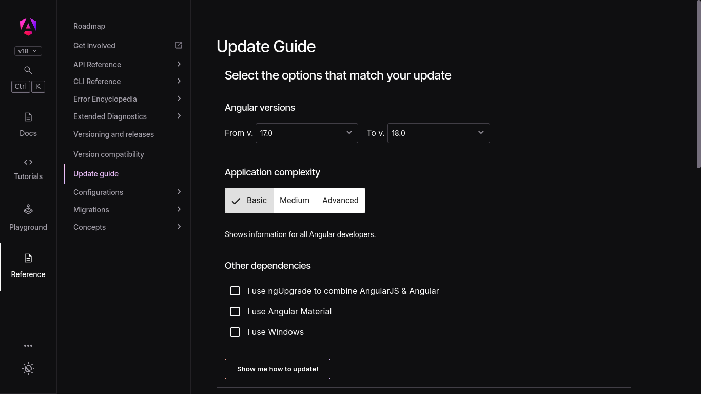
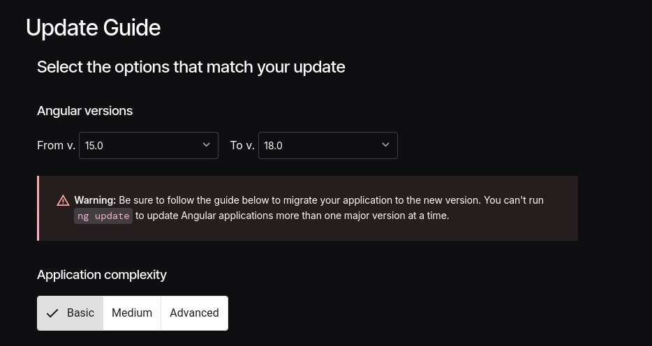
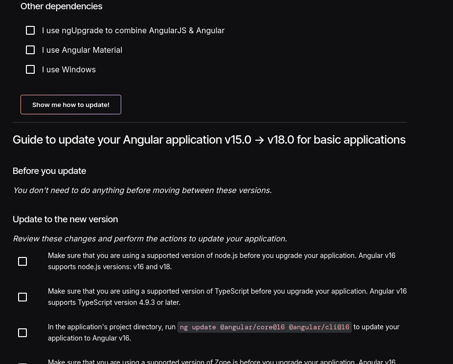

# Angular


Angular คือ web framework หรือชุดเครื่องมือสำหรับสร้างเว็บไซต์ที่พัฒนาโดยทีมของบริษัท Google ซึ่งมีเครื่องมือต่างๆ พร้อมใช้งานในตัว นอกจากนี้ยังถือเป็น framework แรกที่ใช้ [TypeScript](https://roadmap.thaiprogrammer.org/paths/web-guideline/frontend/typescript.html) เป็นหลักจึงทำให้โค้ดมีคุณภาพและพัฒนาต่อได้ง่ายขึ้น และเป็น framework ที่ใช้เทคนิค Dependency Injection ที่คล้ายกับในภาษา Java หรือ C# อีกด้วย ใช้ในการพัฒนาเว็บแอปพลิเคชั่นและเว็บไซต์ต่างๆ แต่จะนิยมในองค์กรระดับ enterprise มากกว่า

> [!warning]
> เนื้อหา Angular ในหน้านี้ไม่ได้แนะนำการใช้ [AngularJS](https://angularjs.org/) ซึ่งเป็นเวอร์ชั่นแรกที่โครงสร้างต่างกับ Angular ปัจจุบันอย่างมาก เวลาที่ผู้เขียนกล่าวถึง Angular จะหมายถึง Angular เวอร์ชั่นปัจจุบัน (หรือที่มักเรียกว่า Angular2+)
>
> Angular != AngularJS

---

### Table of Contents

[[toc]]

## คุณสมบัติหลักของ Angular

### TypeScript

[TypeScript](https://roadmap.thaiprogrammer.org/paths/web-guideline/frontend/typescript.html) แท้จริงแล้วคือ [JavaScript](https://roadmap.thaiprogrammer.org/paths/web-guideline/frontend/javascript.html) แต่ถูกพัฒนามาให้มี Type System ซึ่งสามารถกำหนดประเภทข้อมูลของตัวแปรได้ สามารถดักจับ error ก่อนรันโค้ดได้ และมาพร้อมกับ utilities ต่างๆ ซึ่งช่วยให้การพัฒนาโปรแกรมง่ายขึ้น Angular ถือเป็น framework แรกๆ ในท้องตลาดที่รองรับการใช้งาน TypeScript อย่างเต็มที่

### MVC-based Architecture


MVC ย่อมาจาก Model-View-Controller เป็น Software Design Pattern รูปแบบหนึ่งที่นิยมใช้กัน และมีใช้ใน Angular แนวคิดหลักจะแบ่งการทำงานของซอฟต์แวร์ออกเป็น 3 ส่วนคือ

- Model -> ส่วนจัดการข้อมูล
- View -> ส่วนแสดงผลข้อมูล หรือ UI
- Controller -> ส่วนกลางที่ติดต่อระหว่าง Model และ View คอยควบคุมการรับ-ส่งข้อมูล

เนื่องจาก MVC แยกส่วนการทำงานได้ชัดเจน จึงช่วยให้การทำ Testing โค้ดง่ายขึ้น โค้ดมีความ modular ขึ้น นำไปใช้งานซ้ำได้และ maintain ได้ง่าย เหมาะสำหรับทีมใหญ่

### Standalone Components

Standalone Components เป็น component ประเภทใหม่ใน Angular ที่สร้างมาเพื่อลดการใช้งาน `NgModule` เนื่องจากแต่เดิม การจะใช้งาน component หรือ service ต่างๆ ภายใน Angular จำเป็นต้อง import ทุกอย่างเข้าในไฟล์ module ก่อน แล้วนำ module ออกไปใช้อีกที ซึ่งในบางกรณีการต้องทำ module เพื่อ import component นั้นเยอะเกินความจำเป็น และยากที่นักพัฒนาใหม่ๆ จะเรียนรู้ได้ ดังนั้น Standalone Component จึงเป็นวิธีการสร้าง component เดี่ยวๆ โดยไม่ขึ้นตรงกับ module ใดเลย และสามารถ import เข้าไปใน component อื่นได้โดยตรง

> [!info]
> ทีมงาน Angular แนะนำให้ใช้ Standalone Component ในการพัฒนาเว็บ Angular เวอร์ชั่นใหม่ๆ

### Signals

Signals เป็นระบบที่สามารถปรับตัวและติดตามค่าของข้อมูลโดยอัตโนมัติเมื่อ state มีการเปลี่ยนแปลง ตัว Signals สามารถมีค่าเป็นอะไรก็ได้ ตั้งแต่ข้อมูลระดับเริ่มต้น (primitive) จนถึงข้อมูลที่มีความซับซ้อน ระบบนี้ช่วยปรับปรุง runtime performance ของ Angular ให้ดียิ่งขึ้น จากเดิมที่ทำ change detection โดยการตรวจจับ component ทุกตัวในหน้านั้น

### Dependency Injection

Dependency Injection เป็นเทคนิคในการส่งต่อ (inject) โค้ดหรือ dependency ลงไปในระบบที่ต้องการใช้แทนการสร้าง dependency ใหม่ คล้ายกับในภาษา [Java](https://roadmap.thaiprogrammer.org/paths/java/100-java-fundamentals/100-basic-syntax) หรือ [C#](https://roadmap.thaiprogrammer.org/paths/aspnet-core/basics-of-csharp/100-csharp.html)

### Two-way data binding

Two-way data binding เป็นรูปแบบหนึ่งในการผูกข้อมูลเข้ากับ UI เพื่อแสดงผลข้อมูล โดยความต่างระหว่างระบบนี้กับ One-way data binding ที่หลายคนอาจเจอใน [React](https://roadmap.thaiprogrammer.org/paths/web-guideline/frontend/react.html) ก็คือ หากข้อมูลอัปเดต UI ก็จะอัปเดตด้วย และกลับกัน ถ้า UI มีการอัปเดต ข้อมูลที่อยู่เบื้องหลังก็จะอัปเดตตามไปด้วยเช่นกัน

### Control Flow

Control Flow เป็นตัวเลือกใหม่ในการแสดงผลข้อมูลแบบมีเงื่อนไข (conditionals) และวนซ้ำ (loops) จากเดิมที่จะต้องเขียน directive ภายใน tag เช่น `*ngIf`, `*ngFor` ก็สามารถเขียนเป็น `@if` และ `@for` แทนได้เลย โดย syntax ก็ง่ายเหมือนเขียน `if` หรือ `for` JavaScript

```html
<!-- การใช้ @if Control Flow แสดงผลตามเงื่อนไข -->
@if (streamingService === 'Netflix') {
<div>Peaky Blinders</div>
} @else {
<div>Ted Lasso</div>
}

<!-- เทียบกับการใช้ *ngIf -->
<div *ngIf="streamingService === 'Netflix'; else appleTVShow">
  Peaky Blinders
</div>

<ng-template #appleTVShow>
  <div>Ted Lasso</div>
</ng-template>
```

### Built-in Modules

Angular มาพร้อมกับเครื่องมือและ libraries ต่างๆ ในตัวเพื่อให้พร้อมพัฒนาเว็บไซต์ได้เลยทันทีโดยไม่ต้องโหลด library จากภายนอก เช่น Angular Routing เพื่อทำ Routing, HTTP Client สำหรับรับหรือส่งคำขอ HTTP, [Jasmine](https://jasmine.github.io/) และ [Karma](https://karma-runner.github.io/latest/index.html) เพื่อการทำ Unit Testing, Angular Internationalization เพื่อแปลภาษาหรือเรียกว่า i18n และอื่นๆ อีกมากมาย

## การเริ่มต้นใช้งาน Angular

### สิ่งที่ต้องมี

- [Node.js](https://roadmap.thaiprogrammer.org/paths/web-guideline/backend/nodejs.html) เวอร์ชั่น 18.19.1 ขึ้นไป
- โปรแกรมเขียนโค้ด เช่น Visual Studio Code
- Terminal สำหรับพิมพ์คำสั่ง CLI

### ติดตั้ง Angular CLI

```bash
npm install -g @angular/cli
```

### สร้างโปรเจคท์ใหม่

ใช้คำสั่ง `ng-new` ตามด้วยชื่อโปรเจคท์ที่ต้องการ

```bash
ng new <project-name>
```

ระหว่างนี้จะมีตัวเลือกมาให้เลือก 2-3 ตัว เมื่อเลือกเสร็จแล้วก็จะเริ่มสร้างโปรเจคท์ Angular ของเราขึ้นมา

### File Structure

สมมติให้โปรเจคท์ชื่อ `ng-project` แล้วโครงสร้างของโปรเจคท์ที่ได้จะมีหน้าตาประมาณนี้ ขึ้นอยู่กับว่าเลือกตัวเลือกตอน `ng new` เป็นอะไรบ้าง

```
ng-project/
├── angular.json
├── package.json
├── package-lock.json
├── public
│   └── favicon.ico
├── README.md
├── src
│   ├── app
│   │   ├── app.component.css
│   │   ├── app.component.html
│   │   ├── app.component.spec.ts
│   │   ├── app.component.ts
│   │   ├── app.config.ts
│   │   └── app.routes.ts
│   ├── index.html
│   ├── main.ts
│   └── styles.css
├── tsconfig.app.json
├── tsconfig.json
└── tsconfig.spec.json
```

### สร้างและใช้งาน Component แรก

สร้าง Component ใหม่โดยรันคำสั่ง `ng generate component` ตามด้วยชื่อ Component ของเราได้เลย

```bash
ng generate component <your-component-name-here>
```

หรือใช้ตัวย่อ `ng g c` ได้เช่นกัน

```bash
ng g c <your-component-name-here>
```

จากนั้น CLI จะสร้าง Component ขึ้นมาให้เรา 4 ไฟล์ประกอบด้วยไฟล์ HTML, CSS, TypeScript และไฟล์สกุล `.spec.ts` ซึ่งเป็นไฟล์สำหรับทำ Testing นั่นเอง ต่อมาเราก็มาเขียน Component แรกของเรากัน

```ts
// todo-list-item.component.ts
@Component({
  standalone: true,
  selector: "todo-list-item",
  templateUrl: "./todo-list-item.component.html",
  styleUrl: "./todo-list-item.component.css",
})
export class TodoListItem {
  /* เขียนการทำงานของ Component ตรงนี้ */
}
```

```html
<!-- todo-list-item.component.html -->
<li>(TODO) Read Angular Essentials Guide</li>
```

```css
/* todo-list-item.component.css */
li {
  color: red;
  font-weight: 300;
}
```

เสร็จแล้วถ้าต้องการนำ `TodoListItem` ไปใช้ ก็ให้ import ที่ตัว Component ตัวหลัก ที่อยากให้ใช้ได้เลย โดยนำเข้าภายใต้ `imports` property ที่อยู่ใน `@Component` decorator

```ts{5}
// app.component.ts
import { TodoListItem } from "./todo-list-item.component.ts";
@Component({
  standalone: true,
  imports: [TodoListItem],
  template: `
    <ul>
      <todo-list-item></todo-list-item>
    </ul>
  `,
})
export class App {}
```

### การจัดการ State และข้อมูล

#### การประกาศและอัปเดต State

เรามาเริ่มจัดการ state ในโปรเจคท์ของเราด้วยการประกาศตัวแปรภายใน `.component.ts` กัน

1. `taskTitle` -> เพื่อกำหนดว่า task ชื่ออะไร
2. `isComplete` -> เพื่อกำหนดว่า task เสร็จหรือยัง

```ts{4-5}
// todo-list-item.component.ts
@Component({ ... })
export class TodoListItem {
  taskTitle = '';
  isComplete = false;
}
```

วิธีการอัปเดตค่าของ property ต่างๆ ของเรา ทำได้โดยการสร้างฟังก์ชั่น ซึ่งจะสามารถเรียกใช้ property ใน Class ของเราได้ผ่านคีย์เวิร์ด `this`

```ts{7,10}
// todo-list-item.component.ts
@Component({ ... })
export class TodoListItem {
  taskTitle = '';
  isComplete = false;
  completeTask() {
    this.isComplete = true;
  }
  updateTitle(newTitle: string) {
    this.taskTitle = newTitle;
  }
}
```

#### การ Render ข้อมูล

Angular ทำ interpolation หรือการแทนที่ข้อมูลโดยใช้วงเล็บปีกกาสองชั้นเพื่อใส่ property เข้าไปดังตัวอย่าง

```ts{3}
@Component({
  selector: "todo-list-item",
  template: ` <p>Title: {{ taskTitle }}</p> `,
})
export class TodoListItem {
  taskTitle = "Read cup of coffee";
}
```

```html
<!-- เมื่อ render ออกมาแล้วจะมีหน้าตาแบบนี้ -->
<p>Title: Read cup of coffee</p>
```

#### Conditional Rendering

Angular มีวิธีเรนเดอร์ข้อมูลตามเงื่อนไข 2 วิธี คือวิธีเดิมที่ใช้ Directive (เวอร์ชั่นก่อนหน้า Angular 16) และวิธีใหม่ที่ใช้ [Control Flow](#control-flow) (เวอร์ชั่น 17 เป็นต้นไป) โดยจะเขียนแนะนำทั้งสองแบบ กรณีผู้อ่านเจอกับ codebase เก่า

1. วิธีเดิม -> `*ngIf`, `*ngFor`
2. วิธีใหม่ -> `@if`, `@else` และ `@for`

##### `@if` และ `@else` / `*ngIf`

`if` ใช้แสดงผลข้อมูลตามเงื่อนไข ในวิธีใหม่ เราสามารถเขียน `@if` Control Flow แบบนี้ได้เลย ซึ่งคล้ายกับ JavaScript มากๆ ส่วนวิธีเดิมก็เขียน `*ngIf` ภายใน HTML Tag ที่เราต้องการ แล้วใส่ property ลงไป

```ts{7-11}
// Control Flow
// user-controls.component.ts
@Component({
  standalone: true,
  selector: "user-controls",
  template: `
    @if (isAdmin) {
    <button>Erase database</button>
    } @else {
    <p>You are not authorized.</p>
    }
  `,
})
export class UserControls {
  isAdmin = true;
}
```

กรณีที่จะทำ if-else ด้วยวิธีเดิมนั้น เราจะเขียนต่อท้าย property ด้วย `else` แล้วจากนั้นใส่ชื่อ template ใหม่ให้ Angular เรนเดอร์ ยกตัวอย่างเช่น `notPermitted` แล้วจึงเขียน `<ng-template>` ตามด้วยเครื่องหมาย `#` และชื่อ template ของเราก่อนหน้านี้

```ts{8-10}
// *ngIf Directive
// user-controls.component.ts
@Component({
  selector: "user-controls",
  template: `
    <button *ngIf="isAdmin; else notPermitted">Erase database</button>

    <ng-template #notPermitted>
      <p>You are not authorized.</p>
    </ng-template>
  `,
})
export class UserControls {
  isAdmin = true;
}
```

##### `@for` / `*ngFor`

`@for` เขียนเหมือนกับ `for...of` loop ใน JavaScript เช่นเดียวกัน

```html
<!-- ingredient-list.component.html -->
<ul>
  @for (ingredient of ingredientList; track ingredient.name) {
  <li>{{ ingredient.quantity }} - {{ ingredient.name }}</li>
  }
</ul>
```

```ts
// ingredient-list.component.ts
@Component({
  standalone: true,
  selector: "ingredient-list",
  templateUrl: "./ingredient-list.component.html",
})
export class IngredientList {
  ingredientList = [
    { name: "noodles", quantity: 1 },
    { name: "miso broth", quantity: 1 },
    { name: "egg", quantity: 2 },
  ];
}
```

ส่วน `*ngFor` จะมีหน้าตาแบบนี้

```html
<ul>
  <li *ngFor="let ingredient of ingredientList">
    {{ ingredient.quantity }} - {{ ingredient.name }}
  </li>
</ul>
```

### การใช้งาน Signals

จากที่ได้อธิบายเรื่อง [Signals](#signals) ไปแล้ว เราจะมาสร้าง signal ใช้งานกัน Signals ใน Angular เป็นได้สองแบบ คือแบบ writable เปลี่ยนแปลงค่าได้ กับ read-only อ่านข้อมูลได้อย่างเดียวเท่านั้น

#### Writable Signals

เราประกาศ signal ได้แบบนี้

```ts
const count = signal(0);
// Signals เป็นฟังก์ชั่น getter หมายความว่าถ้าเรียกฟังก์ชั่นก็จะได้ค่าออกมาเลย
console.log("The count is: " + count());
```

และตั้งค่าใหม่โดยใช้ `.set()`

```ts
count.set(3);
```

หรือจะใช้ `.update()` เพื่ออัปเดตค่าใน signal โดยใช้ข้อมูลเดิม

```ts
// เพิ่ม count ครั้งละ 1
count.update((value) => value + 1);
```

#### Computed Signals

Computed Signals เป็นประเภท read-only ที่นำค่าจาก signal อื่นมาใช้ ซึ่งเราใช้คำสั่ง `computed` ในการประกาศ

```ts
const count: WritableSignal<number> = signal(0);
const doubleCount: Signal<number> = computed(() => count() * 2);
```

`doubleCount` ใช้ค่าจาก `count` ฉะนั้นเมื่อ `count` อัปเดต Angular จะรู้ทันทีว่า `doubleCount` ต้องมีค่าเปลี่ยนไปด้วย

### Dependency Injection

เราจะสาธิตการทำ Dependency Injection เริ่มจากการสร้าง Service ก่อนโดยใช้ `ng generate service`

```bash
ng generate service <your-service-name-here>
```

จะได้ service หน้าตาคล้ายแบบนี้

```ts
import { Injectable } from "@angular/core";
@Injectable({
  providedIn: "root",
})
export class HeroService {}
```

สังเกตว่า Service จะมี `@Injectable` decorator อยู่ด้วย ซึ่งบอกให้ Angular รู้ว่า `HeroService` สามารถใช้ทำ Dependency Injection ได้ ส่วนท่อน `providedIn: 'root'` หมายความว่า `HeroService` จะถูกนำไปใช้ทั่วทั้งโปรเจคท์

ส่วนการ inject ใน Angular ให้เรา import dependency เข้ามาที่ `providers` เราทำได้ผ่าน `constructor()` ของ Component ของเรา แล้วใส่ dependency ของเราลงใน argument ของ `constructor()` ตามโค้ดด้านล่าง เท่านี้ก็เรียกใช้ `heroService` ใน Component ของเราได้แล้ว

```ts{5,8}
@Component({
  standalone: true,
  selector: "hero-list",
  template: "...",
  providers: [HeroService],
})
class HeroListComponent {
  constructor(heroService: HeroService);
}
```

หรือจะใช้ฟังก์ชั่น `inject()` ในการเรียกใช้ service ของเราก็ได้เช่นกัน โดยไม่จำเป็นต้องใช้ `constructor()`

```ts
class HeroListComponent {
  heroService = inject(HeroService);
}
```

### การทำ Forms ใน Angular

Angular สามารถทำ forms ได้สองแบบคือ Reactive forms กับ Template-driven form แต่ละแบบมีวิธีการประมวลผลข้อมูลต่างกัน สามารถเลือกได้ตามความเหมาะสมโดยคิดจากตารางด้านล่างนี้

| ฟอร์ม                 |                                                                                                                         รายละเอียด                                                                                                                          |
| --------------------- | :---------------------------------------------------------------------------------------------------------------------------------------------------------------------------------------------------------------------------------------------------------: |
| Reactive forms        | สามารถเรียกใช้หรือเปลี่ยนแปลงข้อมูลของฟอร์มผ่าน object model ของฟอร์มนั้นได้โดยตรง ระบบจะ scale ได้ง่ายกว่า โครงสร้างแข็งแรงกว่าและ test ได้ง่าย เลือกใช้ Reactive forms หากการทำแบบฟอร์มเป็นฟีเจอร์สำคัญของระบบ หรือตัวโปรเจคท์ที่ทำเน้น reactive อยู่แล้ว |
| Template-driven forms |        เน้นใช้ directive ในการสร้างและเปลี่ยนแปลงค่าของแบบฟอร์ม มีความตรงไปตรงมาในการใช้งานมากกว่าและง่ายกว่าสำหรับแบบฟอร์มที่ไม่ซับซ้อน แต่จะ scale ได้ยากกับฟอร์มที่ซับซ้อนสูง ใช้ Template-driven forms หากแบบฟอร์มที่ใช้ในระบบเป็นแบบฟอร์มง่ายๆ         |

#### Reactive Forms

เราใช้ `FormControl` ตรงๆ ภายใน component ของเรา โดยมี directive `[formControl]` เป็นตัวเชื่อม

```ts{6,10}
import { Component } from "@angular/core";
import { FormControl } from "@angular/forms";
@Component({
  selector: "app-reactive-favorite-color",
  template: `
    Favorite Color: <input type="text" [formControl]="favoriteColorControl" />
  `,
})
export class FavoriteColorComponent {
  favoriteColorControl = new FormControl("");
}
```

#### Template-driven Forms

วิธีนี้จะใช้ `[(ngModel)]` ซึ่งจะจัดการข้อมูลภายในตัวมันเองอีกที เราเพียงแค่ใส่ property ที่ต้องการลงไป

```ts{5,9}
import { Component } from "@angular/core";
@Component({
  selector: "app-template-favorite-color",
  template: `
    Favorite Color: <input type="text" [(ngModel)]="favoriteColor" />
  `,
})
export class FavoriteColorComponent {
  favoriteColor = "";
}
```

## การอัปเดตเวอร์ชั่นของ Angular (Migration Guide)

Angular มี [release cycle ที่ค่อนข้างถี่](https://angular.dev/reference/releases#release-frequency) อาจจะทำให้บาง codebase ที่ใช้ Angular กลายเป็นเวอร์ชั่นเก่าเร็วตามไปด้วย หากต้องการอัปเดตไปใช้เวอร์ชั่นใหม่ ทาง Angular จะมี [Update Guide](https://angular.dev/update-guide) ให้

> [!info]
> ขอให้คาดหวังว่าจะมี release cycle ดังต่อไปนี้:
>
> - Major release ทุกๆ 6 เดือน
> - Minor release 1-3 รอบต่อ major release แต่ละครั้ง
> - Patch release และ pre-release (`next` หรือ `rc`) build เกือบทุกสัปดาห์
>
> จาก https://angular.dev/reference/releases#release-frequency

เมื่อกดลิงก์ Update Guide แล้ว จะเข้ามาสู่หน้านี้



สามารถเลือกเวอร์ชั่นที่ต้องการอัปเดต ความซับซ้อนของ codebase รวมไปถึงตัวเลือกอื่นๆ ด้านล่างได้เลย



> [!warning]
> ถ้าอยากอัปเดตแบบข้ามหลายเวอร์ชั่น (15 ไป 18) Angular จะเตือนเราให้ค่อยๆ อัปเดตทีละเวอร์ชั่นตั้งแต่ 15 จนกว่าจะถึง 18 ซึ่งจะออกมาเป็น 15 > 16 > 17 > 18
>
> แต่ถ้าอัปเดตขึ้นไปเวอร์ชั่นเดียว รันคำสั่ง `ng update` ก็ค่อนข้างเพียงพอแล้ว

จะมี checklist ในการอัปเดตโผล่มาด้านล่าง สามารถไล่ดูแต่ละอย่างแล้วทำตามไปได้เลย



## ตัวอย่างเว็บไซต์ / บริการที่ใช้ Angular

- **[Battle.net](https://us.shop.battle.net/en-us)** - แพลตฟอร์มขายเกมของ Blizzard ที่ให้ดาวน์โหลดและอัปเดตเกม
- **[Otter.ai](https://otter.ai/)** - แอปที่ช่วยถอดความการประชุมและสรุปข้อมูล
- **[Google Gemini](https://gemini.google.com/app)** - แพลตฟอร์ม AI ของ Google
- **[Clickup](https://app.clickup.com/login)** - เครื่องมือจัดการโปรเจกต์ที่ช่วยให้ทีมทำงานร่วมกันได้ง่าย
- **[UPS](https://www.ups.com/us/en/Home.page)** - บริษัทขนส่งพัสดุและโลจิสติกส์ระดับโลก
- **[Deutsch Bank Developer Portal](https://developer.db.com/)** - แหล่งข้อมูลสำหรับนักพัฒนาที่ต้องการใช้บริการของ Deutsche Bank
- **[Citibank](https://www.citi.com/)** - ธนาคารที่ให้บริการทางการเงินออนไลน์และสาขาทั่วโลก ครอบคลุมการธนาคารส่วนบุคคลและธุรกิจ
- **[JetBlue](https://www.jetblue.com/)** - สายการบินต้นทุนต่ำในสหรัฐอเมริกาที่ให้บริการเที่ยวบินภายในและระหว่างประเทศ
- **[Delta Airlines](https://www.delta.com/)** - สายการบินหลักของสหรัฐฯ ให้บริการบินไปยังจุดหมายปลายทางทั่วโลก
- **[Freelancer.com](https://www.freelancer.com/)** - แพลตฟอร์มที่เชื่อมต่อฟรีแลนซ์กับผู้ว่าจ้างงานในหลากหลายสายอาชีพ
- **[Google Fonts](https://fonts.google.com/)** - คลังฟอนต์ฟรีสำหรับใช้ในการออกแบบเว็บไซต์และงานกราฟิกต่างๆ
- **[Google Console Cloud](https://console.cloud.google.com/)** - แพลตฟอร์มบริการคลาวด์ของ Google สำหรับการพัฒนาและจัดการแอปพลิเคชัน

## แนะนำ Resources ที่เกี่ยวกับ Angular

🇹🇭 - Resource นี้เป็นภาษาไทย / มีภาษาไทย

🌟 - Resource ที่แนะนำโดยผู้เขียน

🌐 - Resource ที่เป็นแหล่งรวม resource อีกที (index)

### ช่อง YouTube

- 🌟 **[Decoded Frontend](https://www.youtube.com/@DecodedFrontend)**
- 🌟 **[Joshua Morony](https://www.youtube.com/c/JoshuaMorony)** - Google Developer Expert
- 🌟 **[nivek](https://www.youtube.com/@nivekDev/)** - Google Developer Expert
- 🌟 **[Angular University](https://www.youtube.com/@AngularUniversity)**
- **[Official Angular YouTube Channel](https://www.youtube.com/@Angular)** - ช่อง YouTube ทางการของ Angular
- **[Code Shots with Profanis](https://www.youtube.com/c/CodeShotsWithProfanis)** - Google Developer Expert
- **[Deborah Kurata](https://www.youtube.com/@deborah_kurata)** - Google Developer Expert
- **[Monsterlessons Academy](https://www.youtube.com/@MonsterlessonsAcademy)**
- **[ng-conf](https://www.youtube.com/@ngconfonline)** - งาน conference ออนไลน์สำหรับ Angular

### คอร์ส / คลิปสอน

- 🌟 **[Official Interactive Angular Learning](https://angular.dev/tutorials/learn-angular)**
- 🇹🇭 **[มาฝึก Basic Angular ผู้เริ่มต้นใหม่จำเป็นต้องรู้](https://www.youtube.com/watch?v=gns5f_VVRm8)**
- 🇹🇭 **[เรียนรู้พื้นฐานการทำเว็บด้วย Angular + Material UI](https://www.youtube.com/watch?v=VPvcJtn3Zyc)**
- **[Angular 17 Crash Course Playlist](https://youtube.com/playlist?list=PL3i9po_eXL_px7fJ7nv8MtfP1ZmKD8UMV&si=1jDTUekEl9Fb8pz_)**
- **[freeCodeCamp | Angular and Supabase Course – Build a Realtime Chat Application](https://www.youtube.com/watch?v=Dg7bZUFopUo&pp=ygUtZnJlZWNvZGVjYW1wIGFuZ3VsYXIgY2hhbm5lbDpmcmVlQ29kZUNhbXAub3Jn "Angular and Supabase Course – Build a Realtime Chat Application")**
- **[freeCodeCamp | Code a Chess Game with Stockfish API – JavaScript Tutorial](https://www.youtube.com/watch?v=fJIsqZmQVZQ&t=235s&pp=ygUUZnJlZWNvZGVjYW1wIGFuZ3VsYXI%3D)**
- **[Angular Course with NgRx - Building Angular Project From Scratch](https://www.youtube.com/watch?v=vcfZ0EQpYTA)**
- **[Egghead.io Angular Basics](https://egghead.io/courses/angular-basics)**

### Blogs

- 🌟 **[Official Angular Blog](https://blog.angular.dev/)**
- 🌟 **[Angular Experts](https://angularexperts.io/blog)**
- 🌟 **[Angular University Blog](https://blog.angular-university.io/)**
- 🌟 **[Christian Lüdemann](https://christianlydemann.com/)**
- **[Angular Architects Blog](https://www.angulararchitects.io/en/blog/)**
- **[Robin Goetz](https://goetzrobin.github.io/)**
- **[Brandon Roberts](https://brandonroberts.dev/blog)** - Google Developer Expert
- **[Minko Gechev](https://blog.mgechev.com/)** - ทีมงาน Angular
- **[Tim Deschryver](https://timdeschryver.dev/blog?q=Angular)**
- **[Daniel Kreider](https://danielk.tech/)**
- **[ThisDot Blog Angular](https://www.thisdot.co/blog?tags=angular)**
- **[Chau Tran](https://nartc.me/)**

### คอมมูนิตี้ อีเวนต์และงานสัมมนา

- 🌟 **[Discord ทางการของ Angular](https://discord.gg/angular)**
- 🌟 **[NG-CONF](https://ng-conf.org/)** - งานสัมมนา Angular
- 🌐 **[Angular Communities](https://www.angular-communities.com/)** - เว็บรวมคอมมูนิตี้ Angular ระดับ local ทั่วโลก
- **[angular.love](https://angular.love/)** - เว็บคอมมูนิตี้ของชาว Angular
- **[r/Angular2](https://www.reddit.com/r/Angular2/)** - Subreddit สำหรับ Angular
- **[JavaScript & Angular Days](https://javascript-days.de/)** - อีเวนต์เกี่ยวกับ JavaScript, React, Angular และ TypeScript ในเยอรมัน
- **[Angularday Italy](https://angularday.it)** - อีเวนต์ Angular ในอิตาลี

### Libraries and Tools

#### UI / Components

- **[Angular Material](https://material.angular.io/)**
- **[PrimeNG](https://primeng.org/)**
- **[NG-ZORRO](https://ng.ant.design/docs/introduce/en)**
- **[Onsen UI](https://onsen.io/)**
- **[Taiga UI](https://taiga-ui.dev/)**
- **[Ionic Angular](https://ionicframework.com/docs/angular/overview)**

#### State Management

- 🌟 **[NGRX](https://ngrx.io/)**
- **[StateAdapt](https://state-adapt.github.io/angular)**
- **[RxAngular](https://www.rx-angular.io/)**

#### Authentication

- 🌟 **[Auth0 Angular](https://github.com/auth0/auth0-angular)**
- **[angular2-jwt](https://github.com/auth0/angular2-jwt)**
- **[ngx-permissions](https://github.com/AlexKhymenko/ngx-permissions)**

#### Utilities

- **[ngxtension](https://ngxtension.netlify.app/)**
- **[ng-util](https://github.com/ng-util/ng-util)**

### Frameworks

- **[AnalogJS](https://analogjs.org/)** - Angular meta-framework (เหมือน [Next.js](https://roadmap.thaiprogrammer.org/paths/web-guideline/frontend/nextjs) สำหรับ Angular)
- **[Spartan](https://www.spartan.ng/)** - Tech stack และเครื่องมือล้ำสมัยสำหรับพัฒนาโปรเจคท์ Angular แบบ Full-stack
- **[Scully](https://scully.io/)** - Static Site Generator สำหรับ Angular

### อื่นๆ

- 🌐 **[PatrickJS Awesome Angular](https://patrickjs.github.io/awesome-angular/)**
- 🌐 **[Angular @ framework.dev](https://angular.framework.dev/)**
- **[Angular Snippets](https://angularsnippets.dev/)**
- **[Angular Performance Checklist](https://github.com/mgechev/angular-performance-checklist)**

## อ่านเพิ่มเติม

- 🌟 **[เว็บไซต์ Angular ทางการ](https://angular.dev/)**
- 🇹🇭 **[Data Binding with view model Part 1](https://medium.com/@jojoekung/data-binding-with-view-model-part-1-4af9443aea15)**
- 🇹🇭 **[การเชื่อมโยงข้อมูล Data Binding รูปแบบต่างๆ ใน Angular](https://www.ninenik.com/%E0%B8%81%E0%B8%B2%E0%B8%A3%E0%B9%80%E0%B8%8A%E0%B8%B7%E0%B9%88%E0%B8%AD%E0%B8%A1%E0%B9%82%E0%B8%A2%E0%B8%87%E0%B8%82%E0%B9%89%E0%B8%AD%E0%B8%A1%E0%B8%B9%E0%B8%A5_Data_Binding_%E0%B8%A3%E0%B8%B9%E0%B8%9B%E0%B9%81%E0%B8%9A%E0%B8%9A%E0%B8%95%E0%B9%88%E0%B8%B2%E0%B8%87%E0%B9%86_%E0%B9%83%E0%B8%99_Angular-787.html)**
- 🇹🇭 **[MVC Web Application Framework คืออะไร? ก็เธอมันน่ารักเกินต้านขนาดนี้](https://medium.com/@voraguns/mvc-web-application-framework-%E0%B8%84%E0%B8%B7%E0%B8%AD%E0%B8%AD%E0%B8%B0%E0%B9%84%E0%B8%A3-%E0%B8%81%E0%B9%87%E0%B9%80%E0%B8%98%E0%B8%AD%E0%B8%A1%E0%B8%B1%E0%B8%99%E0%B8%99%E0%B9%88%E0%B8%B2%E0%B8%A3%E0%B8%B1%E0%B8%81%E0%B9%80%E0%B8%81%E0%B8%B4%E0%B8%99%E0%B8%95%E0%B9%89%E0%B8%B2%E0%B8%99%E0%B8%82%E0%B8%99%E0%B8%B2%E0%B8%94%E0%B8%99%E0%B8%B5%E0%B9%89-fb7562f8602d)**
- 🇹🇭 **[Dependency Injection คืออะไร](https://medium.com/@masterkeys/dependency-injection-%E0%B8%84%E0%B8%B7%E0%B8%AD%E0%B8%AD%E0%B8%B0%E0%B9%84%E0%B8%A3-85f47720e769)**
- **[Angular Signals: Complete Guide](https://blog.angular-university.io/angular-signals/)**
- **[Angular Control Flow - Angular Experts](https://angularexperts.io/blog/angular-control-flow/)**
- **[Two way Data Binding vs One way Data Binding](https://ranveersequeira.medium.com/two-way-data-binding-vs-one-way-data-binding-67f3f97a5a05)**
