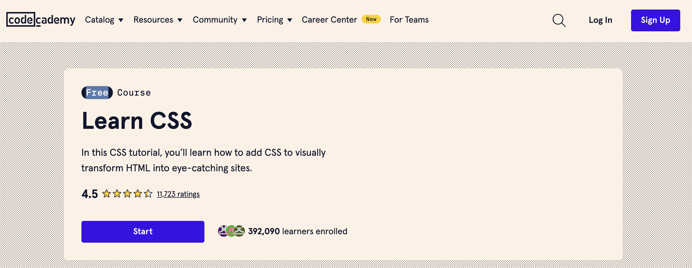
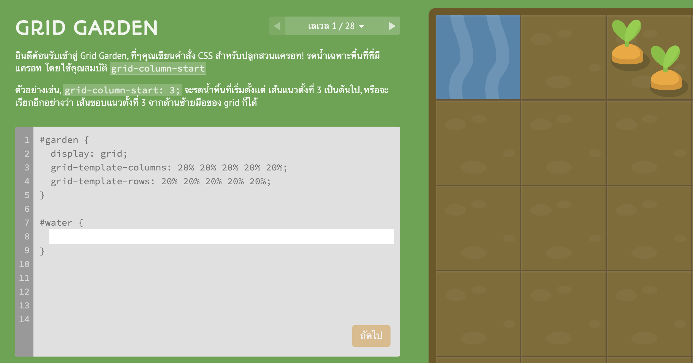
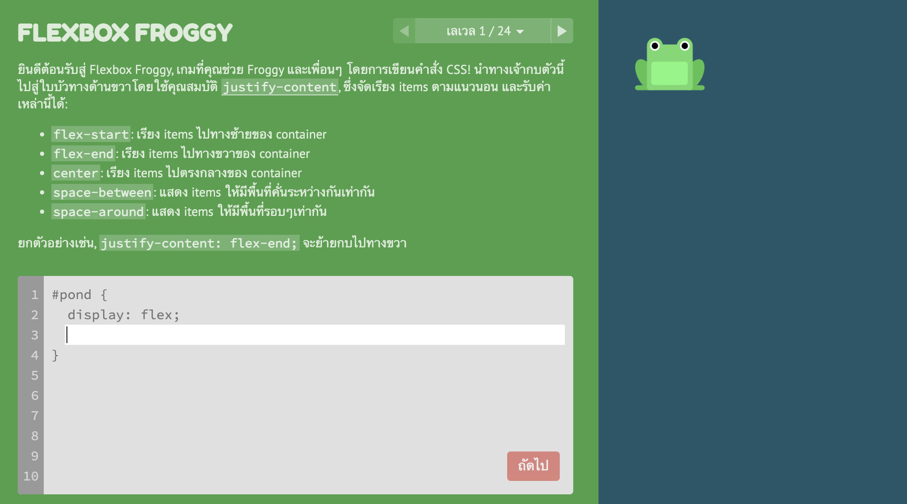
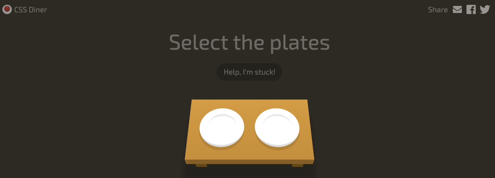
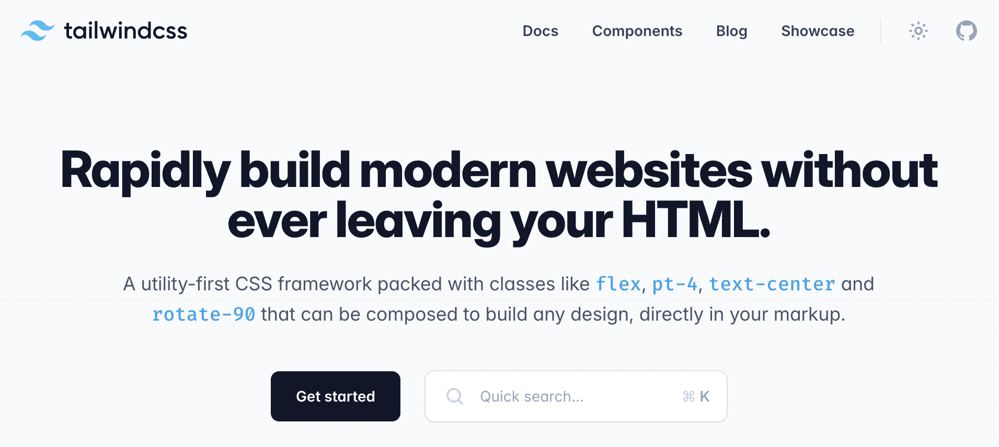

# CSS

CSS (Cascading Style Sheets) คือภาษาที่ใช้สำหรับการออกแบบและตกแต่งหน้าเว็บ ช่วยในการกำหนดลักษณะการแสดงผลของ HTML เช่น สี, ขนาด, การจัดวาง และฟอนต์ขององค์ประกอบต่าง ๆ CSS ช่วยให้การแยกส่วนของโครงสร้าง (HTML) และรูปแบบ (CSS) เป็นไปได้อย่างชัดเจนและง่ายต่อการจัดการ

## โครงสร้างพื้นฐานของ CSS ประกอบด้วย:

1. **Selectors**: ระบุองค์ประกอบที่ต้องการนำสไตล์ไปใช้ เช่น `h1`, `.class`, `#id`
2. **Properties**: คุณสมบัติต่าง ๆ ที่ใช้สำหรับการตกแต่ง เช่น `color`, `font-size`, `margin`
3. **Values**: ค่าที่ระบุให้กับคุณสมบัตินั้น ๆ เช่น `red`, `16px`, `10px`

## ตัวอย่างของ CSS พื้นฐาน:

```css
/* Selectors และ Properties */

h1 {
    color: blue; /* กำหนดสีตัวอักษรเป็นสีฟ้า */
    font-size: 24px; /* กำหนดขนาดฟอนต์ */
    text-align: center; /* จัดข้อความให้อยู่ตรงกลาง */
}

p {
    color: #333; /* กำหนดสีตัวอักษรเป็นสีเทาเข้ม */
    line-height: 1.6; /* กำหนดระยะห่างระหว่างบรรทัด */
    margin: 20px 0; /* กำหนดระยะห่างด้านบนและด้านล่าง */
}

.container {
    width: 80%; /* กำหนดความกว้างของ container */
    margin: 0 auto; /* จัดวาง container ให้อยู่ตรงกลาง */
    padding: 20px; /* กำหนดระยะห่างภายใน */
    border: 1px solid #ccc; /* กำหนดเส้นขอบ */
}
```

## วิธีการรวม CSS กับ HTML มี 3 วิธีหลัก:

1. **Inline CSS**: กำหนดสไตล์ตรงภายในแท็ก HTML โดยใช้ attribute `style`
    ```html
    <h1 style="color: blue; text-align: center;">Welcome to My Website</h1>
    ```

2. **Internal CSS**: กำหนดสไตล์ภายในเอกสาร HTML โดยใช้แท็ก `<style>` ภายใน `<head>`
    ```html
    <head>
        <style>
            body {
                font-family: Arial, sans-serif;
            }
            h1 {
                color: blue;
                text-align: center;
            }
        </style>
    </head>
    ```

3. **External CSS**: กำหนดสไตล์ในไฟล์ CSS แยกต่างหากแล้วลิงก์ไปยังไฟล์นั้นในเอกสาร HTML โดยใช้แท็ก `<link>`
    ```html
    <head>
        <link rel="stylesheet" href="styles.css">
    </head>
    ```

### ตัวอย่างของ External CSS:

```css
/* styles.css */
body {
    font-family: Arial, sans-serif;
    background-color: #f4f4f4;
}

h1 {
    color: blue;
    text-align: center;
}

p {
    color: #333;
    line-height: 1.6;
}
```

## Flexbox และ Grid
เป็นเครื่องมือสำคัญที่ใช้ในการจัดวางองค์ประกอบบนหน้าเว็บอย่างยืดหยุ่นและมีประสิทธิภาพ:

### ตัวอย่างการใช้ Flexbox:

```css
.container {
    display: flex;
    justify-content: center; /* จัดวางให้อยู่ตรงกลางตามแนวนอน */
    align-items: center; /* จัดวางให้อยู่ตรงกลางตามแนวตั้ง */
    height: 100vh; /* กำหนดความสูงเท่ากับความสูงของ viewport */
}
```

### ตัวอย่างการใช้ Grid:

```css
.grid-container {
    display: grid;
    grid-template-columns: repeat(3, 1fr); /* กำหนด 3 คอลัมน์ที่มีขนาดเท่ากัน */
    gap: 10px; /* กำหนดระยะห่างระหว่างคอลัมน์และแถว */
}

.grid-item {
    background-color: #ccc;
    padding: 20px;
    text-align: center;
}
```

การใช้ CSS ทำให้สามารถสร้างเว็บไซต์ที่มีการออกแบบสวยงามและใช้งานได้อย่างมีประสิทธิภาพตามความต้องการของผู้ใช้

## แนะนำคอร์สเรียน
[Learn CSS | Codecademy](https://www.codecademy.com/learn/learn-css?source=post_page-----bc61325951d4--------------------------------)



[Grid Garden](https://cssgridgarden.com/?source=post_page-----bc61325951d4--------------------------------#th)



[Flexbox Froggy](https://flexboxfroggy.com/?source=post_page-----bc61325951d4--------------------------------#th)



[CSS Diner](https://flukeout.github.io/?source=post_page-----bc61325951d4--------------------------------)



## Tailwind CSS

**Tailwind CSS** คือ เฟรมเวิร์ก CSS แบบ utility-first ที่ให้คุณใช้คลาสที่กำหนดไว้ล่วงหน้าเพื่อตกแต่งองค์ประกอบใน HTML โดยตรง ทำให้ง่ายต่อการสร้างและปรับแต่งการออกแบบที่มีความยืดหยุ่นและสอดคล้องกัน ลดความจำเป็นในการเขียน CSS เองและช่วยให้การพัฒนาเว็บเร็วขึ้น

