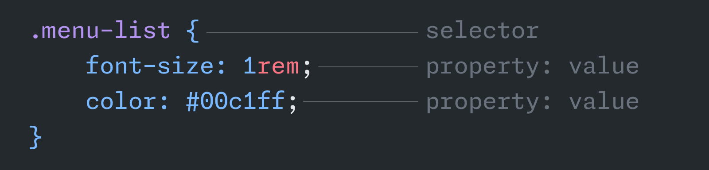
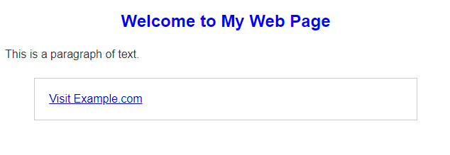

# CSS

CSS (Cascading Style Sheets) คือภาษาที่ใช้กำหนดลักษณะการแสดงผลขององค์ประกอบต่างๆ ของ HTML เช่น สีพื้นหลัง, สีตัวอักษร, ขนาดกว้าง-ยาว, การจัดวาง, รูปแบบตัวอักษรหรือฟอนต์ (Font) ขนาดของฟอนต์ ฯลฯ

หลักการโดยทั่วไปคือ HTML แสดงโครงสร้างและเนื้อหาของเอกสาร ในขณะที่ CSS ทำหน้าที่จัดรูปแบบของเนื้อหา ทั้งสองสิ่งนี้ทำงานร่วมกัน แต่แยกหน้าที่กันอย่างชัดเจน

## โครงสร้างพื้นฐานของ CSS



1. **Selectors**: ระบุองค์ประกอบที่ต้องการนำสไตล์ไปใช้ แบ่งออกเป็นประเภทใหญ่ๆ คือ
   - Type Selectors เช่น `h1`, `p`, `a`
   - Class selectors เช่น `.price`, `.menu-list`, `.cancel-button`
   - ID selectors เช่น `#user-summary-container`
2. **Properties**: คุณสมบัติต่างๆ ที่ต้องการให้อีลีเม้นท์ (Element) นั้นๆ แสดงผลตามเช่น
   - `color`: สีของตัวอักษร
   - `font-size`: ขนาดของตัวฟอนต์
   - `margin`: ระยะห่างภายนอกของอีลีเม้นท์
   - `padding`: พื้นที่เว้นภายในอีลีเม้นท์
3. **Values**: ค่าที่ระบุให้กับคุณสมบัตินั้นๆ ซึ่งขึ้นกับ Properties ด้วย เช่น
   - `red`: ชื่อสี ใช้ได้กับสีตัวอักษร (`color`) สีพื้นหลัง (`background-color`)
   - `#ff00cc`: รหัสสีแบบ Hex Color เช่นเดียวกับชื่อสี
   - `16px`: ขนาดโดยทั่วไปที่ 16 พิกเซล (บนหน้าจอ) อาจใช้กับขนาดอีลีเม้นท์ หรือ ระยะห่างระหว่างอีเม้นท์ หรือ พื้นที่เว้นภายในอีลีเม้นท์

## CSS ถูกใช้งานอย่างไร

ตัวอย่างของ HTML จะเราต้องการจัดรูปแบบด้วย CSS

```html
<!DOCTYPE html>
<html lang="en">
<head>
    <meta charset="UTF-8">
    <meta name="viewport" content="width=device-width, initial-scale=1.0">
    <title>Example HTML Page</title>
</head>
<body>
    <h1>Welcome to My Web Page</h1>
    <p>This is a paragraph of text.</p>
    <div class="container container-1">
        <a href="https://www.example.com">Visit Example.com</a>
    </div>
</body>
</html>
```

```css
body {
    font-family: Arial, sans-serif; /* กำหนดลักษณะของตัวอักษร */
}
h1 {                                /* selector สำหรับทุกอีลีเม้นท์ <h1> */
    color: blue;                    /* กำหนดสีตัวอักษรเป็นสีฟ้า */
    font-size: 24px;                /* กำหนดขนาดฟอนต์ */
    text-align: center;             /* จัดข้อความให้อยู่ตรงกลาง */
}
p {                                 /* selector สำหรับทุกอีลีเม้นท์ <p> */
    color: #333;                    /* กำหนดสีตัวอักษรเป็นสีเทาเข้ม */
    line-height: 1.6;               /* กำหนดระยะห่างระหว่างบรรทัด */
    margin: 20px 0;                 /* กำหนดระยะห่างด้านบนและด้านล่าง */
}
.container {                        /* selector สำหรับทุกอีลีเม้นท์ที่มี class container */
    width: 80%;                     /* กำหนดความกว้างของ container */
    margin: 0 auto;                 /* จัดวาง container ให้อยู่ตรงกลาง */
    padding: 20px;                  /* กำหนดระยะห่างภายใน */
    border-style: solid;            /* ลักษณะเส้นขอบ */
    border-width: 1px;              /* ขนาดเส้นขอบ */
    border-color: #cccccc;          /* สีเส้นขอบ */
}
```

### ผลลัพธ์


## คุณสมบัติแบบสั้น (Shorthand properties)

จากตัวอย่างข้างบน คุณสมบัติบางตัวเช่น `border` สามารถเขียนให้สั้นและกระชับขึ้นได้

```css
/* แบบเต็ม */
{
    ...
    border-width: 1px;              /* ขนาดเส้นขอบ */
    border-style: solid;            /* ลักษณะเส้นขอบ */
    border-color: #cccccc;          /* สีเส้นขอบ */
}

/* แบบสั้น */
{
    ...
    border: solid 1px #cccccc;      /* ลักษณะของเส้นขอบ ขนาด และสี */
}
```

## การเรียกใช้งาน CSS กับ HTML

ทั้ง 3 วิธีดังต่อไปนี้ให้สามารถให้ผลลัพธ์ที่เหมือนกัน

1. **Inline CSS**: กำหนดสไตล์ตรงภายในแท็ก HTML โดยใช้ attribute `style`
    ```html
    <h1 style="color: blue; text-align: center;">Welcome to My Website</h1>
    ```

2. **Internal CSS**: กำหนดสไตล์ภายในเอกสาร HTML โดยใช้แท็ก `<style>` ภายใน `<head>`
    ```html
    <head>
        <style>
            body {
                font-family: Arial, sans-serif;
            }
            h1 {
                color: blue;
                text-align: center;
            }
        </style>
    </head>
    ```

3. **External CSS**: กำหนดสไตล์ในไฟล์ CSS แยกต่างหากแล้วลิงก์ไปยังไฟล์นั้นในเอกสาร HTML โดยใช้แท็ก `<link>`
    ```html
    <head>
        <link rel="stylesheet" href="path/to/css/styles.css">
    </head>
    ```

### ตัวอย่างของ External CSS:

```css
/* styles.css */
body {
    font-family: Arial, sans-serif;
    background-color: #f4f4f4;
}
h1 {
    color: blue;
    text-align: center;
}
p {
    color: #333;
    line-height: 1.6;
}
```

## CSS สมัยใหม่ที่ควรเรียนรู้

ในยุคหลัง CSS มีบทบาทอย่างมากในการช่วยจัดวางองค์ประกอบของหน้าเว็บให้ยืดหยุ่นและเหมาะสมกับขนาดหน้าจอ สร้างเลย์เอาท์ที่ซับซ้อนได้มากขึ้นเช่น การปรับเนื้อหาให้พอดีกับพื้นที่

### Flexbox และ Grid
เป็นเครื่องมือสำคัญที่ใช้ในการจัดวางองค์ประกอบบนหน้าเว็บอย่างยืดหยุ่นและมีประสิทธิภาพ:

### ตัวอย่างการใช้ Flexbox:

```css
.container {
    display: flex;
    justify-content: center; /* จัดวางให้อยู่ตรงกลางตามแนวนอน */
    align-items: center; /* จัดวางให้อยู่ตรงกลางตามแนวตั้ง */
    height: 100vh; /* กำหนดความสูงเท่ากับความสูงของ viewport */
}
```

### ตัวอย่างการใช้ Grid:

```css
.grid-container {
    display: grid;
    grid-template-columns: repeat(3, 1fr); /* กำหนด 3 คอลัมน์ที่มีขนาดเท่ากัน */
    gap: 10px; /* กำหนดระยะห่างระหว่างคอลัมน์และแถว */
}

.grid-item {
    background-color: #ccc;
    padding: 20px;
    text-align: center;
}
```

การใช้ CSS ทำให้สามารถสร้างเว็บไซต์ที่มีการออกแบบสวยงามและใช้งานได้อย่างมีประสิทธิภาพตามความต้องการของผู้ใช้

## แนะนำคอร์สเรียน
[Learn CSS | Codecademy](https://www.codecademy.com/learn/learn-css?source=post_page-----bc61325951d4--------------------------------)


[Grid Garden](https://cssgridgarden.com/?source=post_page-----bc61325951d4--------------------------------#th)


[Flexbox Froggy](https://flexboxfroggy.com/?source=post_page-----bc61325951d4--------------------------------#th)


[CSS Diner](https://flukeout.github.io/?source=post_page-----bc61325951d4--------------------------------)


## Tailwind CSS

**Tailwind CSS** คือ เฟรมเวิร์ก CSS แบบ utility-first ที่ให้คุณใช้คลาสที่กำหนดไว้ล่วงหน้าเพื่อตกแต่งองค์ประกอบใน HTML โดยตรง ทำให้ง่ายต่อการสร้างและปรับแต่งการออกแบบที่มีความยืดหยุ่นและสอดคล้องกัน ลดความจำเป็นในการเขียน CSS เองและช่วยให้การพัฒนาเว็บเร็วขึ้น

