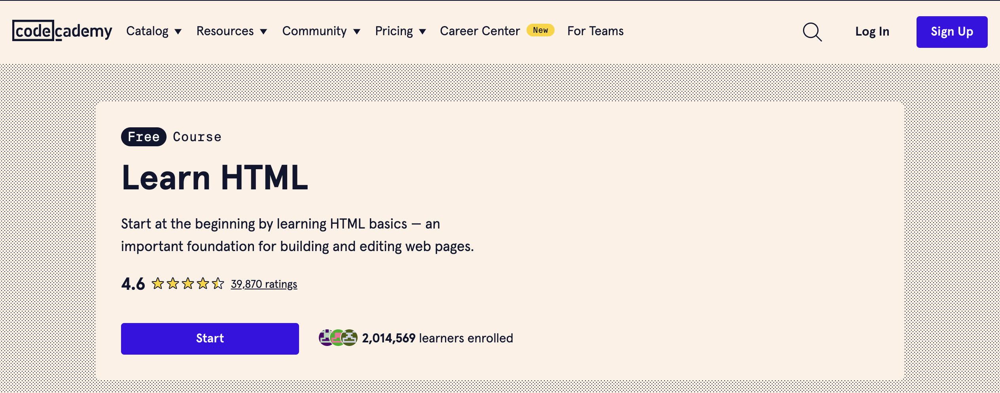

# HTML

HTML (HyperText Markup Language) คือภาษามาร์กอัปที่ใช้ในการสร้างโครงสร้างพื้นฐานของหน้าเว็บ HTML ทำงานโดยการใช้แท็ก (tags) เพื่อกำหนดและจัดระเบียบเนื้อหาบนหน้าเว็บ ตัวอย่างเช่น การใช้แท็ก `<p>` เพื่อสร้างย่อหน้า หรือแท็ก `<a>` เพื่อสร้างลิงก์

## โครงสร้างพื้นฐานของเอกสาร HTML ประกอบด้วยส่วนหลัก ๆ ดังนี้:

1. **DOCTYPE Declaration**: บอกเบราว์เซอร์ว่ากำลังใช้งาน HTML เวอร์ชันใด
    ```html
    <!DOCTYPE html>
    ```

2. **html Element**: เป็นตัวห่อหุ้มเนื้อหาทั้งหมดของเอกสาร HTML
    ```html
    <html>
    </html>
    ```

3. **head Element**: ประกอบด้วยข้อมูลเมตาที่ไม่แสดงบนหน้าเว็บ เช่น ชื่อเรื่อง (title) การอ้างอิง CSS และสคริปต์ต่าง ๆ
    ```html
    <head>
        <title>My Web Page</title>
    </head>
    ```

4. **body Element**: ส่วนนี้ประกอบด้วยเนื้อหาทั้งหมดที่จะแสดงบนหน้าเว็บ เช่น ข้อความ รูปภาพ ลิงก์ และองค์ประกอบอื่น ๆ
    ```html
    <body>
        <h1>Welcome to My Web Page</h1>
        <p>This is a paragraph of text.</p>
        <a href="https://www.example.com">Visit Example.com</a>
    </body>
    ```

## ตัวอย่างของโค้ด HTML พื้นฐาน:

```html
<!DOCTYPE html>
<html lang="en">
<head>
    <meta charset="UTF-8">
    <meta name="viewport" content="width=device-width, initial-scale=1.0">
    <title>Example HTML Page</title>
</head>
<body>
    <header>
        <h1>Welcome to My Website</h1>
    </header>
    <nav>
        <ul>
            <li><a href="#home">Home</a></li>
            <li><a href="#about">About</a></li>
            <li><a href="#contact">Contact</a></li>
        </ul>
    </nav>
    <main>
        <section id="home">
            <h2>Home</h2>
            <p>This is the home section.</p>
        </section>
        <section id="about">
            <h2>About</h2>
            <p>This is the about section.</p>
        </section>
        <section id="contact">
            <h2>Contact</h2>
            <p>This is the contact section.</p>
        </section>
    </main>
    <footer>
        <p>&copy; 2024 My Website</p>
    </footer>
</body>
</html>
```

## องค์ประกอบพื้นฐานของ HTML ประกอบด้วย:

- **Header**: ใช้แท็ก `<header>` เพื่อกำหนดส่วนหัวของหน้า
- **Navigation**: ใช้แท็ก `<nav>` สำหรับเมนูนำทาง
- **Main Content**: ใช้แท็ก `<main>` สำหรับเนื้อหาหลักของหน้า
- **Section**: ใช้แท็ก `<section>` เพื่อแบ่งเนื้อหาออกเป็นส่วน ๆ
- **Footer**: ใช้แท็ก `<footer>` สำหรับส่วนท้ายของหน้า

HTML ยังรองรับการแทรกสื่อประเภทต่าง ๆ เช่น รูปภาพด้วยแท็ก ``, วิดีโอด้วยแท็ก `<video>`, และเสียงด้วยแท็ก `<audio>`.

## แนะนำคอร์สเรียน
[Learn HTML | Codecademy](https://www.codecademy.com/learn/learn-html?source=post_page-----bc61325951d4--------------------------------)



[Intro to HTML and CSS | Udacity](https://www.udacity.com/course/intro-to-html-and-css--ud001?source=post_page-----bc61325951d4--------------------------------)

