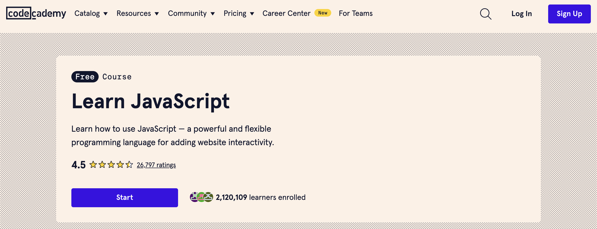

# JavaScript

JavaScript เป็นภาษาสคริปต์ที่ใช้ในการพัฒนาเว็บเพื่อเพิ่มความโต้ตอบและการทำงานบนหน้าเว็บ JavaScript ถูกนำมาใช้เพื่อสร้างฟังก์ชันการทำงานที่ซับซ้อนและประสบการณ์การใช้งานที่ดีขึ้นสำหรับผู้ใช้ เช่น การตรวจสอบฟอร์ม, การสร้างแอนิเมชัน, การดึงข้อมูลจากเซิร์ฟเวอร์แบบเรียลไทม์ และการจัดการกับเหตุการณ์ต่าง ๆ บนหน้าเว็บ

## การประกาศตัวแปร

- **var**: มีการทำงานแบบ function-scoped
- **let**: มีการทำงานแบบ block-scoped
- **const**: มีการทำงานแบบ block-scoped และค่าของตัวแปรไม่สามารถเปลี่ยนแปลงได้

```javascript
var name = 'John';
let age = 30;
const isMarried = false;
```

## ฟังก์ชัน

- ฟังก์ชันแบบดั้งเดิม
- ฟังก์ชันแบบลูกศร (arrow function)

```javascript
// ฟังก์ชันแบบดั้งเดิม
function greet(name) {
    return 'Hello, ' + name;
}

// ฟังก์ชันแบบลูกศร
const greet = (name) => 'Hello, ' + name;

console.log(greet('John')); // Output: Hello, John
```

## การทำงานกับอาร์เรย์และวัตถุ (Array and Object)

```javascript
// Array
let fruits = ['Apple', 'Banana', 'Mango'];
console.log(fruits[1]); // Output: Banana

// Object
let person = {
    firstName: 'John',
    lastName: 'Doe',
    age: 30
};
console.log(person.firstName); // Output: John
```

## การจัดการกับเหตุการณ์ (Event Handling)

```javascript
// การจัดการคลิกปุ่ม
document.getElementById('myButton').addEventListener('click', function() {
    alert('Button clicked!');
});
```

## การทำงานกับ DOM (Document Object Model)

```javascript
// การเปลี่ยนข้อความในองค์ประกอบ HTML
document.getElementById('myElement').innerText = 'Hello, World!';
```

## การทำงานแบบ Asynchronous

- การใช้งาน callback, promises, async/await

```javascript
// การใช้ Callback
function fetchData(callback) {
    setTimeout(() => {
        callback('Data received');
    }, 2000);
}

fetchData((data) => {
    console.log(data); // Output: Data received
});

// การใช้ Promises
function fetchData() {
    return new Promise((resolve, reject) => {
        setTimeout(() => {
            resolve('Data received');
        }, 2000);
    });
}

fetchData().then(data => {
    console.log(data); // Output: Data received
});

// การใช้ async/await
async function fetchData() {
    let data = await new Promise((resolve, reject) => {
        setTimeout(() => {
            resolve('Data received');
        }, 2000);
    });
    console.log(data); // Output: Data received
}

fetchData();
```

## การดึงข้อมูลจากเซิร์ฟเวอร์

- การใช้ `XMLHttpRequest`
- การใช้ `fetch`

```javascript
// การใช้ XMLHttpRequest
let xhr = new XMLHttpRequest();
xhr.open('GET', 'https://api.example.com/data', true);
xhr.onload = function() {
    if (xhr.status === 200) {
        console.log(xhr.responseText);
    }
};
xhr.send();

// การใช้ fetch
fetch('https://api.example.com/data')
    .then(response => response.json())
    .then(data => console.log(data))
    .catch(error => console.error('Error:', error));
```

## การใช้ JavaScript กับ HTML

สามารถรวม JavaScript กับ HTML ได้ด้วยการใช้แท็ก `<script>` ภายในเอกสาร HTML:

```html
<!DOCTYPE html>
<html lang="en">
<head>
    <meta charset="UTF-8">
    <meta name="viewport" content="width=device-width, initial-scale=1.0">
    <title>JavaScript Example</title>
</head>
<body>
    <h1 id="myElement">Hello, World!</h1>
    <button id="myButton">Click Me</button>

    <script>
        document.getElementById('myButton').addEventListener('click', function() {
            document.getElementById('myElement').innerText = 'Button clicked!';
        });
    </script>
</body>
</html>
```

การใช้ JavaScript ทำให้หน้าเว็บมีความสามารถและความยืดหยุ่นในการตอบสนองต่อการโต้ตอบของผู้ใช้ได้อย่างดี

## แนะนำคอร์สเรียน
[Intro to Programming with JavaScript](https://wonderful.software/js/welcome.html)


[🔥 JavaScript 21 Days Challenge](https://www.youtube.com/playlist?list=PLOgiLP3tCaPXc9-whn0on3tDT9rQdXAWL)

<iframe width="560" height="315" src="https://www.youtube.com/embed/videoseries?si=l1t0arYqQ0RXRRGv&amp;list=PLOgiLP3tCaPXc9-whn0on3tDT9rQdXAWL" title="YouTube video player" frameborder="0" allow="accelerometer; autoplay; clipboard-write; encrypted-media; gyroscope; picture-in-picture; web-share" referrerpolicy="strict-origin-when-cross-origin" allowfullscreen></iframe>

[Learn JavaScript | Codecademy](https://www.codecademy.com/learn/introduction-to-javascript?source=post_page-----bc61325951d4--------------------------------)

