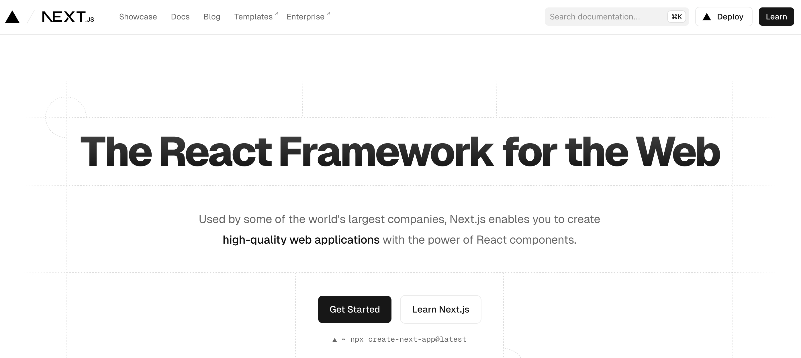

# Next.js

[**Next.js**](https://nextjs.org/) คือเฟรมเวิร์ค React ที่พัฒนาโดย Vercel ซึ่งช่วยให้การพัฒนาเว็บแอปพลิเคชันที่ใช้ React มีประสิทธิภาพและสะดวกมากขึ้น โดยมีคุณสมบัติเด่นหลายประการ เช่น การเรนเดอร์แบบเซิร์ฟเวอร์ไซด์ (Server-Side Rendering), การสร้างหน้าเว็บแบบสถิต (Static Site Generation), การแยกโหลด (Code Splitting), และการจัดการเส้นทาง (Routing) ที่ง่ายดาย




## คุณสมบัติเด่นของ Next.js

### 1. Server-Side Rendering (SSR) และ Static Site Generation (SSG)

Next.js รองรับการเรนเดอร์หน้าเว็บทั้งแบบ Server-Side Rendering (SSR) และ Static Site Generation (SSG) ช่วยให้สามารถเลือกใช้วิธีการเรนเดอร์ที่เหมาะสมกับความต้องการของโปรเจคได้

### 2. File-based Routing

Next.js ใช้ระบบการจัดการเส้นทาง (Routing) ที่สร้างจากโครงสร้างไฟล์ ทำให้ง่ายต่อการสร้างและจัดการหน้าเว็บต่าง ๆ

### 3. API Routes

Next.js สามารถสร้าง API ภายในแอปพลิเคชันได้อย่างง่ายดายโดยไม่ต้องใช้เซิร์ฟเวอร์แยกต่างหาก

### 4. Image Optimization

Next.js มีเครื่องมือสำหรับการปรับแต่งและเพิ่มประสิทธิภาพของรูปภาพในแอปพลิเคชัน

### 5. Internationalization (i18n)

Next.js รองรับการพัฒนาแอปพลิเคชันที่มีหลายภาษา

## การเริ่มต้นใช้งาน Next.js

### 1. การติดตั้ง Next.js

สามารถสร้างโปรเจค Next.js ใหม่ได้โดยใช้ Create Next App

```bash
npx create-next-app@latest my-next-app
cd my-next-app
npm run dev
```

### 2. โครงสร้างโปรเจค

```plaintext
my-next-app/
├── node_modules/
├── pages/
│   ├── api/
│   │   └── hello.js
│   ├── _app.js
│   ├── index.js
├── public/
├── styles/
├── .gitignore
├── package.json
├── README.md
└── yarn.lock
```

### 3. การสร้างหน้าเว็บ

#### สร้างไฟล์หน้าเว็บในโฟลเดอร์ `pages`

```javascript
// pages/index.js
import Link from 'next/link';

export default function Home() {
    return (
        <div>
            <h1>Welcome to Next.js!</h1>
            <Link href="/about">
                <a>About</a>
            </Link>
        </div>
    );
}
```

```javascript
// pages/about.js
export default function About() {
    return (
        <div>
            <h1>About Page</h1>
        </div>
    );
}
```

### 4. การสร้าง API Routes

Next.js รองรับการสร้าง API Routes ภายในโฟลเดอร์ `pages/api`

```javascript
// pages/api/hello.js
export default function handler(req, res) {
    res.status(200).json({ message: 'Hello, Next.js!' });
}
```

### 5. การใช้งาน Server-Side Rendering (SSR)

การใช้ฟังก์ชัน `getServerSideProps` เพื่อดึงข้อมูลในฝั่งเซิร์ฟเวอร์และส่งไปยังหน้าเว็บ

```javascript
// pages/index.js
export async function getServerSideProps() {
    const res = await fetch('https://api.example.com/data');
    const data = await res.json();

    return {
        props: {
            data,
        },
    };
}

export default function Home({ data }) {
    return (
        <div>
            <h1>Data from Server-Side Rendering</h1>
            <pre>{JSON.stringify(data, null, 2)}</pre>
        </div>
    );
}
```

### 6. การใช้งาน Static Site Generation (SSG)

การใช้ฟังก์ชัน `getStaticProps` เพื่อดึงข้อมูลในช่วงเวลาคอมไพล์และสร้างหน้าเว็บแบบสถิต

```javascript
// pages/index.js
export async function getStaticProps() {
    const res = await fetch('https://api.example.com/data');
    const data = await res.json();

    return {
        props: {
            data,
        },
    };
}

export default function Home({ data }) {
    return (
        <div>
            <h1>Data from Static Site Generation</h1>
            <pre>{JSON.stringify(data, null, 2)}</pre>
        </div>
    );
}
```

### 7. การใช้งาน Image Optimization

Next.js มีคอมโพเนนต์ `<Image>` สำหรับการเพิ่มประสิทธิภาพของรูปภาพ

```javascript
import Image from 'next/image';

export default function Home() {
    return (
        <div>
            <h1>Optimized Image Example</h1>
            <Image src="/path/to/image.jpg" alt="Example" width={500} height={300} />
        </div>
    );
}
```

Next.js เป็นเฟรมเวิร์คที่ทรงพลังและยืดหยุ่น ช่วยให้การพัฒนาเว็บแอปพลิเคชันที่ใช้ React มีประสิทธิภาพและง่ายต่อการจัดการมากขึ้น