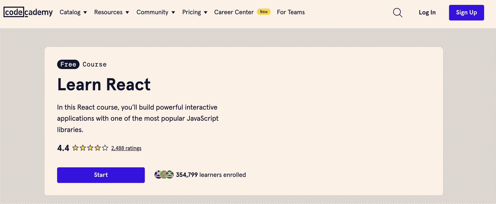
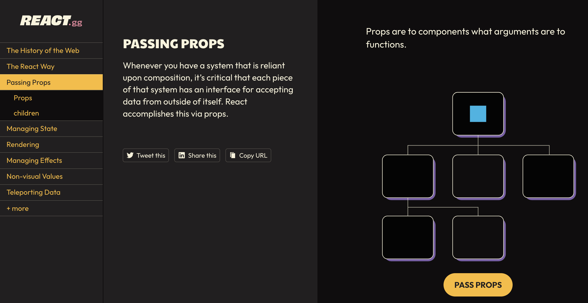

# React 
React คือไลบรารี JavaScript สำหรับการสร้างส่วนประกอบ UI (User Interface) ที่พัฒนาโดย Facebook React ช่วยให้นักพัฒนาสามารถสร้างเว็บแอปพลิเคชันที่มีความรวดเร็วและมีความสามารถในการตอบสนองสูงได้อย่างมีประสิทธิภาพ โดยใช้แนวคิดของการแบ่งส่วนประกอบ (components)

## คุณสมบัติหลักของ React

### 1. Component-Based Architecture
React ใช้แนวคิดของการแบ่งส่วนประกอบในการสร้าง UI ทำให้สามารถแยกโค้ดออกเป็นส่วนย่อย ๆ ที่สามารถนำกลับมาใช้ใหม่ได้

### 2. JSX (JavaScript XML)
JSX เป็นการผสมผสานระหว่าง JavaScript และ HTML ซึ่งทำให้สามารถเขียนโค้ดที่มีโครงสร้างและเนื้อหาในรูปแบบที่คล้าย HTML ได้อย่างง่ายดาย

### 3. Virtual DOM
React ใช้ Virtual DOM ในการทำให้การอัปเดต UI มีประสิทธิภาพมากขึ้น โดยจะเปรียบเทียบการเปลี่ยนแปลงของ DOM ก่อนแล้วค่อยทำการอัปเดต DOM จริง

### 4. One-Way Data Binding
React ใช้แนวคิดของการผูกข้อมูลแบบทางเดียว ซึ่งทำให้การควบคุมข้อมูลในแอปพลิเคชันมีความชัดเจนและง่ายต่อการดีบัก

## การเริ่มต้นกับ React

### 1. การติดตั้ง Create React App

Create React App เป็นเครื่องมือที่ช่วยในการตั้งค่าโปรเจค React ได้อย่างรวดเร็ว

```bash
npx create-react-app my-app
cd my-app
npm start
```

### 2. โครงสร้างโปรเจค

```plaintext
my-app/
├── node_modules/
├── public/
├── src/
│   ├── App.css
│   ├── App.js
│   ├── App.test.js
│   ├── index.css
│   ├── index.js
│   ├── logo.svg
│   └── serviceWorker.js
├── .gitignore
├── package.json
├── README.md
└── yarn.lock
```

### 3. ตัวอย่างการสร้าง Component

#### Functional Component

```jsx
import React from 'react';

function Welcome(props) {
    return <h1>Hello, {props.name}</h1>;
}

export default Welcome;
```

#### Class Component

```jsx
import React, { Component } from 'react';

class Welcome extends Component {
    render() {
        return <h1>Hello, {this.props.name}</h1>;
    }
}

export default Welcome;
```

### 4. การใช้ State และ Props

#### State

State เป็นข้อมูลที่มีการเปลี่ยนแปลงได้และถูกเก็บอยู่ภายใน component

```jsx
import React, { useState } from 'react';

function Counter() {
    const [count, setCount] = useState(0);

    return (
        <div>
            <p>You clicked {count} times</p>
            <button onClick={() => setCount(count + 1)}>Click me</button>
        </div>
    );
}

export default Counter;
```

#### Props

Props เป็นข้อมูลที่ถูกส่งจาก component หนึ่งไปยัง component อื่น ๆ

```jsx
import React from 'react';

function Greeting(props) {
    return <h1>Hello, {props.name}</h1>;
}

function App() {
    return (
        <div>
            <Greeting name="Alice" />
            <Greeting name="Bob" />
        </div>
    );
}

export default App;
```

### 5. การจัดการกับเหตุการณ์ (Event Handling)

การจัดการกับเหตุการณ์ใน React สามารถทำได้โดยการกำหนดฟังก์ชันในส่วนประกอบต่าง ๆ

```jsx
import React, { Component } from 'react';

class Toggle extends Component {
    constructor(props) {
        super(props);
        this.state = { isToggleOn: true };

        // การ bind this เพื่อให้สามารถใช้ภายในฟังก์ชัน handleClick ได้
        this.handleClick = this.handleClick.bind(this);
    }

    handleClick() {
        this.setState(state => ({
            isToggleOn: !state.isToggleOn
        }));
    }

    render() {
        return (
            <button onClick={this.handleClick}>
                {this.state.isToggleOn ? 'ON' : 'OFF'}
            </button>
        );
    }
}

export default Toggle;
```

### 6. การใช้ Effect Hook

Effect Hook ช่วยในการจัดการผลกระทบข้างเคียงใน functional component เช่น การดึงข้อมูล การสมัครสมาชิก

```jsx
import React, { useState, useEffect } from 'react';

function Example() {
    const [count, setCount] = useState(0);

    useEffect(() => {
        document.title = `You clicked ${count} times`;
    });

    return (
        <div>
            <p>You clicked {count} times</p>
            <button onClick={() => setCount(count + 1)}>Click me</button>
        </div>
    );
}

export default Example;
```

### 7. การจัดการกับฟอร์ม (Form Handling)

การจัดการกับฟอร์มใน React สามารถทำได้โดยใช้ state ในการเก็บข้อมูลของฟอร์ม

```jsx
import React, { useState } from 'react';

function MyForm() {
    const [name, setName] = useState('');

    const handleChange = (event) => {
        setName(event.target.value);
    }

    const handleSubmit = (event) => {
        alert('A name was submitted: ' + name);
        event.preventDefault();
    }

    return (
        <form onSubmit={handleSubmit}>
            <label>
                Name:
                <input type="text" value={name} onChange={handleChange} />
            </label>
            <input type="submit" value="Submit" />
        </form>
    );
}

export default MyForm;
```

React เป็นไลบรารีที่มีความยืดหยุ่นและสามารถขยายได้ด้วยเครื่องมือและไลบรารีเพิ่มเติมเช่น Redux สำหรับการจัดการสถานะของแอปพลิเคชัน หรือ React Router สำหรับการจัดการการนำทางในแอปพลิเคชัน

## แนะนำคอร์สเรียน

[Learn React | Codecademy](https://www.codecademy.com/learn/react-101?source=post_page-----bc61325951d4--------------------------------)



[React, visualized](https://react.gg/visualized?source=post_page-----bc61325951d4--------------------------------#the-react-way)

