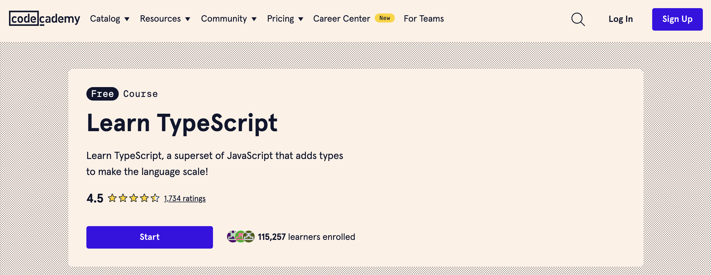

# TypeScript 
เป็นภาษาการเขียนโปรแกรมที่พัฒนาโดย Microsoft และเป็นการขยายความสามารถของ JavaScript โดยการเพิ่มระบบประเภท (type system) เข้ามา ซึ่งช่วยในการเขียนโค้ดที่มีความชัดเจนและมั่นใจในความถูกต้องมากขึ้น TypeScript สามารถคอมไพล์เป็น JavaScript เพื่อให้สามารถรันบนเบราว์เซอร์หรือแพลตฟอร์มอื่น ๆ ที่รองรับ JavaScript ได้

## คุณสมบัติของ TypeScript

### 1. การประกาศประเภท (Type Annotations)

การประกาศประเภทใน TypeScript ช่วยให้สามารถกำหนดประเภทของตัวแปร ฟังก์ชัน และคลาสได้

```typescript
let isDone: boolean = false;
let count: number = 42;
let name: string = 'John Doe';

function greet(name: string): string {
    return 'Hello, ' + name;
}
```

### 2. Interfaces

Interfaces ใช้ในการกำหนดรูปแบบของวัตถุที่ต้องปฏิบัติตาม

```typescript
interface Person {
    firstName: string;
    lastName: string;
    age?: number; // age เป็นคุณสมบัติที่ไม่จำเป็นต้องมี
}

function printName(person: Person) {
    console.log(person.firstName + ' ' + person.lastName);
}

let john: Person = { firstName: 'John', lastName: 'Doe' };
printName(john);
```

### 3. Classes

TypeScript รองรับการใช้งานคลาส ซึ่งเป็นคุณสมบัติที่มีใน ECMAScript 6 (ES6)

```typescript
class Animal {
    private name: string;

    constructor(name: string) {
        this.name = name;
    }

    move(distance: number = 0) {
        console.log(`${this.name} moved ${distance} meters.`);
    }
}

class Dog extends Animal {
    bark() {
        console.log('Woof! Woof!');
    }
}

let dog = new Dog('Rex');
dog.bark();
dog.move(10);
```

### 4. Generics

Generics ช่วยในการสร้างฟังก์ชัน คลาส หรืออินเทอร์เฟซที่สามารถทำงานกับชนิดข้อมูลหลายชนิดโดยไม่ต้องระบุชนิดข้อมูลล่วงหน้า

```typescript
function identity<T>(arg: T): T {
    return arg;
}

let output1 = identity<string>('myString');
let output2 = identity<number>(42);
```

### 5. Enums

Enums เป็นโครงสร้างข้อมูลที่ใช้ในการกำหนดค่าคงที่ที่มีความหมาย

```typescript
enum Color {
    Red,
    Green,
    Blue
}

let c: Color = Color.Green;
console.log(c); // Output: 1
```

### 6. Type Inference

TypeScript สามารถกำหนดประเภทของตัวแปรได้โดยอัตโนมัติจากค่าที่กำหนดให้

```typescript
let someValue = 'this is a string'; // someValue ถูกกำหนดประเภทเป็น string โดยอัตโนมัติ
```

### 7. Type Assertion

Type Assertion ช่วยให้สามารถบอก TypeScript ว่าตัวแปรมีประเภทที่เฉพาะเจาะจง

```typescript
let someValue: any = 'this is a string';
let strLength: number = (someValue as string).length;
```

## การตั้งค่าและการคอมไพล์ TypeScript

1. ติดตั้ง TypeScript โดยใช้ npm:

```bash
npm install -g typescript
```

2. สร้างไฟล์ TypeScript (เช่น `app.ts`):

```typescript
let message: string = 'Hello, TypeScript!';
console.log(message);
```

3. คอมไพล์ไฟล์ TypeScript เป็น JavaScript:

```bash
tsc app.ts
```

4. จะได้ไฟล์ JavaScript (เช่น `app.js`):

```javascript
var message = 'Hello, TypeScript!';
console.log(message);
```

## การใช้ TypeScript กับเฟรมเวิร์คยอดนิยม

### 1. React

ติดตั้ง TypeScript และการตั้งค่าในโปรเจค React:

```bash
npx create-react-app my-app --template typescript
```

ตัวอย่างการใช้งาน:

```tsx
import React from 'react';

interface AppProps {
    message: string;
}

const App: React.FC<AppProps> = ({ message }) => {
    return <h1>{message}</h1>;
};

export default App;
```

### 2. Node.js

ติดตั้ง TypeScript ในโปรเจค Node.js:

```bash
npm init -y
npm install typescript @types/node --save-dev
npx tsc --init
```

สร้างไฟล์ TypeScript (เช่น `index.ts`):

```typescript
import * as http from 'http';

const server = http.createServer((req, res) => {
    res.statusCode = 200;
    res.setHeader('Content-Type', 'text/plain');
    res.end('Hello, TypeScript with Node.js!\n');
});

server.listen(3000, () => {
    console.log('Server running at http://localhost:3000/');
});
```

คอมไพล์และรันไฟล์:

```bash
npx tsc
node dist/index.js
```

TypeScript ช่วยให้นักพัฒนาสามารถเขียนโค้ดที่มีคุณภาพสูง มีความปลอดภัยและมีประสิทธิภาพในการพัฒนาโปรเจคขนาดใหญ่ โดยเฉพาะเมื่อทำงานในทีม

## แนะนำคอร์สเรียน

แนะนำติดตาม [**ไทยไทป์**](https://www.facebook.com/thaitypecoding/) สำหรับความรู้ Update ใหม่ๆทางด้าน TypeScript โดยเฉพาะเลยครับ

[เรียน TypeScript ด้วย Express.js แบบเร่งด่วน (Crash Course)](https://www.youtube.com/playlist?list=PLkOkQgestxY85ivJgrTlQlVEGQi-1ykoB)
<iframe width="560" height="315" src="https://www.youtube.com/embed/videoseries?si=aZJIpT8Mf5hNu1cx&amp;list=PLkOkQgestxY85ivJgrTlQlVEGQi-1ykoB" title="YouTube video player" frameborder="0" allow="accelerometer; autoplay; clipboard-write; encrypted-media; gyroscope; picture-in-picture; web-share" referrerpolicy="strict-origin-when-cross-origin" allowfullscreen></iframe>

[TypeHero](https://typehero.dev/explore?source=post_page-----bc61325951d4--------------------------------)


[Learn TypeScript | Codecademy](https://www.codecademy.com/learn/learn-typescript?source=post_page-----bc61325951d4--------------------------------)
