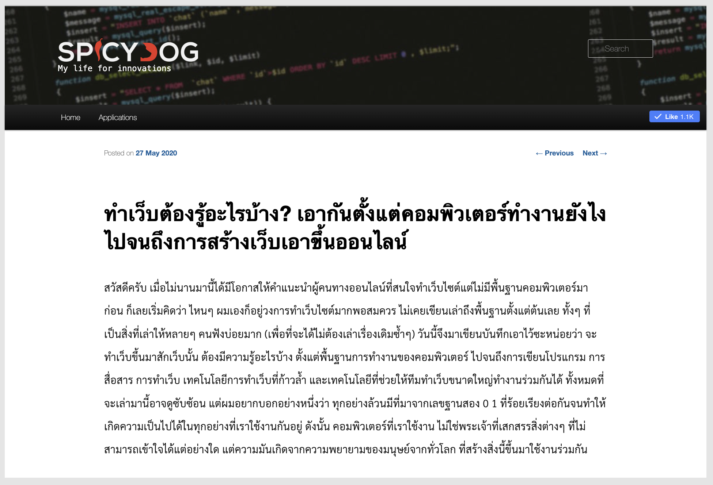
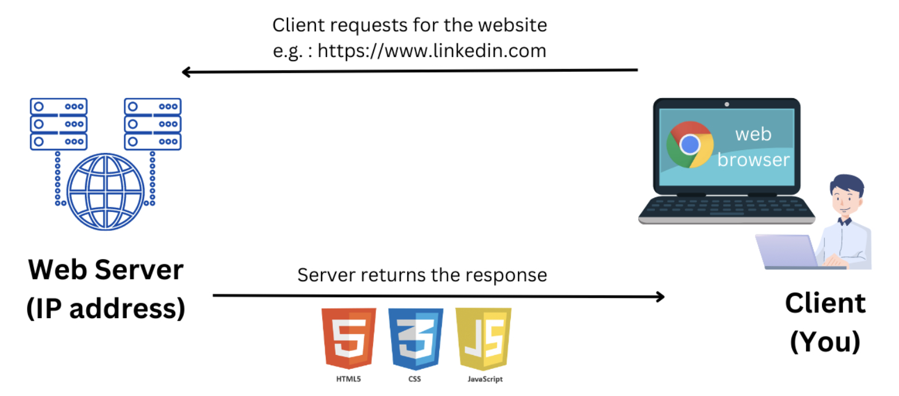
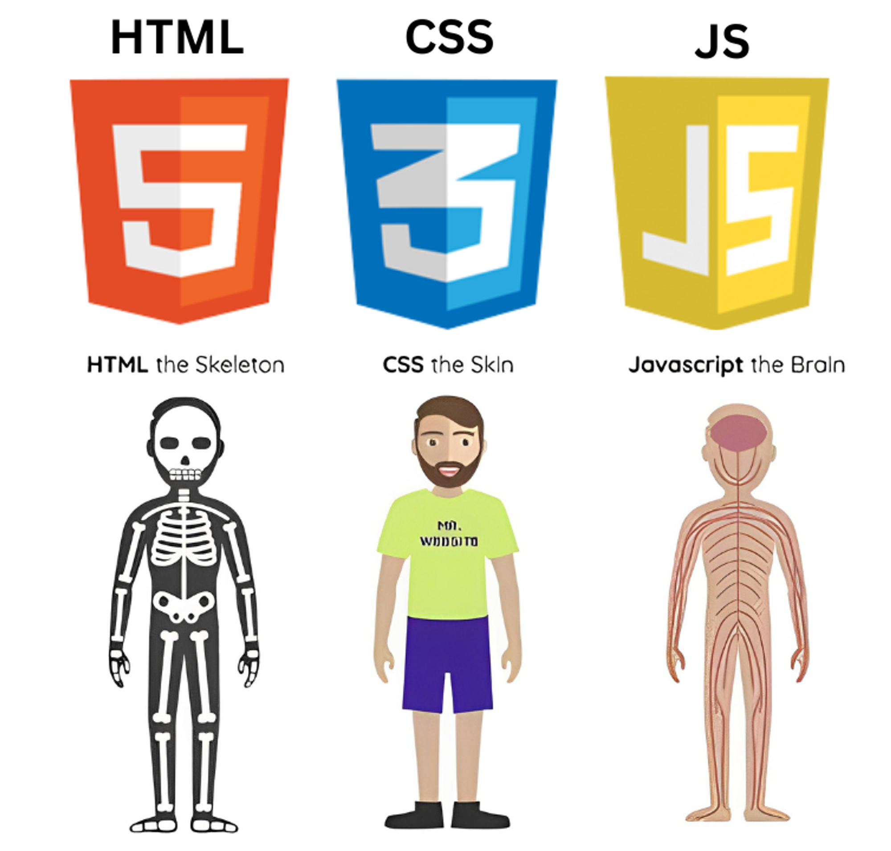

# ทำเว็บต้องรู้อะไรบ้าง
ผมชอบแนวทางการสอนแบบรู้ภาพกว้างๆก่อนว่ามีองค์ประกอบอะไรที่เราควรรู้บ้าง หลังจากนั้นเราค่อยๆเข้าไปลงลึกในตัวงานที่เกี่ยวข้องครับผม ซึ่งเนื้อหาในบทความข้างล่างนี้ผู้เขียนแนะนำแนวทางในการทำความเข้าใจการทำงานพัฒนา Website ได้ดีมากๆๆเลยครับ ผมเลยอยากชวนผู้อ่านมาศึกษาแนวทางนี้ไปด้วยกันครับผม

[บทความ: ทำเว็บต้องรู้อะไรบ้าง? เอากันตั้งแต่คอมพิวเตอร์ทำงานยังไง ไปจนถึงการสร้างเว็บเอาขึ้นออนไลน์](https://www.spicydog.org/blog/what-is-web-application/)

## **สรุปเนื้อหาจากบทเรียนข้างต้น**

การพัฒนาเว็บไซต์ต้องเริ่มจากความเข้าใจพื้นฐานของคอมพิวเตอร์และการเขียนโปรแกรม การจัดการการสื่อสารระหว่างคอมพิวเตอร์ การจัดการฐานข้อมูล การใช้เครื่องมือในการควบคุมเวอร์ชัน และการ Deployment ที่มีประสิทธิภาพ

เมื่อเราเข้าใจเนื้อหาในบทความนี้แล้ว เราจะเข้าใจคำศัพท์ต่างๆที่จำเป็นสำหรับการพัฒนาเว็บไซต์มากยิ่งขึ้นครับ

The Fundamental Elements of Web Development: HTML, CSS, and JavaScript by [Anass Essadikine](https://www.linkedin.com/pulse/fundamental-elements-web-development-html-css-anass-essadikine-byn7e/)

- ทำความเข้าใจพื้นฐานการทำงานของคอมพิวเตอร์
- ทำความเข้าใจว่าคอมพิวเตอร์สื่อสารกันได้อย่างไร และคำศัพท์ต่างๆที่ควรรู้ (**TCP/IP, Internet, NAT, DNS, HTTP, HTTPS, Server/Client**)
- **Web Site** คืออะไร ต่างจาก **Web Development** ยังไง
- **Front End Web Development: HTML** (โครงสร้าง), **CSS** (ตกแต่ง), และ **JavaScript** (การโต้ตอบ), **Web Browser** แสดงผลเว็บไซต์ตามมาตรฐาน **W3C**)
- **Back End Web Development**: การจัดการข้อมูลและการประมวลผลบน Serverใช้ภาษาต่างๆ เช่น **NodeJS, Python, Java, PHP** ในการพัฒนา
- **Database**: ฐานข้อมูลใช้ในการเก็บข้อมูลจำนวนมากและเรียกคืนได้อย่างรวดเร็วระบบฐานข้อมูลส่วนใหญ่ เช่น SQL, NoSQL
- **Version Control (Git)** : การใช้ระบบ **Version Control** เพื่อจัดการและเก็บ Source Code
- **Web Application Deployment**: วิธีการ **Deployment** เช่น **Static Website**, **Dynamic Website, Container as a Service (CaaS)**, และ **Container Orchestration (Kubernetes)** การทำ **Automation** ในกระบวนการ Deployment เพื่อความสะดวกและรวดเร็ว
- วิวัฒนาการของ **Web Front End**:การพัฒนา **Web Browser** และมาตรฐานใหม่ๆ ทำให้เว็บไซต์ซับซ้อนและมีความสามารถมากขึ้น เช่นการใช้ JS Frameworks React, Vue, Angular เพื่อพัฒนาเว็บไซต์

The Fundamental Elements of Web Development: HTML, CSS, and JavaScript by [Anass Essadikine](https://www.linkedin.com/pulse/fundamental-elements-web-development-html-css-anass-essadikine-byn7e/)