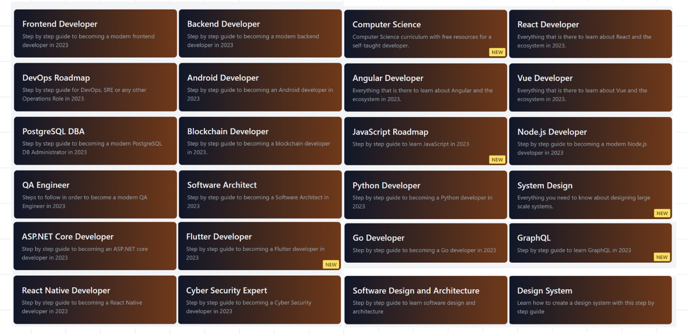
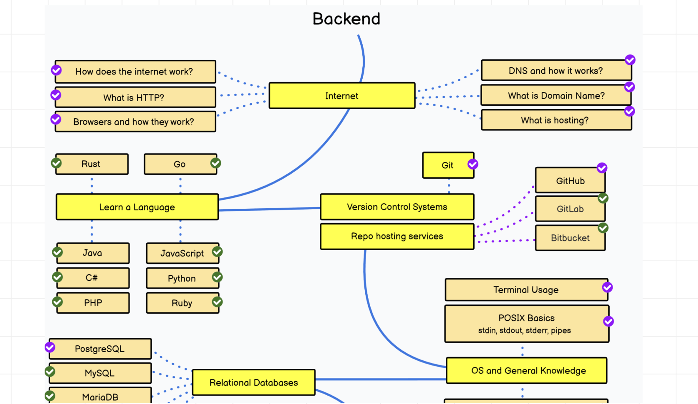
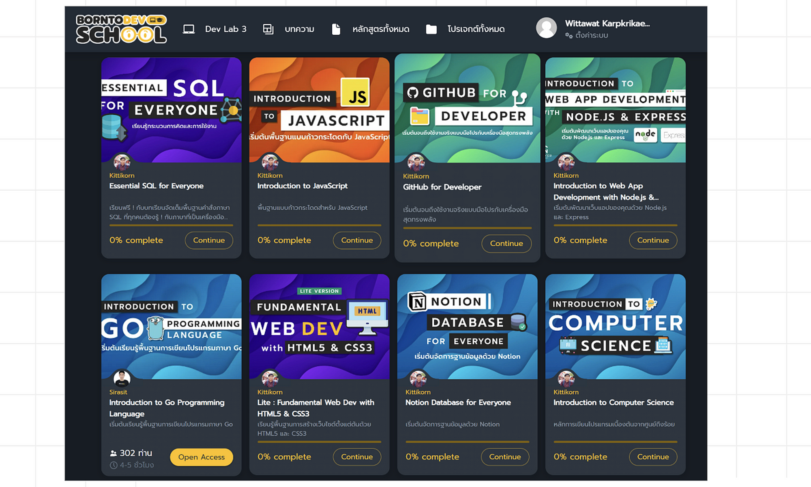
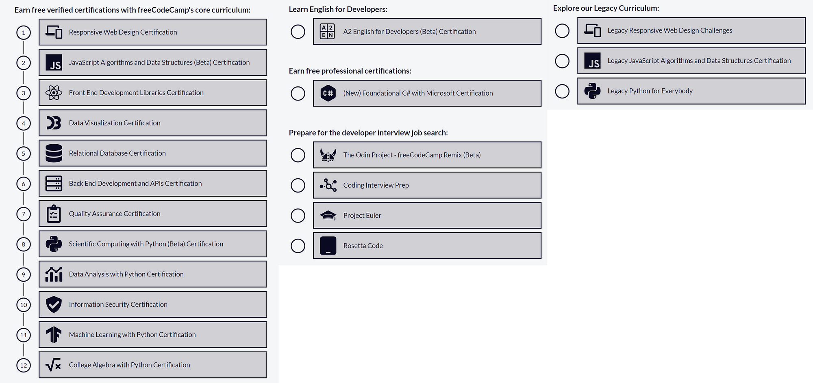

# Learning Path
หัวข้อนี้ผมอยากแบ่งปันเนื้อหาที่ Developer เก่งๆทั้งในประเทศไทยและต่างประเทศได้ทำสรุปภาพรวมของการพัฒนา Website ไว้ดีมากๆเลยครับ เผื่อช่วยให้เสริมการเรียนรู้ให้มากขึ้นนะครับ

## Web development 101

Playlist ที่น่าสนใจมากๆๆๆๆครับ เรียนรู้แนวทางพัฒนากันตั้งแต่ต้นจนจบเลยครับ พอเราเห็นแนวทางแล้วเราก็สามารถเลือกได้ว่าเราสนใจทำตรงจุดไหนแล้วก็ค่อยๆลงมือปฏิบัติจนชำนาญครับผม

<iframe width="560" height="315" src="https://www.youtube.com/embed/videoseries?si=p3yyC_dPXU4oVCam&amp;list=PLwZ0y9k-cYXCSSU3ujBqBWMbtZcW2OGkA" title="YouTube video player" frameborder="0" allow="accelerometer; autoplay; clipboard-write; encrypted-media; gyroscope; picture-in-picture; web-share" referrerpolicy="strict-origin-when-cross-origin" allowfullscreen></iframe>

## สอนทำเว็บไซต์ด้วย Node.js / Express / MongoDB สำหรับมือใหม่
แนวทางการพัฒนา Website ด้วย Node.js, Express และ MongoDB ครับ

<iframe width="560" height="315" src="https://www.youtube.com/embed/videoseries?si=-gty98moIDXWjnv6&amp;list=PLJIYqUDFnH-EQoFajb4b6u34q1w7t_y5N" title="YouTube video player" frameborder="0" allow="accelerometer; autoplay; clipboard-write; encrypted-media; gyroscope; picture-in-picture; web-share" referrerpolicy="strict-origin-when-cross-origin" allowfullscreen></iframe>

## exercism
มีตัวอย่างการเรียนรู้แบบเป็นลำดับขั้นที่ดีมากๆเลยครับในการที่เราจะปูพื้นฐานความรู้ให้แน่นขึ้นครับ

[exercism.org](https://exercism.org/)

## Developer Roadmaps
ถ้าอยากเข้าใจภาพกว้างๆครับ มีตำแหน่งที่น่าสนใจหลากหลาย และยังมีเนื้อหาสอนอยู่ข้างในครับ ให้เราค่อยๆไต่ระดับการเรียนรู้ครับ

[roadmap.sh](https://roadmap.sh/)

## เปลี่ยนสายงานมา IT มาทางนี้จ้า
ทีมงานได้ทำการรวบรวมบทความเจ๋งๆจากหลายๆผู้เชี่ยวชาญในประเทศไทยครับที่แนะนำการทำงานเริ่มต้นกับสายงานต่างๆ เผื่อเป็นประโยชน์นะครับ

[บทความเริ่มต้นเขียนโปรแกรม สำหรับคนที่สนใจเปลี่ยนสายคร้าบบบ
รวบรวมมาหลายสายเลย ทั้ง Data, Cloud, Web Developer, Tester, Blockchain Developer, DevOps Developer](https://medium.com/t-t-software-solution/%E0%B8%9A%E0%B8%97%E0%B8%84%E0%B8%A7%E0%B8%B2%E0%B8%A1%E0%B9%80%E0%B8%A3%E0%B8%B4%E0%B9%88%E0%B8%A1%E0%B8%95%E0%B9%89%E0%B8%99%E0%B9%80%E0%B8%82%E0%B8%B5%E0%B8%A2%E0%B8%99%E0%B9%82%E0%B8%9B%E0%B8%A3%E0%B9%81%E0%B8%81%E0%B8%A3%E0%B8%A1-%E0%B8%AA%E0%B8%B3%E0%B8%AB%E0%B8%A3%E0%B8%B1%E0%B8%9A%E0%B8%84%E0%B8%99%E0%B8%97%E0%B8%B5%E0%B9%88%E0%B8%AA%E0%B8%99%E0%B9%83%E0%B8%88%E0%B9%80%E0%B8%9B%E0%B8%A5%E0%B8%B5%E0%B9%88%E0%B8%A2%E0%B8%99%E0%B8%AA%E0%B8%B2%E0%B8%A2%E0%B8%84%E0%B8%A3%E0%B9%89%E0%B8%B2%E0%B8%9A%E0%B8%9A%E0%B8%9A-990dc3ed3d3e)

## BorntoDev
ผมอยากขอแนะนำเรื่องหาเรียนดีๆที่มีทั้งแบบฟรีและเสียเงินจาก BorntoDev ครับ มีเนื้อหาการเรียนี่หลากหลาย น่าติดตามมากๆๆ

[BorntoDev School](https://school.borntodev.com/)

## freecodecamp.org
[freecodecamp.org/learn](https://www.freecodecamp.org/learn/) เป็นอีก 1 ช่องทางการเรียนรู้ที่มาในรูปแบบ [Learning Path](https://www.freecodecamp.org/learn/) ค่อยๆเรียนค่อยๆต่อยอดครับดีงามมากๆ

