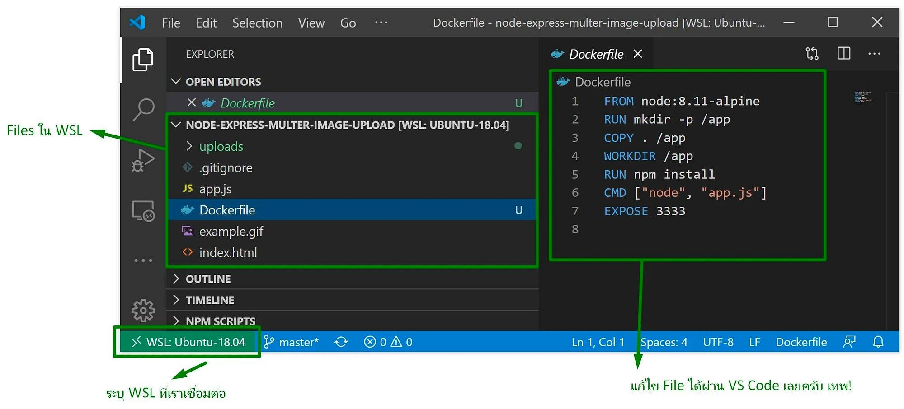
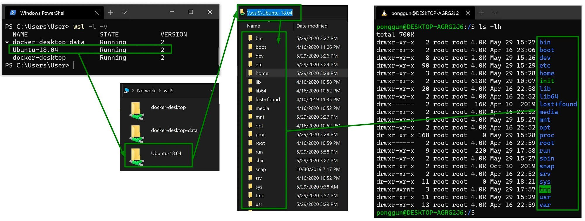
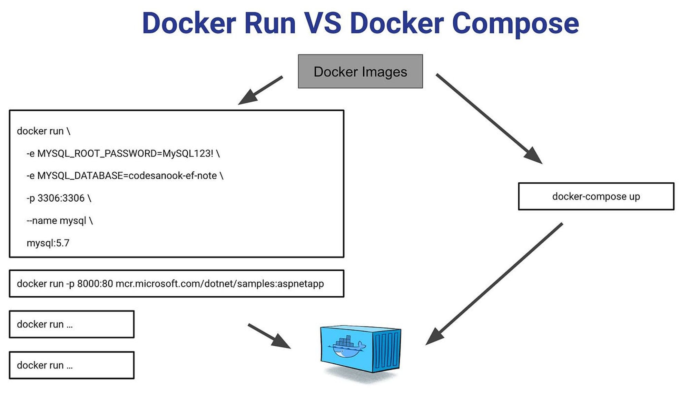

# เตรียมเครื่องมือของเราให้พร้อมเรียนรู้การพัฒนาเว็บไซต์สมัยใหม่
การเตรียมเครื่องมือในคอมพิวเตอร์ของเราก็เป็นอีก 1 สิ่งที่จำเป็นมากๆในการฝึกเรียนรู้แนวทางการพัฒนาเว็บไซต์หลังจากที่เราได้เรียนเนื้อหาต่างๆนะครับ ผมเลยอยากชวนมาลองใช้

- VS Code ที่เป็น Editor ยอดนิยม
- Commandline Tool รุ่นใหม่บน Windows 11
- โลกของ Linux และการใช้งานผ่าน WSL2
- สุดท้ายคือ Welcome to Container Technology ครับ เป็นอีกสิ่งนึงที่เราจำเป็นต้องรู้มากๆในยุคนี้เพื่อให้เราสามารถติดตั้งใช้งานระบบได้ดีและดูแลรักษาสะดวก

<iframe width="560" height="315" src="https://www.youtube.com/embed/i9iiEYY4ZC4?si=tWuoMM4uku-bfuOn" title="YouTube video player" frameborder="0" allow="accelerometer; autoplay; clipboard-write; encrypted-media; gyroscope; picture-in-picture; web-share" referrerpolicy="strict-origin-when-cross-origin" allowfullscreen></iframe>

## **ตัวอย่างเนื้อหาใน Video นะครับ**

ทดลอง Remote ไปใช้ WSL2 ครับเปรียบเทียบให้เห็นการจัดการกับ Files ใน Windows / WSL2

Docker Compose ฮีโร่ของเราาา
